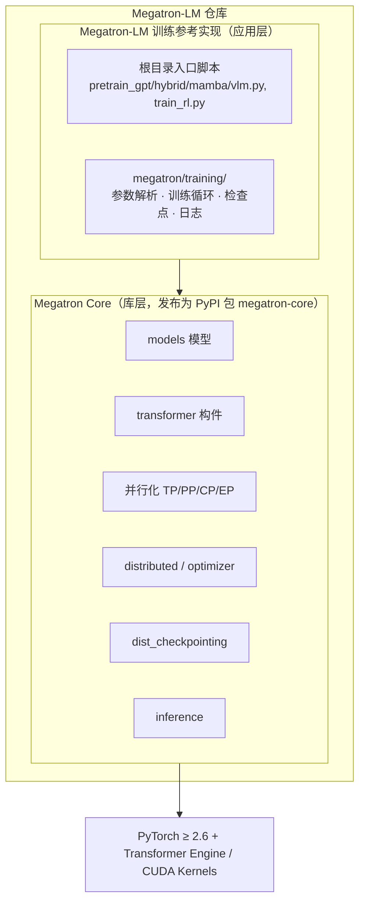
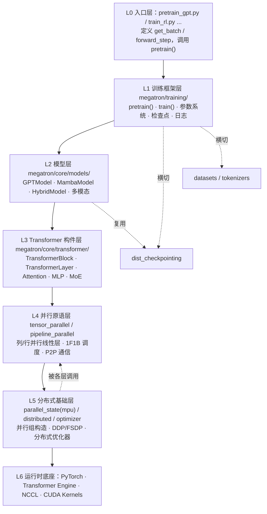
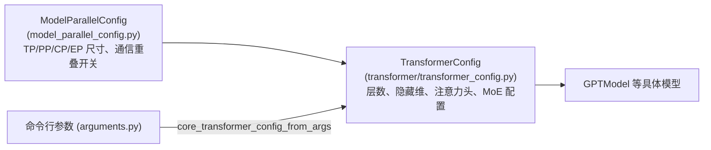
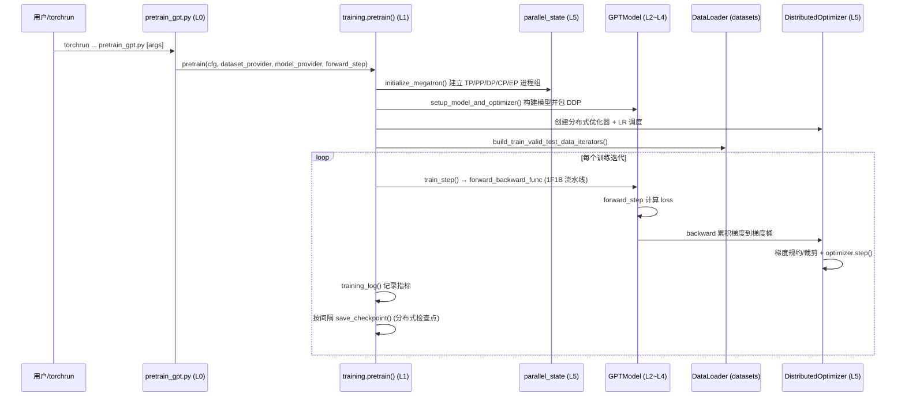

# 01 · 框架透视图解

本篇建立 Megatron-LM 的全局视图：双层架构定位、目录结构、分层依赖关系总图，以及端到端执行链路鸟瞰。后续各篇是对这张总图中某个方块的放大。

---

## 1. 双层架构定位

Megatron-LM 仓库实际上交付**两个产物**，二者同处一个仓库但定位不同：



| 维度 | Megatron Core | Megatron-LM 训练实现 |
|------|---------------|----------------------|
| 路径 | `megatron/core/` | `megatron/training/` + 根目录脚本 |
| 定位 | 可组合的底层库 | 开箱即用的训练框架 |
| 受众 | 框架开发者 / ML 工程师 | 研究者 / 快速实验 |
| 发布 | PyPI `megatron-core` | 随仓库提供，不单独发布 |
| 稳定性 | 有 API 向后兼容约束 | 偏脚本，灵活演进 |

> 关键认知：`megatron/training/` **依赖** `megatron/core/`，反之不成立。Core 不感知具体训练脚本，这是整个仓库最重要的分层边界。

---

## 2. 顶层目录结构

```
Megatron-LM/
├── pretrain_gpt.py / pretrain_hybrid.py / pretrain_mamba.py / pretrain_vlm.py
├── train_rl.py                      # 入口脚本（应用层）
├── gpt_builders.py / hybrid_builders.py / mamba_builders.py / model_provider.py
├── megatron/
│   ├── core/                        # ★ Megatron Core 库
│   │   ├── models/                  # GPT / T5 / BERT / Mamba / Hybrid / 多模态 / MIMO
│   │   ├── transformer/             # 注意力、MLP、归一化、MoE、TransformerBlock/Layer
│   │   ├── tensor_parallel/         # 张量并行：列/行并行线性层、词表并行
│   │   ├── pipeline_parallel/       # 流水线并行：1F1B、交错调度、P2P 通信
│   │   ├── distributed/             # DDP / FSDP、梯度桶、梯度规约
│   │   ├── optimizer/               # 分布式优化器、梯度裁剪/缩放、Muon
│   │   ├── datasets/                # 索引数据集、混合数据集、GPTDataset
│   │   ├── tokenizers/              # 分词器（文本/视觉）
│   │   ├── dist_checkpointing/      # 分布式检查点格式与读写策略
│   │   ├── resharding/              # 不同并行拓扑间的检查点重切分
│   │   ├── inference/               # 推理引擎、调度器、采样、文本生成服务
│   │   ├── export/                  # TensorRT-LLM 导出
│   │   ├── ssm/                     # 状态空间模型（Mamba）算子
│   │   ├── post_training/           # ModelOpt 集成（核心侧）
│   │   ├── fusions/ extensions/     # 融合算子、Transformer Engine 扩展
│   │   └── parallel_state.py        # ★ 并行组全局状态（别名 mpu）
│   ├── training/                    # ★ 训练框架 harness
│   ├── post_training/               # 后训练应用层（量化/蒸馏/剪枝）
│   ├── rl/                          # 强化学习（GRPO / RLHF）
│   ├── inference/                   # 推理应用层封装
│   └── elastification/              # 弹性训练
├── examples/                        # 各模型开箱即用训练配方
├── tools/                           # 数据预处理、检查点转换、推理服务等工具
├── tests/                           # unit / functional / performance 测试（最大子树 ~40MB）
└── docs/                            # 官方文档
```

---

## 3. 分层依赖关系总图（核心）

整个代码仓最关键的就是这张**自上而下、上层依赖下层**的分层图。每一层只调用同层或更底层的能力。



### 横切关注点（被多层共享）

这些模块不在主调用链上，而是被多层横向调用：

- **`parallel_state.py`（mpu）**：全局并行组状态，几乎被所有层查询「我属于哪个 TP/PP/DP 组」。
- **`dist_checkpointing/`**：模型层产生 `ShardedStateDict`，训练层负责落盘/加载。
- **`datasets/` + `tokenizers/`**：被训练层与入口层共同使用。
- **`config` 体系**：`ModelParallelConfig` → `TransformerConfig` 配置对象贯穿模型与并行层。

---

## 4. 配置对象继承链

Megatron 用**配置对象**驱动模型构建，理解这条继承链是读懂代码的钥匙：



- `ModelParallelConfig`：定义并行维度与通信策略。
- `TransformerConfig`（继承前者）：追加 Transformer 结构超参，是模型构建的统一入口配置。
- 训练侧由 `core_transformer_config_from_args()` 把 CLI 参数翻译成 `TransformerConfig`。

---

## 5. 端到端执行链路鸟瞰

以最常见的 GPT 预训练为例，一次完整运行的宏观链路：



链路中每个角色对应一个子系统，后续文档逐一展开：

| 链路角色 | 对应文档 |
|----------|----------|
| `initialize_megatron` / 并行组 | [02 并行化子系统](./02-并行化子系统.md) |
| `GPTModel` / forward | [03 Transformer 与模型](./03-Transformer与模型子系统.md) |
| DDP / 优化器 / 梯度 | [04 分布式训练与优化器](./04-分布式训练与优化器.md) |
| DataLoader / 数据 | [05 数据集与分词器](./05-数据集与分词器.md) |
| `pretrain` / `train` 主循环 | [06 训练框架 Harness](./06-训练框架Harness.md) |
| `save_checkpoint` | [08 检查点与重切分](./08-检查点与重切分.md) |

---

## 6. 关键依赖与环境

来自 `pyproject.toml`：

- **Python**：`>= 3.12`（0.17+ 起放弃 3.10）
- **核心依赖**：`torch >= 2.6.0`、`numpy`、`packaging`
- **训练扩展 `[training]`**：`transformers`、`wandb`、`sentencepiece`、`tiktoken`、`accelerate`、`omegaconf`
- **开发扩展 `[dev]`**：`flashinfer`、`megatron-energon`、`nvidia-modelopt`、`emerging_optimizers`、`tensorstore`、`multi-storage-client` 等
- **隐性强依赖**：NVIDIA **Transformer Engine**（FP8/融合 kernel）、**NCCL**（集合通信）、CUDA

安装：

```bash
cd Megatron-LM
uv pip install -e .                 # 仅 megatron-core
uv pip install -e ".[training]"     # 完整训练栈
```

---

## 7. 小结

- 仓库 = **Core 库** + **训练参考实现**两层，边界清晰，方向单向。
- 代码组织遵循严格的**六层依赖**：入口 → 训练 → 模型 → Transformer → 并行原语 → 分布式底座。
- `parallel_state`、`dist_checkpointing`、`config` 体系是贯穿各层的**横切关注点**。
- 一切运行最终落到 PyTorch + Transformer Engine + NCCL 之上。

下一篇进入最底层也是最有特色的部分：[并行化子系统](./02-并行化子系统.md)。
