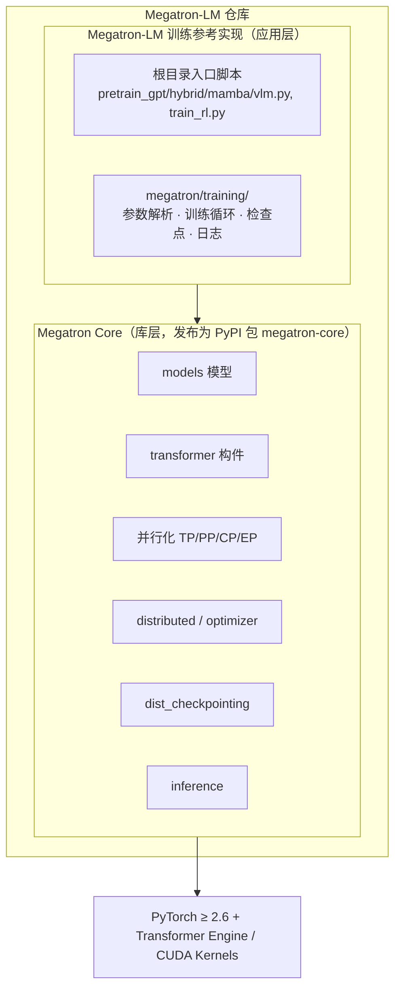
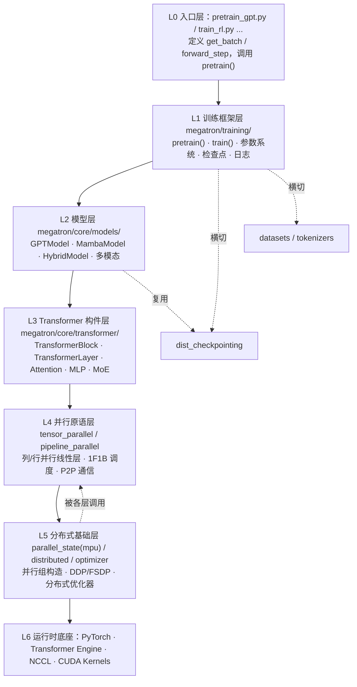
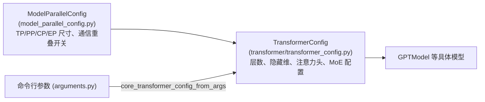
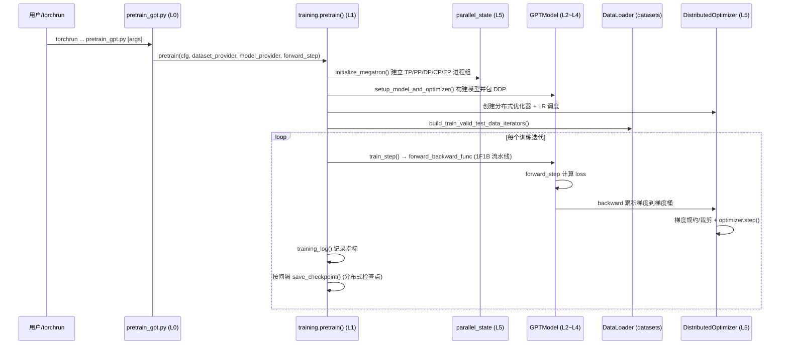
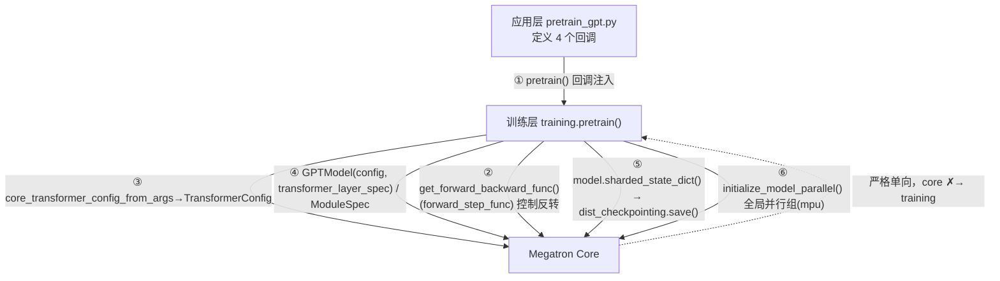
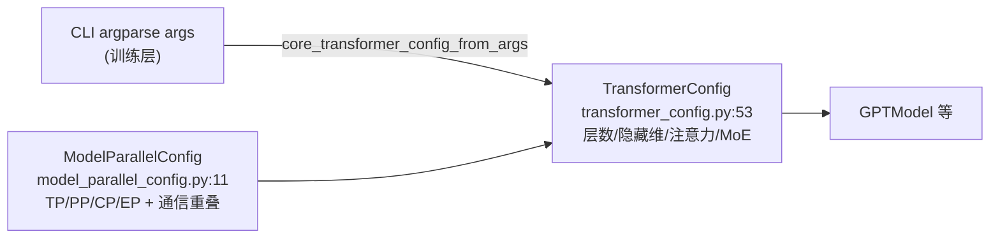

# 01 · 框架透视图解

本篇建立 Megatron-LM 的全局视图：双层架构定位、目录结构、分层依赖关系总图，以及端到端执行链路鸟瞰。后续各篇是对这张总图中某个方块的放大。

---

## 1. 双层架构定位

Megatron-LM 仓库实际上交付**两个产物**，二者同处一个仓库但定位不同：



| 维度 | Megatron Core | Megatron-LM 训练实现 |
|------|---------------|----------------------|
| 路径 | `megatron/core/` | `megatron/training/` + 根目录脚本 |
| 定位 | 可组合的底层库 | 开箱即用的训练框架 |
| 受众 | 框架开发者 / ML 工程师 | 研究者 / 快速实验 |
| 发布 | PyPI `megatron-core` | 随仓库提供，不单独发布 |
| 稳定性 | 有 API 向后兼容约束 | 偏脚本，灵活演进 |

> 关键认知：`megatron/training/` **依赖** `megatron/core/`，反之不成立。Core 不感知具体训练脚本，这是整个仓库最重要的分层边界。

---

## 2. 顶层目录结构

```
Megatron-LM/
├── pretrain_gpt.py / pretrain_hybrid.py / pretrain_mamba.py / pretrain_vlm.py
├── train_rl.py                      # 入口脚本（应用层）
├── gpt_builders.py / hybrid_builders.py / mamba_builders.py / model_provider.py
├── megatron/
│   ├── core/                        # ★ Megatron Core 库
│   │   ├── models/                  # GPT / T5 / BERT / Mamba / Hybrid / 多模态 / MIMO
│   │   ├── transformer/             # 注意力、MLP、归一化、MoE、TransformerBlock/Layer
│   │   ├── tensor_parallel/         # 张量并行：列/行并行线性层、词表并行
│   │   ├── pipeline_parallel/       # 流水线并行：1F1B、交错调度、P2P 通信
│   │   ├── distributed/             # DDP / FSDP、梯度桶、梯度规约
│   │   ├── optimizer/               # 分布式优化器、梯度裁剪/缩放、Muon
│   │   ├── datasets/                # 索引数据集、混合数据集、GPTDataset
│   │   ├── tokenizers/              # 分词器（文本/视觉）
│   │   ├── dist_checkpointing/      # 分布式检查点格式与读写策略
│   │   ├── resharding/              # 不同并行拓扑间的检查点重切分
│   │   ├── inference/               # 推理引擎、调度器、采样、文本生成服务
│   │   ├── export/                  # TensorRT-LLM 导出
│   │   ├── ssm/                     # 状态空间模型（Mamba）算子
│   │   ├── post_training/           # ModelOpt 集成（核心侧）
│   │   ├── fusions/ extensions/     # 融合算子、Transformer Engine 扩展
│   │   └── parallel_state.py        # ★ 并行组全局状态（别名 mpu）
│   ├── training/                    # ★ 训练框架 harness
│   ├── post_training/               # 后训练应用层（量化/蒸馏/剪枝）
│   ├── rl/                          # 强化学习（GRPO / RLHF）
│   ├── inference/                   # 推理应用层封装
│   └── elastification/              # 弹性训练
├── examples/                        # 各模型开箱即用训练配方
├── tools/                           # 数据预处理、检查点转换、推理服务等工具
├── tests/                           # unit / functional / performance 测试（最大子树 ~40MB）
└── docs/                            # 官方文档
```

---

## 3. 分层依赖关系总图（核心）

整个代码仓最关键的就是这张**自上而下、上层依赖下层**的分层图。每一层只调用同层或更底层的能力。



### 横切关注点（被多层共享）

这些模块不在主调用链上，而是被多层横向调用：

- **`parallel_state.py`（mpu）**：全局并行组状态，几乎被所有层查询「我属于哪个 TP/PP/DP 组」。
- **`dist_checkpointing/`**：模型层产生 `ShardedStateDict`，训练层负责落盘/加载。
- **`datasets/` + `tokenizers/`**：被训练层与入口层共同使用。
- **`config` 体系**：`ModelParallelConfig` → `TransformerConfig` 配置对象贯穿模型与并行层。

---

## 4. 配置对象继承链

Megatron 用**配置对象**驱动模型构建，理解这条继承链是读懂代码的钥匙：



- `ModelParallelConfig`：定义并行维度与通信策略。
- `TransformerConfig`（继承前者）：追加 Transformer 结构超参，是模型构建的统一入口配置。
- 训练侧由 `core_transformer_config_from_args()` 把 CLI 参数翻译成 `TransformerConfig`。

---

## 5. 端到端执行链路鸟瞰

以最常见的 GPT 预训练为例，一次完整运行的宏观链路：



链路中每个角色对应一个子系统，后续文档逐一展开：

| 链路角色 | 对应文档 |
|----------|----------|
| `initialize_megatron` / 并行组 | [02 并行化子系统](./02-并行化子系统.md) |
| `GPTModel` / forward | [03 Transformer 与模型](./03-Transformer与模型子系统.md) |
| DDP / 优化器 / 梯度 | [04 分布式训练与优化器](./04-分布式训练与优化器.md) |
| DataLoader / 数据 | [05 数据集与分词器](./05-数据集与分词器.md) |
| `pretrain` / `train` 主循环 | [06 训练框架 Harness](./06-训练框架Harness.md) |
| `save_checkpoint` | [08 检查点与重切分](./08-检查点与重切分.md) |

---

## 6. 关键依赖与环境

来自 `pyproject.toml`：

- **Python**：`>= 3.12`（0.17+ 起放弃 3.10）
- **核心依赖**：`torch >= 2.6.0`、`numpy`、`packaging`
- **训练扩展 `[training]`**：`transformers`、`wandb`、`sentencepiece`、`tiktoken`、`accelerate`、`omegaconf`
- **开发扩展 `[dev]`**：`flashinfer`、`megatron-energon`、`nvidia-modelopt`、`emerging_optimizers`、`tensorstore`、`multi-storage-client` 等
- **隐性强依赖**：NVIDIA **Transformer Engine**（FP8/融合 kernel）、**NCCL**（集合通信）、CUDA

安装：

```bash
cd Megatron-LM
uv pip install -e .                 # 仅 megatron-core
uv pip install -e ".[training]"     # 完整训练栈
```

---

## 7. 小结

- 仓库 = **Core 库** + **训练参考实现**两层，边界清晰，方向单向。
- 代码组织遵循严格的**六层依赖**：入口 → 训练 → 模型 → Transformer → 并行原语 → 分布式底座。
- `parallel_state`、`dist_checkpointing`、`config` 体系是贯穿各层的**横切关注点**。
- 一切运行最终落到 PyTorch + Transformer Engine + NCCL 之上。

下一篇进入最底层也是最有特色的部分：[并行化子系统](./02-并行化子系统.md)。

---

## 8. 双层接口契约设计（接口缝合点）

> 本节是对第 1 节「双层架构定位」的放大：`megatron/training/`（训练框架层）与 `megatron/core/`（库层）究竟通过哪些「插槽」对接。理解这些缝合点，就理解了为什么 Core 能独立发布为 PyPI 包 `megatron-core`。

### 8.1 两条设计铁律

1. **严格单向依赖**：`training` 依赖 `core`，反之绝不成立。
   - 验证：`grep -r "from megatron.training" megatron/core/` 结果为 **0 行**。Core 不感知任何训练脚本，这是分层边界的根本前提。
2. **控制反转（IoC）**：Core 不「调用」训练逻辑，而是训练层把**回调函数**注入 Core，由 Core 在合适时机回调。
   - 典型：`get_forward_backward_func()` 返回的流水线调度器持有 `forward_step_func`，在 1F1B 每个 microbatch 时机回调它，却对「这一步算 GPT 还是 BERT 的 loss」一无所知。

因此两层不是「上层 import 下层函数」那么简单，而是通过**五类契约 + 一个全局状态**对接。

### 8.2 五大接口缝合点总览



| 编号 | 接口 | 方向 | 交换的「数据/契约」 |
|------|------|------|----------------------|
| ① | `pretrain()` 回调注入 | 应用 → 训练 | 4 个回调函数 |
| ② | 流水线调度回调 | 训练 ⇄ core | `forward_step_func`（控制反转） |
| ③ | 配置翻译 | 训练 → core | `TransformerConfig` 对象 |
| ④ | `ModuleSpec` 规格系统 | 训练 → core | 数据结构 `ModuleSpec` |
| ⑤ | `ShardedStateDict` | core → 训练 | 分片状态字典 |
| ⑥ | `parallel_state`(mpu) | 横切全局 | 进程组单例 |

### 8.3 接口 ① — `pretrain()` 回调注入契约

训练层暴露主控函数 `pretrain()`，应用层注入回调来定制行为。

`megatron/training/training.py:1029`
```python
def pretrain(
    cfg_container,
    train_valid_test_dataset_provider,  # 回调：建数据集
    model_provider,                     # 回调：建 core 模型（未包装）
    model_type,                         # ModelType 枚举
    forward_step_func,                  # 回调：跑前向 + 返回 loss_func
    process_non_loss_data_func=None,
    ...)
```

应用层调用（`pretrain_gpt.py:410`）：
```python
pretrain(full_config,
    train_valid_test_datasets_provider,
    partial(model_provider, gpt_builder),
    ModelType.encoder_or_decoder,
    forward_step,
    ...)
```

| 回调 | 签名契约 | 返回 |
|------|----------|------|
| `model_provider` | `(pre_process, post_process, config, pg_collection)` | 一个**裸的** core 模型（未包 DDP） |
| `forward_step_func` | `(data_iterator, model, return_schedule_plan=False)` | `(output_tensor, partial(loss_func, ...))` |
| `dataset_provider` | `(num_samples, vp_stage=None)` | `(train_ds, valid_ds, test_ds)` |

> 关键约定：`model_provider` 返回**裸模型**，训练层负责包 DDP/FSDP；`forward_step_func` 第二项是 `functools.partial`，预绑定 `loss_mask`，让 Core 调度器只需用 `output_tensor` 调用它。

### 8.4 接口 ② — `forward_step_func` ⇄ 流水线调度器（控制反转核心）

训练层不自己写流水线循环，而是向 Core 要一个调度器。

`megatron/core/pipeline_parallel/schedules.py:48`
```python
def get_forward_backward_func(pp_size=None, vp_size=None):
    # 按 PP/VPP 配置返回三者之一：
    #   forward_backward_no_pipelining                       (PP=1)
    #   forward_backward_pipelining_without_interleaving     (PP>1, 无 VPP)
    #   forward_backward_pipelining_with_interleaving        (PP>1, 有 VPP)
```

训练层在 `train_step()`（`training.py:2267`）使用：
```python
forward_backward_func = get_forward_backward_func()
losses_reduced = forward_backward_func(
    forward_step_func=forward_step_func,  # ← 把应用层回调交给 core
    data_iterator=..., model=..., ...)
```

**契约**（`schedules.py:61` 文档定义）：Core 用 `(data_iterator, model)` 调用回调 → 期望拿到 `(output_tensor, loss_func)` → 期望 `loss_func(output_tensor)` 返回 `(loss, num_tokens, report_dict)`。应用层 `pretrain_gpt.py:198` 正是按此实现。**Core 掌控调度（何时 forward/P2P/backward），应用层只填「算什么」。**

### 8.5 接口 ③ — 配置对象（跨层数据契约）

两层间传的不是散参数，而是继承链上的配置对象，它既是模型构建入口，也是并行策略载体。



翻译缝合点 `megatron/training/argument_utils.py:272`：
```python
def core_transformer_config_from_args(args, config_class=None):
    config_class = config_class or TransformerConfig
    kw_args = {}
    for f in dataclasses.fields(config_class):   # 自动对齐同名字段
        if hasattr(args, f.name):
            kw_args[f.name] = getattr(args, f.name)
    # ... 再手工翻译特殊项（swiglu→silu、num_experts 等）
    return config_class(**kw_args)
```

> 关键解耦：**CLI argparse 属于训练层，TransformerConfig 属于 Core**。训练层负责「把命令行翻译成 Core 听得懂的配置对象」，Core 完全不知道命令行存在——这让 Core 也能被纯 Python 代码（不经 argparse）直接调用。

### 8.6 接口 ④ — `ModuleSpec` 规格系统（可插拔架构接口）

Core 最有特色的扩展点：应用层决定「模型多少层」，每层用什么算子实现（Transformer Engine / Local / 推理优化）则由**纯数据结构** `ModuleSpec` 声明。

`megatron/core/transformer/spec_utils.py:12`
```python
@dataclass
class ModuleSpec:
    module: Union[Tuple, type]   # 模块类，或 (路径, 类名) 动态导入
    params: dict = ...
    submodules: object = None    # 递归：子模块的 spec
```

应用层选 spec 再喂给模型（`gpt_builders.py:32`）：
```python
if args.spec is not None:
    transformer_layer_spec = import_module(args.spec)        # 可外部注入
else:
    use_te = args.transformer_impl == "transformer_engine"
    transformer_layer_spec = _get_transformer_layer_spec(use_te, config)

model = GPTModel(config=config,
                 transformer_layer_spec=transformer_layer_spec,  # ← 规格注入点
                 vocab_size=..., ...)
```

Core 侧工厂函数（`core/models/gpt/gpt_layer_specs.py`）：

| 分支 | 工厂函数 | 用途 |
|------|----------|------|
| Transformer Engine | `get_gpt_layer_with_transformer_engine_spec()` | 高性能 + FP8 |
| Local | `get_gpt_layer_local_spec()` | 纯 Megatron-Core 实现 |
| Inference | `get_gpt_layer_with_inference_spec()` | 推理优化线性层 |

> 为什么是关键接口：spec 是**数据而非代码**，构建时由 `build_module()` 递归展开成真实模块树。换后端（TE↔Local）、插自定义算子，**无需改 GPTModel 源码**，只换一个 spec。这是 Core 对所有模型（GPT/T5/BERT/Mamba）通用的插件机制。

### 8.7 接口 ⑤ — `ShardedStateDict` 分布式检查点契约

职责分离：**Core 产出分片元数据，训练层负责落盘/加载**。

- Core 侧：每个 `MegatronModule` 与 `DistributedOptimizer` 实现 `sharded_state_dict()`（`core/transformer/module.py:58`），返回带分片信息（`ShardedTensor`/`ShardedObject`）的字典。
- 训练层侧（`megatron/training/checkpointing.py:1039`）：
```python
model_sd     = model[i].sharded_state_dict()          # 问 core 要分片字典
optimizer_sd = optimizer.sharded_state_dict(...)      # 优化器同理
# 再交给 core 的 dist_checkpointing.save() 落盘
```
- 真正的读写引擎仍在 Core（`core/dist_checkpointing/serialization.py` 的 `save()`/`load()`），训练层只是编排者。

> 这让检查点**与并行拓扑解耦**：保存时记录每个张量的全局分片坐标，加载时可在不同 TP/PP/EP 拓扑间自动重切分（参见 [08 检查点与重切分](./08-检查点与重切分.md)）。

### 8.8 接口 ⑥ — `parallel_state`（mpu）全局并行状态

被几乎所有层查询的全局单例接口。`megatron/core/parallel_state.py`（别名 `mpu`）：

- 初始化：`initialize_model_parallel(tp_size, pp_size, cp_size, ep_size, ...)`（`:547`）建立所有进程组。
- 查询：`get_tensor_model_parallel_group()` / `get_pipeline_model_parallel_rank()` / `get_data_parallel_world_size()` …

训练层在 `initialize_megatron()`（`megatron/training/initialize.py:41`）调用它完成进程组初始化。任何层想知道「我属于哪个 TP/PP/DP 组」都查它。

> **演进趋势**：Core 正引入 `ProcessGroupCollection`（`core/process_groups_config.py:27`）作为**显式传参**的新接口，逐步替代全局单例 `parallel_state.get_*()`——好处是可测试、可解耦（`model_provider`、DDP 包装、检查点之间显式传递 `pg_collection`，而非依赖全局状态）。

### 8.9 一句话总结

> Megatron 两层通过**「训练层注入回调 + 传递配置对象 + Core 回调驱动调度 + 共享全局并行状态 + 分片字典交换」**对接；核心是**严格单向依赖**与**控制反转**——Core 提供机制（调度/并行/算子/检查点引擎），训练层提供策略（算什么 loss、用什么数据、何时存盘），二者通过数据结构（`TransformerConfig`、`ModuleSpec`、`ShardedStateDict`）而非硬编码耦合。这正是 Core 能独立发布为 `megatron-core` 的根本原因。
