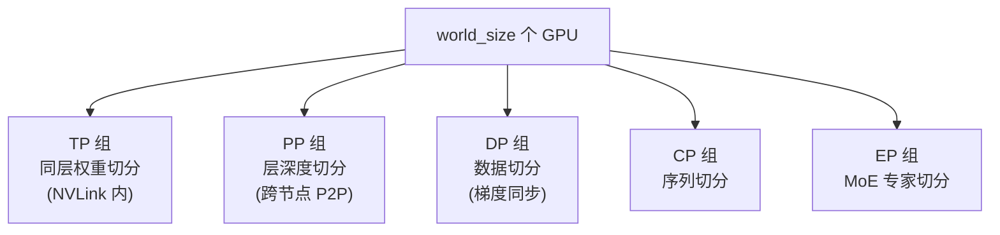
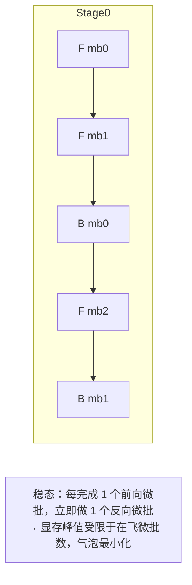
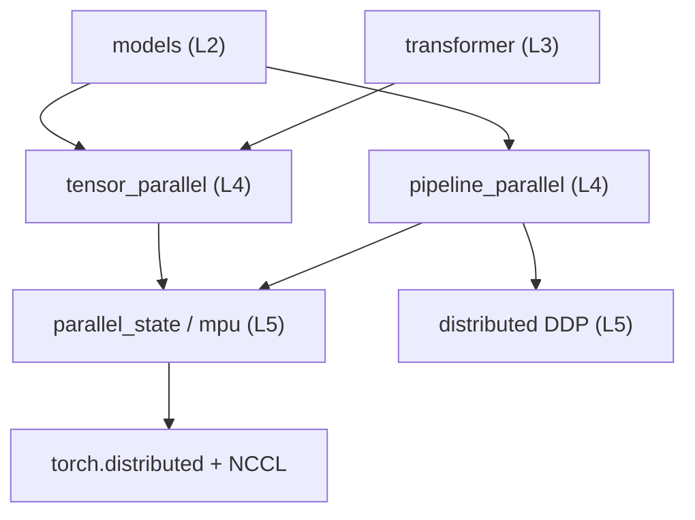

# 02 · 并行化子系统

并行化是 Megatron 的灵魂。本篇拆解五种并行维度、并行组的全局状态管理（`parallel_state`/mpu）、张量并行（`tensor_parallel`）与流水线并行（`pipeline_parallel`）的实现机制。

相关路径：
- `megatron/core/parallel_state.py`（并行组状态，别名 `mpu`）
- `megatron/core/tensor_parallel/`
- `megatron/core/pipeline_parallel/`
- `megatron/core/model_parallel_config.py`、`process_groups_config.py`、`hyper_comm_grid.py`

---

## 1. 五维并行总览

Megatron 把超大模型的训练负载沿 5 个正交维度切分，可任意组合：

| 维度 | 缩写 | 切什么 | 通信特征 |
|------|------|--------|----------|
| 张量并行 | TP | 单层权重矩阵按行/列切到多 GPU | 每层 forward/backward 都需 all-reduce/all-gather，通信频繁，限 NVLink 内 |
| 流水线并行 | PP | 模型按层深度切成多个 stage | stage 间 P2P 传 activation，1F1B 调度 |
| 数据并行 | DP | 复制模型，切分 batch | 梯度 all-reduce / reduce-scatter |
| 上下文并行 | CP | 沿序列长度切分 | 注意力跨 CP 通信，处理超长上下文 |
| 专家并行 | EP | MoE 的 experts 切到多 GPU | token dispatch 的 all-to-all |

> 全局 GPU 数 = TP × PP × DP × CP（×EP 在 MoE 专家层另算）。例如 GPT-3 175B 配方用 `TP=8, PP=16`。

### 维度组合示意



---

## 2. parallel_state：并行组全局状态（mpu）

`parallel_state.py`（约 2200 行）是并行化的**中枢**。它在初始化时根据 `(tp, pp, dp, cp, ep)` 尺寸，把所有 rank 划分进若干 `torch.distributed` 进程组，并用一组模块级全局变量保存「当前 rank 属于哪个组」。

核心全局变量（节选自源码）：

```28:44:megatron/core/parallel_state.py
# Intra-layer model parallel group that the current rank belongs to.
_TENSOR_MODEL_PARALLEL_GROUP = None
# Inter-layer model parallel group that the current rank belongs to.
_PIPELINE_MODEL_PARALLEL_GROUP = None
# Model parallel group (both intra- and pipeline) that the current rank belongs to.
_MODEL_PARALLEL_GROUP = None
# Model parallel group (both intra-, pipeline, and expert) that the current rank belongs to.
# Embedding group.
_EMBEDDING_GROUP = None
# Position embedding group.
_POSITION_EMBEDDING_GROUP = None
# Data parallel group that the current rank belongs to.
_DATA_PARALLEL_GROUP = None
```

### 提供的能力

- **构造**：`initialize_model_parallel(tp_size, pp_size, ...)` 一次性创建全部进程组。
- **查询**：`get_tensor_model_parallel_group()`、`get_pipeline_model_parallel_rank()`、`is_pipeline_first_stage()`、`get_data_parallel_world_size()` 等大量 getter，被各层广泛调用。
- **专家并行子状态**：`_EXPERT_MODEL_PARALLEL_GROUP`、`_EXPERT_TENSOR_PARALLEL_GROUP`、`_EXPERT_DATA_PARALLEL_GROUP` 等，专门服务 MoE。
- **嵌入组**：`_EMBEDDING_GROUP` 让 PP 首尾 stage 共享词嵌入权重（weight tying）。

> 设计要点：`mpu = parallel_state`（见 `core/__init__.py`），「mpu」（model parallel unit）是历史别名，源码中两者混用。

### 进程组与超网格

- `process_groups_config.py` 定义 `ProcessGroupCollection`，把分散的进程组打包传递，逐步替代裸全局变量（新代码倾向显式传 `pg_collection`）。
- `hyper_comm_grid.py` 提供多维通信网格抽象，描述 rank 在多维并行空间中的坐标。

---

## 3. 张量并行 tensor_parallel/

把单个线性层的权重矩阵切到多个 GPU，每个 GPU 算一部分，再通过集合通信合并。

### 核心文件

| 文件 | 职责 |
|------|------|
| `layers.py` | `ColumnParallelLinear`（列切）、`RowParallelLinear`（行切）、`VocabParallelEmbedding`（词表切） |
| `mappings.py` | 前向/反向的通信原语：`copy`、`reduce`、`scatter`、`gather`、`reduce-scatter`，均实现为 `torch.autograd.Function` |
| `cross_entropy.py` | `VocabParallelCrossEntropy`：词表并行下的交叉熵，避免聚合整张词表 logits |
| `random.py` | TP 下的随机数种子管理（保证切分后随机性一致/独立） |
| `data.py` | 跨 TP 组广播数据 |

### 列并行 + 行并行的经典配对

Transformer 的 MLP 与注意力用「列并行 → 行并行」配对，使一层只需一次 all-reduce：


通信原语在 `mappings.py` 中以自动求导函数成对出现（前向 all-gather ↔ 反向 reduce-scatter），保证梯度正确：

```256:296:megatron/core/tensor_parallel/mappings.py
class _ScatterToModelParallelRegion(torch.autograd.Function):
...
class _GatherFromModelParallelRegion(torch.autograd.Function):
```

### 序列并行（Sequence Parallel）

TP 的增强：把 LayerNorm/Dropout 等「按 token 独立」的算子沿序列维切分，进一步省显存。对应 `_ScatterToSequenceParallelRegion` / `_GatherFromSequenceParallelRegion` / `_ReduceScatterToSequenceParallelRegion`。

---

## 4. 流水线并行 pipeline_parallel/

把模型按层切成多个 stage 分布到不同 GPU，stage 间用 P2P 通信传递 activation，并通过**微批 + 1F1B 调度**重叠计算与通信、降低气泡。

### 核心文件

| 文件 | 职责 |
|------|------|
| `schedules.py` | ★ 调度核心：`get_forward_backward_func()` 按配置返回相应调度函数 |
| `p2p_communication.py` | stage 间点对点发送/接收张量 |
| `combined_1f1b.py` | 组合式 1F1B 调度优化 |
| `fine_grained_activation_offload.py` | 细粒度 activation 卸载到 CPU 省显存 |
| `hybrid_cp_schedule.py` | 上下文并行的混合调度 |
| `multimodule_communicator.py` / `bridge_communicator.py` | 多模块/跨模型通信 |

### 三种调度

`get_forward_backward_func()` 是统一入口，根据 PP/VP 尺寸分派：

```48:48:megatron/core/pipeline_parallel/schedules.py
def get_forward_backward_func(pp_size: Optional[int] = None, vp_size: Optional[int] = None):
```

- `forward_backward_no_pipelining`：PP=1，单 stage，无流水线。
- `forward_backward_pipelining_without_interleaving`：标准 1F1B。
- `forward_backward_pipelining_with_interleaving`：**交错式 1F1B（虚拟流水线 VP）**，每个物理 stage 承载多个非连续 model chunk，进一步压缩气泡。

### 1F1B 调度直觉



调度函数内部还负责：
- `forward_step` / `backward_step`：单微批前向/反向（含 `forward_step_calc_loss`）。
- `deallocate_output_tensor`：及时释放中间 activation 省显存。
- 与 DDP 协作的梯度同步开关（`disable_grad_sync`/`enable_grad_sync`），仅在最后一个微批做梯度规约。

---

## 5. 专家并行 EP（与 MoE 协作）

EP 不是独立目录，而是 `parallel_state` 中的一组专家专用进程组 + `transformer/moe/` 中的 token 分发逻辑：

- `_EXPERT_MODEL_PARALLEL_GROUP`：experts 切分到的组。
- `transformer/moe/token_dispatcher.py`：按路由结果把 token 用 all-to-all 发到对应专家所在 GPU。
- `transformer/moe/fused_a2a.py`：融合的 all-to-all 优化。

MoE 细节见 [03 Transformer 与模型子系统](./03-Transformer与模型子系统.md)。

---

## 6. 上下文并行 CP

沿序列维度切分，使单卡可处理远超显存的长序列：

- `parallel_state` 提供 `get_context_parallel_group()`。
- 注意力计算需跨 CP 组通信（环形/全收集 attention）。
- `ssm/mamba_context_parallel.py` 为 Mamba 提供 CP 支持。
- 「动态上下文并行」（见 README 新闻）可对变长序列自适应调整 CP 尺寸。

---

## 7. 依赖关系小结



- 模型与 Transformer 构件**通过** TP/PP 原语实现并行，但并行组的真相只有 `parallel_state` 持有。
- PP 调度与 DDP 紧密协作控制梯度同步时机。
- 所有集合通信最终落到 `torch.distributed`/NCCL。

下一篇：[Transformer 与模型子系统](./03-Transformer与模型子系统.md)。
