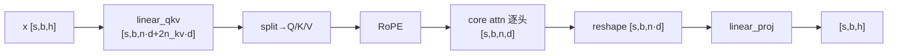
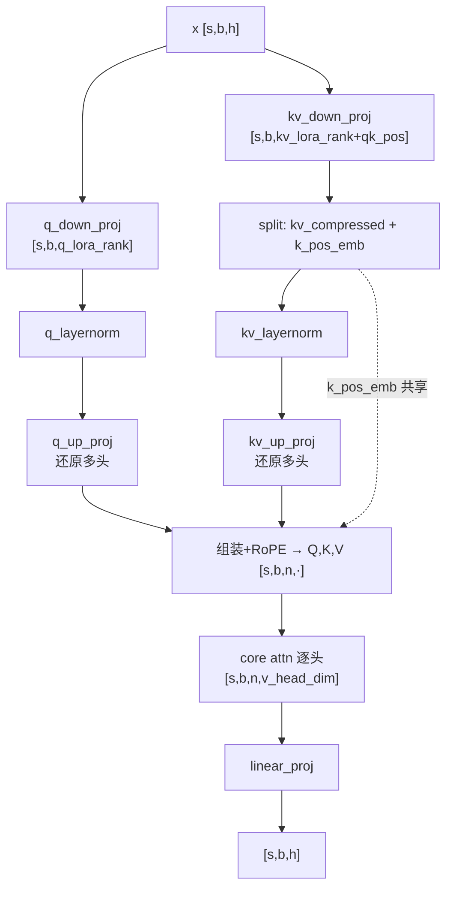
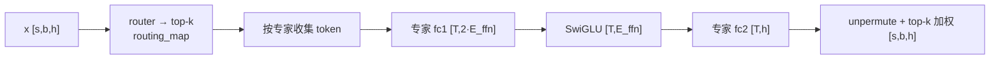
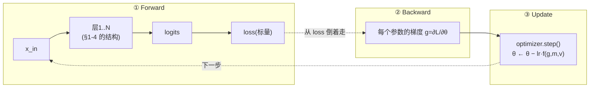

# 02.0 · Transformer + MoE 结构与张量维度基础（MHA / MLA）

> 本篇是 [02 · 并行化子系统](./02-并行化子系统.md) 的**前置基础文档**：在学习任何并行模式（TP/PP/DP/CP/EP）之前，先建立三个直觉——**一个带 MoE 的 Transformer 层在算什么、张量维度如何逐步变化（§1–4）、以及一个训练步的 Forward→Backward→Update 三段式（§5）**。本篇以**单卡逻辑视角**呈现（不含切分），并在每步标注「⏵ 并行预览」指向后续文档，告诉你**之后并行会在哪里、哪一段下刀**。注意力部分**分 MHA 与 MLA 两轨**。
>
> 阅读顺序建议：先读本篇（结构）→ [02.1](./02.1-显存、激活值与重计算.md)（为什么要并行：显存/激活/重计算）→ [02.2](./02.2-优化器数学原理与对比.md)（优化器）→ [02.3](./02.3-通信原语速查.md)（通信积木）→ 再进入 Megatron 实现：[02.4](./02.4-并行组构建与通信详解.md)（通信组）→ [02.5](./02.5-张量并行实现详解.md)（TP）→ [02.6](./02.6-流水线并行与1F1B调度.md)（PP）→ [02.7](./02.7-上下文并行与专家并行.md)（CP&EP）→ [02.8](./02.8-进阶专题.md)（进阶专题）。
>
> 相关源码：`transformer/transformer_layer.py`、`attention.py`（MHA）、`multi_latent_attention.py`（MLA）、`transformer/moe/{moe_layer,experts.py}`。

---

## 0. 记号约定

| 符号 | 含义 | DeepSeek-V3 量级示例 |
|------|------|----------------------|
| `s` / `b` / `h` | 序列长 / micro-batch / 隐藏维 | s=4096, b=1, h=7168 |
| `n` / `n_kv` / `d` | 注意力头数 / KV 头数(GQA) / 头维 | n=128, d=128 |
| `E` / `k` / `E_ffn` | 专家数 / top-k / 单专家 FFN 维 | E=256, k=8, E_ffn=2048 |
| **MLA 专用** | `q_lora_rank` / `kv_lora_rank` / `qk_head_dim` / `qk_pos_emb_head_dim` / `v_head_dim` | 1536 / 512 / 128 / 64 / 128 |

> 本篇所有维度都是**单卡逻辑维度**（完整张量，未切分）。并行如何切分、何处通信，见各步的「⏵ 并行预览」与对应子文档。

---

## 1. Transformer 层骨架（MoE 版，Pre-Norm）

```
x_in ─┬─────────────────────────────► (+) ─┬───────────────────────► (+) ─► x_out
      │  残差1(取自norm前的输入)        │   │  残差2(取自norm前的输入)    │
      └─ InputNorm ─► Attention ───────┘   └─ PreMLPNorm ─► MoE ────────┘
          (RMSNorm)    (MHA 或 MLA)            (RMSNorm)     (路由+专家)
```

结构是标准 **Pre-Norm（Pre-LN）**：

```
h = h + Attn(Norm(h))      # 残差1 从 norm 之前的输入引出
h = h + MoE(Norm(h))       # 残差2 从 norm 之前的输入引出
```

一层 = **归一 → 注意力 → 加残差 → 归一 → MoE → 加残差**。两个 Norm、残差加法都是逐元素操作；计算的"重头"在 Attention 的投影矩阵与 MoE 的专家 FFN。

> 对照源码（`transformer_layer.py`）：`residual = hidden_states`（:636/:799 取 **norm 之前**的输入）→ `input_layernorm/pre_mlp_layernorm` → `self_attention/mlp` → `self_attn_bda/mlp_bda`（:683/末尾做 `residual + 子层输出`）。残差出处由 `apply_residual_connection_post_layernorm=False`（默认）决定。
>
> 与 DeepSeek 对齐：DS 同为 Pre-Norm，归一用 **RMSNorm**（Megatron 由 spec 配置，DS 配方即 RMSNorm）。另两点属 DS 特色但**不改变本顺序**：① DeepSeek-V3 前 3 层用 Dense FFN、之后才是 MoE 层（本图取 MoE 层视角）；② DS 的 MoE = 细粒度路由专家 + 共享专家（见 §4 与 [02.7 §7](./02.7-上下文并行与专家并行.md)）。

> ⏵ 并行预览：两个 Norm 是**复制参数**（不切分，原因见 [02.5 §9.1](./02.5-张量并行实现详解.md)）；其后的大矩阵乘是 TP 的切分对象；MoE 的专家是 EP 的切分对象。

> Remark：pre Norm和post Norm的区别可参考https://spaces.ac.cn/archives/9009
---

## 2. 注意力轨道 A：MHA（标准多头 / GQA）

一个 `linear_qkv` 投影出 Q/K/V → 逐头算注意力 → `linear_proj` 投影回 `h`。

| 步骤 | 算子 | 输入维 → 输出维（单卡逻辑） |
|------|------|----------------------------|
| 1 | `linear_qkv` | `[s,b,h]` → `[s,b, n·d + 2·n_kv·d]` |
| 2 | split + reshape | → Q`[s,b,n,d]` K`[s,b,n_kv,d]` V`[s,b,n_kv,d]` |
| 3 | RoPE | 逐元素旋转 Q,K（作用于完整头维 `d`） |
| 4 | **core attention** | `softmax(QKᵀ/√d)·V` → `[s,b,n,d]` |
| 5 | reshape | → `[s,b, n·d]` |
| 6 | `linear_proj` | `[s,b, n·d]` → `[s,b,h]` |



> ⏵ 并行预览：TP 把 `linear_qkv`/`linear_proj` **沿注意力头切**（每卡 `n/t` 个头），core attention 逐头本地、无通信，`linear_proj` 出口做一次 AllReduce——完整推导见 [02.5 §5](./02.5-张量并行实现详解.md)。KV cache 大小 ∝ `n_kv·d`。

---

## 3. 注意力轨道 B：MLA（多头潜在注意力，DeepSeek 式）

MLA 的核心是**低秩压缩**：先把 Q、KV 各压到一个极小的 latent 维，再 up-proj 还原成多头。**推理时 KV cache 只需缓存压缩后的 `kv_lora_rank + qk_pos_emb_head_dim`（如 512+64=576）**，远小于 MHA 的 `n_kv·d`——这是 MLA 省显存的根本。源码：`multi_latent_attention.py:628`（down）、`:769`（up）。

### 3.1 维度流（单卡逻辑）

| 步骤 | 算子 | 输入维 → 输出维 | 说明 |
|------|------|----------------|------|
| 1a | `linear_q_down_proj` | `[s,b,h]` → `[s,b, q_lora_rank]` | Q 压到 latent |
| 1b | `q_layernorm` | `[s,b, q_lora_rank]` | latent 归一 |
| 2a | `linear_kv_down_proj` | `[s,b,h]` → `[s,b, kv_lora_rank + qk_pos_emb_head_dim]` | KV 压缩；**这段即 KV cache** ★ |
| 2b | split | → kv_compressed`[s,b,kv_lora_rank]` + k_pos_emb`[s,b,qk_pos_emb_head_dim]` | k_pos_emb 为所有头共享的 RoPE 段 |
| 2c | `kv_layernorm` | `[s,b, kv_lora_rank]` | latent 归一 |
| 3 | `linear_q_up_proj` | `[s,b,q_lora_rank]` → `[s,b, n·(qk_head_dim+qk_pos_emb_head_dim)]` | 还原多头 Q |
| 4 | `linear_kv_up_proj` | `[s,b,kv_lora_rank]` → `[s,b, n·(qk_head_dim+v_head_dim)]` | 还原多头 K(no-pe) 与 V |
| 5 | 组装 + RoPE | Q=concat(q_no_pe,q_pos_emb)`[s,b,n,q_head_dim]`；K=concat(k_no_pe, k_pos_emb 广播)`[s,b,n,q_head_dim]`；V`[s,b,n,v_head_dim]` | `q_head_dim = qk_head_dim + qk_pos_emb_head_dim` |
| 6 | **core attention** | → `[s,b,n,v_head_dim]` | 逐头 |
| 7 | reshape | → `[s,b, n·v_head_dim]` | — |
| 8 | `linear_proj` | `[s,b, n·v_head_dim]` → `[s,b,h]` | 投影回隐藏维 |



### 3.2 MHA vs MLA 对比

| 维度 | MHA | MLA |
|------|-----|-----|
| Q/K/V 来源 | 一个 `linear_qkv` 直接投影 | down-proj 压到 latent → up-proj 还原 |
| **KV cache 大小** | `n_kv·d`（GQA 已压一道） | `kv_lora_rank + qk_pos_emb_head_dim`（更小）★ |
| 额外参数 | 无 | q/kv down-proj、up-proj、两个 latent LayerNorm |
| RoPE | 作用于完整头维 `d` | 只作用于独立的 `qk_pos_emb_head_dim` 小段（解耦 RoPE），`k_pos_emb` 所有头共享 |
| 计算特点 | 投影一步到位 | 多个小矩阵乘 + latent 压缩，换更小 KV cache |

> ⏵ 并行预览：MLA 的 TP 把 **up-proj** 沿头切（`linear_q_up_proj`/`linear_kv_up_proj`），latent 段小、通常不按头切；`linear_proj` 出口 AllReduce。其 TP 通信结构与 MHA 几乎一致——见 [02.5 §5/§10](./02.5-张量并行实现详解.md)。

---

## 4. MoE 轨道（MHA / MLA 共用）

注意力输出经残差 + PreMLPLayerNorm 后进入 MoE：路由器为每个 token 选 top-k 专家，token 流过被选中的专家 FFN，再按概率加权合并。

| 步骤 | 算子 | 维度变化（单卡逻辑） |
|------|------|----------------------|
| 1 | `router` | `[s,b,h]` → logits`[s,b,E]` → top-k routing_map |
| 2 | 选路 + 收集 | 把每个 token 送到它的 top-k 专家 |
| 3 | 专家 `fc1`（gated） | `[T,h]` → `[T, 2·E_ffn]` |
| 4 | 激活（SwiGLU） | → `[T, E_ffn]` |
| 5 | 专家 `fc2` | → `[T, h]` |
| 6 | unpermute + 加权 | 按 top-k 概率合并 → `[s,b,h]` |

`T` = 流经某专家的 token 数（动态）。单专家的 `fc1→act→fc2` 就是一个标准 MLP（见 [02.5 §4](./02.5-张量并行实现详解.md)）。



> ⏵ 并行预览：EP 把 `E` 个专家**分到不同 GPU**（每卡 `E/ep` 个）；步骤 2 与 5 之后各插入一次 **All-to-All** 把 token 送到目标专家所在卡、再送回——完整推导见 [02.7 §6](./02.7-上下文并行与专家并行.md)。共享专家（若有）不经路由、可并行重叠。

---

## 5. 一个训练步：Forward → Backward → Update 三段式

§1–4 只讲了**前向**：一层里张量怎么从 `x_in` 逐步变成 `x_out`。但训练模型，每一步（step）其实是**三个首尾相接的阶段**：

```
 Forward(前向)   ──►   Backward(反向)   ──►   Update(更新)
 算激活、最后算 loss      从 loss 倒推每个参数的梯度      用梯度改参数
```

**为什么这一节对理解并行至关重要**：后面的 5 种通信，**无一例外都发生在这三段里的某一段**——而且往往能一眼看出它落在 forward 还是 backward。把三段在**单卡**上讲透，再看「哪种通信在哪一段」就水到渠成。本节末尾（§5.6）给出这张桥梁表。

> 本节仍是**单卡逻辑视角**（无切分、无通信），只是把视野从"前向一趟"扩展到"完整训练一步"。PyTorch 里 `backward()` / `optimizer.step()` 的真实 API 与代码，见 [02.4 §2.6 的两块 Remark](./02.4-并行组构建与通信详解.md)；本节聚焦**直觉与维度**。

### 5.1 三段式总览（单卡，无并行）



| 阶段 | 输入 | 产出 | 关键代价 | 一句话 |
|------|------|------|----------|--------|
| **Forward** | `x_in` + 权重 θ | 各层激活 + 最终 `loss` | **激活显存**（∝ 层数·`s·b·h`） | 顺着网络算一遍，并"留底"中间结果 |
| **Backward** | `loss` + 留底的激活 | 每个参数的梯度 `g=∂L/∂θ` | 算力（约 2× 前向） | 倒着走一遍，用链式法则求梯度 |
| **Update** | 梯度 `g` + 优化器状态 | 更新后的权重 θ' | **优化器状态显存**（Adam 的 m,v,主权重） | 逐参数独立地把 θ 改一点 |

> 三段循环往复：`update` 完就拿新权重跑下一个 batch 的 `forward`。**训练 = 把这三段重复几十万次。**

### 5.2 Forward：算激活，并"留底"给反向

前向就是把 §1–4 的算子从头到尾跑一遍，最后接一个 loss（如交叉熵）把 `[s,b,vocab]` 的 logits 压成一个**标量** `L`。这里只需补一个对反向至关重要的细节：

> **前向每算一步，都要把"反向会用到的中间结果"缓存下来**——这些缓存就是**激活（activation）**。

为什么要留底？因为反向算梯度要用链式法则，而链式法则的每一环都依赖前向时的输入值。例如一个矩阵乘 `Y = X·A`，反向算权重梯度需要用到 `X`（见 §5.3 公式），所以前向必须把 `X` 存着，不能算完就扔。

- **激活是显存大户**：每层都要留一份 `[s,b,h]` 量级的激活，`N` 层就是 `N` 份。序列 `s` 越长、层数越多，激活显存越爆——这正是后面 **序列并行（省激活）** 和 **重计算（activation recomputation）** 要解决的问题。完整的显存账（模型态 16P + 激活）、"什么才算激活"、以及重计算原理，见 [02.1 · 显存、激活值与重计算](./02.1-显存、激活值与重计算.md)。
- **对照 §5.1**：forward 的"关键代价"写的是激活显存，就是这个原因。

> ⏵ 并行预览：TP 的 Row 层出口、PP 的 stage 边界、CP 的注意力、EP 的 dispatch——这些通信**都在前向就已经发生**，传的是**激活或激活的部分和**。见 §5.6。

### 5.3 Backward：从 loss 倒着走一遍，每个算子吐"两种梯度"

反向是全篇最需要建立直觉的一段。抓住三个要点就够：

**要点①：反向 = 把前向的计算图倒过来走一遍。** 前向是 `x → h1 → h2 → … → L`，反向就从标量 `L` 出发，沿**完全相同的图、逆序**地算出 `∂L/∂(每个中间量)` 和 `∂L/∂(每个参数)`。

**要点②：一个矩阵乘 `Y = X·A`，反向会吐出两种梯度。** 这是整节的核心。设反向传到这里时，"上游"已经给了 `∂L/∂Y`（和 `Y` 同形状），则：

```
                         ┌─ ∂L/∂X = ∂L/∂Y · Aᵀ     ← 继续往前传给上一个算子（激活梯度）
  已知 ∂L/∂Y  ──────────┤
                         └─ ∂L/∂A = Xᵀ · ∂L/∂Y     ← 留在本地，喂给优化器（权重梯度）
```

维度自检（`X:[s·b, h_in]`，`A:[h_in, h_out]`，`Y:[s·b, h_out]`）：

| 梯度 | 公式 | 形状 | 和谁同形 |
|------|------|------|----------|
| `∂L/∂Y`（上游给的） | — | `[s·b, h_out]` | = `Y` |
| `∂L/∂X`（传回上一层） | `∂L/∂Y · Aᵀ` | `[s·b, h_in]` | = `X` |
| `∂L/∂A`（本层权重梯度） | `Xᵀ · ∂L/∂Y` | `[h_in, h_out]` | = `A` |

> **黄金记忆法**：**梯度永远和它对应的量同形状**（`∂L/∂A` 与权重 `A` 同形，`∂L/∂X` 与输入 `X` 同形）。这条规律贯穿全篇，也是 [02.4 §2.6](./02.4-并行组构建与通信详解.md) 里 "`.grad` 的形状 = 参数形状" 的由来。
>
> **📐 想看"为什么恰好是这两个公式"**（为什么带转置、为什么一个左乘一个右乘）？逐元素链式法则的严谨推导见本节末 **§5.3.1（选读）**。

**要点③：区分"两种梯度"是理解所有并行通信的钥匙。**

| 名称 | 是谁 | 去哪 | 谁需要它 |
|------|------|------|----------|
| **激活梯度** `∂L/∂X` | 对**输入/激活**的梯度 | **继续沿网络往回传** | 上一个算子（链式法则的下一环） |
| **权重梯度** `∂L/∂A` | 对**参数**的梯度 | **停在本地**，本步用完 | 优化器（§5.4 的 update） |

记住这个区分：**TP/PP/CP/EP 通信的是"激活梯度"**（沿网络流动，所以前向反向对称出现）；**DP 通信的是"权重梯度"**（反向末尾同步一次）。§5.6 会把这点讲穿。

**一个三算子小链条（把上面串起来）：**

前向（留底 `x, h1, h2`）：
```
x ──W1──► h1 = x·W1 ──ReLU──► h2 = relu(h1) ──W2──► y = h2·W2 ──► L = loss(y)
```

反向（逆序，每个 Linear 各吐两种梯度）：
```
        产出 ∂L/∂W1 = xᵀ·(∂L/∂h1)              产出 ∂L/∂W2 = h2ᵀ·(∂L/∂y)
                    ▲                                      ▲
∂L/∂x ◄──W1── ∂L/∂h1 = (∂L/∂h2)⊙relu'(h1) ◄──ReLU── ∂L/∂h2 = (∂L/∂y)·W2ᵀ ◄──W2── ∂L/∂y ◄── L
```

看清两件事：① 反向严格逆着前向走；② 每经过一个带权重的算子（W1、W2），都**顺手产出该权重的梯度**（`∂L/∂W`），同时把**激活梯度**（`∂L/∂h`）继续往回传。前者留给 update，后者是通信/回传的主角。

### 5.3.1 严谨推导：为什么是 $\partial L/\partial X = \partial L/\partial Y\cdot A^\top$、$\partial L/\partial A = X^\top\cdot \partial L/\partial Y$（选读）

上面要点②直接给了结论。这里用**逐元素链式法则**把它严格证出来——只想用结论的读者可跳到 §5.4。

**设定**。设矩阵乘 $Y = XA$，其中

$$
X\in\mathbb{R}^{m\times k},\quad A\in\mathbb{R}^{k\times n},\quad Y\in\mathbb{R}^{m\times n},
$$

对应本篇的 $m = s\cdot b$（token 数）、$k = h_{\text{in}}$、$n = h_{\text{out}}$。$L$ 是最终的**标量** loss。反向传播到这一步时，上游已经算好了

$$
\bar Y \;:=\; \frac{\partial L}{\partial Y}\in\mathbb{R}^{m\times n},\qquad \bar Y_{ij}=\frac{\partial L}{\partial Y_{ij}} .
$$

前向的逐元素形式（**关键：对下标 $p$ 求和，$p$ 就是被"收缩"掉的共享维 $k$**）：

$$
Y_{ij}=\sum_{p=1}^{k} X_{ip}\,A_{pj}. \tag{$\ast$}
$$

**目标**：只用 $\bar Y,\ X,\ A$ 表示出 $\dfrac{\partial L}{\partial A_{pj}}$ 与 $\dfrac{\partial L}{\partial X_{ip}}$。

---

**(1) 权重梯度 $\partial L/\partial A$。** 参数 $A_{pj}$ 只通过 $Y$ 的各元素影响 $L$，多元链式法则（对所有 $Y_{ij'}$ 求和）：

$$
\frac{\partial L}{\partial A_{pj}}
=\sum_{i=1}^{m}\sum_{j'=1}^{n}\frac{\partial L}{\partial Y_{ij'}}\,\frac{\partial Y_{ij'}}{\partial A_{pj}} .
$$

由 $(\ast)$ 求局部偏导，只有 $q=p$ 且 $j'=j$ 的那一项非零（$\delta$ 为 Kronecker delta）：

$$
\frac{\partial Y_{ij'}}{\partial A_{pj}}
=\frac{\partial}{\partial A_{pj}}\sum_{q} X_{iq}A_{qj'}
= X_{ip}\,\delta_{j'j}.
$$

代回并把 $\delta_{j'j}$ 把 $j'$ 锁成 $j$：

$$
\frac{\partial L}{\partial A_{pj}}
=\sum_{i}\bar Y_{ij}\,X_{ip}
=\sum_{i}(X^\top)_{pi}\,\bar Y_{ij}
=(X^\top\bar Y)_{pj}
\;\;\Longrightarrow\;\;
\boxed{\;\frac{\partial L}{\partial A}=X^\top\,\frac{\partial L}{\partial Y}\;}
$$

> 注意 $\sum_i$ 恰好是**对 $m=s\cdot b$（batch·序列）维求和**——所以权重梯度天然把一个 batch 里所有 token 的贡献**加起来**。这也是数据并行 DP 里"各卡梯度求和/求平均"（[02.4 §0.4.1](./02.4-并行组构建与通信详解.md)）在单算子层面的根源。

---

**(2) 激活梯度 $\partial L/\partial X$。** 同理，$X_{ip}$ 通过 $Y$ 的元素影响 $L$：

$$
\frac{\partial L}{\partial X_{ip}}
=\sum_{i'=1}^{m}\sum_{j=1}^{n}\frac{\partial L}{\partial Y_{i'j}}\,\frac{\partial Y_{i'j}}{\partial X_{ip}},
\qquad
\frac{\partial Y_{i'j}}{\partial X_{ip}}=A_{pj}\,\delta_{i'i}.
$$

$\delta_{i'i}$ 把 $i'$ 锁成 $i$：

$$
\frac{\partial L}{\partial X_{ip}}
=\sum_{j}\bar Y_{ij}\,A_{pj}
=\sum_{j}\bar Y_{ij}\,(A^\top)_{jp}
=(\bar Y A^\top)_{ip}
\;\;\Longrightarrow\;\;
\boxed{\;\frac{\partial L}{\partial X}=\frac{\partial L}{\partial Y}\,A^\top\;}
$$

---

**(3) 用微分/迹法交叉验证**（更快、更不易错）。对标量 $L$，$dL=\sum_{ij}\bar Y_{ij}\,dY_{ij}=\operatorname{tr}(\bar Y^\top\,dY)$。对 $Y=XA$ 取微分：$dY=dX\,A+X\,dA$，于是

$$
dL=\operatorname{tr}(\bar Y^\top dX\,A)+\operatorname{tr}(\bar Y^\top X\,dA)
=\operatorname{tr}\big(\underbrace{A\bar Y^\top}_{}\,dX\big)+\operatorname{tr}\big(\underbrace{\bar Y^\top X}_{}\,dA\big),
$$

（用了迹的轮换 $\operatorname{tr}(UVW)=\operatorname{tr}(WUV)$）。与 $dL=\operatorname{tr}\!\big((\partial L/\partial X)^\top dX\big)+\operatorname{tr}\!\big((\partial L/\partial A)^\top dA\big)$ 逐项对齐：

$$
\Big(\frac{\partial L}{\partial X}\Big)^\top=A\bar Y^\top\Rightarrow \frac{\partial L}{\partial X}=\bar Y A^\top,
\qquad
\Big(\frac{\partial L}{\partial A}\Big)^\top=\bar Y^\top X\Rightarrow \frac{\partial L}{\partial A}=X^\top\bar Y,
$$

与 (1)(2) 完全一致。

---

**(4) 为什么"带转置、一左乘一右乘"——三条直觉。**

1. **对没被求导的那个下标做收缩**。前向 $(\ast)$ 沿 $p$（即 $k$ 维）求和。求 $\partial L/\partial X$（下标 $i,p$）时，$\bar Y_{ij}$ 与 $A_{pj}$ 要沿**它们共享、而 $X$ 不含的下标 $j$（即 $n$ 维）**收缩，剩下 $(i,p)$——这就逼出 $A^\top$ 且**右乘**：$\bar Y A^\top$。求 $\partial L/\partial A$（下标 $p,j$）时沿 $i$（$m$ 维）收缩，逼出 $X^\top$ 且**左乘**：$X^\top\bar Y$。
2. **形状守恒是必要检查**（非充分）：只有 $\bar Y A^\top$（$[m,n]\!\cdot\![n,k]=[m,k]$）能与 $X$ 同形，只有 $X^\top\bar Y$（$[k,m]\!\cdot\![m,n]=[k,n]$）能与 $A$ 同形——与要点②的"梯度与量同形"表吻合。
3. **转置 = 把前向的"读取方向"倒过来**。前向 $X$ 用行、$A$ 用列去点乘；反向把上游 $\bar Y$ 分别沿这两个方向"回填"，数学上正好体现为乘上 $A^\top$ / $X^\top$。

> 推论：**ReLU/逐元素算子**（如 §5.3 小链条里的 `∂L/∂h1 = (∂L/∂h2)⊙relu'(h1)`）没有矩阵收缩，只是逐元素乘上局部导数 $\mathrm{relu}'$，所以用 Hadamard 积 $\odot$ 而非矩阵乘——同一套链式法则的退化情形。

### 5.4 Update：用梯度改参数，逐参数独立

反向结束后，每个参数 θ 都有了自己的梯度 `g=∂L/∂θ`。update 就是用 `g` 把 θ 改一点。最简单的 SGD：`θ ← θ − lr·g`；实际常用 Adam：

```
m ← β1·m + (1−β1)·g          # 一阶矩(动量)
v ← β2·v + (1−β2)·g²         # 二阶矩(自适应步长)
θ ← θ − lr · m̂ / (√v̂ + ε)    # 用 m,v 更新 θ
```

**唯一但极关键的直觉：update 是逐参数独立的。** 更新第 `i` 个参数只需要它自己的 `(g_i, m_i, v_i, θ_i)`，**完全不需要第 `j` 个参数的任何信息**。

> 这条"参数间互不依赖"正是**分布式优化器（ZeRO）** 能把优化器状态切成 `1/N` 分给各卡的根本原因——每卡只管一段参数，各更各的。完整推导与 Adam/SGD/Muon 对比见 [02.4 §2.6](./02.4-并行组构建与通信详解.md) 与 [02.2](./02.2-优化器数学原理与对比.md)。

### 5.5 把 §2 的 MHA 倒着走一遍（一层的完整来回）

把 §2 那张 MHA 前向表（6 步）倒过来，就是这一层的反向：从 `linear_proj` 开始逆序回到 `linear_qkv`，每个 `linear_*` 都吐出「权重梯度 + 激活梯度」两份。

| 前向（§2） | → | 反向（逆序） | 该步产出 |
|-----------|---|-------------|----------|
| ⑥ `linear_proj` | ⇄ | 先回到 `linear_proj` | `∂L/∂W_proj` + 往回传的激活梯度 |
| ④ core attention | ⇄ | 逐头反传（softmax、QKᵀ、·V 各自的反向） | Q,K,V 的梯度 |
| ③ RoPE | ⇄ | 旋转的反向（也是旋转） | — |
| ① `linear_qkv` | ⇄ | 最后回到 `linear_qkv` | `∂L/∂W_qkv` + `∂L/∂x_in`(传给上一层) |

- 前向留底的激活（如 `core attention` 的 softmax 结果、各投影的输入 `x`）在这里被逐一取用——**这就是 §5.2 说"留底"的兑现现场**。
- 最左端产出的 `∂L/∂x_in` 会作为**上一层的上游梯度**继续往回传（若跨 PP stage，就要 P2P 送回上一个 stage）；沿途每个 `linear_*` 产出的 `∂L/∂W` 攒着，等 §5.4 的 update。

> MLA（§3）同理：反向从 `linear_proj` 逆序穿过 up-proj → latent LayerNorm → down-proj 回到 `x_in`，每个投影各吐两种梯度，结构与 MHA 一致。

### 5.6 桥梁：5 种通信分别落在 forward / backward / update 的哪一段 ★

这是本节的落脚点，也是通往 [02.4](./02.4-并行组构建与通信详解.md)～[02.7](./02.7-上下文并行与专家并行.md) 的钥匙。把"三段式"和"5 种并行"叉乘，规律异常清晰：

| 并行 | 切什么 | **Forward 通信** | **Backward 通信** | **Update 通信** | 传的是哪种量 |
|------|--------|------------------|-------------------|-----------------|--------------|
| **TP** | 层内矩阵 | Row 层出口 all-reduce **部分和** | Column 层入口 all-reduce **部分激活梯度** | — | 激活 / 激活梯度 |
| **PP** | 层深度 | stage 边界 P2P **送激活** | stage 边界 P2P **回传激活梯度** | — | 激活 / 激活梯度 |
| **CP** | 序列 `s` | 注意力内交换 **K/V** | 交换 **K/V 的梯度** | — | 激活 / 激活梯度 |
| **EP** | 专家 `E` | dispatch+combine **A2A** | 反向 A2A **回传 token 梯度** | (专家权重梯度在 expert-DP 组同步) | 激活 / 激活梯度 |
| **DP** | 复制模型、切数据 | — | 反向末尾 all-reduce **权重梯度** | 紧接 update（或 ZeRO 的 RS+AG） | **权重梯度** |

**从这张表能一眼读出的三条直觉：**

1. **TP/PP/CP/EP 都在 forward 和 backward 里成对出现**——因为它们传的是**激活/激活梯度**（§5.3 的 `∂L/∂X`），前向怎么流动、反向就怎么反着流回来，天然对称。所以这四种"每层都发、前后向各一次"。
2. **只有 DP 传"权重梯度"（§5.3 的 `∂L/∂W`）**，它不参与前向、只在**反向末尾**把各副本的 `∂L/∂W` 求和一次，紧接着 update。所以 DP 是"每步一次、频率最低"（详见 [02.4 §0.4.1](./02.4-并行组构建与通信详解.md)）。
3. **update 阶段本身几乎不通信**——梯度在 update 之前就同步好了；唯一的例外是 **ZeRO 分布式优化器**把 DP 的同步拆成 "反向末尾 Reduce-Scatter + 下次前向前 All-Gather"，相当于把一部分通信挪到了 update 前后（见 [02.4 §2.6](./02.4-并行组构建与通信详解.md)）。

> **和 §6 的关系**：本节（§5.6）回答 **WHEN**——通信落在 forward / backward / update 的哪一段；下一节（§6）回答 **WHERE**——通信落在结构图的哪个算子上。两张表对着看，5 种通信的"何时、何地、传什么"就全齐了。

---

## 6. 并行预览地图：五种并行在这张图上的下刀点

理解了上面的结构、维度与三段式（§5）后，五种并行其实就是**在这张图的不同位置切分 / 通信**。下表是从基础结构到并行模式的桥梁（回答 **WHERE**，与 §5.6 的 **WHEN** 互补）：

| 并行 | 在本图的作用点 | 切什么 / 通信 | 展开文档 |
|------|----------------|---------------|----------|
| **TP** | `linear_qkv`/`up_proj`、`linear_proj`、专家 `fc1/fc2` | 沿头维/隐藏维切权重；行并行出口 AllReduce | [02.5](./02.5-张量并行实现详解.md) |
| **PP** | 层与层之间（本图是单层） | 按层深度切 stage，边界 P2P 传 `[s,b,h]` | [02.6](./02.6-流水线并行与1F1B调度.md) |
| **DP** | 整张图复制，喂不同数据 | 梯度同步 AllReduce/ReduceScatter | [02.5 §11](./02.5-张量并行实现详解.md) / [04](./04-分布式训练与优化器.md) |
| **CP** | core attention 内部 | 沿序列 `s` 切，注意力交换 KV | [02.7 §1-4](./02.7-上下文并行与专家并行.md) |
| **EP** | MoE 专家 | 沿专家 `E` 切，dispatch/combine A2A | [02.7 §5-8](./02.7-上下文并行与专家并行.md) |
| **SP**（TP 搭档） | 两 TP 区域**之间**的激活 | 沿序列 `s` 切激活，AllReduce→RS+AG | [02.5 §8](./02.5-张量并行实现详解.md) |

> 一个粗略的"全开"前向通信量（单层、单 microbatch）：**≈ 1× AllReduce(TP) + 2× All-to-All(EP)**，反向对称；其余并行（PP/DP/CP/SP）在各自边界叠加。这条结论会在 [02.5~02.7](./02.5-张量并行实现详解.md) 中逐项落实。

---

## 7. 小结

- 一个 MoE Transformer 层 = **LayerNorm → Attention(MHA/MLA) → 残差 → LayerNorm → MoE → 残差**；计算重头在投影矩阵与专家 FFN。
- **MHA**：`linear_qkv` 一步投影 → 逐头 attn → `linear_proj` 回 `h`，KV cache ∝ `n_kv·d`。
- **MLA**：down-proj 压 latent → up-proj 还原多头 → `linear_proj`，**KV cache ∝ `kv_lora_rank`（更小）**，RoPE 解耦到独立小段。
- **MoE**：router 选 top-k → 专家 FFN（GroupedGEMM）→ top-k 加权合并。
- **一个训练步 = Forward → Backward → Update 三段式**（§5）：前向算激活并留底，反向倒着走、每个矩阵乘吐出「激活梯度 `∂L/∂X`（往回传）+ 权重梯度 `∂L/∂W`（喂优化器）」两种量，update 逐参数独立地改权重。
- **5 种通信全落在这三段里**（§5.6）：**TP/PP/CP/EP 传"激活/激活梯度"**，在 forward 与 backward 里对称成对出现、每层都发；**DP 传"权重梯度"**，只在反向末尾同步一次。记住"传激活还是传权重梯度"，5 种通信的性格就分清了。
- 五种并行就是在这张图的不同位置下刀：**TP 切矩阵、PP 切层、DP 复制、CP 切序列、EP 切专家**——读完本篇再进入 [02.4](./02.4-并行组构建与通信详解.md) 起的并行细节，会清晰很多。

返回上级：[02 · 并行化子系统](./02-并行化子系统.md) ｜ 下一篇：[02.1 · 显存、激活值与重计算](./02.1-显存、激活值与重计算.md)
