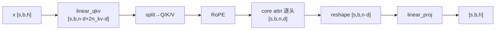
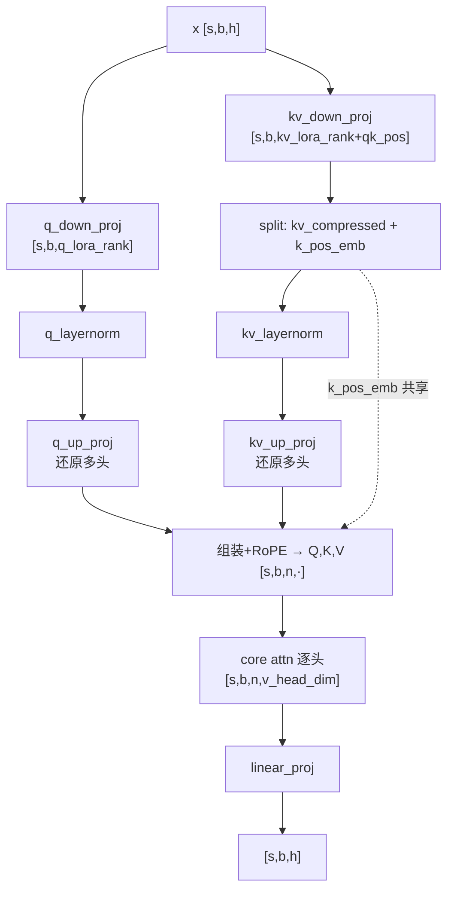
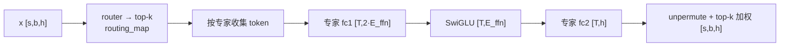

# 02.0 · Transformer + MoE 结构与张量维度基础（MHA / MLA）

> 本篇是 [02 · 并行化子系统](./02-并行化子系统.md) 的**前置基础文档**：在学习任何并行模式（TP/PP/DP/CP/EP）之前，先建立两个直觉——**一个带 MoE 的 Transformer 层在算什么、张量维度如何逐步变化**。本篇以**单卡逻辑视角**呈现（不含切分），并在每步标注「⏵ 并行预览」指向后续文档，告诉你**之后并行会在哪里下刀**。注意力部分**分 MHA 与 MLA 两轨**。
>
> 阅读顺序建议：先读本篇 → 再按 [02.1](./02.1-并行组构建与通信详解.md)（通信组）→ [02.2](./02.2-张量并行实现详解.md)（TP）→ [02.3](./02.3-流水线并行与1F1B调度.md)（PP）→ [02.4](./02.4-上下文并行与专家并行.md)（CP&EP）逐层叠加并行。
>
> 相关源码：`transformer/transformer_layer.py`、`attention.py`（MHA）、`multi_latent_attention.py`（MLA）、`transformer/moe/{moe_layer,experts.py}`。

---

## 0. 记号约定

| 符号 | 含义 | DeepSeek-V3 量级示例 |
|------|------|----------------------|
| `s` / `b` / `h` | 序列长 / micro-batch / 隐藏维 | s=4096, b=1, h=7168 |
| `n` / `n_kv` / `d` | 注意力头数 / KV 头数(GQA) / 头维 | n=128, d=128 |
| `E` / `k` / `E_ffn` | 专家数 / top-k / 单专家 FFN 维 | E=256, k=8, E_ffn=2048 |
| **MLA 专用** | `q_lora_rank` / `kv_lora_rank` / `qk_head_dim` / `qk_pos_emb_head_dim` / `v_head_dim` | 1536 / 512 / 128 / 64 / 128 |

> 本篇所有维度都是**单卡逻辑维度**（完整张量，未切分）。并行如何切分、何处通信，见各步的「⏵ 并行预览」与对应子文档。

---

## 1. Transformer 层骨架（MoE 版，Pre-Norm）

```
x_in ─┬─────────────────────────────► (+) ─┬───────────────────────► (+) ─► x_out
      │  残差1(取自norm前的输入)        │   │  残差2(取自norm前的输入)    │
      └─ InputNorm ─► Attention ───────┘   └─ PreMLPNorm ─► MoE ────────┘
          (RMSNorm)    (MHA 或 MLA)            (RMSNorm)     (路由+专家)
```

结构是标准 **Pre-Norm（Pre-LN）**：

```
h = h + Attn(Norm(h))      # 残差1 从 norm 之前的输入引出
h = h + MoE(Norm(h))       # 残差2 从 norm 之前的输入引出
```

一层 = **归一 → 注意力 → 加残差 → 归一 → MoE → 加残差**。两个 Norm、残差加法都是逐元素操作；计算的"重头"在 Attention 的投影矩阵与 MoE 的专家 FFN。

> 对照源码（`transformer_layer.py`）：`residual = hidden_states`（:636/:799 取 **norm 之前**的输入）→ `input_layernorm/pre_mlp_layernorm` → `self_attention/mlp` → `self_attn_bda/mlp_bda`（:683/末尾做 `residual + 子层输出`）。残差出处由 `apply_residual_connection_post_layernorm=False`（默认）决定。
>
> 与 DeepSeek 对齐：DS 同为 Pre-Norm，归一用 **RMSNorm**（Megatron 由 spec 配置，DS 配方即 RMSNorm）。另两点属 DS 特色但**不改变本顺序**：① DeepSeek-V3 前 3 层用 Dense FFN、之后才是 MoE 层（本图取 MoE 层视角）；② DS 的 MoE = 细粒度路由专家 + 共享专家（见 §4 与 [02.4 §7](./02.4-上下文并行与专家并行.md)）。

> ⏵ 并行预览：两个 Norm 是**复制参数**（不切分，原因见 [02.2 §9.1](./02.2-张量并行实现详解.md)）；其后的大矩阵乘是 TP 的切分对象；MoE 的专家是 EP 的切分对象。

> Remark：pre Norm和post Norm的区别可参考https://spaces.ac.cn/archives/9009
---

## 2. 注意力轨道 A：MHA（标准多头 / GQA）

一个 `linear_qkv` 投影出 Q/K/V → 逐头算注意力 → `linear_proj` 投影回 `h`。

| 步骤 | 算子 | 输入维 → 输出维（单卡逻辑） |
|------|------|----------------------------|
| 1 | `linear_qkv` | `[s,b,h]` → `[s,b, n·d + 2·n_kv·d]` |
| 2 | split + reshape | → Q`[s,b,n,d]` K`[s,b,n_kv,d]` V`[s,b,n_kv,d]` |
| 3 | RoPE | 逐元素旋转 Q,K（作用于完整头维 `d`） |
| 4 | **core attention** | `softmax(QKᵀ/√d)·V` → `[s,b,n,d]` |
| 5 | reshape | → `[s,b, n·d]` |
| 6 | `linear_proj` | `[s,b, n·d]` → `[s,b,h]` |



> ⏵ 并行预览：TP 把 `linear_qkv`/`linear_proj` **沿注意力头切**（每卡 `n/t` 个头），core attention 逐头本地、无通信，`linear_proj` 出口做一次 AllReduce——完整推导见 [02.2 §5](./02.2-张量并行实现详解.md)。KV cache 大小 ∝ `n_kv·d`。

---

## 3. 注意力轨道 B：MLA（多头潜在注意力，DeepSeek 式）

MLA 的核心是**低秩压缩**：先把 Q、KV 各压到一个极小的 latent 维，再 up-proj 还原成多头。**推理时 KV cache 只需缓存压缩后的 `kv_lora_rank + qk_pos_emb_head_dim`（如 512+64=576）**，远小于 MHA 的 `n_kv·d`——这是 MLA 省显存的根本。源码：`multi_latent_attention.py:628`（down）、`:769`（up）。

### 3.1 维度流（单卡逻辑）

| 步骤 | 算子 | 输入维 → 输出维 | 说明 |
|------|------|----------------|------|
| 1a | `linear_q_down_proj` | `[s,b,h]` → `[s,b, q_lora_rank]` | Q 压到 latent |
| 1b | `q_layernorm` | `[s,b, q_lora_rank]` | latent 归一 |
| 2a | `linear_kv_down_proj` | `[s,b,h]` → `[s,b, kv_lora_rank + qk_pos_emb_head_dim]` | KV 压缩；**这段即 KV cache** ★ |
| 2b | split | → kv_compressed`[s,b,kv_lora_rank]` + k_pos_emb`[s,b,qk_pos_emb_head_dim]` | k_pos_emb 为所有头共享的 RoPE 段 |
| 2c | `kv_layernorm` | `[s,b, kv_lora_rank]` | latent 归一 |
| 3 | `linear_q_up_proj` | `[s,b,q_lora_rank]` → `[s,b, n·(qk_head_dim+qk_pos_emb_head_dim)]` | 还原多头 Q |
| 4 | `linear_kv_up_proj` | `[s,b,kv_lora_rank]` → `[s,b, n·(qk_head_dim+v_head_dim)]` | 还原多头 K(no-pe) 与 V |
| 5 | 组装 + RoPE | Q=concat(q_no_pe,q_pos_emb)`[s,b,n,q_head_dim]`；K=concat(k_no_pe, k_pos_emb 广播)`[s,b,n,q_head_dim]`；V`[s,b,n,v_head_dim]` | `q_head_dim = qk_head_dim + qk_pos_emb_head_dim` |
| 6 | **core attention** | → `[s,b,n,v_head_dim]` | 逐头 |
| 7 | reshape | → `[s,b, n·v_head_dim]` | — |
| 8 | `linear_proj` | `[s,b, n·v_head_dim]` → `[s,b,h]` | 投影回隐藏维 |



### 3.2 MHA vs MLA 对比

| 维度 | MHA | MLA |
|------|-----|-----|
| Q/K/V 来源 | 一个 `linear_qkv` 直接投影 | down-proj 压到 latent → up-proj 还原 |
| **KV cache 大小** | `n_kv·d`（GQA 已压一道） | `kv_lora_rank + qk_pos_emb_head_dim`（更小）★ |
| 额外参数 | 无 | q/kv down-proj、up-proj、两个 latent LayerNorm |
| RoPE | 作用于完整头维 `d` | 只作用于独立的 `qk_pos_emb_head_dim` 小段（解耦 RoPE），`k_pos_emb` 所有头共享 |
| 计算特点 | 投影一步到位 | 多个小矩阵乘 + latent 压缩，换更小 KV cache |

> ⏵ 并行预览：MLA 的 TP 把 **up-proj** 沿头切（`linear_q_up_proj`/`linear_kv_up_proj`），latent 段小、通常不按头切；`linear_proj` 出口 AllReduce。其 TP 通信结构与 MHA 几乎一致——见 [02.2 §5/§10](./02.2-张量并行实现详解.md)。

---

## 4. MoE 轨道（MHA / MLA 共用）

注意力输出经残差 + PreMLPLayerNorm 后进入 MoE：路由器为每个 token 选 top-k 专家，token 流过被选中的专家 FFN，再按概率加权合并。

| 步骤 | 算子 | 维度变化（单卡逻辑） |
|------|------|----------------------|
| 1 | `router` | `[s,b,h]` → logits`[s,b,E]` → top-k routing_map |
| 2 | 选路 + 收集 | 把每个 token 送到它的 top-k 专家 |
| 3 | 专家 `fc1`（gated） | `[T,h]` → `[T, 2·E_ffn]` |
| 4 | 激活（SwiGLU） | → `[T, E_ffn]` |
| 5 | 专家 `fc2` | → `[T, h]` |
| 6 | unpermute + 加权 | 按 top-k 概率合并 → `[s,b,h]` |

`T` = 流经某专家的 token 数（动态）。单专家的 `fc1→act→fc2` 就是一个标准 MLP（见 [02.2 §4](./02.2-张量并行实现详解.md)）。



> ⏵ 并行预览：EP 把 `E` 个专家**分到不同 GPU**（每卡 `E/ep` 个）；步骤 2 与 5 之后各插入一次 **All-to-All** 把 token 送到目标专家所在卡、再送回——完整推导见 [02.4 §6](./02.4-上下文并行与专家并行.md)。共享专家（若有）不经路由、可并行重叠。

---

## 5. 并行预览地图：五种并行在这张图上的下刀点

理解了上面的结构与维度后，五种并行其实就是**在这张图的不同位置切分 / 通信**。下表是从基础结构到并行模式的桥梁：

| 并行 | 在本图的作用点 | 切什么 / 通信 | 展开文档 |
|------|----------------|---------------|----------|
| **TP** | `linear_qkv`/`up_proj`、`linear_proj`、专家 `fc1/fc2` | 沿头维/隐藏维切权重；行并行出口 AllReduce | [02.2](./02.2-张量并行实现详解.md) |
| **PP** | 层与层之间（本图是单层） | 按层深度切 stage，边界 P2P 传 `[s,b,h]` | [02.3](./02.3-流水线并行与1F1B调度.md) |
| **DP** | 整张图复制，喂不同数据 | 梯度同步 AllReduce/ReduceScatter | [02.2 §11](./02.2-张量并行实现详解.md) / [04](./04-分布式训练与优化器.md) |
| **CP** | core attention 内部 | 沿序列 `s` 切，注意力交换 KV | [02.4 §1-4](./02.4-上下文并行与专家并行.md) |
| **EP** | MoE 专家 | 沿专家 `E` 切，dispatch/combine A2A | [02.4 §5-8](./02.4-上下文并行与专家并行.md) |
| **SP**（TP 搭档） | 两 TP 区域**之间**的激活 | 沿序列 `s` 切激活，AllReduce→RS+AG | [02.2 §8](./02.2-张量并行实现详解.md) |

> 一个粗略的"全开"前向通信量（单层、单 microbatch）：**≈ 1× AllReduce(TP) + 2× All-to-All(EP)**，反向对称；其余并行（PP/DP/CP/SP）在各自边界叠加。这条结论会在 [02.2~02.4](./02.2-张量并行实现详解.md) 中逐项落实。

---

## 6. 小结

- 一个 MoE Transformer 层 = **LayerNorm → Attention(MHA/MLA) → 残差 → LayerNorm → MoE → 残差**；计算重头在投影矩阵与专家 FFN。
- **MHA**：`linear_qkv` 一步投影 → 逐头 attn → `linear_proj` 回 `h`，KV cache ∝ `n_kv·d`。
- **MLA**：down-proj 压 latent → up-proj 还原多头 → `linear_proj`，**KV cache ∝ `kv_lora_rank`（更小）**，RoPE 解耦到独立小段。
- **MoE**：router 选 top-k → 专家 FFN（GroupedGEMM）→ top-k 加权合并。
- 五种并行就是在这张图的不同位置下刀：**TP 切矩阵、PP 切层、DP 复制、CP 切序列、EP 切专家**——读完本篇再进入 [02.1](./02.1-并行组构建与通信详解.md) 起的并行细节，会清晰很多。

返回上级：[02 · 并行化子系统](./02-并行化子系统.md) ｜ 下一篇：[02.1 · 并行组构建与通信详解](./02.1-并行组构建与通信详解.md)
