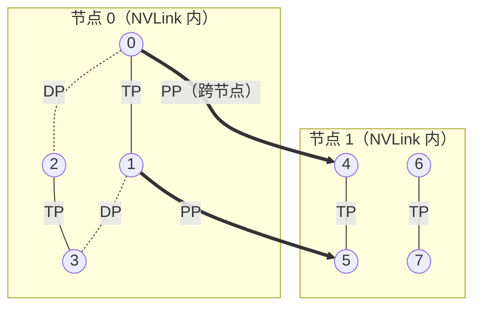

# 02.1 · 并行组构建与通信详解（parallel_state 深读）

> 本篇是 [02 · 并行化子系统](./02-并行化子系统.md) 的**子文档**，对其中「并行组的全局状态管理（`parallel_state`/mpu）」一节做面向初学者的展开。如果你是分布式计算新手，建议从本篇第 0 节读起；已了解基础的可直接跳到第 1 节。
>
> 唯一相关源码：`megatron/core/parallel_state.py`（2238 行），辅以 `megatron/core/tensor_parallel/{layers,mappings}.py`。

---

## 0. 预备知识：GPU 分布式并行需要什么

### 0.1 为什么要分布式

一块 GPU 的显存（如 80GB）装不下大模型（参数 + 激活 + 优化器状态），算力也不够。解法是**把工作拆到多块 GPU 协同完成**。而"协同"的代价是 GPU 间必须**通信**，通信需要一套约定。

### 0.2 三个最基础的概念

| 概念 | 含义 | 类比 |
|------|------|------|
| **Rank** | 每个进程（≈1 块 GPU）的全局唯一编号 `0..N-1` | 工号 |
| **World Size** | 总进程/GPU 数 | 公司总人数 |
| **Process Group（进程组/通信组）** | 一组需互相通信的 rank 的集合 | 微信群 |

> 核心直觉：**通信永远发生在"组"内**。不会让全部 GPU 一起喊话，而是切成很多小群、群内做集合通信。`parallel_state.py` 的核心职责，就是**把哪些 rank 分到哪个群、并把群建好**。

### 0.3 集合通信原语（底层由 NCCL 实现）

| 操作 | 作用 | 用在哪 |
|------|------|--------|
| **All-Reduce** | 组内各持一份 → 求和 → 结果发回每个人 | DP 同步梯度、TP 合并结果 |
| **All-Gather** | 各持一片 → 拼成完整发给所有人 | TP 收集输出 |
| **Reduce-Scatter** | 求和后切片分发 | 序列并行 / 分布式优化器 |
| **Broadcast** | 一个发给所有 | 数据广播 |
| **Send/Recv（P2P）** | 点对点直接发 | PP 传激活 |

每个操作都要传入一个 **process group 参数**，告诉 NCCL「在哪个群里做」。

### 0.4 四/五种并行（Megatron 的核心）

| 简称 | 全称 | 切什么 | 组内通信 |
|------|------|--------|----------|
| **DP** | 数据并行 | 每 GPU 一份完整模型，喂不同数据 | 同步梯度（All-Reduce） |
| **TP** | 张量并行 | 把单层矩阵横竖切到多 GPU | 每层 All-Gather/All-Reduce（频繁，须机内） |
| **PP** | 流水线并行 | 不同层分给不同 GPU | 相邻 stage P2P 传激活 |
| **CP** | 上下文并行 | 长序列切片 | 注意力时交换 |
| **EP** | 专家并行 | MoE 不同专家分到不同 GPU | token 路由 All-to-All |

> 这就是为什么 `parallel_state.py` 里有那么多 `_TENSOR_MODEL_PARALLEL_GROUP`、`_PIPELINE_MODEL_PARALLEL_GROUP`、`_DATA_PARALLEL_GROUP`、`_CONTEXT_PARALLEL_GROUP`、`_EXPERT_MODEL_PARALLEL_GROUP`——**每种并行都需要它自己的一套通信组**。

### 0.5 分布式训练的基础流程

```
1. torchrun 在每台机拉起 N 个进程，每进程绑 1 块 GPU
        ↓
2. torch.distributed.init_process_group()  建立"默认大群"（全部 N 个 rank）
        ↓
3. ★ initialize_model_parallel(tp,pp,dp,cp,ep)   ← parallel_state.py 的入口
   把 N 个 rank 按并行策略切成各种小群，存入全局变量
        ↓
4. 训练时各层用 get_*_group() 取出该用的群，调 NCCL 完成协同计算
        ↓
5. destroy_model_parallel() 清理
```

**`parallel_state.py` 负责第 3、4 步**——它是"裸的 N 块 GPU"与"结构化并行训练"之间的桥梁。

---

## 1. parallel_state 的三件事：算分组 → 建组 → 提供查询

文件虽 2238 行，骨架只有三件事。

### 1.1 全局状态：一堆 `_XXX_GROUP = None` 单例（开头 29–140 行）

```python
_TENSOR_MODEL_PARALLEL_GROUP = None      # 我所在的 TP 群
_PIPELINE_MODEL_PARALLEL_GROUP = None    # 我所在的 PP 群
_DATA_PARALLEL_GROUP = None              # 我所在的 DP 群
_CONTEXT_PARALLEL_GROUP = None           # 我所在的 CP 群
_EXPERT_MODEL_PARALLEL_GROUP = None      # 我所在的 EP 群
```

重要细节：这些变量存的是**"当前 rank 自己所属的那个群"**，不是全部群。每个进程跑同一份代码，但靠 `if rank in ranks:` 判断，只把"包含自己的群"存进全局变量。

### 1.2 核心算法 `generate_masked_orthogonal_rank_groups`（250 行）

整个文件**最硬核**的函数，解决纯数学问题：给定 world_size 和各维度大小，算出某种并行下的所有分组。

核心公式（注释 273 行）——把一维 rank 看成多维坐标的**多进制数位分解**：
```
global_rank = tp_rank + dp_rank·tp_size + pp_rank·tp_size·dp_size
```

`mask`（布尔列表）是"开关"，决定生成哪种群：
- `[True,False,False]` → 沿 tp 维分组 = **TP 群**
- `[False,False,True]` → 沿 dp 维分组 = **DP 群**
- `[True,False,True]`  → tp+dp 联合群

> 一句话：**把"GPU 怎么切"变成纯坐标运算，不碰任何 GPU，只产出一堆 rank 编号列表。**

### 1.3 `RankGenerator` 类（446 行）：算法的友好外壳

```python
rg = RankGenerator(tp=2, ep=1, dp=2, pp=2, cp=1, order="tp-cp-ep-dp-pp")
rg.get_ranks("tp")     # 所有 TP 组
rg.get_ranks("dp")     # 所有 DP 组
rg.get_ranks("tp-pp")  # TP+PP 联合组（= model-parallel 组）
```

`get_ranks(token)`（505 行）= 把 `"dp"` → 转 mask → 调 `generate_masked_orthogonal_rank_groups`。初始化时建两个 generator：普通的 `decoder_rank_generator`（770 行）和给 MoE 的 `expert_decoder_rank_generator`（793 行）。

### 1.4 `initialize_model_parallel`（547 行）：把组真正建出来

总入口。逻辑高度重复，**看懂一段即看懂全部**。以 DP 组为例（935 行）：

```python
for ranks in decoder_rank_generator.get_ranks('dp'):   # ① 算出所有 DP 组
    group = create_group(                               # ② 每组建一个真正的通信组
        ranks,
        pg_options=get_nccl_options("dp", nccl_comm_cfgs),
        group_desc="DATA_PARALLEL_GROUP",
    )
    if rank in ranks:                                   # ③ 只有"我在组里"才存下来
        _DATA_PARALLEL_GROUP = group
        _DATA_PARALLEL_GLOBAL_RANKS = ranks
```

**这三步是理解整个文件的钥匙**：

1. **算**：`get_ranks('dp')` 返回所有 DP 组的 rank 列表（纯数学）。
2. **建**：`create_group()`（213 行）最终调 `torch.distributed.new_group(ranks=...)`——真正向 NCCL 注册通信组。这是**集合操作，所有进程都必须执行**（哪怕组里没自己），否则死锁。
3. **存**：`if rank in ranks` —— 每进程只把**包含自己的组**存进全局单例。

这段逻辑对每种并行重复一遍：DP（935）、DP-with-CP（845）、CP（957）、Model-Parallel=tp-pp（986）、TP（1003）、PP+Embedding（1014）、EP 系列（1171 起）。

> 细节：部分组会额外建 **gloo 后端**版本（`backend="gloo"`），因为 NCCL 只跑 GPU 张量，而检查点、对象广播等 CPU 侧协调需要 gloo。

### 1.5 一批 getter（1442 行起）：训练代码的查询接口

```python
def get_tensor_model_parallel_group(check_initialized=True):
    return _TENSOR_MODEL_PARALLEL_GROUP             # 返回全局单例
def get_tensor_model_parallel_world_size():
    return get_tensor_model_parallel_group().size() # 我的 TP 组有几块 GPU
def get_tensor_model_parallel_rank():
    return get_tensor_model_parallel_group().rank() # 我在 TP 组排第几
```

模型各层通过这些函数取出自己该用的群——这正是流程图第 4 步。

---

## 2. 实例：8 GPU 三种并行的分组可视化

配置 **TP=2, PP=2, DP=2**（8 GPU，默认 `order="tp-cp-ep-dp-pp"`，cp=ep=1）。代入公式
`global_rank = tp_rank·1 + dp_rank·2 + pp_rank·4`，精确算出：

| 并行 | mask | stride | 分出的组 | rank 0 属于 |
|------|------|--------|----------|-------------|
| **TP** | 只留 tp | 1（相邻） | `[0,1] [2,3] [4,5] [6,7]` | `[0,1]` |
| **DP** | 只留 dp | 2 | `[0,2] [1,3] [4,6] [5,7]` | `[0,2]` |
| **PP** | 只留 pp | 4（最远） | `[0,4] [1,5] [2,6] [3,7]` | `[0,4]` |
| **MP**（tp-pp） | 留 tp+pp | — | `[0,1,4,5] [2,3,6,7]` | `[0,1,4,5]` |



**关键认知**：每块 GPU 同时属于 3 个组。rank 0 算 TP 时与 rank 1 通信、同步梯度时与 rank 2 通信、传流水线激活时与 rank 4 通信——三套关系正交、互不干扰。初始化后 rank 0 的全局单例：

- `_TENSOR_MODEL_PARALLEL_GROUP` → `[0,1]`
- `_DATA_PARALLEL_GROUP` → `[0,2]`
- `_PIPELINE_MODEL_PARALLEL_GROUP` → `[0,4]`

---

## 3. 张量并行如何用 group 做 All-Reduce（代码级追踪）

从 `parallel_state` 的"group"到真正 NCCL 通信的完整链路。Megatron TP 的精髓是一对**对偶算子**。

### 3.1 ColumnParallelLinear：前向恒等，反向 all-reduce

`tensor_parallel/layers.py:1041`
```python
input_parallel = copy_to_tensor_model_parallel_region(input_, group=self.tp_group)
```
→ `_CopyToModelParallelRegion`（`mappings.py:197`）：**前向什么都不做，反向才 all-reduce 梯度**。

### 3.2 RowParallelLinear：前向 all-reduce，反向恒等

`tensor_parallel/layers.py:324`
```python
output = reduce_from_tensor_model_parallel_region(output_parallel, group=self.tp_group)
```
→ `_ReduceFromModelParallelRegion`（`mappings.py:217`）：**前向 all-reduce 合并各分片，反向恒等**。

### 3.3 最底层：真正的 NCCL 调用

两者都落到 `mappings.py:22`：
```python
def _reduce(input_, group):
    if group.size() == 1: return input_
    torch.distributed.all_reduce(input_.contiguous(), group=group)   # ← NCCL 在 group 内求和
    return input_
```

### 3.4 完整链路

```
parallel_state.initialize_model_parallel()   建好 _TENSOR_MODEL_PARALLEL_GROUP（如 [0,1]）
        ↓  层构造时 (layers.py:864)
get_tensor_model_parallel_group_if_none() → 存进 self.tp_group
        ↓  前向 / 反向
reduce_from_tensor_model_parallel_region(x, group=self.tp_group)
        ↓
torch.distributed.all_reduce(x, group=self.tp_group)   ← NCCL 在 [0,1] 群内求和
```

> 设计之美：一个 Transformer 的 MLP/Attention 块 = Column 层 + Row 层。结果是**前向只在 Row 末尾 all-reduce 1 次、反向只在 Column 开头 all-reduce 1 次**——把 TP 通信压到理论最小。而"在哪个群里 all-reduce"完全由 `parallel_state` 提供。

---

## 4. `order` 参数为什么是 `tp-cp-ep-dp-pp`

`order` 决定每个维度在 rank 编号里的 **stride（步长）**。`generate_masked_orthogonal_rank_groups` 里 `global_stride = prefix_product(parallel_size)`——**越靠左的维度 stride 越小，rank 越相邻（物理上越可能在同一台机器）。**

排布原则：**通信越频繁的并行放越左（越相邻 → 走机内 NVLink）。**

| 位置 | 维度 | 通信频率 | stride | 落到的硬件 |
|------|------|----------|--------|-----------|
| 最左 | **TP** | 每层 fwd+bwd 各 1 次 all-reduce（极频繁） | 1 | 同节点 NVLink（最快） |
| ↓ | CP / EP | 注意力 / MoE 路由 | 小 | 节点内 |
| ↓ | **DP** | 每步同步梯度 1 次 | 较大 | 可跨节点 |
| 最右 | **PP** | 每 microbatch 边界 P2P 1 次（最少） | 最大 | 跨节点 InfiniBand（可容忍延迟） |

> **性能影响**：若把 TP 放到大 stride 位置，TP 的 all-reduce 就会跨节点走慢速 IB 而非机内 NVLink，训练**严重变慢**。`order` 的本质是**把逻辑并行映射到物理网络拓扑**。
>
> 代码 `803–807` 行有个断言：`order` 必须以 `pp` 结尾（或 pp=1），以保证专家层与注意力层的 DP 切分一致。

---

## 5. 小结

- `parallel_state.py` 是 Megatron 的**"通信组户籍管理中心"**：算分组（`generate_masked_orthogonal_rank_groups` + `RankGenerator`）→ 建组（`create_group`→`new_group`）→ 提供查询（全局单例 + getter）。
- 每块 GPU 同时属于 TP/PP/DP/CP/EP 多个正交的组，在不同时机用不同的群通信。
- 张量并行的 all-reduce 通过 `self.tp_group`（来自 `parallel_state`）→ `mappings._reduce` → `torch.distributed.all_reduce` 落地。
- `order` 把逻辑并行映射到物理拓扑，把高频通信（TP）放到机内 NVLink，是性能关键。

> 关于演进趋势：Megatron 正用显式传参的 `ProcessGroupCollection`（见 [01 · 框架透视图解 §8.8](./01-框架透视图解.md)）逐步替代这里的全局单例，但底层分组算法与建组逻辑不变。

返回上级：[02 · 并行化子系统](./02-并行化子系统.md) ｜ 上一篇：[02.0 · Transformer 与 MoE 结构基础](./02.0-Transformer与MoE结构基础.md)
