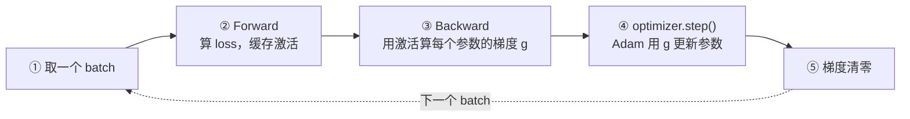

<!--
name: 显存、激活值与重计算
creator: Li Cheng
created: 2026-07-09
modified: 2026-07-09
-->

# 02.1 · 显存、激活值与重计算（为什么单卡装不下）

> 本篇是 [02 · 并行化子系统](./02-并行化子系统.md) 的**铺垫基础文档**，与 Megatron 的具体代码无关，只讲一个问题：**为什么一个模型单张卡装不下？装不下的到底是什么？** 想清楚这一点，后面所有并行（切模型态省显存）和重计算（省激活）才有动机。
>
> 建议在 [02.0](./02.0-Transformer与MoE结构基础.md)（结构与三段式）之后、进入 [02.4](./02.4-并行组构建与通信详解.md)（Megatron 并行组）之前读本篇。
>
> 面向初学者：只需要 [02.0 §5](./02.0-Transformer与MoE结构基础.md) 的"Forward→Backward→Update 三段式"和"梯度与量同形"两条直觉。

---

## 0. 记号约定

| 符号 | 含义 |
|------|------|
| `P` | 模型参数总量（个数，如 7B = 7×10⁹） |
| `b` / `s` / `h` / `L` | micro-batch / 序列长 / 隐藏维 / 层数 |
| **1 份 / 2B / 4B** | 一个数值占的字节：fp16/bf16 = **2 字节**，fp32 = **4 字节** |

> 全篇按**混合精度 + Adam** 这一 LLM 事实标准来算账（Megatron 默认配方）。

---

## 1. 单卡一次迭代（step）的 5 个动作

抛开一切并行，单张 GPU 训练一步，永远是这 5 个首尾相接的动作：



| 步 | 动作 | 显存里此刻多了/用到什么 |
|----|------|------------------------|
| ① | 取 batch | 输入 token（很小） |
| ② | Forward | **激活**：每层把"反向要用的中间结果"留底（§3） |
| ③ | Backward | 用留底的激活算出**梯度 `g`**（和参数同形，§[02.0 5.3](./02.0-Transformer与MoE结构基础.md)） |
| ④ | step | 读 `g` + **优化器状态**（Adam 的 m/v/主权重），写回参数 |
| ⑤ | zero | 清空梯度 buffer，准备下一步 |

**训练 = 把这 5 步重复几十万次。** 显存必须同时容纳：参数、梯度、优化器状态（这三样合称**模型态**，跨步长期驻留），以及**激活**（步内产生、反向用完即可释放）。下面逐项算账。

---

## 2. 显存账：两大消费者

### 2.1 模型态（固定，16P）

模型态是"和参数量成正比、每步都在那"的显存，是 Adam 混合精度下的四份东西：

| 组成 | 精度 | 每参数字节 | 7B 模型 |
|------|------|:--:|:--:|
| 参数副本（前向反向用） | fp16/bf16 | **2B** | 14 GB |
| 梯度 `g` | fp16/bf16 | **2B** | 14 GB |
| 优化器·fp32 主权重 | fp32 | 4B | 28 GB |
| 优化器·一阶矩 `m` | fp32 | 4B | 28 GB |
| 优化器·二阶矩 `v` | fp32 | 4B | 28 GB |
| **合计** | — | **16B** | **≈ 112 GB** |

> 记住这个数：**Adam 混精下，模型态 ≈ 16 字节/参数**。一个 7B 模型光模型态就 **112 GB**——已经超过一张 80GB H100。其中 **12B（主权重 + m + v）是优化器状态**，是最大头，也正是[分布式优化器 / ZeRO](./02.4-并行组构建与通信详解.md) 要沿 DP 组切分的对象（三种优化器状态的差异见 [02.2](./02.2-优化器数学原理与对比.md)）。

### 2.2 激活（随 batch·序列增长）

激活是前向为反向"留底"的中间结果（§3），量级大致：

```
激活显存  ∝  b · s · h · L        （micro-batch × 序列长 × 隐藏维 × 层数）
```

它和模型态最大的不同：**模型态固定，激活随 `b`、`s` 线性膨胀**。序列一长（128K、1M），激活能**远超模型本身**——这就是长序列训练最头疼的地方（见 [02.8 §2](./02.8-进阶专题.md)）。

### 2.3 结论：两条省显存的主线

| 消费者 | 大小 | 谁来省 |
|--------|------|--------|
| **模型态**（16P，固定） | 参数+梯度+优化器状态 | **并行**：TP/PP 切参数、ZeRO/FSDP 切优化器状态与参数（[02.4](./02.4-并行组构建与通信详解.md)、[04](./04-分布式训练与优化器.md)） |
| **激活**（∝ b·s·h·L） | 前向留底 | **重计算**（§5）、**序列并行/上下文并行**（[02.5 §8](./02.5-张量并行实现详解.md)、[02.7](./02.7-上下文并行与专家并行.md)） |

**"单卡装不下"= 模型态 + 激活 之和爆了显存。** 后面整个并行化子系统，本质就是把这两块拆到多卡上。

---

## 3. 什么是"激活值"，为什么它必须一直占着显存

### 3.1 激活 = `save_for_backward` 留底的张量

PyTorch autograd 的规则：**前向时，凡是"反向算梯度会用到"的张量，都被缓存下来**（`ctx.save_for_backward`），不能算完就扔。这些被迫留到反向才能释放的中间结果，就是**激活**。

一个 `Linear`（`Y = X·W`）最能说明问题。反向要吐两种梯度（推导见 [02.0 §5.3](./02.0-Transformer与MoE结构基础.md)）：

```
  dX = dY · Wᵀ        ← 往上一层传（激活梯度），需要 W
  dW = Xᵀ · dY        ← 喂给优化器（权重梯度），需要 X  ★
```

`dW = Xᵀ·dY` 里赫然出现了前向的输入 `X`。所以前向的 `X` **必须一直活到反向**——它就是这层的激活。`W` 本来就常驻（属模型态），激活的增量是 `X` 这种"输入侧留底"。

### 3.2 逐算子：到底存了什么

不同算子留底的东西不一样，这决定了各自的激活开销：

| 算子 | 反向需要 → 前向留底 | 量级 |
|------|--------------------|------|
| **Linear** | 输入 `X`（算 `dW=Xᵀ·dY`） | `[s,b,h]` |
| **GeLU / SiLU** | 输入（算激活函数导数） | `[s,b,h]` |
| **Softmax / LayerNorm** | 输出或统计量（均值/方差、行 logsumexp） | 视情况 |
| **Dropout** | 0/1 mask（反向要用同一个 mask） | `[s,b,h]` |
| **矩阵乘 A·B** | 两个输入（各自算对方的梯度） | 两份 |

> **直觉**：权重 `W` 和权重梯度 `dW` 大小固定（∝ 参数量）；**激活 ∝ b·s·h·L**，在长序列/大 batch 下是头号显存杀手。这也是为什么后面要专门想办法省激活。

---

## 4. 一个反直觉：流水线并行为什么"前重后轻"

这里先埋一个和激活相关的直觉，[02.6](./02.6-流水线并行与1F1B调度.md) 会用到。

流水线并行（PP）把层按深度切给不同卡，用 1F1B 调度交错跑多个 micro-batch。关键点：**一个 micro-batch 只有等它的反向做完，它前向留下的激活才能释放**。在 1F1B 稳态里，**靠前的 stage** 手上"已前向、还没轮到反向"的 micro-batch 数量最多——这些在飞的 micro-batch 的激活都压着不能放：

```
stage 0（最前）: 同时压着最多个 micro-batch 的激活  → 峰值激活最高
stage p-1(最后): 前向完很快就反向、立刻释放        → 峰值激活最低
```

所以 PP 的显存压力"前重后轻"，峰值激活从朴素的 `O(m)`（m=micro-batch 数）降到 `O(p)`（p=stage 数）正是 1F1B 相对 GPipe 的核心优势。细节见 [02.6](./02.6-流水线并行与1F1B调度.md)。

---

## 5. 重计算（Recomputation）：用算力换激活显存

### 5.1 核心思想：前向别全存，反向时重算

既然激活是显存大户，一个直接的念头是：**前向不要把每个中间激活都存下来，只在少数"检查点"存输入；反向需要某段的内部激活时，拿检查点的输入重跑一次前向，把它们临时算回来。** 这就是重计算（又叫 activation checkpointing / gradient checkpointing）。

以 TransformerBlock 为检查点边界：

```
前向：只存每个 Block 的边界输入 h₀, h₁, h₂ …
      Block 内部的 Self-Attn / MLP 激活全部算完即扔  ← 省显存

反向到第 k 个 Block：
      取回存着的 h_k → 就地重跑一次这个 Block 的前向 → 重建内部激活 → 再算梯度
```

### 5.2 代价与选择性重计算

- **代价 ≈ 多一次前向**。前向大约占总算力的 1/3，全量重计算约 **+30% 算力**，换来激活显存大幅下降。典型的"以算力换显存"。
- **选择性重计算（selective）**：只对"算起来便宜、却很占地方"的部分（如 softmax、dropout 的中间量）做重计算，性价比最高——省了大头激活，几乎不增算力。

### 5.3 Megatron 对应开关

| 目的 | 参数 |
|------|------|
| 选择性重计算（推荐，性价比最高） | `--recompute-activations` |
| 全量重计算 + 均匀切段 | `--recompute-granularity full --recompute-method uniform` |
| 全量重计算 + 按 Block 切 | `--recompute-granularity full --recompute-method block` |

### 5.4 同一招的名场面：FlashAttention

**FlashAttention 本质就是"注意力里的重计算"**：前向**不保存**完整的 `S = QKᵀ / softmax` 注意力矩阵（那是 `O(s²)` 的巨物），只留 Q/K/V 和每行的 logsumexp 统计量；反向时**分块重算** softmax。于是注意力的激活从 `O(s²)` 降到 `O(s)`。

> 这也是 [02.7 §3 Ring Attention](./02.7-上下文并行与专家并行.md) 里 **online-softmax（分块累加）** 能成立的同一套数学——记住"以算力/重算换显存"这条主线，很多长序列技巧都是它的变体。

---

## 6. 小结

- 单卡一步永远是 **取 batch → Forward → Backward → step → 清零** 5 个动作；显存要同时装下**模型态**（跨步驻留）和**激活**（步内产生）。
- **模型态 ≈ 16 字节/参数**（Adam 混精：参数 2B + 梯度 2B + 优化器状态 12B），7B 就 **112 GB**——单卡直接爆。其中最大头是**优化器状态**，正是 ZeRO 要切的。
- **激活 ∝ b·s·h·L**，随 batch/序列增长，长序列下可超过模型本身。
- **激活 = 前向为反向留底的张量**（`save_for_backward`）；`Linear` 的 `dW=Xᵀ·dY` 需要输入 `X`，所以 `X` 必须活到反向。
- **两条省显存主线**：并行切模型态（[02.4](./02.4-并行组构建与通信详解.md)/[04](./04-分布式训练与优化器.md)），重计算/序列并行省激活（本篇 §5、[02.5 §8](./02.5-张量并行实现详解.md)/[02.7](./02.7-上下文并行与专家并行.md)）。
- **重计算 = 用一次额外前向（≈+30% 算力）换激活显存**；选择性重计算性价比最高；FlashAttention 是它在注意力上的名场面（`O(s²)→O(s)`）。

返回上级：[02 · 并行化子系统](./02-并行化子系统.md) ｜ 上一篇：[02.0 · Transformer 与 MoE 结构基础](./02.0-Transformer与MoE结构基础.md) ｜ 下一篇：[02.2 · 优化器数学原理与对比](./02.2-优化器数学原理与对比.md)
