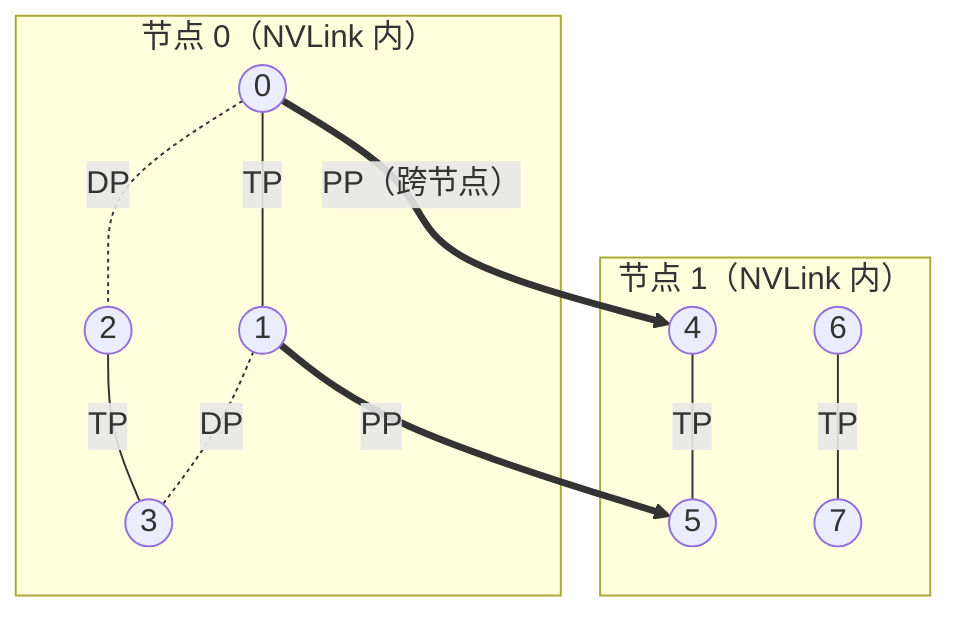
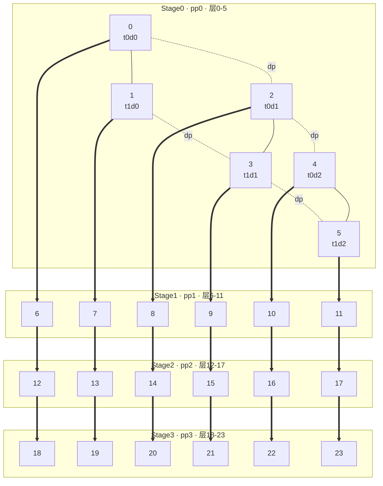

# 02.4 · 并行组构建与通信详解（parallel_state 深读）

> 本篇是 [02 · 并行化子系统](./02-并行化子系统.md) 的**子文档**，对其中「并行组的全局状态管理（`parallel_state`/mpu）」一节做面向初学者的展开。如果你是分布式计算新手，建议从本篇第 0 节读起；已了解基础的可直接跳到第 1 节。
>
> 唯一相关源码：`megatron/core/parallel_state.py`（2238 行），辅以 `megatron/core/tensor_parallel/{layers,mappings}.py`。

---

## 0. 预备知识：GPU 分布式并行需要什么

### 0.1 为什么要分布式

一块 GPU 的显存（如 80GB）装不下大模型（参数 + 激活 + 优化器状态），算力也不够。解法是**把工作拆到多块 GPU 协同完成**。而"协同"的代价是 GPU 间必须**通信**，通信需要一套约定。

### 0.2 三个最基础的概念

| 概念 | 含义 | 类比 |
|------|------|------|
| **Rank** | 每个进程（≈1 块 GPU）的全局唯一编号 `0..N-1` | 工号 |
| **World Size** | 总进程/GPU 数 | 公司总人数 |
| **Process Group（进程组/通信组）** | 一组需互相通信的 rank 的集合 | 微信群 |

> 核心直觉：**通信永远发生在"组"内**。不会让全部 GPU 一起喊话，而是切成很多小群、群内做集合通信。`parallel_state.py` 的核心职责，就是**把哪些 rank 分到哪个群、并把群建好**。

### 0.3 集合通信原语（底层由 NCCL 实现）

并行通信都由几个集合通信原语拼成。这里只列训练最常用的几个速记；**完整的 11 个原语 + 通信量 + `All-Reduce = Reduce-Scatter + All-Gather` 恒等式，见 [02.3 · 通信原语速查](./02.3-通信原语速查.md)。**

| 操作 | 作用 | 用在哪 |
|------|------|--------|
| **All-Reduce** | 组内各持一份 → 求和 → 结果发回每个人 | DP 同步梯度、TP 合并结果 |
| **All-Gather** | 各持一片 → 拼成完整发给所有人 | TP 收集输出、ZeRO-3 聚参 |
| **Reduce-Scatter** | 求和后切片分发 | 序列并行 / 分布式优化器 |
| **All-to-All** | 每卡把不同块发给每张卡（转置） | MoE dispatch/combine |
| **Broadcast** | 一个发给所有 | 数据/权重广播 |
| **Send/Recv（P2P）** | 点对点直接发 | PP 传激活 |

每个操作都要传入一个 **process group 参数**，告诉 NCCL「在哪个群里做」——本篇后续就是讲这些"群"怎么按 rank 划分、怎么建。

> **📌 Remark：集合通信 vs 点对点通信——小白入门**
>
> 上面这些原语（All-Reduce、All-Gather…）都属于**集合通信（Collective Communication）**。它和另一类**点对点通信（P2P，Point-to-Point）**是分布式训练里的两大通信范式，先把区别讲清楚，后面看代码就不会晕。
>
> **一句话区别**：
> - **集合通信**：一个**组里所有成员**一起参与、协同完成的**一次**操作。像开**视频会议**——所有人必须同时上线，一起说、一起听，缺一个就卡住（死锁）。
> - **点对点通信**：**只有两个人**之间的直接收发，一个 `send`、一个 `recv` 配对。像**打电话**——A 拨给 B，其他人完全不知情、也不受影响。
>
> **为什么集合通信不是"点对点的简单叠加"？**
> 比如 8 张卡做 All-Reduce（求和后人手一份），朴素想法是"每张卡都点对点发给其他 7 张卡"，那要发 8×7=56 次，且带宽浪费严重。NCCL 的集合通信会用 **Ring / Tree 等算法**把数据在组内高效流转，通信量和延迟远低于手动两两点对点。**这就是为什么要专门有集合通信原语，而不是让你自己拿 send/recv 拼**——它是被高度优化过的"群体协作"。
>
> **拿两个真实框架对照，最直观：**
>
> | 维度 | **NCCL**（集合通信代表） | **RPC**（点对点通信代表） |
> |------|------------------------|--------------------------|
> | 全称 | NVIDIA Collective Communications Library | Remote Procedure Call（远程过程调用） |
> | 通信模型 | **多对多**，组内全员同时参与 | **一对一**，调用方 → 被调方 |
> | 典型语义 | "大家一起把梯度求和" | "我请你帮我执行一个函数并把结果给我" |
> | 是否要求同步到齐 | **是**，组内每个 rank 都必须调用同一个操作，否则死锁 | **否**，只要发起方和接收方对上即可 |
> | 传的是什么 | 主要是**张量**（GPU 显存里的数值块） | 可以是**任意对象/指令**（一个函数调用 + 参数） |
> | 底层优化 | Ring/Tree 算法，榨干 NVLink/IB 带宽 | 通用网络请求，重点在灵活而非极致吞吐 |
> | 在训练里干嘛 | **梯度同步、TP 合并结果**等高频、规整的数值通信 | 参数服务器、流水线编排、异步调度等**控制流/不规整**通信 |
>
> **在 Megatron 里怎么落地？**
> - **绝大多数**通信是**集合通信**，走 NCCL：DP 同步梯度用 All-Reduce、TP 合并用 All-Reduce/All-Gather、EP 路由用 All-to-All（见 §0.4 表格）。因为这些通信是"整组规整张量、每步都发"，最适合 NCCL 这种被压榨到极致的集合原语。
> - **P2P（Send/Recv）**是集合通信家族里"最像点对点"的成员：PP 流水线里相邻 stage 传激活，本质就是"上一 stage 点对点发给下一 stage"。注意它在 NCCL 里仍以 `batched send/recv` 的形式实现，和上面纯粹的 RPC 不是一回事，只是**语义上**是点对点。
> - **RPC 风格**的通信在 Megatron 核心训练循环里用得少，更多出现在**检查点保存、对象广播、参数服务器**等 CPU 侧协调场景（对应后文提到的 gloo 后端）。
>
> **记住这张心智图就够了**：
> ```
> 集合通信 = 开视频会（全组到齐，一起做同一件事，NCCL 优化到极致）→ 传张量、每步都发
> 点对点   = 打电话  （两人私聊，别人无感）              → RPC 传指令 / PP 传激活
> ```

### 0.4 四/五种并行（Megatron 的核心）

| 简称 | 全称 | 切什么 | 组内通信 |
|------|------|--------|----------|
| **DP** | 数据并行 | 每TP/PP/CP/EP组一份完整模型，喂不同数据 | 同步梯度（All-Reduce） |
| **TP** | 张量并行 | 把单层矩阵横竖切到多 GPU | 每层 All-Gather/All-Reduce（频繁，须机内） |
| **PP** | 流水线并行 | 不同层分给不同 GPU | 相邻 stage P2P 传激活 |
| **CP** | 上下文并行 | 长序列切片 | 注意力时交换 |
| **EP** | 专家并行 | MoE 不同专家分到不同 GPU | token 路由 All-to-All |

> 这就是为什么 `parallel_state.py` 里有那么多 `_TENSOR_MODEL_PARALLEL_GROUP`、`_PIPELINE_MODEL_PARALLEL_GROUP`、`_DATA_PARALLEL_GROUP`、`_CONTEXT_PARALLEL_GROUP`、`_EXPERT_MODEL_PARALLEL_GROUP`——**每种并行都需要它自己的一套通信组**。

### 0.4.1 为什么 DP 要 All-Reduce 同步梯度？

**一句话**：DP 组里每块 GPU 各持一份**完整、相同**的模型副本，但各自只喂到**不同的数据分片**，因此算出的梯度不同；若不同步，参数会越更新越分裂，"数据并行"就不再等价于一个大 batch。All-Reduce 的作用就是把各副本的梯度**求和/求平均**，让所有副本拿到同一个梯度、执行同一次参数更新，从而始终保持权重一致。

#### ① Loss 是怎么算的（先看单卡）

设一个 mini-batch 有 $B$ 个样本，模型参数为 $\theta$，标准做法是对样本损失求**平均**：

$$
L(\theta) = \frac{1}{B}\sum_{i=1}^{B} \ell(x_i;\theta)
$$

反向传播得到的梯度，因求导是线性算子，同样是逐样本梯度的平均：

$$
g = \nabla_\theta L = \frac{1}{B}\sum_{i=1}^{B} \nabla_\theta \ell(x_i;\theta)
$$

#### ② 数据并行把这个求和"拆"到多卡

DP=$N$ 时，把全局 batch（大小 $B$）切成 $N$ 份，每卡 $k$ 拿到自己那份 $B_k = B/N$ 个样本，各自前向+反向，得到**局部梯度**：

$$
g_k = \frac{1}{B_k}\sum_{i \in \text{shard}_k} \nabla_\theta \ell(x_i;\theta)
$$

每张卡此时只"看过" $1/N$ 的数据，$g_k$ 只是全局梯度的一个**有偏局部估计**——彼此都不一样。我们真正想要的是**全局 batch 的平均梯度**：

$$
g = \frac{1}{N}\sum_{k=1}^{N} g_k
$$

> 注意等式成立的前提：各卡样本数相等（$B_k$ 相同），此时"全局平均"恰好等于"局部平均再取平均"。

#### ③ All-Reduce 正好完成这一步

All-Reduce 的语义就是**组内各持一份 → 求和 → 结果发回每个人**。把每卡的 $g_k$ 丢进 DP 组做 All-Reduce（求和后除以 $N$，或直接对已按全局 batch 归一化的梯度求和），每卡最终拿到**完全相同**的 $g$：

```
卡0: g0 ┐                         ┌ g = (g0+g1+g2+g3)/4  →回卡0
卡1: g1 ├─ All-Reduce(DP group) ─┤ g                     →回卡1
卡2: g2 │      (sum / N)          │ g                     →回卡2
卡3: g3 ┘                         └ g                     →回卡3
```

于是每卡用**同一个 $g$** 执行 `optimizer.step()`，更新后权重仍然处处一致 → 下一步继续保持"N 份相同副本"的不变式。

#### ④ 为什么"必须"同步（不同步会怎样）

- **权重发散**：不同步则各卡各更各的，第 1 步后 $\theta$ 就分裂成 $N$ 份不同的权重，模型副本不再等价，训练语义崩坏。
- **等价性**：同步后，DP 训练在数学上**等价于**单卡跑一个 $N$ 倍大的 batch——这正是数据并行"用多卡放大 batch、线性加速"的理论依据。
- **对比 TP 的 All-Reduce**：DP 的 All-Reduce 同步的是**梯度**，每个训练步 1 次（反向末尾），通信量大但频率低，可跨节点；TP 的 All-Reduce 同步的是**前向/反向的激活或部分和**，每层多次，须走机内 NVLink（见 §3、§4）。二者用的是不同的通信组（`_DATA_PARALLEL_GROUP` vs `_TENSOR_MODEL_PARALLEL_GROUP`）。

> 工程实现上，Megatron 并非等反向全部结束再一次性 All-Reduce，而是用 **梯度分桶（bucketing）+ 反向计算重叠通信**（`DistributedDataParallel`）：某层梯度一算完就异步 All-Reduce，把通信藏进后续层的反向计算里。若开启**分布式优化器（Distributed Optimizer / ZeRO）**，则用 **Reduce-Scatter** 替代 All-Reduce——每卡只归约并持有 $1/N$ 的梯度与优化器状态，更新后再 All-Gather 参数，进一步省显存。细节见 §2.6。

### 0.5 分布式训练的基础流程

```
1. torchrun 在每台机拉起 N 个进程，每进程绑 1 块 GPU
        ↓
2. torch.distributed.init_process_group()  建立"默认大群"（全部 N 个 rank）
        ↓
3. ★ initialize_model_parallel(tp,pp,dp,cp,ep)   ← parallel_state.py 的入口
   把 N 个 rank 按并行策略切成各种小群，存入全局变量
        ↓
4. 训练时各层用 get_*_group() 取出该用的群，调 NCCL 完成协同计算
        ↓
5. destroy_model_parallel() 清理
```

**`parallel_state.py` 负责第 3、4 步**——它是"裸的 N 块 GPU"与"结构化并行训练"之间的桥梁。

---

## 1. parallel_state 的三件事：算分组 → 建组 → 提供查询

文件虽 2238 行，骨架只有三件事。

### 1.1 全局状态：一堆 `_XXX_GROUP = None` 单例（开头 29–140 行）

```python
_TENSOR_MODEL_PARALLEL_GROUP = None      # 我所在的 TP 群
_PIPELINE_MODEL_PARALLEL_GROUP = None    # 我所在的 PP 群
_DATA_PARALLEL_GROUP = None              # 我所在的 DP 群
_CONTEXT_PARALLEL_GROUP = None           # 我所在的 CP 群
_EXPERT_MODEL_PARALLEL_GROUP = None      # 我所在的 EP 群
```

重要细节：这些变量存的是**"当前 rank 自己所属的那个群"**，不是全部群。每个进程跑同一份代码，但靠 `if rank in ranks:` 判断，只把"包含自己的群"存进全局变量。

### 1.2 核心算法 `generate_masked_orthogonal_rank_groups`（250 行）

整个文件**最硬核**的函数，解决纯数学问题：给定 world_size 和各维度大小，算出某种并行下的所有分组。

核心公式（注释 273 行）——把一维 rank 看成多维坐标的**多进制数位分解**：
```
global_rank = tp_rank + dp_rank·tp_size + pp_rank·tp_size·dp_size
```

`mask`（布尔列表）是"开关"，决定生成哪种群：
- `[True,False,False]` → 沿 tp 维分组 = **TP 群**
- `[False,False,True]` → 沿 dp 维分组 = **DP 群**
- `[True,False,True]`  → tp+dp 联合群

> 一句话：**把"GPU 怎么切"变成纯坐标运算，不碰任何 GPU，只产出一堆 rank 编号列表。**

### 1.3 `RankGenerator` 类（446 行）：算法的友好外壳

```python
rg = RankGenerator(tp=2, ep=1, dp=2, pp=2, cp=1, order="tp-cp-ep-dp-pp")
rg.get_ranks("tp")     # 所有 TP 组
rg.get_ranks("dp")     # 所有 DP 组
rg.get_ranks("tp-pp")  # TP+PP 联合组（= model-parallel 组）
```

`get_ranks(token)`（505 行）= 把 `"dp"` → 转 mask → 调 `generate_masked_orthogonal_rank_groups`。初始化时建两个 generator：普通的 `decoder_rank_generator`（770 行）和给 MoE 的 `expert_decoder_rank_generator`（793 行）。

### 1.4 `initialize_model_parallel`（547 行）：把组真正建出来

总入口。逻辑高度重复，**看懂一段即看懂全部**。以 DP 组为例（935 行）：

```python
for ranks in decoder_rank_generator.get_ranks('dp'):   # ① 算出所有 DP 组
    group = create_group(                               # ② 每组建一个真正的通信组
        ranks,
        pg_options=get_nccl_options("dp", nccl_comm_cfgs),
        group_desc="DATA_PARALLEL_GROUP",
    )
    if rank in ranks:                                   # ③ 只有"我在组里"才存下来
        _DATA_PARALLEL_GROUP = group
        _DATA_PARALLEL_GLOBAL_RANKS = ranks
```

**这三步是理解整个文件的钥匙**：

1. **算**：`get_ranks('dp')` 返回所有 DP 组的 rank 列表（纯数学）。
2. **建**：`create_group()`（213 行）最终调 `torch.distributed.new_group(ranks=...)`——真正向 NCCL 注册通信组。这是**集合操作，所有进程都必须执行**（哪怕组里没自己），否则死锁。
3. **存**：`if rank in ranks` —— 每进程只把**包含自己的组**存进全局单例。

这段逻辑对每种并行重复一遍：DP（935）、DP-with-CP（845）、CP（957）、Model-Parallel=tp-pp（986）、TP（1003）、PP+Embedding（1014）、EP 系列（1171 起）。

> 细节：部分组会额外建 **gloo 后端**版本（`backend="gloo"`），因为 NCCL 只跑 GPU 张量，而检查点、对象广播等 CPU 侧协调需要 gloo。

### 1.5 一批 getter（1442 行起）：训练代码的查询接口

```python
def get_tensor_model_parallel_group(check_initialized=True):
    return _TENSOR_MODEL_PARALLEL_GROUP             # 返回全局单例
def get_tensor_model_parallel_world_size():
    return get_tensor_model_parallel_group().size() # 我的 TP 组有几块 GPU
def get_tensor_model_parallel_rank():
    return get_tensor_model_parallel_group().rank() # 我在 TP 组排第几
```

模型各层通过这些函数取出自己该用的群——这正是流程图第 4 步。

---

## 2. 实例：并行分组、权重/数据切分与梯度同步

### 2.1 快速一览：8 GPU 三种并行的分组

配置 **TP=2, PP=2, DP=2**（8 GPU，默认 `order="tp-cp-ep-dp-pp"`，cp=ep=1）。代入公式
`global_rank = tp_rank·1 + dp_rank·2 + pp_rank·4`，精确算出：

| 并行 | mask | stride | 分出的组 | rank 0 属于 |
|------|------|--------|----------|-------------|
| **TP** | 只留 tp | 1（相邻） | `[0,1] [2,3] [4,5] [6,7]` | `[0,1]` |
| **DP** | 只留 dp | 2 | `[0,2] [1,3] [4,6] [5,7]` | `[0,2]` |
| **PP** | 只留 pp | 4（最远） | `[0,4] [1,5] [2,6] [3,7]` | `[0,4]` |
| **MP**（tp-pp） | 留 tp+pp | — | `[0,1,4,5] [2,3,6,7]` | `[0,1,4,5]` |



**关键认知**：每块 GPU 同时属于 3 个组。rank 0 算 TP 时与 rank 1 通信、同步梯度时与 rank 2 通信、传流水线激活时与 rank 4 通信——三套关系正交、互不干扰。初始化后 rank 0 的全局单例：

- `_TENSOR_MODEL_PARALLEL_GROUP` → `[0,1]`
- `_DATA_PARALLEL_GROUP` → `[0,2]`
- `_PIPELINE_MODEL_PARALLEL_GROUP` → `[0,4]`

### 2.2 算法拆解：rank 就是一个"多维坐标压成的一维编号"

`generate_masked_orthogonal_rank_groups` 是全文件最硬核的函数（§1.2）。它的核心只有一句话：**每块 GPU 的 `global_rank` 是它的多维并行坐标 `(tp_rank, dp_rank, pp_rank)` 按混合进制（mixed-radix）压成的一维编号**。

以 `order = tp-dp-pp`、`parallel_size = [tp, dp, pp]` 为例（即 §2.1 默认 `order` 在 cp=ep=1 时的简化，两者 stride 完全一致）：

```
global_rank = tp_rank·1 + dp_rank·tp_size + pp_rank·(tp_size·dp_size)
                    └stride[0]      └stride[1]           └stride[2]
```

这三个乘数 `[1, tp_size, tp_size·dp_size]` 正是代码里的 **`global_stride = prefix_product(parallel_size)`**（去掉最后一个）。每个维度是一个"数位"，stride 是该数位的进位权重。

**用 TP=2, DP=2, PP=2 代入，`stride = [1, 2, 4]`：**

| global_rank | tp_rank | dp_rank | pp_rank |
|:-:|:-:|:-:|:-:|
| 0 | 0 | 0 | 0 |
| 1 | 1 | 0 | 0 |
| 2 | 0 | 1 | 0 |
| 3 | 1 | 1 | 0 |
| 4 | 0 | 0 | 1 |
| 5 | 1 | 0 | 1 |
| 6 | 0 | 1 | 1 |
| 7 | 1 | 1 | 1 |

> 记忆法：**tp 变化最快**（stride=1，相邻 rank 就是 TP 邻居），**pp 变化最慢**（stride=4，隔 4 个才换 stage）。这就是 §4 说的"最左 = 变化最快 = 放通信最频繁的 TP，走机内 NVLink"。

**`mask` 在干什么**：构造某种并行组 = **固定其余维度、让目标维度遍历**。代码把维度分两拨：

| 角色 | 含义 | 决定 |
|------|------|------|
| **masked**（`mask=True`） | 组内成员靠它区分 | `rank_in_group` |
| **unmasked**（`mask=False`） | 靠它区分不同的组 | `group_index` |

```python
group_size    = ∏ masked_shape        # 每组人数 = 目标维 size 之积
num_of_group  = world_size // group_size
# 双重循环：group_index 选组、rank_in_group 选组内位置，再按 stride 拼回 global_rank
rank = inner_product(masked_idx,  masked_stride)      # 组内变化的部分
     + inner_product(unmasked_idx, unmasked_stride)   # 固定的"基址"
```

**手算 DP 组（mask = `[F, T, F]`，只让 dp 变）：**

- masked = dp：`masked_stride=[2]`；unmasked = tp,pp：`unmasked_stride=[1,4]`
- `group_size = 2`，`num_of_group = 4`

| group_index | 拆成 (tp,pp) | 基址 = tp·1+pp·4 | 组内 dp∈{0,1}：基址+dp·2 | DP 组 |
|:-:|:-:|:-:|:-:|:-:|
| 0 | (0,0) | 0 | 0, 2 | `[0,2]` |
| 1 | (1,0) | 1 | 1, 3 | `[1,3]` |
| 2 | (0,1) | 4 | 4, 6 | `[4,6]` |
| 3 | (1,1) | 5 | 5, 7 | `[5,7]` |

结果 `[0,2] [1,3] [4,6] [5,7]` 与 §2.1 表格完全一致 ✅。TP 组（mask`[T,F,F]`）同理得相邻俩，PP 组（mask`[F,F,T]`）得隔 4 的组。

### 2.3 重点：权重与数据到底怎么切（TP+DP+PP）

**一句话认知**：坐标 `(tp_rank, pp_rank)` 唯一决定这块 GPU 持有**哪一片权重**；`dp_rank` 只是这片权重的**副本编号**。

| 并行 | 切什么 | 怎么切 |
|------|--------|--------|
| **PP** | 切模型（按层，纵向切深度） | pp_rank=0 拿第 0–11 层，pp_rank=1 拿第 12–23 层，各持**完整、不重叠**的一批层 |
| **TP** | 切每一层内部的矩阵（横向切宽度） | 一层内的 QKV/MLP 权重按行列分片，tp_rank=0 拿左半、tp_rank=1 拿右半 |
| **DP** | **不切权重**，复制整份模型，切**数据** | dp_rank 不同的卡权重**完全相同**，只是喂不同的数据分片 |

把三者拼起来看这 8 张卡（假设模型 24 层）：

```
副本 A (dp_rank=0):  rank {0,1,4,5}   ← 吃数据分片 D0
副本 B (dp_rank=1):  rank {2,3,6,7}   ← 吃数据分片 D1

  每份副本内部：
    ┌─ Stage0 (pp0)：层0-11 ─┐   P2P   ┌─ Stage1 (pp1)：层12-23 ─┐
    │   tp0  |  tp1（各半层）  │  ────►  │   tp0  |  tp1（各半层）   │
    └────────────────────────┘         └─────────────────────────┘
  副本A:   0   |   1                        4    |   5
  副本B:   2   |   3                        6    |   7
```

- **权重切分**由 `(tp_rank, pp_rank)` 决定：rank 0 和 rank 2 持有**完全相同**的权重（都是 pp0-tp0 = 第 0–11 层的左半片），它们只是两个数据副本 → 恰好组成 DP 组 `[0,2]`。
- **数据切分**由 `dp_rank` 决定：全局 batch 切 2 份，副本 A 的 4 张卡共享 D0，副本 B 的 4 张卡共享 D1。**同一副本内**（无论 tp 还是 pp）喂的是同一批数据，因为它们要协作算同一次前向。
- **为什么 DP 组恰好是"权重相同的卡"**：DP 组 `[0,2]` 里两张卡是同一片权重的两个副本，在不同数据上算出不同梯度，必须 All-Reduce 求平均（§0.4.1）才能让权重保持一致。所以构造 DP 组的本质，就是**把"持有相同权重分片"的卡找出来放进同一个梯度同步群**——固定的 `(tp,pp)` 正是"权重分片的身份证"。

> **一份完整模型副本** = 固定 dp_rank、跨所有 tp+pp 的那组 GPU，正是 mask`[T,F,T]` 的 **model-parallel 组** `[0,1,4,5]` 和 `[2,3,6,7]`（见 §2.1 表格 MP 行）。这两个 MP 组就是两份 DP 副本。

### 2.4 更复杂的例子：TP=2 · DP=3 · PP=4（24 GPU）

换一个非对称、更大的配置，`order = tp-dp-pp`，`parallel_size = [2, 3, 4]`，`world_size = 24`。
`stride = prefix_product = [1, 2, 6]`（tp·1、dp·2、pp·6）：

```
global_rank = tp_rank·1 + dp_rank·2 + pp_rank·6
    tp_rank ∈ [0,2)   dp_rank ∈ [0,3)   pp_rank ∈ [0,4)
```

**先把 24 个 rank 摆成 4 个 stage（每 stage 6 张卡 = tp2×dp3）：**

| pp_rank（stage） | rank 区间 | 该 stage 的 6 张卡 (tp,dp) 布局 |
|:-:|:-:|:--|
| 0（层 0-5） | 0–5 | `0`=(t0,d0) `1`=(t1,d0) `2`=(t0,d1) `3`=(t1,d1) `4`=(t0,d2) `5`=(t1,d2) |
| 1（层 6-11） | 6–11 | `6`=(t0,d0) `7`=(t1,d0) `8`=(t0,d1) `9`=(t1,d1) `10`=(t0,d2) `11`=(t1,d2) |
| 2（层 12-17） | 12–17 | `12`…`17` 同上偏移 +12 |
| 3（层 18-23） | 18–23 | `18`…`23` 同上偏移 +18 |

**① TP 组**（mask `[T,F,F]`，只让 tp 变，`group_size=2`，共 12 组）：相邻两两一对。

```
[0,1] [2,3] [4,5] [6,7] [8,9] [10,11] [12,13] [14,15] [16,17] [18,19] [20,21] [22,23]
```

**② DP 组**（mask `[F,T,F]`，只让 dp 变，`group_size=3`，共 8 组）
手算：`masked_stride=[2]`（dp），`unmasked_stride=[1,6]`（tp,pp），组内 dp∈{0,1,2} 即基址 + `{0,2,4}`：

| group_index | (tp,pp) | 基址 = tp·1+pp·6 | 基址 + {0,2,4} | DP 组 |
|:-:|:-:|:-:|:-:|:-:|
| 0 | (0,0) | 0 | 0,2,4 | `[0,2,4]` |
| 1 | (1,0) | 1 | 1,3,5 | `[1,3,5]` |
| 2 | (0,1) | 6 | 6,8,10 | `[6,8,10]` |
| 3 | (1,1) | 7 | 7,9,11 | `[7,9,11]` |
| 4 | (0,2) | 12 | 12,14,16 | `[12,14,16]` |
| 5 | (1,2) | 13 | 13,15,17 | `[13,15,17]` |
| 6 | (0,3) | 18 | 18,20,22 | `[18,20,22]` |
| 7 | (1,3) | 19 | 19,21,23 | `[19,21,23]` |

> 这正好对上 docstring 末尾那个例子（它用 `parallel_size=[2,3,4]`、mask`[F,T,F]`，`dp_group[0]=[0,2,4]`…`dp_group[7]=[19,21,23]`）——只是它把 8 个组的编号写成了 0..7。

**③ PP 组**（mask `[F,F,T]`，只让 pp 变，`group_size=4`，共 6 组）
`masked_stride=[6]`（pp），组内 pp∈{0,1,2,3} 即基址 + `{0,6,12,18}`：

| (tp,dp) 固定 | 基址 | PP 组（穿过 4 个 stage） |
|:-:|:-:|:-:|
| (0,0) | 0 | `[0,6,12,18]` |
| (1,0) | 1 | `[1,7,13,19]` |
| (0,1) | 2 | `[2,8,14,20]` |
| (1,1) | 3 | `[3,9,15,21]` |
| (0,2) | 4 | `[4,10,16,22]` |
| (1,2) | 5 | `[5,11,17,23]` |

**24 卡三套连接可视化**（4 个 stage 从上到下堆叠，每 stage 6 卡按 `t0d0 t1d0 t0d1 t1d1 t0d2 t1d2` 排列）：



> 图例：**实线 = TP 组**（每层 fwd/bwd all-reduce，须机内 NVLink）；**虚线 = DP 组**（每步同步梯度 1 次，图中仅在 Stage0 画出 `[0,2,4]`/`[1,3,5]` 两条示意，其余 3 个 stage 结构相同）；**粗箭头 = PP 组**（相邻 stage P2P 传激活，6 条链彼此平行）。竖直方向数一列（如 `0→6→12→18`）就是一个 PP 组，水平方向一份 stage 内就含 TP 与 DP 两套关系。

**这个例子里权重和数据怎么切：**

- **PP=4**：模型纵向切成 4 段，每段 6 层（示意），一次前向要串行穿过 4 个 stage，靠 PP 组内的 P2P 逐段传激活。
- **TP=2**：每一层的矩阵横向切 2 片，TP 组内每层做 All-Gather/All-Reduce 合并。
- **DP=3**：整份"被 TP+PP 切好的模型"复制 **3 份**，全局 batch 切 3 份分别喂给 3 个副本；反向后在 DP 组内 All-Reduce 同步梯度。
- **模型副本数 = DP = 3**，每份副本占 `tp×pp = 2×4 = 8` 张卡，`3 副本 × 8 = 24` 恰好用满。三份副本的 rank 集合（mask`[T,F,T]` 的 MP 组）为：

```
副本 dp0: [0,1, 6,7, 12,13, 18,19]     ← 8 张卡拼成一份完整模型
副本 dp1: [2,3, 8,9, 14,15, 20,21]
副本 dp2: [4,5, 10,11, 16,17, 22,23]
```

- **验证正交性**：随便挑一张卡，比如 **rank 8**（坐标 tp0,dp1,pp1）。它算 TP 时找 `[8,9]`、同步梯度时找 DP 组 `[6,8,10]`、传流水线时找 PP 组 `[2,8,14,20]`——三个组只在 rank 8 处相交，其余成员互不重叠，三套通信完全正交、互不干扰。

> **一句话总结这个函数**：把每块 GPU 的多维并行坐标编码成一维 rank，再用 mask 决定"沿哪个坐标轴切一刀"，从而批量生成所有正交通信组。TP 沿层内切权重、PP 沿层切权重、DP 复制权重切数据，三轴正交。

### 2.5 分组的本质：按"谁和谁必须通信"来切

前面几节反复出现一个规律——**这些组都是按"组内需要通信"来构造的**。`parallel_state` 的全部意义，就是把"因某种并行而必须协同的那批 rank"提前圈成一个通信组（NCCL communicator），训练时该并行触发的集合通信只在这个小群内发生，绝不惊动无关的卡。

换个角度：**每种并行都要求某批 GPU 交换某种张量，这批 GPU 就必须先建一个组**。反过来，一个组的存在，就对应一种"必须一起做的通信操作"。

| 通信组 | 组内为什么"必须通信" | 交换的是什么张量 | 对应集合通信操作 | 触发时机 / 频率 |
|--------|----------------------|------------------|------------------|-----------------|
| **TP 组** | 一层的权重被横竖切开，单卡只算出**部分和 / 半个输出**，必须合并才是正确结果 | 前向的部分和 / 反向的梯度分片 | **All-Reduce**（Row 层前向、Column 层反向）、**All-Gather / Reduce-Scatter**（序列并行时） | 每层 fwd + bwd，**极频繁** |
| **PP 组** | 模型按层切开，上一 stage 的**输出激活**是下一 stage 的输入；反向要把**梯度**回传 | 前向激活、反向输入梯度 | **P2P（Send/Recv）**，相邻 stage 点对点 | 每个 micro-batch 跨 stage 边界一次 |
| **DP 组** | 同一份权重的多个副本各吃不同数据，算出的**梯度不同**，必须求平均才能一致更新（§0.4.1） | 各副本的梯度（或分桶后的梯度） | **All-Reduce**（普通 DDP）/ **Reduce-Scatter + All-Gather**（分布式优化器 ZeRO） | 每个训练步 1 次（反向末尾） |
| **CP 组** | 长序列被切片，注意力需要**其它片的 K/V** 才能算完整 attention | K/V（有时含 softmax 统计量） | **All-Gather / All-to-All** | 每个注意力层 |
| **EP 组** | token 被路由到分布在不同卡上的专家，必须把 token **发过去、算完再收回** | 路由后的 token 隐状态 | **All-to-All**（dispatch + combine） | 每个 MoE 层 |
| **MP 组**（tp-pp 联合） | 一份完整模型副本跨这批卡；用于跨副本**广播权重/判断 rank 归属**等 | 权重、元信息 | **Broadcast** 等 | 初始化 / 保存加载 checkpoint |

**建组的目的可以归纳成三句话：**

1. **通信隔离**：NCCL 的集合通信是"组内全员参与"的。只有把真正需要协同的卡圈进一个组，`all_reduce(x, group=tp_group)` 才不会波及组外的卡——这是性能和正确性的前提。
2. **拓扑映射**（呼应 §4 的 `order`）：把通信最频繁的组（TP）映射到最快的物理链路（机内 NVLink），把偶尔通信的组（DP/PP）放到可跨节点的慢速链路（IB）。`order="tp-cp-ep-dp-pp"` 决定了 stride，也就决定了每种组的成员在物理上是"挨着"还是"隔很远"。
3. **代码解耦**：各层前向/反向只需 `get_xxx_group()` 取出"此刻该用的群"，把"在哪个群里通信"这件事完全交给 `parallel_state`。所以同一份 `RowParallelLinear` 代码，无论 TP 切几份、部署在哪些物理卡上都不用改（§3 会看到这条链路）。

> 一句话闭环：**先有"哪些卡必须交换哪种张量"的需求（TP 换部分和、PP 换激活、DP 换梯度……），`generate_masked_orthogonal_rank_groups` 用 mask 把这些卡精确圈出来建成组，训练时对应的集合通信操作就只在各自的组内落地。** 分组方式 = 通信需求的镜像。

### 2.6 DP 组里到底怎么同步：DDP 分桶 与 分布式优化器（ZeRO）

§0.4.1 讲了"为什么要 All-Reduce"，§2.5 说了"DP 组对应梯度同步"。这里把 DP 组内**真正的工程实现**讲清楚——它经历了两级优化：**① 朴素 DDP → ② Megatron DDP（分桶+重叠）→ ③ 分布式优化器（ZeRO 切分状态）**。相关代码在 `megatron/core/distributed/`（DDP）和 `megatron/core/optimizer/distrib_optimizer.py`（分布式优化器）。

> 前置：本节的"每参数 18B = 6 + 12"字节账，其小白版拆解（模型态 ≈ 16 字节/参数、优化器状态 12B 为何是大头）见 [02.1 §2.1 显存账](./02.1-显存、激活值与重计算.md)。本节聚焦 Megatron 怎么把这 12B **沿 DP 组切成 1/N** 的工程实现。

#### ① 朴素 DDP 的两个痛点

最直白的数据并行：反向全部算完 → 对整份梯度做一次 All-Reduce → 每张卡各自 `optimizer.step()`。它有两个明显浪费：

1. **通信不重叠**：反向 100% 结束才开始通信，GPU 在 All-Reduce 期间干等，算力闲置。
2. **优化器状态冗余**：每张 DP 卡都存了**一整份**完整的优化器状态（Adam 的 momentum + variance + fp32 主权重）。DP=$N$ 就重复存了 $N$ 份完全相同的东西——纯浪费显存。

Megatron 的两级优化正是分别解决这两点。

#### ② Megatron DDP：连续梯度缓冲 + 分桶 + 通信重叠

对应 `DistributedDataParallel`（`distributed_data_parallel.py:22`）。核心做法：

- **连续缓冲区（contiguous buffer）**：所有参数的梯度不是各存各的零散张量，而是预先规划进一块大的连续内存 `_ParamAndGradBuffer`（`param_and_grad_buffer.py`）。好处：一次 NCCL 通信就能覆盖一大片梯度，避免成千上万个小张量各发一次。
- **分桶（bucketing）**：把这块大缓冲切成若干 **bucket**（默认桶大小 `max(40_000_000, 1_000_000 × dp_size)` 个元素，见 `distributed_data_parallel.py:68`）。
- **反向时重叠通信（overlap_grad_reduce）**：给每个参数注册**梯度 hook**——某个 bucket 里的所有梯度一算完，立刻对这个 bucket **异步**发起 All-Reduce/Reduce-Scatter，通信和后续层的反向计算**并行进行**。等整个反向结束时，大部分通信已经藏在计算背后完成了。

```
朴素:  [========反向========]  然后  [====All-Reduce====]      (串行，通信裸露)
分桶:  [反向层k][反向层k-1]...[反向层0]
              └桶3就绪→AR┘ └桶2就绪→AR┘ └桶1就绪→AR┘         (通信藏进计算)
```

> 补充：只有 `pp_rank == 0` 且开启 `overlap_grad_reduce` 时才做细粒度分桶（`distributed_data_parallel.py:105`）；关掉重叠时桶大小设为无穷 = 退化成"整份一把 All-Reduce"。

#### ③ 分布式优化器：用 ZeRO 思想把状态切到 DP 组各卡

对应 `DistributedOptimizer`（`distrib_optimizer.py:108`，docstring 明确写 *"shards state across data-parallel ranks … as described in the ZeRO paper"*）。它解决痛点 2：**优化器状态不再每卡全存，而是沿 DP 组切成 $N$ 份，每卡只负责 $1/N$。**

> 在讲"怎么切"之前，先补两块基础（已经熟悉的读者可跳过下面两条 Remark）：**① 一个参数身上到底挂着哪几样东西、梯度 buffer 存什么**；**② 这些量在 PyTorch 里怎么算、怎么更新**。打通这两点，再看 Reduce-Scatter / All-Gather 的切分机制就会非常顺。

> **📌 Remark：一个参数身上挂了哪几样东西？梯度 buffer 到底存什么？——彻底打通 ZeRO 为什么能切**
>
> 初学 ZeRO 最容易卡两个点：①梯度 buffer 里的元素是"数据"还是"参数"？②为什么各卡只对自己那 1/N 参数做 `optimizer.step()` 就够了？把"每个参数身上挂着几样东西"理清就全通了。
>
> **1）一个参数身上同时挂着 5 样东西**（以常用的 bf16 参数 / fp32 梯度 + Adam 为例）：
>
> | 名字 | 精度/字节 | 存在哪 | 是什么 / 干嘛用 |
> |---|---|---|---|
> | **bf16 参数** θ | 2B | 参数 buffer | 前向/反向实际用的权重值 |
> | **梯度** g = ∂L/∂θ | fp32, 4B | **梯度 buffer** | 反向传播算出的、这一步该往哪改 θ |
> | **fp32 主权重** θ_master | 4B | 优化器状态 | θ 的高精度副本，真正被更新的是它（bf16 累加会丢精度） |
> | **momentum** m | 4B | 优化器状态 | 梯度的滑动平均（一阶矩），给更新加惯性 |
> | **variance** v | 4B | 优化器状态 | 梯度平方的滑动平均（二阶矩），给每个参数自适应步长 |
>
> **梯度 buffer 存的就是 g**（每个参数一个 `∂Loss/∂θ`，一整块连续内存），它**不是** m/v。梯度是"这一步新算的原料"，m/v/master 是"历史累积的状态"，关系是 `新 m,v ← 旧 m,v + 当前 g`，再 `θ_master ← θ_master − 步长(m,v)`。这四样是**按参数逐个对应的平行数组**——第 `i` 个参数对应它们各自的第 `i` 个元素。
>
> **⚠️ 再强调**：梯度 buffer 的元素数 = **参数个数**（示意 9 个 = 9 个参数），与 batch 里有几条数据**无关**。数据切分（每卡吃不同样本）和状态切分（每卡管不同参数）是两个正交维度，别混。
>
> **2）反向传播只产出一样东西：梯度 g**。它填满梯度 buffer，不碰 m/v/master（那三样只在紧接着的 `optimizer.step()` 登场）。前向须提前存**激活值**供反向用链式法则算 g——但激活不属于优化器状态，该层反向算完即可释放，不跨步保留。
>
> **3）Adam 更新一个参数，只需要下标相同的四元组**：
>
> ```
> m_i ← β1·m_i + (1−β1)·g_i                        # 旧 momentum + 当前梯度
> v_i ← β2·v_i + (1−β2)·g_i²                       # 旧 variance + 当前梯度²
> θ_master_i ← θ_master_i − lr · m_i /(√v_i + ε)   # 更新高精度主权重
> θ_i(bf16) ← cast(θ_master_i)                     # 转回 bf16 写回参数 buffer
> ```
>
> 即 `θ_iⁿᵉʷ = f( g_i , m_i , v_i , θ_master_i )`——**更新第 i 个参数完全不需要第 j 个参数的任何信息，参数间的更新彼此独立**。这正是 ZeRO 能切分的根本原因：只要某张卡凑齐它负责那段参数的 `(g, m, v, θ_master)`，就能**完整、正确地**更新这段，无需知道其余参数。所以"谁负责第 i 个参数，就把这四样的第 i 个存在谁那儿"。
>
> **4）为什么只切 m/v/master、不切 bf16 参数和梯度 buffer？**（下文"6 + 12/d"字节表就是这里的量化结果）
> - **bf16 参数（2B）**：每卡前向都要用**整份**权重 → 不能切，All-Gather 后每卡全存。
> - **fp32 梯度 buffer（4B）**：反向时每卡得先算出**整份** g 才能 Reduce-Scatter → 反向阶段是全份的。
> - 这两样合计 **6B「每卡全存（replicated）」**。
> - **m + v + θ_master（4+4+4=12B）**：跨步长期驻留的显存大头，且更新逐参数独立 → **切成 1/d，每卡只存 12/d**。
>
> 于是每参数从 `6 + 12 = 18B` 降到 `6 + 12/d`，省的正是那 12B 优化器状态。
>
> **一句话闭环**：梯度 buffer 存"当前步新算的梯度 g"；m/v/master 是"历史累积的优化器状态"；更新一个参数只需它自己的 `(g,m,v,master)` 四元组，参数间互不依赖，所以能按参数切给不同卡各管一段——这就是 ZeRO 省显存的全部秘密。

> **📌 Remark：落到 PyTorch 代码——反向传播怎么算梯度、优化器怎么更新参数**
>
> 上面讲了"每个参数挂哪几样东西"，这里补上它在 **PyTorch 里到底怎么跑起来**，把概念对应到真实 API，读 Megatron 源码时就能对上号。
>
> ⛓️ 承接 [02.0 §5.4.1](./02.0-Transformer与MoE结构基础.md)：那里从**单卡三段式的数学原理**（含 §5.3.1 梯度公式推导）出发，讲清了标准 `backward() → .grad → optimizer.step()` 流程；本 Remark 与之**完全一致**，A/B 两段快速回顾后，重点落在 **C）Megatron 在这套标准流程上做了哪些分布式改造**——这也是"数学原理 → 单卡工程实现 → 分布式工程实现"这条链路的最后一环。
>
> **A）反向传播：`loss.backward()` 把梯度填进 `param.grad`**
>
> PyTorch 用 **autograd（自动微分）**：前向每做一次算子，都会顺手记录它的"反向函数"，串成一张**计算图（DAG）**。`loss.backward()` 就是从 loss 出发、沿这张图**逆序**用链式法则算出每个参数的梯度。
>
> ```python
> import torch
>
> # 1) 前向：autograd 自动建计算图（每个中间张量带 grad_fn，记录怎么反向）
> x = torch.randn(4, 8)
> w = torch.randn(8, 2, requires_grad=True)   # 叶子张量，需要梯度
> b = torch.zeros(2, requires_grad=True)
> y = x @ w + b                               # y.grad_fn = <AddBackward0>
> loss = y.pow(2).mean()                      # 标量，才能 backward
>
> # 2) 反向：从 loss 逆序遍历计算图，链式法则求梯度
> loss.backward()                             # 触发 autograd 引擎
>
> # 3) 梯度【累加】到叶子张量的 .grad 属性（形状与参数完全一致）
> print(w.grad.shape)   # torch.Size([8, 2]) ← 这就是"梯度 buffer"里存的 g
> print(b.grad.shape)   # torch.Size([2])
> ```
>
> 三个关键点：
> - `requires_grad=True` 的**叶子张量**（即模型参数）才会收到 `.grad`；`grad_fn` 是 autograd 反向遍历的线索。
> - `.grad` 的形状 = 参数形状，**逐元素一一对应**——这印证了上一条 Remark 说的"梯度是按参数索引的数组"。
> - **梯度是累加（`+=`）的**，不是覆盖！所以每步训练前必须 `zero_grad()` 清零，否则会把上一步的梯度叠进来。
>
> **B）优化器更新：`optimizer.step()` 用 `.grad` 改参数、并维护 m/v**
>
> 标准训练循环就是五步：清梯度 → 前向 → 算 loss → 反向 → 更新。
>
> ```python
> optimizer = torch.optim.AdamW([w, b], lr=1e-3, betas=(0.9, 0.999), eps=1e-8)
>
> for step in range(num_steps):
>     optimizer.zero_grad()     # ① 清空上一步的 .grad（否则累加）
>     y = x @ w + b             # ② 前向
>     loss = y.pow(2).mean()    # ③ 算 loss
>     loss.backward()           # ④ 反向 → 填 w.grad / b.grad
>     optimizer.step()          # ⑤ 用 .grad 更新参数，并更新 momentum/variance
> ```
>
> `optimizer.step()` 内部对每个参数 `p` 做的事，正是上一条 Remark 的 Adam 公式（这里是 PyTorch 里的真实变量名）：
>
> ```python
> # torch.optim.AdamW.step() 内部（简化）：逐参数独立更新
> grad  = p.grad
> state = self.state[p]                            # 每个参数一份状态字典
> if len(state) == 0:                              # 第一次见到：懒初始化
>     state['step']       = 0
>     state['exp_avg']    = torch.zeros_like(p)    # ← momentum m
>     state['exp_avg_sq'] = torch.zeros_like(p)    # ← variance v
> m, v = state['exp_avg'], state['exp_avg_sq']
> state['step'] += 1
>
> m.mul_(beta1).add_(grad, alpha=1-beta1)            # m ← β1·m + (1-β1)·g
> v.mul_(beta2).addcmul_(grad, grad, value=1-beta2)  # v ← β2·v + (1-β2)·g²
> bias1 = 1 - beta1 ** state['step']
> bias2 = 1 - beta2 ** state['step']
> denom = (v.sqrt() / math.sqrt(bias2)).add_(eps)
> p.data.addcdiv_(m, denom, value=-lr / bias1)       # θ ← θ - lr·m̂/(√v̂+ε)
> ```
>
> 对上号：**`exp_avg` 就是 momentum、`exp_avg_sq` 就是 variance**，都存在 `optimizer.state[p]` 里、一个参数一份；更新只用到 `p.grad + state[p]`，**参数间互不依赖**——这就是为什么分布式优化器能只给自己负责的那 1/N 参数分配 `state[p]` 并只对它们 `step()`。
>
> **C）Megatron 在这套标准流程上改了什么？**
>
> | 环节 | 原生 PyTorch | Megatron |
> |---|---|---|
> | 梯度存放 | 每个参数各自一个零散的 `.grad` | 预分配**一整块连续** `_ParamAndGradBuffer`，`.grad` 是它的视图（一次 NCCL 覆盖一大片，见 §1 连续缓冲区） |
> | 反向与通信 | `backward()` 全跑完才通信 | 分桶：某桶梯度一算完就异步 Reduce-Scatter，藏进后续反向（`--overlap-grad-reduce`） |
> | `optimizer.state` | 每卡为**全部**参数分配 m/v/master | 分布式优化器只为自己负责的 **1/N** 参数分配 `state[p]`，`step()` 只遍历这 1/N（`distrib_optimizer.py`） |
> | fp32 主权重 | 混合精度下另存一份 fp32 副本 | 同样只存自己那 1/N 段，更新后 cast 回 bf16、再 All-Gather 拼回完整权重 |
>
> 所以 Megatron 分布式优化器**没有改 autograd、也没改 Adam 数学**，只是把"梯度放哪、状态给谁、什么时候通信"这三件工程事重新编排了——底层还是这套 `backward() → .grad → step()` 的标准流程。
>
> **一句话闭环**：`loss.backward()` 只负责把梯度填进 `.grad`，`optimizer.step()` 用 `.grad + state[p]` 逐参数独立更新；Megatron 不动这套数学，只重排"梯度放哪、状态给谁、何时通信"——这正是分布式优化器能落地的工程前提。

> **📎 补充文档**：上面只讲了 Adam 的更新公式。想系统了解 **SGD / Adam / Muon** 三种优化器的数学原理、它们"额外状态"的多少如何直接决定显存与切分代价，见配套的 [02.2 · 优化器数学原理与对比](./02.2-优化器数学原理与对比.md)。

有了上面两块基础，回到分布式优化器的**切分机制**。关键变化：**把 DP 的 All-Reduce 换成 `Reduce-Scatter + All-Gather` 两步**（二者通信量之和与一次 All-Reduce 相同，但换来了显存的大幅节省）：


**用官方文档的具体例子**（`docs/user-guide/features/dist_optimizer.md`，DP=4、梯度 buffer 共 16 个元素）：

| 步骤 | 状态 |
|------|------|
| 反向结束 | 每卡都持有完整 16 个 fp32 梯度 |
| **Reduce-Scatter** | rank0 拿到 `[0:4]`、rank1 拿 `[4:8]`、rank2 拿 `[8:12]`、rank3 拿 `[12:16]` 的**已完全归约**梯度（其余 12 个是垃圾，丢弃） |
| **optimizer.step()** | 每卡只对自己那 4 个元素做 Adam 更新（因此只需存这 4 个元素的 momentum/variance/fp32 主权重） |
| cast → bf16 | 每卡把自己那 4 个 fp32 主权重转成 bf16，写回参数 buffer 对应段 |
| **All-Gather** | 4 张卡把各自的 4 段拼回完整 16 个 bf16 权重，PyTorch 模块的参数视图已指向 buffer → 前向可立即开始 |

**为什么这样能省显存**：Adam 的 momentum、variance、fp32 主权重是显存大头（正是上面 Remark 里那切成 1/N 的 12 字节）。切成 $1/N$ 后，每卡只存 $1/N$。官方给出的每参数字节数（$d$ = DP size）：

| 精度组合 | 非分布式优化器 | 分布式优化器 |
|----------|:-:|:-:|
| fp16 参数 / fp16 梯度 | 20 | 4 + 16/d |
| **bf16 参数 / fp32 梯度**（常用） | 18 | 6 + 12/d |
| fp32 参数 / fp32 梯度 | 16 | 8 + 8/d |

> 例：bf16+fp32、DP=8 时，每参数从 18 字节降到 `6 + 12/8 = 7.5` 字节，省掉约 58%。DP 越大省得越多——这正是 ZeRO 的核心红利。

**接回 §2.4 的 24 卡例子看切片**：那里 DP=3，其中一个 DP 组是 `[0,2,4]`（三卡持有**同一片**权重——pp0-tp0，第 0–5 层的左半）。开分布式优化器后，这片权重对应的梯度 buffer 和优化器状态就沿这 3 张卡三等分：

```
              第 0–5 层左半片 的梯度 buffer（示意 9 个元素）
              ┌───────────────────────────────────────────┐
反向结束(各卡全份): [ g0 g1 g2 | g3 g4 g5 | g6 g7 g8 ]  ×3 卡各一份
              └───────────────────────────────────────────┘
       ① Reduce-Scatter (在 DP 组 [0,2,4] 内)
              rank0 ← [g0 g1 g2] 已归约    (只留 1/3)
              rank2 ← [g3 g4 g5] 已归约
              rank4 ← [g6 g7 g8] 已归约
       ② 各卡只对自己那 1/3 做 optimizer.step()
              rank0 只存 [0:3] 的 momentum/variance/fp32主权重
              rank2 只存 [3:6] ……   rank4 只存 [6:9] ……
       ③ All-Gather (在 DP 组 [0,2,4] 内)
              三卡把各自 1/3 更新后的 bf16 权重拼回完整 9 个 → 前向可开始
```

- 注意切片发生在 **DP 组内部**（`[0,2,4]` 这三张卡之间），与它们各自的 TP 伙伴（`[0,1]`/`[2,3]`/`[4,5]`）、PP 伙伴（`[0,6,12,18]` 等）**完全无关**——再次印证 §2.5 的正交性。
- 另外两个同 stage 的 DP 组 `[1,3,5]`（tp1 半片）、以及其它 stage 的 DP 组，各自独立做同样的三等分。

#### ④ 三者对比与选型

| 维度 | 朴素 DDP | Megatron DDP（分桶+重叠） | 分布式优化器（ZeRO） |
|------|----------|---------------------------|----------------------|
| DP 组内通信 | 整份一次 All-Reduce | 分桶多次异步 All-Reduce | **Reduce-Scatter + All-Gather** |
| 与反向重叠 | ❌ | ✅ | ✅（RS 与反向重叠，AG 与前向重叠） |
| 优化器状态 | 每卡全存（冗余 N 份） | 每卡全存 | **每卡只存 1/N** |
| 通信总量 | 1× | ≈1× | ≈1×（RS+AG 之和 = 一次 AR） |
| 显存 | 基线 | 基线 | **大幅下降** |
| 开关 | — | `--overlap-grad-reduce` | `--use-distributed-optimizer` |

**要点**：分布式优化器**不改变 DP 组的划分**（还是 §2.2 那套 `[0,2,4]…` 分组），只是把该组内的通信从 All-Reduce 换成 Reduce-Scatter+All-Gather、并把状态沿组切片。所以它和 TP/PP 完全正交，可叠加使用；MoE 的专家参数则在 `expert_data_parallel` 组内单独切分（呼应 §4 里 `order` 必须以 `pp` 结尾的约束，保证专家层与注意力层 DP 切分一致）。

> 与 PyTorch 原生 FSDP 的关系：Megatron 也提供 `--use-megatron-fsdp` / `--use-torch-fsdp2`（`distributed/` 目录下的 `fsdp`、`torch_fully_sharded_data_parallel.py`）。FSDP 进一步把**参数本身**也切片（ZeRO-3），显存更省但通信更重；分布式优化器是更轻量的 ZeRO-1/2 档位，通信量不增而只省状态显存，是 Megatron 默认推荐的起点。FSDP(ZeRO-3) 的显存/通信数学与两套实现细节见铺垫专题 [02.3.1 · FSDP](./02.3.1-FSDP.md)。

---

## 3. 张量并行如何用 group 做 All-Reduce（代码级追踪）

从 `parallel_state` 的"group"到真正 NCCL 通信的完整链路。Megatron TP 的精髓是一对**对偶算子（conjugate operators）**——论文里叫 `f` 和 `g`，代码里是 `_CopyToModelParallelRegion` 和 `_ReduceFromModelParallelRegion`：

| 算子 | 代码类 | 前向 | 反向 | 放在哪 |
|------|--------|------|------|--------|
| **f**（copy） | `_CopyToModelParallelRegion` | 恒等（什么都不做） | **all-reduce** | TP 区域**入口**（Column 层前） |
| **g**（reduce） | `_ReduceFromModelParallelRegion` | **all-reduce** | 恒等 | TP 区域**出口**（Row 层后） |

两者前向/反向的行为**正好互为镜像**，这就是"对偶"。要理解为什么这样设计，得先看清"一次矩阵乘法被切开后，通信到底缺在哪"。

### 3.1 为什么需要这对算子：矩阵切开后前向/反向各缺一次求和

Transformer 的 MLP 块本质是两次矩阵乘法 `Z = (X·A)·B`（中间还有 GeLU）。Megatron 把它们分别按**列**、按**行**切开，刚好首尾衔接：

**Column 层 `Y = X·A`**，权重按列切 `A = [A₁ | A₂]`，rank i 只持 `Aᵢ`：

```
前向:  Yᵢ = X · Aᵢ        每卡各算出输出的一"列块" Y = [Y₁ | Y₂]，天然分片，无需通信
反向:  ∂L/∂X = Σᵢ (∂L/∂Yᵢ)·Aᵢᵀ    每卡只能算出一个"部分和"，必须求和才是完整的 ∂L/∂X
```

→ **前向不缺通信，反向缺一次"把各卡部分梯度加起来"**。这正是 `f`：前向恒等、反向 all-reduce。

**Row 层 `Z = Y·B`**，权重按行切 `B = [B₁ ; B₂]`，输入正好是上一层分片的 `Y = [Y₁ | Y₂]`：

```
前向:  Zᵢ = Yᵢ · Bᵢ       每卡只算出完整结果的一个"部分和"，Z = Z₁ + Z₂ 必须求和
反向:  ∂L/∂Yᵢ = ∂L/∂Z · Bᵢᵀ    ∂L/∂Z 各卡已持有同一份，本地即可算，无需通信
```

→ **前向缺一次"把各卡部分和加起来"，反向不缺通信**。这正是 `g`：前向 all-reduce、反向恒等。

> **一句话抓住本质**：切开矩阵后，一端在**前向**产生"需要相加的部分和"（Row 层出口），另一端在**反向**产生"需要相加的部分梯度"（Column 层入口）。两次求和分处前向和反向的两端，所以要一对行为镜像的算子各管一头。

#### 为什么是 all-reduce ⇄ 恒等 这种镜像？——"复制"与"求和"互为伴随

有一条通用规律（自动微分的伴随/转置关系）：

- **前向做"复制/广播"（一个张量喂给多路）→ 反向必是"求和"**；
- **前向做"求和"（多路合并成一个）→ 反向必是"复制/恒等"**。

`f` 的前向把同一个 `X` 同时喂给两卡的本地矩阵乘（一次 fan-out 复制），它的反向就必须把两卡回传的梯度**求和**（all-reduce）。`g` 的前向把两卡的部分和**求和**成 `Z`，它的反向就只是把 `∂L/∂Z` 原样发回（恒等）。所以这对算子不是"凑出来的约定"，而是**数学上唯一正确的搭配**——否则梯度就错了。

### 3.2 f 算子 · ColumnParallelLinear：前向恒等，反向 all-reduce

`tensor_parallel/layers.py:1041`
```python
input_parallel = copy_to_tensor_model_parallel_region(input_, group=self.tp_group)
# → 之后 output_parallel = input_parallel · Aᵢ，各卡算自己的列块
```
底层是 `_CopyToModelParallelRegion`（`mappings.py:197`），代码极简，正是 §3.1 推导的直接翻译：
```python
class _CopyToModelParallelRegion(torch.autograd.Function):
    @staticmethod
    def forward(ctx, input_, group):
        ctx.group = group
        return input_                              # 前向：恒等，原样透传 X
    @staticmethod
    def backward(ctx, grad_output):
        return _reduce(grad_output, ctx.group), None   # 反向：all-reduce 把各卡的 ∂L/∂X 部分和求和
```

### 3.3 g 算子 · RowParallelLinear：前向 all-reduce，反向恒等

`tensor_parallel/layers.py:324`
```python
output = reduce_from_tensor_model_parallel_region(output_parallel, group=self.tp_group)
# output_parallel = Yᵢ · Bᵢ 是部分和，reduce 后才是完整的 Z
```
底层是 `_ReduceFromModelParallelRegion`（`mappings.py:217`），与 `f` 严格镜像：
```python
class _ReduceFromModelParallelRegion(torch.autograd.Function):
    @staticmethod
    def forward(ctx, input_, group):
        return _reduce(input_, group)              # 前向：all-reduce 把各卡部分和求成完整 Z
    @staticmethod
    def backward(ctx, grad_output):
        return grad_output, None                    # 反向：恒等，∂L/∂Z 原样发回
```

> 还有一对对偶算子管"切分/收集"维度：`_ScatterToModelParallelRegion`（前向 split、反向 all-gather）与 `_GatherFromModelParallelRegion`（前向 all-gather、反向 split），沿**最后一维（hidden）**操作，用在 `gather_output=True` 等场景，规律完全一样：split ⇄ gather 互为伴随。（沿**序列维**的另一对用于序列并行，见 §3.7。）

### 3.4 为什么必须包成 `torch.autograd.Function`

`torch.distributed.all_reduce` 本身**不是 autograd 感知的**——直接在前向里调它，反向时梯度不会正确地沿它回流。把通信包进 `torch.autograd.Function`，就能**分别精确定义前向和反向该做什么**，从而把"这一次 all-reduce 该发生在前向还是反向"这件事，交给 `f`/`g` 两个类各自的 `forward`/`backward` 去声明。这样从 TP 区域**外部**看，整块 MLP 就像一个普通的、可微的层：输入完整的 `X`、输出完整的 `Z`，梯度全对，而所有跨卡通信都被"藏"进了这对算子内部。

### 3.5 最底层：真正的 NCCL 调用

`f`/`g` 的通信都落到 `mappings.py:22`：
```python
def _reduce(input_, group):
    if group.size() == 1: return input_
    torch.distributed.all_reduce(input_.contiguous(), group=group)   # ← NCCL 在 group 内求和
    return input_
```
注意 `group` 就是 §1–§2 里 `parallel_state` 建好的 `_TENSOR_MODEL_PARALLEL_GROUP`——**"在哪些卡之间求和"完全由分组决定**。`group.size()==1`（没开 TP）时直接短路返回，零通信。

### 3.6 完整链路

```
parallel_state.initialize_model_parallel()   建好 _TENSOR_MODEL_PARALLEL_GROUP（如 [0,1]）
        ↓  层构造时 (layers.py:864)
get_tensor_model_parallel_group_if_none() → 存进 self.tp_group
        ↓  前向 / 反向
reduce_from_tensor_model_parallel_region(x, group=self.tp_group)   # g 算子
        ↓
torch.distributed.all_reduce(x, group=self.tp_group)   ← NCCL 在 [0,1] 群内求和
```

> **设计之美**：一个 Transformer 的 MLP/Attention 块 = Column 层（`f` 入口）+ Row 层（`g` 出口）。结果是**前向只在 Row 末尾（`g`）all-reduce 1 次、反向只在 Column 开头（`f`）all-reduce 1 次**——整块只需前后各一次通信，把 TP 通信压到理论最小。而"在哪个群里 all-reduce"完全由 `parallel_state` 提供。这也解释了 §4 为什么要把 TP 这种"每块 fwd+bwd 各一次、极频繁"的通信放到最快的机内 NVLink。

### 3.7 序列并行：把 `g` 的一次 all-reduce 拆成 reduce-scatter + all-gather

**动机**：纯 TP 只切了 Column/Row 这两个大矩阵乘，但块与块之间的 **LayerNorm、Dropout、残差** 仍是**每张 TP 卡各存一整份**完整激活 `[s, b, h]`（它们没被切开，是复制的）。当序列长 `s` 很大时，这些复制的激活是显存大户。**序列并行（Sequence Parallel, SP）** 的思路：这些算子是沿 hidden 维逐 token 独立的，天然可以**沿序列维 `s` 切开**，让每卡只存 `[s/tp, b, h]` → 激活显存直接降到 `1/tp`。

**关键恒等式**：`all-reduce = reduce-scatter + all-gather`。SP 正是把 §3.3 里 `g` 的**那一次 all-reduce 拆成两半**，分别安放在 TP 区域的出口和入口：

- 进入 TP 区域（需要完整序列做矩阵乘）：**all-gather** 把 `[s/tp, b, h]` 沿序列拼回 `[s, b, h]`；
- 离开 TP 区域（Row 层部分和 + 要回到序列分片）：**reduce-scatter** 一步同时完成"求和"和"按序列切回 `[s/tp, b, h]`"。

于是 §3 那对 `f`/`g` 在开启 SP 后，就替换成一对新的对偶算子（都在 `mappings.py`）：

| 算子 | 代码类 | 前向 | 反向 | 位置 |
|------|--------|------|------|------|
| **ḡ**（gather） | `_GatherFromSequenceParallelRegion`（`mappings.py:296`） | **all-gather**（拼回完整序列） | **reduce-scatter** | TP 区域**入口**（替代 `f`） |
| **g**（reduce-scatter） | `_ReduceScatterToSequenceParallelRegion`（`mappings.py:351`） | **reduce-scatter**（求和+切回序列） | **all-gather** | TP 区域**出口**（替代 `g`） |

两个类的核心代码，依旧是"前向做什么、反向做它的伴随"：

```python
class _ReduceScatterToSequenceParallelRegion(torch.autograd.Function):   # SP 版的 g
    @staticmethod
    def forward(ctx, input_, group, ...):
        return _reduce_scatter_along_first_dim(input_, group, ...)   # 前向：reduce-scatter（沿序列维 dim0）
    @staticmethod
    def backward(ctx, grad_output):
        return _gather_along_first_dim(grad_output, ctx.group, ...), ...   # 反向：all-gather

class _GatherFromSequenceParallelRegion(torch.autograd.Function):        # SP 版的 f / ḡ
    @staticmethod
    def forward(ctx, input_, group, tensor_parallel_output_grad=True, ...):
        return _gather_along_first_dim(input_, group, ...)          # 前向：all-gather
    @staticmethod
    def backward(ctx, grad_output):
        if ctx.tensor_parallel_output_grad:
            return _reduce_scatter_along_first_dim(grad_output, ...) # 反向：reduce-scatter（下游在 TP 模式）
        else:
            return _split_along_first_dim(grad_output, ...)         # 反向：仅 split（下游是复制的）
```

**为什么是 all-gather ⇄ reduce-scatter 这种镜像？** 和 §3.1 完全同一条规律——它们互为伴随：

- **前向 all-gather（把各卡序列片拼成完整）→ 反向必是 reduce-scatter**（把完整梯度求和后再切回各卡的序列片）；
- **前向 reduce-scatter（求和+切片）→ 反向必是 all-gather**。

> 代码里 `_GatherFromSequenceParallelRegion.backward` 有个分支 `tensor_parallel_output_grad`：若 all-gather 之后的计算处在 TP 模式（下游会产生需要相加的部分和梯度），反向就用 **reduce-scatter**；若下游只是复制式计算，反向只需 **split**。这正是"伴随随下游计算形态而定"的精确处理。此外进入 SP 区域的最外层入口用 `_ScatterToSequenceParallelRegion`（前向 split、反向 all-gather）把复制的输入切成序列片。

**数据流（一个 MLP 块，开 SP）**：

```
[s/tp,b,h] ──all-gather(ḡ)──► [s,b,h] ──Column 矩阵乘──► 各卡列块 ──GeLU──► ──Row 矩阵乘──► 部分和
   (SP 区,序列分片)              (TP 区,完整序列)                                          │
        ▲                                                                        reduce-scatter(g)
        └──────────────────────── [s/tp,b,h] (回到序列分片,喂给下一个 LayerNorm) ◄──────────┘
```

> 注意开 SP 后，入口的 `ḡ`（all-gather）**替代**了纯 TP 里的 `f`（copy）、出口的 `g`（reduce-scatter）**替代**了纯 TP 里的 `g`（all-reduce）——不是在 `f`/`g` 之外额外加通信。

**通信量：SP 不比纯 TP 多**。因为 `all-reduce = reduce-scatter + all-gather`，SP 只是把 `g` 原本的一次 all-reduce 拆成"入口 all-gather + 出口 reduce-scatter"，前向反向各自的通信**总量与纯 TP 完全相同**——但换来了 LayerNorm/Dropout/残差激活显存降到 `1/tp`。所以 SP 常被视为"叠加在 TP 上、几乎免费的显存优化"，用 `--sequence-parallel` 开启（需与 TP 同时使用）。

> 与 §2.6 呼应：分布式优化器把 **DP 组**的 all-reduce 拆成 reduce-scatter+all-gather 来省**优化器状态**显存；序列并行把 **TP 组**的 all-reduce 拆成 all-gather+reduce-scatter 来省**激活**显存。同一个恒等式 `AR = RS + AG`，被用在两个不同的组、省两种不同的显存——这是 Megatron 里一个很统一的设计母题。

---

## 4. `order` 参数为什么是 `tp-cp-ep-dp-pp`

`order` 决定每个维度在 rank 编号里的 **stride（步长）**。`generate_masked_orthogonal_rank_groups` 里 `global_stride = prefix_product(parallel_size)`——**越靠左的维度 stride 越小，rank 越相邻（物理上越可能在同一台机器）。**

排布原则：**通信越频繁的并行放越左（越相邻 → 走机内 NVLink）。**

| 位置 | 维度 | 通信频率 | stride | 落到的硬件 |
|------|------|----------|--------|-----------|
| 最左 | **TP** | 每层 fwd+bwd 各 1 次 all-reduce（极频繁） | 1 | 同节点 NVLink（最快） |
| ↓ | CP / EP | 注意力 / MoE 路由 | 小 | 节点内 |
| ↓ | **DP** | 每步同步梯度 1 次 | 较大 | 可跨节点 |
| 最右 | **PP** | 每 microbatch 边界 P2P 1 次（最少） | 最大 | 跨节点 InfiniBand（可容忍延迟） |

> **性能影响**：若把 TP 放到大 stride 位置，TP 的 all-reduce 就会跨节点走慢速 IB 而非机内 NVLink，训练**严重变慢**。`order` 的本质是**把逻辑并行映射到物理网络拓扑**。
>
> 代码 `803–807` 行有个断言：`order` 必须以 `pp` 结尾（或 pp=1），以保证专家层与注意力层的 DP 切分一致。

---

## 5. world_size 计算与 EP 限制条件

一个常见误解是「总卡数 = TP×PP×CP×EP×DP」。**这是错的**：EP 不是与 TP/PP/CP 并列的乘数，它是从 DP 维度里「借」出来的。本节按 `initialize_model_parallel`（`parallel_state.py:729` 起）的实际计算讲清楚。

### 5.1 总卡数的分解：EP 不在乘积里

`initialize_model_parallel` 拿到 `world_size` 后，先算「非专家层」的模型并行规模，DP 由总数**除**出来（`parallel_state.py:733`）：

```python
# :733 —— 注意这里没有 EP！
model_size = tensor_model_parallel_size * pipeline_model_parallel_size * context_parallel_size
if world_size % model_size != 0:
    raise RuntimeError(...)                       # 必须整除
data_parallel_size = world_size // model_size     # :738  DP 是被动算出来的
```

所以总卡数的恒等式是：

$$\boxed{\text{world\_size} = \text{TP} \times \text{PP} \times \text{CP} \times \text{DP}}$$

**EP 完全不出现在里面**。给定卡数与 TP/PP/CP，DP 就唯一确定；EP 取多少都不改变总卡数。

### 5.2 DP=1 下的训练卡数

把 DP=1 代入即得：

$$\text{卡数} = \text{TP} \times \text{PP} \times \text{CP}$$

| TP | PP | CP | DP | 卡数 = TP×PP×CP×DP |
|:--:|:--:|:--:|:--:|:--:|
| 8 | 1 | 1 | 1 | 8 |
| 8 | 4 | 1 | 1 | 32 |
| 2 | 2 | 2 | 1 | 8 |
| 4 | 2 | 2 | 1 | 16 |

> 反过来推 DP：已知总卡数时，`DP = world_size / (TP×PP×CP)`。例如 64 卡、TP=8/PP=2/CP=1 → DP=4；要 DP=1 就得让 TP×PP×CP=64。

### 5.3 EP 的限制条件：从 DP×CP 借卡，不新增卡

MoE 层用**另一套**并行分解（`parallel_state.py:781-787`），但它切的是**同一批卡**：

```python
if expert_tensor_parallel_size is None:
    expert_tensor_parallel_size = tensor_model_parallel_size          # :781 ETP 默认=TP
expert_tensor_model_pipeline_parallel_size = ETP * EP * PP            # :784
expert_data_parallel_size = world_size // (ETP * EP * PP)             # :786  EDP 除出来
if world_size % (ETP * EP * PP) != 0:                                 # :787  必须整除
    raise RuntimeError(...)
```

因为专家层和非专家层跑在同一个 world_size 上（都 `= 某分解 × PP`），两套分解必须相等，得到 EP 的**硬约束**：

$$\text{ETP} \times \text{EP} \times \text{EDP} \;=\; \text{TP} \times \text{CP} \times \text{DP}\quad(\text{两边都} = \text{world\_size}/\text{PP})$$

再叠加 `803–807` 行那个断言（非 pp-last order 下强制 `expert_data_parallel_size == data_parallel_size`，即 EDP=DP）与默认 ETP=TP，约束化简为：

$$\text{EP} \times \text{EDP} = \text{CP} \times \text{DP} \;\xrightarrow{\text{EDP=DP}}\; \boxed{\text{EP} = \text{CP}\ (\text{当 EDP=DP、ETP=TP})}$$

由此几条结论：

- **world_size % (ETP×EP×PP) 必须为 0**（`:787`）——EP 的取值受此整除性限制。
- **EP 消耗的是 DP×CP 这块「可切分冗余」预算，不新增卡**：把卡从「数据并行副本」重新解释为「不同专家分片」。
- **DP=1 且 CP=1 时，EP 只能 = 1**：没有多余的 DP/CP 卡可供专家切分。想在 DP=1 下用 EP>1，必须靠 CP 提供可切分维度（如 CP=EP）。

> 直觉：非专家层把这批卡当「TP×PP×CP×DP」用；MoE 层把**同一批卡**重新划成「ETP×EP×PP×EDP」。EP 不是往集群里加卡，而是把原本用于 DP/CP 复制的卡改作专家分片——所以它进不了 §5.1 的总卡数乘积。EP 的通信（两次 All-to-All）落在 `_EXPERT_MODEL_PARALLEL_GROUP` 上，详见 [02.8 · 专家并行](./02.8-专家并行.md)。

---

## 6. 小结

- `parallel_state.py` 是 Megatron 的**"通信组户籍管理中心"**：算分组（`generate_masked_orthogonal_rank_groups` + `RankGenerator`）→ 建组（`create_group`→`new_group`）→ 提供查询（全局单例 + getter）。
- 分组的本质是**把"必须交换同一种张量的卡"圈进一个组**：rank 是多维坐标压成的一维编号，mask 决定"沿哪个轴切一刀"（§2.2）；TP 沿层内切权重、PP 沿层切权重、DP 复制权重切数据（§2.3–2.4）。
- 每块 GPU 同时属于 TP/PP/DP/CP/EP 多个正交的组，在不同时机用不同的群通信；每种组对应一种集合通信操作（TP→All-Reduce、PP→P2P、DP→All-Reduce、EP→All-to-All，§2.5）。
- DP 组的同步有两级工程优化（§2.6）：**Megatron DDP** 用连续缓冲+分桶+梯度 hook 把 All-Reduce 藏进反向计算；**分布式优化器（ZeRO）** 进一步把 All-Reduce 换成 Reduce-Scatter+All-Gather，并把优化器状态沿 DP 组切成 1/N，大幅省显存而通信量不增。
- 张量并行的 all-reduce 通过 `self.tp_group`（来自 `parallel_state`）→ `mappings._reduce` → `torch.distributed.all_reduce` 落地。
- `order` 把逻辑并行映射到物理拓扑，把高频通信（TP）放到机内 NVLink，是性能关键。

> 关于演进趋势：Megatron 正用显式传参的 `ProcessGroupCollection`（见 [01 · 框架透视图解 §8.8](./01-框架透视图解.md)）逐步替代这里的全局单例，但底层分组算法与建组逻辑不变。

返回上级：[02 · 并行化子系统](./02-并行化子系统.md) ｜ 上一篇：[02.3.1 · FSDP](./02.3.1-FSDP.md) ｜ 下一篇：[02.5 · 张量并行实现详解](./02.5-张量并行实现详解.md)
