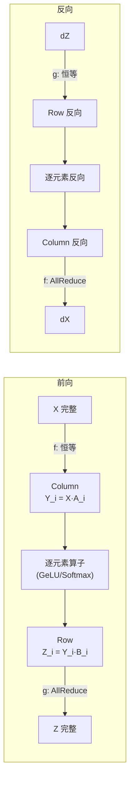
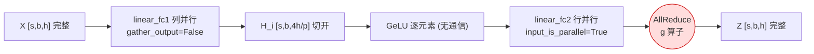
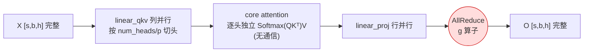
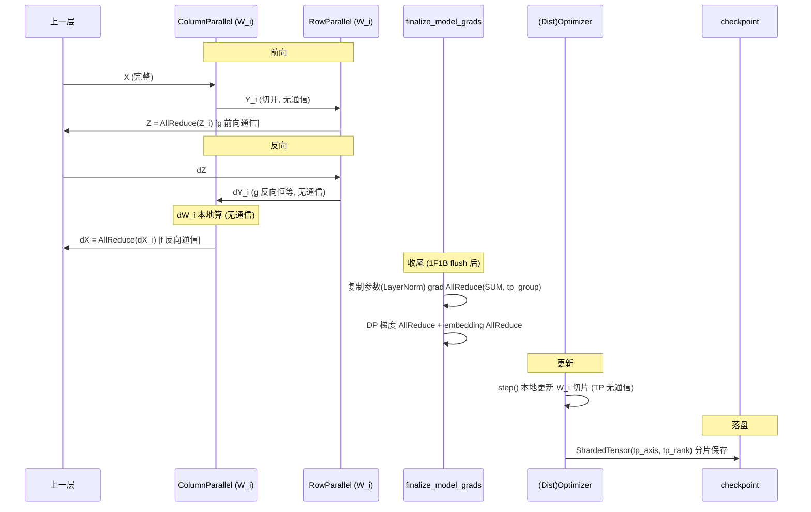

# 02.5 · 张量并行实现详解（TP in Transformer）

> 本篇是 [02 · 并行化子系统](./02-并行化子系统.md) 的**子文档**，承接 [02.4 · 并行组构建与通信详解](./02.4-并行组构建与通信详解.md)。02.4 讲清了"通信组怎么建、`tp_group` 从哪来"，本篇聚焦：TP 在 Transformer 结构下**如何切分权重、列并行与行并行如何经典配对、计算与通信的精确顺序**。
>
> 相关源码：
> - `megatron/core/tensor_parallel/layers.py`（`ColumnParallelLinear` / `RowParallelLinear` / `VocabParallelEmbedding`）
> - `megatron/core/tensor_parallel/mappings.py`（`f` / `g` 对偶算子与底层 NCCL 调用）
> - `megatron/core/transformer/mlp.py`、`megatron/core/transformer/attention.py`（配对的使用现场）

---

## 0. 全景图：一次前向里，通信到底落在哪（竖版） ★

先给一张**竖版全景图**，把一次前向从 `token → loss` 的每个算子、以及**每个集合通信落点**都标出来，建立"完整数学直觉"。后面 §1–§10 就是对这张图**逐块展开**。

图里 `●` = 一次集合通信；`⊕` = 残差加；标 `前向 / 反向` 表示该通信发生在 autograd 的哪一趟（关于"前向/反向 ≠ up/down project"见 [§3 开头 Remark](#3-两个对偶算子-f-和-g通信的真正落点)）。

```text
        token ids [s,b]
            │
            ▼
  ▶ VocabParallelEmbedding — 词表维切分，非本地 token 的行先置 0
            │
      ●① All-Reduce（前向）  切词表维 → 每卡只贡献一段部分和，求和拼回
            │
            ▼  X [s,b,h] 完整      （SP: 沿 s 切为 [s/t, b, h]）
  ┈┈┈┈┈┈┈┈┈┈┈┈ Transformer Layer × L ┈┈┈┈┈┈┈┈┈┈┈┈┈┈┈┈┈
            │
  ▶ InputNorm (RMSNorm)  复制参数，沿 h 归一（不切，见 §9.1）
            │
      ● f 入口   前向: 恒等(SP:All-Gather)  │ 反向: All-Reduce(汇 dX)
            │
  ▶ Attention (MHA / MLA)
      · linear_qkv  = Column（按 head 切）
      · core attn   逐头独立 Softmax(QKᵀ/√d)·V  → 零通信
      · linear_proj = Row              （MLA: down→latent→up，TP 仍切 head 维）
            │
      ●② g 出口   前向: All-Reduce(合并部分和 O)  │ 反向: 恒等
            │                                （SP: 前向→Reduce-Scatter）
            ▼
          ⊕ 残差1
            │
  ▶ PreMLPNorm (RMSNorm)  复制参数
            │
      ● f 入口   前向: 恒等(SP:All-Gather)  │ 反向: All-Reduce
            │
  ▶ FFN ── 二选一 ──────────────────────────────────────────────
      ├ Dense-MLP:  fc1 Column(↑ h→4h) → SwiGLU/GeLU → fc2 Row(↓ 4h→h)
      │                        └ ●③ g 出口  前向: All-Reduce │ 反向: 恒等
      │
      └ MoE:  router → top-k
              ●③a All-to-All  dispatch（把 token 送到专家所在卡）
              expert FFN 本地  fc1 → act → fc2
              ●③b All-to-All  combine（把结果送回原卡）
              （EP 的层内通信 = ③a/③b；EP 与 TP 正交，可叠加）
            │
            ▼
          ⊕ 残差2
  ┈┈┈┈┈┈ 重复 L 层；层间 PP 切 stage → 边界 P2P 传激活/激活梯度 ┈┈┈┈┈┈
            │
            ▼
  ▶ Final LayerNorm → Output linear（VocabParallel，切词表维）
            │  logits [s,b,V/t]
            ▼
  ▶ vocab_parallel_cross_entropy
      ●④ All-Reduce ×3（前向）  1×MAX(全局最大, 数值稳定) + 2×SUM(Σexp 分母, 目标项)
            │
            ▼
         loss（标量）
```

**通信点清单（对照上图的 `●`）**：

| 通信点 | 位置（算子） | 原语 | 触发趟 | 为什么非通信不可（数学根源） | 本篇展开 |
|--------|--------------|------|:------:|------------------------------|----------|
| **① Emb** | Embedding 出口 | All-Reduce | 前向 | 切**词表维**，每卡只查到一段 → 部分和求和拼回 | [§6](#6-词嵌入并行vocabparallelembedding) |
| **f 入口** | Column 入口（qkv / fc1） | All-Reduce | 反向 | 输入 `X` 被复制到各卡 → `dX` 是各分片贡献**之和** | [§3](#3-两个对偶算子-f-和-g通信的真正落点)、[§10.2](#102-输入梯度-dgraddldx要回传上一层-靠-fg-对偶算子) |
| **② Attn** | Attention 出口（proj） | All-Reduce | 前向 | 行并行沿**收缩维（head）**→ 每卡只得部分和 | [§5](#5-attention-的实现按注意力头切) |
| **③ MLP** | Dense-MLP 出口（fc2） | All-Reduce | 前向 | 行并行沿**收缩维**→ 部分和 | [§4](#4-mlp-的实现与计算-通信顺序) |
| **③a/③b MoE** | MoE dispatch / combine | All-to-All ×2 | 前/反向 | 专家分到不同卡，token 必须**去专家所在卡**算、再送回 | [§6.5](#65-moe--专家并行ep的通信为什么是-all-to-all)、[02.8 §3](./02.8-专家并行.md) |
| **④ Loss** | vocab_parallel_cross_entropy | All-Reduce ×3 | 前向 | logits 切词表维，softmax 需**全局 max 与 Σexp** | [§6](#6-词嵌入并行vocabparallelembedding)、[02·Q11](./interview/02-并行化子系统面试题集.md) |
| **SP** | 每个 f / g 边界 | AllReduce→RS+AG | 前/反向 | `AllReduce = RS + AG`，激活沿 `s` 切、**总量不变** | [§8](#8-延伸序列并行sequence-parallel) |

**三条一眼直觉**：

1. **每层只在四个边界通信**：Attention 的 `f`(反)/`g`(前) 各一次、FFN 的 `f`(反)/`g`(前) 各一次——夹在中间的 Norm、激活、core-attn 都是**逐元素/逐头**，切开算结果不变，**零通信**（设计哲学见 [§7](#7-前向反向通信次数总表)）。
2. **切在收缩维 → 部分和 → All-Reduce（`g`）；复制输入 → 梯度是和 → 反向 All-Reduce（`f`）**。①②③④ 全是这两条的实例（推导见 [§3](#3-两个对偶算子-f-和-g通信的真正落点)）。
3. **MoE 是唯一的例外**：它的层内通信不是 All-Reduce 而是**两次 All-to-All**——因为 EP 切的是"专家"这个**数据依赖**维度，不是矩阵的收缩维（见 [§6.5](#65-moe--专家并行ep的通信为什么是-all-to-all)）。

> 这张图同样放在 [02.0 §6.1](./02.0-Transformer与MoE结构基础.md)（结构视角的"全景预览"）。本篇从这里往下，`●①→④` 逐个落到代码与数学。

---

## 1. 核心思想：切的是权重矩阵，不是数据

DP 是「复制模型、切数据」；**TP 正相反：数据在每个 rank 上完整，但把单层的权重矩阵切到多块 GPU**。一个线性层 `Y = X·A`，把 `A` 切开，每块 GPU 只存一片、只算一片，最后通过一次集合通信把结果拼/合起来。

切矩阵有两个方向，对应两个类：

| 类 | 切谁 | 怎么切 | 切分代码 |
|----|------|--------|----------|
| **ColumnParallelLinear** | 权重 `A` 按**输出维（列）**切 | `[h, 4h] → [h, 4h/p]` | `output_size_per_partition = output_size / world_size`（`layers.py:870`） |
| **RowParallelLinear** | 权重 `B` 按**输入维（行）**切 | `[4h, h] → [4h/p, h]` | `input_size_per_partition = input_size / world_size`（`RowParallelLinear` 构造） |

> `p = tp_group.size()`，即 TP 组里的 GPU 数。`self.tp_group` 是 [02.4](./02.4-并行组构建与通信详解.md) 中由 `parallel_state` 建好并存入的那个通信组（`layers.py:864` 取得）。

---

## 2. 两种切法的数学与通信

### 列并行（Column）—— 切输出维

```
A = [A_1 | A_2 | ... | A_p]          # 按列切
Y_i = X · A_i                        # 第 i 块只算输出的一部分
Y   = [Y_1 | Y_2 | ... | Y_p]        # 拼接才是完整输出
```

- **输入 X 必须完整**（每个 rank 都要全量 X）。
- 输出天然**切开**（`[s, b, 4h/p]`）。
- `gather_output=True` 会 All-Gather 拼全；但经典配对里设 **`gather_output=False`**，保持切开直接喂下一层（`layers.py:1085` 处的分支）。

### 行并行（Row）—— 切输入维

```
B = [B_1; B_2; ...; B_p]             # 按行切（竖着摞）
Z_i = Y_i · B_i                      # 用切开的输入算出"部分和"
Z   = Σ Z_i                          # 必须 All-Reduce 求和才是完整输出
```

- **输入 Y 本来就是切开的**（`input_is_parallel=True`），刚好接住列并行的输出。
- 每个 rank 算出**部分和**，必须 **All-Reduce** 相加。

> 关键：**列并行的输出（切开的）正好是行并行需要的输入（切开的）**。两者首尾相接，中间不需要任何通信——这就是"经典配对"的精髓。

---

## 3. 两个对偶算子 f 和 g（通信的真正落点）

Megatron 论文里的 `f` 和 `g`，在代码里是两个 `torch.autograd.Function`，把通信巧妙分配到前向/反向。

> **Remark：`f`/`g` 是「投影边界上的通信包装」，别和 up/down project 混为一谈**
>
> 初读容易把两件事叠在一起，其实是**两个正交的维度**：
>
> - **`f`/`g` 各自的「前向 / 反向」** = `autograd.Function` 的 `.forward()` / `.backward()` 两个方法，跑在**网络前向那一趟 / 梯度回传那一趟**——就是你熟悉的 forward/backward，**同一个概念**。`f.backward` 会在反向传播时被 autograd 自动调用。
> - **「列并行 / 行并行」≈ up-project / down-project** = 具体是哪一层 `Linear`（`ColumnParallelLinear` fc1 `h→4h` 上投影；`RowParallelLinear` fc2 `4h→h` 下投影）。这是**空间位置**，和"前向/反向"无关。
>
> 关键点：**`f`/`g` 本身不是投影、不做矩阵乘**，它们是**套在投影边界上的两个"通信包装"**——只负责在合适的时刻插入 All-Reduce（或恒等直通），把切分制造出的"部分和"补齐。整条 MLP 的数据流长这样：
>
> ```text
>          ┌──────────────── autograd 前向（网络前向）────────────────┐
>   X ──▶ [f] ──▶ ColumnParallel(up, h→4h) ──▶ GeLU ──▶ RowParallel(down, 4h→h) ──▶ [g] ──▶ Z
>   完整   入口包装      切列·各算各(不通信)      逐元素      切行·出部分和            出口包装   完整
>         前向:恒等                                                              前向:All-Reduce(合并部分和)
>         反向:All-Reduce(汇梯度)                                               反向:恒等
>          └──────────────── autograd 反向沿反方向逐个调用各算子的 .backward() ─────────────┘
> ```
>
> - `f` 贴在 **up-project 的入口**（列并行入口）：前向直通、反向把 `dX` 的部分和 All-Reduce 汇齐。
> - `g` 贴在 **down-project 的出口**（行并行出口）：前向把各卡部分和 `Z_i` All-Reduce 合并、反向直通。
>
> 之所以"感觉像 up/down"，是因为**位置上** `f` 恰在 up 那侧、`g` 恰在 down 那侧；但这只说明"包装摆在哪儿"，不改变"前向/反向指 autograd 两趟"这件事。一句话：**「`f` 还是 `g`／列并行还是行并行」是空间维（≈up/down project），「前向还是反向」是时间维（=计算 vs 梯度回传），二者正交。** 下面 (A)(B)(C) 就分别讲清这两个包装为什么各自要在某一趟做 All-Reduce。

### 为什么非得 All-Reduce：两处"求和"的数学根源

一句话结论：**f 和 g 的 all-reduce，都是在补一次"跨卡求和"**——因为矩阵切分在两个地方各自制造了"部分和"：一个在**行并行的前向**，一个在**列并行的反向**。

**(A) g 的前向 all-reduce —— 行并行沿"收缩维"产生部分和**

行并行把输入 `Y` 沿**收缩维**（矩阵相乘要对齐、要累加的那一维）切开，权重 `B` 按行切：

$$
Y=[\,Y_1\ Y_2\ \cdots\ Y_p\,],\qquad
B=\begin{bmatrix}B_1\\ B_2\\ \vdots\\ B_p\end{bmatrix},\qquad
Z=YB=\sum_{i=1}^{p} Y_i B_i .
$$

每张卡 `i` 只算得一个**部分和** $Z_i=Y_iB_i$——它的形状和完整的 `Z` 一样（`[s,b,h]`），但**只含求和里的一项**。真正的输出 $Z=\sum_i Z_i$ 必须把各卡的 $Z_i$ **跨卡加起来** → 这就是 **g 前向的 All-Reduce**。

**(B) f 的反向 all-reduce —— 列并行复制输入，梯度汇聚所有分片**

列并行把权重 `A` 按列切，而**输入 `X` 在每张卡上是同一份（复制）**：

$$
A=[\,A_1\ \cdots\ A_p\,],\qquad Y_i = X A_i,\qquad Y=[\,Y_1\ \cdots\ Y_p\,].
$$

前向每卡各算各的 $Y_i$，**不通信**。但反向要算 $\partial L/\partial X$：因为**同一个 `X` 喂给了所有列分片**（`Y` 的每一块都用到它），由多元链式法则（[02.0 §5.3.1](./02.0-Transformer与MoE结构基础.md)），`X` 的梯度是所有分片贡献**之和**：

$$
\frac{\partial L}{\partial X}=\sum_{i=1}^{p}\frac{\partial L}{\partial Y_i}\,A_i^{\!\top}.
$$

每张卡只能算出自己那一项 $dX_i=dY_i A_i^{\!\top}$（又是一个**部分和**），必须**跨卡求和** → 这就是 **f 反向的 All-Reduce**。

> 顺带：权重梯度 $dA_i = X^{\!\top} dY_i$ 是**本地**的（每卡有自己的 $A_i$、各更各的），无需通信——**参数梯度天然是切开的**，这也是 TP 省显存的来源（本篇 §10、[02.4 §2.6](./02.4-并行组构建与通信详解.md)）。

**(C) 对偶的本质：复制(恒等) 与 求和(All-Reduce) 互为"伴随"**

把 f、g 前向各自做的事抽象出来，正好是一对**伴随（转置）算子**：

| 算子 | 前向做的事 | 反向（伴随）做的事 |
|------|-----------|-------------------|
| **f**（列并行入口） | **复制** `X` 到各卡（`X` 本已同一份，故 = 恒等） | **求和** 各卡的 `dX`（All-Reduce） |
| **g**（行并行出口） | **求和** 各卡部分和 `Z_i`（All-Reduce） | **复制** `dZ` 到各卡（= 恒等） |

线性代数上，"把一个张量**复制/广播**成 N 份"这个算子的**转置（伴随）恰好是"把 N 份加起来"**，反之亦然。于是有铁律：**前向复制 ⇒ 反向必求和；前向求和 ⇒ 反向必复制**。f 与 g 就是把这对伴随算子分别摆在**列并行入口**和**行并行出口**——这样前向、反向**各只需一次 All-Reduce**，且梯度自动正确。下面看它们的代码。

### f 算子 = `_CopyToModelParallelRegion`（`mappings.py:197`）

```python
class _CopyToModelParallelRegion:
    def forward(ctx, input_, group):  return input_                    # 前向：恒等
    def backward(ctx, grad):          return _reduce(grad, ctx.group)  # 反向：All-Reduce
```

放在**列并行入口**：前向直通，反向把梯度 all-reduce。

### g 算子 = `_ReduceFromModelParallelRegion`（`mappings.py:217`）

```python
class _ReduceFromModelParallelRegion:
    def forward(ctx, input_, group):  return _reduce(input_, group)    # 前向：All-Reduce
    def backward(ctx, grad):          return grad                      # 反向：恒等
```

放在**行并行出口**：前向 all-reduce 合并部分和，反向直通。

### 最底层：真正的 NCCL 调用（`mappings.py:22`）

```python
def _reduce(input_, group):
    if group.size() == 1: return input_
    torch.distributed.all_reduce(input_.contiguous(), group=group)   # ← NCCL 在 tp_group 内求和
    return input_
```

**f 与 g 互为对偶**：f 前向恒等/反向通信，g 前向通信/反向恒等。一前一后，保证前向、反向各只发生**一次** all-reduce。



---

## 4. MLP 的实现与计算-通信顺序

构造（`mlp.py:216, 236`）——经典配对一目了然：

```python
self.linear_fc1 = ColumnParallelLinear(..., gather_output=False)   # 列并行，输出保持切开
self.linear_fc2 = RowParallelLinear(...,  input_is_parallel=True)  # 行并行，接住切开输入
```

前向（`mlp.py:252`）伪代码 + 通信标注：

```
输入 X: [s, b, h]   ← 完整

# ---- linear_fc1 (列并行) ----
X = f(X)                      # 前向恒等；反向 all-reduce 梯度        [通信:反向]
H_i = X · A_i                 # A_i=[h, 4h/p] → H_i=[s,b,4h/p] 切开    无通信

# ---- 激活函数 ----
H_i = GeLU(H_i)               # 逐元素，在切开张量上直接算 ★          无通信

# ---- linear_fc2 (行并行) ----
Z_i = H_i · B_i               # B_i=[4h/p, h] → 部分和 Z_i=[s,b,h]    无通信
Z = g(Z_i) = AllReduce(Z_i)   # 前向 all-reduce 求和；反向恒等         [通信:前向]

输出 Z: [s, b, h]   ← 完整
```

**关键点**：GeLU 逐元素，作用在「切开的 `4h/p`」与作用在「完整 `4h`」结果一致，所以激活函数**零通信**。整个 MLP：前向 1 次 All-Reduce（fc2 的 g）、反向 1 次（fc1 的 f）——理论最小值。



---

## 5. Attention 的实现：按"注意力头"切

Attention 同样是 Column→Row 配对，切的语义是**注意力头**。

构造（`attention.py:1409, 394`）：

```python
self.linear_qkv  = ColumnParallelLinear(..., gather_output=False)   # 列并行
self.linear_proj = RowParallelLinear(...,  input_is_parallel=True)  # 行并行
```

前向（`attention.py:1558` qkv、`1342` proj）伪代码 + 通信：

```
输入 X: [s, b, h]   ← 完整

# ---- linear_qkv (列并行，按头切) ----
X = f(X)                              # 反向 all-reduce 梯度            [通信:反向]
QKV_i = X · W_qkv_i                   # 每 rank 拿到 num_heads/p 个头的 Q,K,V   无通信

# ---- core attention (逐头独立) ----
O_i = Softmax(Q_i·K_iᵀ/√d)·V_i        # 注意力在"本地的几个头"上独立计算 ★  无通信

# ---- linear_proj (行并行) ----
P_i = O_i · W_proj_i                  # 部分和
O = g(P_i) = AllReduce(P_i)           # 前向 all-reduce                 [通信:前向]

输出 O: [s, b, h]   ← 完整
```

**关键点**：注意力的「头」是天然独立的计算单元，把头分到不同 GPU，每个头的 `Q·Kᵀ·V` 完全自包含，**core attention 零通信**。所以 Attention 也是前向 1 次、反向 1 次 All-Reduce。

> **Remark：结尾为什么是 All-Reduce，而不是把多头 All-Gather 拼回来？**
>
> 直觉上，`O_i` 是完整多头输出 `Concat(head_1,…,head_H)` 的一个列块，"拼回完整"似乎该用 All-Gather。但**注意力块的结尾不是"拼接多头"，而是紧跟的输出投影 `linear_proj`**，而线性层作用在拼接结果上，天然就是行并行的部分和：
>
> $$O_{full}\cdot W_O=\big[O_1\,\big|\cdots\big|\,O_p\big]\cdot\begin{bmatrix}W_{O,1}\\ \vdots\\ W_{O,p}\end{bmatrix}=\sum_{i=1}^{p}O_i\cdot W_{O,i}=\sum_i P_i$$
>
> 每卡算出的 `P_i = O_i·W_proj_i` 是**完整形状 `[s,b,h]` 的部分和**，收缩维（被 `W_O` 乘掉的那个 `h` 维）恰好就是被切开的头维 → 必须**跨卡求和** → All-Reduce（即 `g`）。
>
> "先 All-Gather 拼出 `O_full`、再各卡用**复制的完整 `W_O`** 做整个投影"是**另一种更浪费的等价方案**：通信量同量级，但每卡都要做整个 GEMM（冗余 `p` 倍算力）。行并行把"拼接"从算子里**代数地消掉**——投影直接吃切开的头、输出即求和结果，每卡只做 `1/p` 的 GEMM。
>
> 一句话判据：**切分沿收缩维、每卡只得部分和 → All-Reduce**（行并行出口 `g`）；**切分沿非收缩维、下游要完整拼接 → All-Gather**（如 `gather_output=True`、SP 补齐序列维）。头维是输出投影的收缩维，故此处是 All-Reduce。



> 一个完整 Transformer 层 = Attention + MLP，因此**每层前向 2 次、反向 2 次** All-Reduce。

---

## 6. 词嵌入并行：VocabParallelEmbedding

输入/输出嵌入按**词表维度**切（`layers.py:284` forward）：

```
每个 rank 只持有词表的一段 [vocab_start, vocab_end)

input_mask = (id < vocab_start) | (id >= vocab_end)   # 不在本段的 token
masked_input = id - vocab_start
masked_input[input_mask] = 0                          # 越界的先置 0
out_i = Embedding(masked_input)                       # 本地查表
out_i[input_mask, :] = 0.0                            # 不属于本段的行清零 ★
out = AllReduce(out_i)                                # 求和：每 token 只有一段非零，相加即正确
```

巧妙之处：每个 rank 把「不归自己管的 token」输出清零，All-Reduce 求和后每个 token 恰由持有它的 rank 贡献，其余为 0，结果正确。

---

## 6.5 MoE / 专家并行（EP）的通信：为什么是 All-to-All

这是[全景图 §0](#0-全景图一次前向里通信到底落在哪竖版-) 里 `●③a/③b` 的展开。Dense-MLP 和 MoE 都算"FFN 块"，但**层内通信性质完全不同**：Dense 是 All-Reduce，MoE 是**两次 All-to-All**。

**根源在"切的是什么维"**：

- **TP 切的是矩阵的收缩维**（`h`/`4h`），每卡拿到同一批 token 的"部分和"，求和即可 → **All-Reduce**（①②③，见 §3）。
- **EP 切的是"专家 `E`"这个数据依赖维**：`E` 个专家分到不同 GPU（每卡 `E/ep` 个）。router 为每个 token 选 top-k 专家后，**token 必须被送到它所选专家所在的那张卡**去算——这不是"求和"，而是"**按目的地重排/交换**"，正是 All-to-All 的语义。

**两次 All-to-All（`experts.py` / `token_dispatcher`）**：

```
router → top-k routing_map        # 每 token 选 top-k 专家（本地算，无通信）
●③a  All-to-All  dispatch         # 按目标专家把 token 打散送到对应 EP rank
expert FFN 本地： fc1 → act → fc2   # 每卡只算落到自己专家上的 token（GroupedGEMM）
●③b  All-to-All  combine          # 把算完的 token 结果送回它原来的 rank
unpermute + top-k 加权 → [s,b,h]  # 本地合并
```

反向对称：`combine` 的反向是一次 All-to-All、`dispatch` 的反向也是一次 All-to-All（token 梯度按原路送回）。

**EP 与 TP 正交、可叠加**：专家内部的 `fc1/fc2` 仍可再被 TP 沿 `h/E_ffn` 切（此时专家 FFN 内部又出现 ③ 那样的 All-Reduce）。二者切的维度不同（EP 切"哪个专家"、TP 切"专家内矩阵"），组合使用即 `etp`/`ep` 混合。

> 本节只交代"MoE 为何是 A2A、落在图谱哪一格"。负载不均、容量因子、共享专家、Ring/2D 通信优化等完整推导见 [02.8 · 专家并行](./02.8-专家并行.md)。

---

## 7. 前向/反向通信次数总表

| 模块 | 列并行算子（入口） | 行并行算子（出口） | 前向通信 | 反向通信 |
|------|------------------|------------------|----------|----------|
| MLP | fc1: `f` | fc2: `g` | 1× AllReduce | 1× AllReduce |
| Attention | qkv: `f` | proj: `g` | 1× AllReduce | 1× AllReduce |
| Embedding | — | — | 1× AllReduce | — |

> **设计哲学**：把 GeLU、Softmax 这类「逐元素/逐头」算子夹在 Column 与 Row 之间，它们在切开张量上算结果不变，于是中间零通信，整层只在边界各做一次 all-reduce。

---

## 8. 延伸：序列并行（Sequence Parallel）

开启 `sequence_parallel` 时，行并行出口的 `g` 从 **All-Reduce 换成 Reduce-Scatter**（`layers.py:319` `reduce_scatter_to_sequence_parallel_region`），把激活也沿序列维切开存储，进一步省显存。原理是把 `AllReduce = ReduceScatter + AllGather` 拆开，分摊到 Row 出口与下一个 Column 入口——通信总量不变，但峰值激活显存显著下降。

---

## 9. 参数的两分：切分参数 vs 复制参数

理解 TP 的梯度与优化器状态，先要分清 TP 下参数有**两类**，处理方式完全不同：

| 类别 | 例子 | 在各 TP rank 上 | 标记 |
|------|------|----------------|------|
| **切分参数（sharded）** | `linear_qkv/fc1` 的 weight（列切）、`linear_proj/fc2` 的 weight（行切） | 每 rank 持有**不同的一片**，合起来才是完整权重 | `tensor_model_parallel=True` + `partition_dim`（`layers.py:104` `set_tensor_model_parallel_attributes`） |
| **复制参数（duplicated）** | LayerNorm 的 weight/bias、router、未切维度的 bias | 每 rank 持有**完全相同的一份** | 默认 `tensor_model_parallel=False` |

判定函数 `param_is_not_tensor_parallel_duplicate`（`layers.py:92`）：切分参数每片都唯一（恒为"非重复"）；复制参数只有 `tp_rank==0` 那份算"非重复"。这用于**梯度范数统计、checkpoint 去重**等场景，避免把同一份复制参数重复计数。

> 这条「切分/复制」之分，是下面梯度、优化器、checkpoint 三件事的总开关。

### 9.1 为什么 LayerNorm 等参数只复制、不切分

一个自然的疑问：既然 TP 能切 Linear，为什么不也切 LayerNorm？根本原因是——**TP 切分的前提是「计算沿某个维度可分配」，而 LayerNorm 不满足，硬切反而亏。**

**TP 能切 Linear，是利用矩阵乘法的可分配律**（见 §2）：GEMM 可以沿输出维/输入维拆成独立小块，每块只用一片权重。但 LayerNorm 的计算是：

```
y = γ · (x - μ) / σ + β        # γ,β 形状 [h]，逐元素作用
其中 μ = mean(x, dim=h),  σ = std(x, dim=h)   # 沿整个 hidden 维 h 归约
```

它有两个"不可切"的特征：

1. **逐元素 + 无 GEMM 维**：`γ/β` 是 element-wise 缩放/平移，没有可分配的矩阵乘维度。
2. **沿 h 归约需要全量**：`μ/σ` 要对**完整的 hidden 维**求均值/方差。若把 `x` 沿 `h` 切两半到两卡，算 `μ` 必须凑齐两片的和 → 每个 LayerNorm 凭空多 **2 次 AllReduce**（μ 一次、σ 一次）。

**这笔账是亏的**：LayerNorm 参数量仅 `O(h)`（相比 Linear 的 `O(h·4h)` 微不足道），切分省下的显存/算力极小，却要在每层增加归约通信。所以复制成本最低——每个 rank 拿着完整的 `x`（TP 区域内 `x` 本就完整，见 §3 的 `f` 算子）各自独立算，**零通信**。

> 一句话对照：**Linear 是"沿 hidden 做 GEMM"→ 可分配 → 能切；LayerNorm 是"沿 hidden 做归约"→ 需全量 → 不能切。**

### 9.2 三种归一化的计算公式与归约维度（BatchNorm / LayerNorm / RMSNorm）

要理解"为什么沿 h 归约就不能切",关键是看清**每种归一化沿哪个维度求统计量**。设激活 `x` 形状 `[s, b, h]`（`s`=序列、`b`=batch、`h`=隐藏/特征维），下面 `i∈[1,s]`、`j∈[1,b]`、`k∈[1,h]`。

**① BatchNorm —— 沿 batch（样本）维归约,每个特征一个统计量**
```
# 归约轴 = (s, b)；统计量形状 [h]（每个特征通道 k 一个）
μ_k  = (1/(s·b)) Σ_{i,j} x[i,j,k]
σ²_k = (1/(s·b)) Σ_{i,j} (x[i,j,k] - μ_k)²
y[i,j,k] = γ_k · (x[i,j,k] - μ_k) / √(σ²_k + ε) + β_k
```
- 统计量 `μ,σ²` 形状 `[h]`,**跨样本共享、依赖 batch 里的其它 token**；推理时需维护 running mean/var（EMA）。
- Transformer **不用** BatchNorm:变长序列、小/变 batch 下统计量不稳,且耦合不同样本。

**② LayerNorm —— 沿 hidden 维 h 归约,每个 token 一个统计量**
```
# 归约轴 = h；统计量形状 [s, b, 1]（每个 token (i,j) 一个）
μ[i,j]  = (1/h) Σ_{k} x[i,j,k]
σ²[i,j] = (1/h) Σ_{k} (x[i,j,k] - μ[i,j])²
y[i,j,k] = γ_k · (x[i,j,k] - μ[i,j]) / √(σ²[i,j] + ε) + β_k
```
- 统计量形状 `[s,b,1]`,**每个 token 独立、与其它样本无关** → 适合序列模型。
- `γ,β` 形状 `[h]`,逐元素缩放/平移,沿 `s,b` 广播。

**③ RMSNorm —— 沿 h 归约,但只算均方根、不减均值（DeepSeek 实际所用）**
```
# 归约轴 = h；只需一个二阶统计量
RMS[i,j] = √( (1/h) Σ_{k} x[i,j,k]² + ε )
y[i,j,k] = γ_k · x[i,j,k] / RMS[i,j]          # 通常无 β
```
- 去掉了减均值,沿 h 只需归约 `Σx²` 一个量。

**对比与 TP 关联（核心）**：

| | BatchNorm | LayerNorm | RMSNorm |
|---|-----------|-----------|---------|
| **归约维度** ★ | batch `(s,b)` | **hidden `h`** | **hidden `h`** |
| 统计量形状 | `[h]` | `[s,b,1]` | `[s,b,1]` |
| 统计量个数 | μ、σ²（2） | μ、σ²（2） | RMS（1，无 μ） |
| 是否依赖其它样本 | 是 | 否 | 否 |
| 参数 | γ,β `[h]` | γ,β `[h]` | γ `[h]` |
| Transformer 是否用 | 否 | 是（GPT 等） | 是（LLaMA/DeepSeek） |
| 沿 h 切分的代价 | —（不沿 h 归约） | 切了须 AllReduce（朴素 2 次/融合 1 次） | 切了须 AllReduce（1 次，仅 `Σx²`） |

> **关键结论**：LayerNorm 与 RMSNorm 都**沿 `h` 归约**,而 `h` 恰是 TP 的切分轴 → 一旦沿 h 切开,本地统计量就是错的,必须跨卡 AllReduce 才能拼对（数学反例见下方 §9.2.1）。BatchNorm 沿 batch 归约,与 TP 的 h 切分轴正交,但 Transformer 因稳定性根本不用它。**这就是 LN/RMSNorm 在 TP 下选择复制而非切分的根因——归约轴与切分轴重合。**

#### 9.2.1 为什么"分别算再拼"是错的（数学反例）

设 `x=[1,2,3,4]`（h=4），沿 h 切两半：GPU0=`[1,2]`、GPU1=`[3,4]`（以 LayerNorm 为例，省略 γ,β,ε）。

```
正确（用全局统计）: μ=2.5, σ≈1.118
  y = [(1-2.5)/1.118, (2-2.5)/1.118, (3-2.5)/1.118, (4-2.5)/1.118]
    = [-1.34, -0.45, 0.45, 1.34]

分别算再拼（各用本地统计）:
  GPU0: μ₀=1.5,σ₀=0.5 → [-1, 1]
  GPU1: μ₁=3.5,σ₁=0.5 → [-1, 1]
  拼接 = [-1, 1, -1, 1]   ❌ 与正确值完全不同
```

每一半被自己**错误的本地均值/方差**归一化了 → 拼出来是另一个函数。要算对,GPU0 必须知道 GPU1 那半的数据(即全局 μ/σ)——这只能靠 AllReduce。

> **统一判据**：当把张量沿"下游操作要归约的轴"切开时,就必须跨卡归约;只有输出沿切分轴**互相独立**时才能直接拼接。
> - 列并行 Linear:切输出维（归约轴=输入维,未被切）→ 能拼,零通信。
> - 行并行 Linear:切输入维（=矩阵乘归约轴）→ 须 AllReduce。
> - LayerNorm/RMSNorm:切 h（=归一化归约轴）→ 须 AllReduce。
>
> 可见行并行 Linear 要 AllReduce 与 LN 不能切是**同一条原理**;区别仅在 Linear 切大矩阵划算、LN 参数太小纯亏。

### 9.3 其它"只复制"参数同理

| 参数 | 为什么不切 |
|------|-----------|
| **LayerNorm / RMSNorm 的 γ, β** | 逐元素 + 沿 h 归约，无 GEMM 维；切了要加 AllReduce |
| **bias（非切分维上的）** | 参数量 `O(h)` 极小，切分收益微乎其微 |
| **router（MoE 门控）** | `[h, num_experts]`，需对**完整 token 表示**打分才能正确路由；切了破坏语义且参数极小 |

共同点：**要么没有可切的 GEMM 维度，要么参数量太小——切分省下的 < 引入的通信开销。** 这是工程权衡，不是技术限制。

### 9.4 复制的代价：偶尔一次梯度同步

复制把代价从"切分时的归约通信"转移到"梯度同步"，而后者通常更小：

- **不开序列并行**：各 rank 的 `x` 完整且相同（`f` 算子保证），LayerNorm 梯度**天然一致**，零额外通信。
- **开序列并行**：激活沿序列维 `s` 切开（§8），各 rank 看到不同 token，`γ/β` 梯度不同 → 需 1 次跨 TP **SUM AllReduce**（即 §10.3 的 `finalize_model_grads`）。

> 注意这是把"硬切 LayerNorm 时每层 2 次零散归约"换成了"收尾时所有复制参数打平的 1 次 all-reduce"，通信效率反而更高。

**决策表**：

| 维度 | Linear（切分） | LayerNorm/bias/router（复制） |
|------|---------------|------------------------------|
| 计算类型 | GEMM，沿 hidden 可分配 | 逐元素 + 沿 hidden 归约 / 小参数 |
| 切分能否成立 | 能，省显存省算力 | 能但要加归约 AllReduce，得不偿失 |
| 参数量 | 大（`h×4h` 量级） | 极小（`O(h)` 量级） |
| TP 下处理 | 切到各 rank | 整份复制 |

---

## 10. 梯度的计算与通信

TP 反向涉及**两种梯度**，加上**复制参数的额外同步**，共三条路径：

### 10.1 权重梯度 wgrad（dL/dW）—— 本地计算，零通信 ★

切分权重 `W_i` 的梯度 `dW_i` 由本地的 `X` 与 `dY_i` 算出，**天然就是切开的、各 rank 各持一片，不需要任何 TP 通信**。这是 TP 高效的关键：

```
ColumnParallel: dW_i = dY_i^T · X     # 本地，dW_i 对应 W_i 那片
RowParallel:    dW_i = dZ^T   · Y_i   # 本地
```
每个 TP rank 只为自己那片权重算梯度、存梯度——和它前向只算一片完全对称。

### 10.2 输入梯度 dgrad（dL/dX，要回传上一层）—— 靠 f/g 对偶算子

回看 02.5 §3 的对偶算子，反向通信恰好由它们承担：

- **ColumnParallelLinear**：前向 `X` 是被 `f` 复制进来的完整张量；反向各 rank 只能算出 `dX` 的**部分和**，必须 all-reduce 才正确。这正是 **`f` 算子的 backward**（`_CopyToModelParallelRegion.backward` → `_reduce` → `all_reduce(group=tp_group)`，`mappings.py:214`）。受 `allreduce_dgrad` 控制（`layers.py:422`）。
- **RowParallelLinear**：前向输入本就是切开的，反向 `dX` 也切开即可，`g` 算子 backward 是**恒等**，dgrad 无通信。

> 对照表：

| 梯度 | Column 层 | Row 层 |
|------|-----------|--------|
| wgrad（dW） | 本地，无通信 | 本地，无通信 |
| dgrad（dX） | **f.backward → All-Reduce** | 恒等，无通信 |

所以一个 Column→Row 配对，反向仍只有 **1 次 All-Reduce**（在 Column 入口），与前向的 1 次（Row 出口）对称——与 §7 总表一致。

### 10.3 复制参数的梯度同步 —— 额外的跨 TP All-Reduce

复制参数有个隐患：**普通情况下**（无序列并行），LayerNorm 的输入在各 TP rank 上是相同的完整激活 → 梯度天然相同，无需同步。**但开启序列并行后**，LayerNorm 作用在「沿序列切开」的不同 token 上 → 各 rank 算出的梯度**不同**，必须跨 TP 求和。

这一步在 `finalize_model_grads.py:371` 的 `_allreduce_non_tensor_model_parallel_grads` 完成：

```python
# 收集需要同步的复制参数梯度
elif (config.sequence_parallel and getattr(param, "sequence_parallel", False)) or (
        config.qk_layernorm and ("q_layernorm" in name or "k_layernorm" in name)):
    grads_sum.append(grad.data)
...
coalesced = _flatten_dense_tensors(grads)                         # 打平成一块
torch.distributed.all_reduce(coalesced, op=SUM, group=tp_group)   # 跨 TP 求和
```

- **SUM 规约**：序列并行 LayerNorm、qk_layernorm（各 rank 是不同 token 的部分和）。
- **AVG 规约**：标记了 `average_gradients_across_tp_domain` 的参数。
- 触发时机：在 1F1B 调度收尾的 `finalize_model_grads` 里（见 [02.6 §5.4](./02.6-流水线并行与1F1B调度.md)），与 DP 梯度 all-reduce、embedding all-reduce 一起做。

---

## 11. 优化器状态在 TP 下如何维护

优化器状态（如 Adam 的一阶动量 `m`、二阶动量 `v`）是**逐参数**的，因此：

- 每个 TP rank **只持有自己那片切分权重**，于是**只为这一片维护对应的 `m/v`** → 优化器状态**天然沿 TP 切分**，无需任何额外处理，`optimizer.step()` 在本地切片上独立更新，**零 TP 通信**（梯度此时已在本地就位）。
- 复制参数的优化器状态在各 rank 上相同（因为 §10.3 已把它们的梯度同步成一致），各 rank 冗余更新但结果一致。

### 与 DistributedOptimizer（ZeRO）的正交关系

`DistributedOptimizer` 在此基础上**再沿 DP 维切分优化器状态**（ZeRO-1）：

```
一个切分权重 W_i 的优化器状态，被双重切分：
   TP 维：W_i 本身只是完整 W 的 1/tp 片
   DP 维：DistributedOptimizer 把这 1/tp 片的 m/v 再切成 1/dp，
          每个 dp_cp rank 只存 1/(tp·dp)
```

- TP 与 DP 正交：TP 在 `tp_group` 内切参数本体，DistributedOptimizer 在 `dp_cp_group` 内切优化器状态（见 [02.4](./02.4-并行组构建与通信详解.md) 的 `_DATA_PARALLEL_GROUP_WITH_CP`）。
- 更新后通过 DP 组的 reduce-scatter / all-gather 收发参数——这部分属于数据并行，详见 [04 · 分布式训练与优化器](./04-分布式训练与优化器.md)。TP 本身对优化器状态**不产生通信**。

---

## 12. 梯度/权重的 checkpoint 分片保存

TP 切分的权重落盘时，必须记录「这一片在全局张量里的位置」，否则无法在不同 TP 尺寸间加载。这由 **ShardedTensor** 元数据承担。

`ColumnParallelLinear.sharded_state_dict`（`layers.py:333`）/ `RowParallelLinear.sharded_state_dict`（`layers.py:1373`）调用 `make_sharded_tensors_for_checkpoint`（`transformer/utils.py:95`），传入一个 **tp 切分轴映射**：

```python
# Column 层：weight 沿 dim 0 切（输出维）
make_sharded_tensors_for_checkpoint(state_dict, prefix, {'weight': 0}, ...)
# Row 层：weight 沿 dim 1 切（输入维）
make_sharded_tensors_for_checkpoint(state_dict, prefix, {'weight': 1}, ...)
```

内部（`transformer/utils.py:148`）按这个 `tp_axis` 把张量包成带全局坐标的 `ShardedTensor`：
```python
tp_axis = tensor_parallel_layers_axis_map[layer_name]    # 0 或 1
make_tp_sharded_tensor_for_checkpoint(tensor, key, tp_axis, tp_group=..., dp_cp_group=...)
```

- **切分参数** → `ShardedTensor`，记录 `(tp_axis, tp_rank, tp_size)`，每片只由对应 rank 写出。
- **复制参数 / `_extra_state`** → 用 `replica_id = (0, tp_rank, dp_rank)`（`utils.py:142`）标记主副本，只由一个 rank 实际落盘，其余视为副本去重。

> 结果：checkpoint **与具体 TP 尺寸解耦**——用 TP=8 训练存的权重，可被 TP=4 加载，框架按 ShardedTensor 的全局坐标自动重切分（resharding，详见 [08 · 检查点与重切分](./08-检查点与重切分.md)）。

---

## 13. 完整生命周期时序

把前向到落盘串成一条线（单个 Column→Row 配对，开启序列并行）：



**一句话**：TP 下，**切分权重的梯度与优化器状态全程本地化、零 TP 通信**；TP 的反向通信只有 `f` 算子的 1 次 dgrad all-reduce；唯一的"额外"梯度同步来自**序列并行下的复制参数（LayerNorm）**；checkpoint 用 ShardedTensor 记录切分坐标，做到与 TP 尺寸解耦。

---

## 14. 小结

- TP 切的是**权重矩阵**：Column 切输出维、Row 切输入维。
- **经典配对 Column→(逐元素算子)→Row**：列并行输出的切开张量正好是行并行的切开输入，中间零通信。
- **f / g 对偶算子**把通信压到前向、反向各一次 All-Reduce，全部落在 `parallel_state` 提供的 `tp_group` 上。
- MLP 按隐藏维切、Attention 按头切、Embedding 按词表切，三者统一用同一对 `ColumnParallelLinear` / `RowParallelLinear` 实现。
- 序列并行是 TP 的标准省显存搭配，把出口的 AllReduce 换成 ReduceScatter。
- **梯度**：切分权重的 wgrad 本地算、零通信；dgrad 由 `f` 算子反向 all-reduce；**复制参数（序列并行 LayerNorm）** 需在 `finalize_model_grads` 额外跨 TP all-reduce。
- **优化器状态**：天然沿 TP 切分、本地更新、零 TP 通信；`DistributedOptimizer` 在 DP 维再切（与 TP 正交）。
- **checkpoint**：切分权重以 `ShardedTensor(tp_axis, tp_rank)` 保存，与 TP 尺寸解耦、支持重切分。

返回上级：[02 · 并行化子系统](./02-并行化子系统.md) ｜ 上一篇：[02.4 · 并行组构建与通信详解](./02.4-并行组构建与通信详解.md) ｜ 下一篇：[02.6 · 流水线并行与1F1B调度](./02.6-流水线并行与1F1B调度.md)
