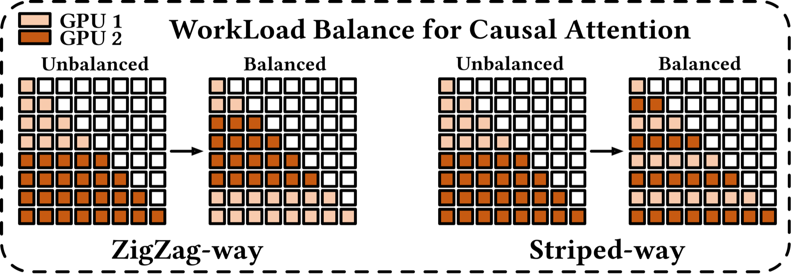
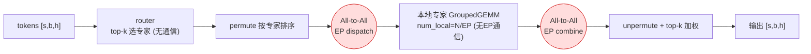

# 02.7 · 上下文并行与专家并行（CP & EP）

> 本篇是 [02 · 并行化子系统](./02-并行化子系统.md) 的**子文档**，与 [02.4](./02.4-并行组构建与通信详解.md)（通信组）、[02.5](./02.5-张量并行实现详解.md)（TP）、[02.6](./02.6-流水线并行与1F1B调度.md)（PP）并列，补齐剩下两种并行：**上下文并行 CP**（切超长序列）与**专家并行 EP**（切 MoE 专家）。它们的 group 同样来自 02.4 的 `parallel_state`。
>
> 相关源码：
> - CP：`megatron/core/transformer/{dot_product_attention,transformer_config}.py`、`parallel_state.get_context_parallel_group()`
> - EP：`megatron/core/transformer/moe/{moe_layer,token_dispatcher,experts,router}.py`、`parallel_state.get_expert_model_parallel_group()`

---

# 第一部分：上下文并行（Context Parallel, CP）

## 1. CP 在切什么，难点在哪

TP 切层内矩阵、PP 切层深度，**CP 切的是「序列长度 s」**——把一条超长序列（如 128K token）沿序列维分成若干段，每个 CP rank 只持有一段。

```
序列 [t0 ... t127k]  CP=4:
  cp_rank 0: t[0:32k]
  cp_rank 1: t[32k:64k]
  cp_rank 2: t[64k:96k]
  cp_rank 3: t[96k:128k]
```

**难点在注意力**：MLP、LayerNorm 都是逐 token 的，切开序列后各算各的、互不影响；但 **Attention 要求每个 token 都能看到（attend to）所有位置的 K/V**。序列被切开后，本地 rank 只有部分 K/V，必须**跨 CP 组交换 K/V** 才能算完整的注意力。这就是 CP 的全部通信来源。

## 2. 四种 CP 通信方式（`cp_comm_type`）

由 `transformer_config.py:891` 的 `cp_comm_type` 选择，注意力计算本身委托给 Transformer Engine 完成（`dot_product_attention.py:58` 处仅当 `context_parallel_size==1` 才走纯本地路径）：

| `cp_comm_type` | 机制 | 通信原语 | 特点 |
|----------------|------|----------|------|
| **`p2p`** | Ring Attention：KV 分块在环形拓扑中逐跳传递，每收到一块就算一次部分注意力，用 online-softmax 累加 | P2P（`send/recv`，异步） | 通信可与计算重叠，最常用 |
| **`all_gather`** | 注意力前先 All-Gather 出完整 KV 序列 | All-Gather | 实现简单，显存/带宽开销较大 |
| **`a2a`** | DeepSpeed-Ulysses 式：用 All-to-All 把**注意力头**散到 CP 组，让每个 rank 拿到「全序列、部分头」 | All-to-All | 通信量小，受头数约束 |
| **`a2a+p2p`** | 分层组合：组内 a2a + 组间 p2p ring | A2A + P2P | 超大 CP 的层次化方案 |

> CP 组由 `parallel_state.get_context_parallel_group()` 提供（02.4 §1.4 的 `_CONTEXT_PARALLEL_GROUP`）。`all_gather` 之外，CP 通常与 DP 合并成 `dp-cp` 组参与梯度同步（02.4 中 `get_ranks('dp-cp')`）。

## 3. Ring Attention（`p2p`）的计算-通信顺序

以 CP=4 为例，每个 rank 持有自己那段 Q，并轮流接收其他 rank 的 KV：

```
本地: Q_i, K_i, V_i （第 i 段）
out_i = 0; 在线 softmax 统计量 (m, l) 初始化
for step in range(CP):                       # 环形 CP 跳
    用当前持有的 (K_j, V_j) 算一次"部分注意力"
    online_softmax 累加到 out_i              # 不需要完整 KV 也能正确累加 ★
    异步 P2P：把 K_j,V_j 发给环上下一个 rank，同时从上一个 rank 收下一块   [通信]
out_i 即为 Q_i 对全序列的完整注意力
```

关键洞见：**online-softmax（FlashAttention 的核心技巧）让注意力可以分块累加**，所以不必一次性持有全部 KV——这正是 Ring Attention 能成立的数学基础。P2P 异步发起，KV 传输与上一块的注意力计算重叠，把通信藏进计算里。

> online-softmax 的严谨递推（运行 `max/sum` + rescale 因子）见 [02.1.1 · FlashAttention §3](./02.1.1-FlashAttention.md)；Ring Attention 就是把它从"单卡分块"推广到"沿序列跨卡累加"。

## 3.5. 因果掩码下的负载均衡（Zigzag / Striped）

Ring Attention 有个容易被忽略的坑：**因果掩码（causal mask）会让各 CP rank 的计算量严重不均**。

**问题**：自回归语言模型里，第 `t` 个 token 只能 attend 到 `≤ t` 的位置。若把序列**按顺序**平均切给各 rank（rank 0 拿最前一段、rank N−1 拿最后一段），那么：

```
rank 0（最前段）：token 都很靠前，能看的历史少 → 计算量最小、很快算完就空等
rank N-1(最后段)：token 都很靠后，要 attend 几乎整条序列 → 计算量最大、拖慢全环
```

于是"顺序切"让**靠后的 rank 过载、靠前的 rank 闲置**，整个 Ring 被最慢的那张卡拖住。

**招法 —— Zigzag（之字形）切分**：把序列切成 `2N` 个小块（N=CP 卡数），让 **rank i 同时持有第 `i` 块和第 `2N−1−i` 块**（一前一后配对）。这样每张卡都"一段靠前 + 一段靠后"，因果计算量大致拉平：

```
CP=4, 序列切成 8 块 [0 1 2 3 4 5 6 7]：
  rank0: 块0 + 块7      rank1: 块1 + 块6
  rank2: 块2 + 块5      rank3: 块3 + 块4      ← 每卡都是"一头一尾"，负载均衡
```

**Striped（条纹）** 是另一种交错切法（按 stride 把 token 打散分配），目标相同——都是让每张卡的因果工作量尽量相等。



> 直觉：因果掩码让"工作量"沿序列递增，所以任何"把递增曲线均分给各卡"的交错方式都能均衡负载。Megatron 的 CP 在处理因果注意力时正是用这类重排（配合 [02.8 §2.2](./02.8-进阶专题.md) 的 2D CP 一起支撑超长序列）。

## 4. CP 小结

- CP 沿**序列维**切，专为**超长上下文**；MLP/LN 无影响，唯一通信在**注意力的 KV 交换**。
- 四种 `cp_comm_type`：`p2p`(ring) / `all_gather` / `a2a`(Ulysses) / `a2a+p2p`，默认推荐 ring。
- Ring Attention 靠 **online-softmax 分块累加** + **异步 P2P 重叠**实现。

---

# 第二部分：专家并行（Expert Parallel, EP）

## 5. EP 在切什么

EP 只作用于 **MoE（Mixture-of-Experts）层**。MoE 把一个 FFN 换成 N 个专家 FFN + 一个路由器（router），每个 token 只被路由到 top-k 个专家。**EP 把这 N 个专家分到不同 GPU**：

```
num_moe_experts = 64, EP=8:
  每个 ep_rank 持有 num_local_experts = 64/8 = 8 个专家
  num_global_experts = ep_size · num_local_experts   (experts.py:814)
  本地专家全局编号 = ep_rank · num_local_experts + i   (experts.py:815)
```

**难点**：token 在哪个 GPU、它要去的专家在另一个 GPU。必须把 token **搬运**到持有目标专家的 GPU，算完再搬回来——这就是 EP 标志性的 **All-to-All** 通信。

## 6. MoE 层的计算-通信顺序

`MoELayer` 的 forward 拆成清晰的几步（`moe_layer.py` 的 `router_and_preprocess` / `dispatch` / `experts` / `combine`），token dispatcher 选 `alltoall` 时（`token_dispatcher.py:354` docstring）：

```
输入 hidden_states: [s, b, h]  （本地 token）

# ① 路由 (router_and_preprocess, moe_layer.py:591)
probs, routing_map = router(hidden_states)        # 每个 token 选 top-k 专家  无跨卡通信

# ② dispatch 预处理：按目标专家把本地 token permute（排序）

# ③ token dispatch —— All-to-All(EP)        ★核心通信
global_input_tokens = all_to_all(ep_group, permuted_tokens)   # token_dispatcher.py:678
#   把每个 token 送到"持有它目标专家"的 ep_rank

# ④ dispatch 后处理：(若 TP) All-Gather；多本地专家时再 sort_chunk

# ⑤ 专家计算
expert_output = experts(global_input_tokens)      # 本地 num_local_experts 上 GroupedGEMM  无跨EP通信

# ⑥ combine 预处理：sort_chunk → (若 TP) Reduce-Scatter

# ⑦ token combine —— All-to-All(EP)         ★核心通信
output = all_to_all(ep_group, expert_output)      # token_dispatcher.py:837
#   把专家结果送回 token 原来所在的 ep_rank

# ⑧ combine 后处理：unpermute 还原顺序，按 top-k 概率加权合并
```



**两次 All-to-All**（dispatch 一次、combine 一次）是 EP 的全部跨卡通信，落在 `ep_group`（`parallel_state.get_expert_model_parallel_group()`，02.4 §1.4 的 `_EXPERT_MODEL_PARALLEL_GROUP`）上。

## 7. 三种 token dispatcher 与共享专家

| dispatcher（`moe_token_dispatcher_type`） | 机制 | 代码 |
|---|---|---|
| **`alltoall`** | 上面的标准 A2A 路由，主流选择 | `MoEAlltoAllTokenDispatcher` (`:354`) |
| **`allgather`** | 先 All-Gather 全部 token 再本地选取 | `MoEAllGatherTokenDispatcher` (`:212`) |
| **`flex`** | 灵活后端（如 DeepEP fused kernel） | `MoEFlexTokenDispatcher` (`:1395`) |

- **共享专家（shared experts）**：部分 MoE 配置有恒定参与的共享 FFN，它**不经路由、无 A2A**，可与路由专家的 A2A **并行重叠**（`shared_expert_overlap`）。
- EP 常与专家侧的 TP（`expert_tensor_parallel_size`）、专家侧 DP 组合——这也是 02.4 里要单独建 `expert_decoder_rank_generator` 和一整套 `_EXPERT_*` 组的原因。

## 8. EP 小结

- EP 只切 **MoE 专家**：每 rank 持 `num_local_experts = N / ep_size` 个专家。
- 标志通信是 **两次 All-to-All**：dispatch 把 token 送到目标专家所在 GPU，combine 送回结果。
- 专家本地计算用 **GroupedGEMM**，无跨 EP 通信；共享专家可与 A2A 重叠。
- 三种 dispatcher：`alltoall`(主流) / `allgather` / `flex`。

---

## 9. 五种并行通信特征总表（全篇收束）

| 并行 | 切什么 | 通信发生处 | 主要原语 | 放置链路建议（按通信轻重） |
|------|--------|-----------|----------|----------|
| **TP**（02.5） | 层内矩阵 | 每层 fwd/bwd 边界 | All-Reduce | **机内 NVLink**（每层多次大通信，最重，≤8 不跨节点） |
| **EP**（本篇） | MoE 专家 | token dispatch/combine | All-to-All ×2 | **机内 NVLink**（每 MoE 层两次，带宽敏感） |
| **CP**（本篇） | 序列长度 | 注意力 KV 交换 | P2P(ring)/All-Gather/A2A | 视方式而定（Ring 可跨节点，Ulysses 受头数约束） |
| **PP**（02.6） | 层深度 | 相邻 stage 间 | P2P（isend/irecv） | **可跨节点**（只传一个边界激活，最轻） |
| **DP**（→04） | 数据/batch | 每步梯度同步 | All-Reduce / Reduce-Scatter | **最外层**（每步一次、可与反向重叠，用来扩节点） |

> **放置直觉（关键！）**：通信越重 → 越要放在越快的链路上。**TP/EP** 每层大量通信，只能关在**机内 NVLink（~900GB/s）**；**PP** 只传一个边界激活、最轻，适合走**跨节点 IB**；**DP** 每步才同步一次且能藏进反向，放在**最外层**扩机器。全局 GPU 数 = **DP × TP × PP × CP × EP**。
>
> **四特征对比框架**：横向比较任一并行时，盯这四点即可——**① 通信**（什么原语、多频繁、多大量）、**② 计算**（是否切分、有无额外算力）、**③ 重叠**（通信能否藏进计算）、**④ 受制于**（带宽/头数/负载均衡等瓶颈）。各并行的这四点已散落在前面各篇的"特征面板"里。
>
> 所有通信组都由 [02.4](./02.4-并行组构建与通信详解.md) 的 `parallel_state` 统一计算、建立、提供查询——这就是整个并行化子系统的闭环。更前沿的 Muon 分布式化、长序列工具箱、FSDP vs TP+PP 选型，见 [02.8 · 进阶专题](./02.8-进阶专题.md)。

返回上级：[02 · 并行化子系统](./02-并行化子系统.md) ｜ 上一篇：[02.6 · 流水线并行与1F1B调度](./02.6-流水线并行与1F1B调度.md) ｜ 下一篇：[02.8 · 进阶专题](./02.8-进阶专题.md)
