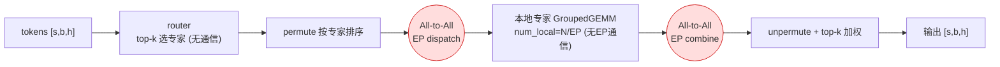

<!--
name: 专家并行
creator: Li Cheng
created: 2026-07-15
modified: 2026-07-20
-->

# 02.8 · 专家并行（Expert Parallel, EP）

> 本篇是 [02 · 并行化子系统](./02-并行化子系统.md) 的**子文档**，与 [02.5](./02.5-张量并行实现详解.md)（TP）、[02.6](./02.6-流水线并行与1F1B调度.md)（PP）、[02.7](./02.7-上下文并行.md)（CP）并列，讲**专家并行 EP**——切 MoE 专家。EP 组同样来自 02.4 的 `parallel_state`。
>
> 相关源码：`megatron/core/transformer/moe/{moe_layer,token_dispatcher,experts,router}.py`、`parallel_state.get_expert_model_parallel_group()`。
>
> **本篇结构**：§1 切什么 → §2 **MoE 数学定义（路由/专家/负载均衡公式）** → §3 计算-通信顺序 → §4 dispatcher 与共享专家 → §5 小结 → §6 五种并行通信特征总表（全子系统收束）。

---

## 1. EP 在切什么

EP 只作用于 **MoE（Mixture-of-Experts）层**。MoE 把一个 FFN 换成 N 个专家 FFN + 一个路由器（router），每个 token 只被路由到 top-k 个专家。**EP 把这 N 个专家分到不同 GPU**：

```
num_moe_experts = 64, EP=8:
  每个 ep_rank 持有 num_local_experts = 64/8 = 8 个专家
  num_global_experts = ep_size · num_local_experts   (experts.py:814)
  本地专家全局编号 = ep_rank · num_local_experts + i   (experts.py:815)
```

**难点**：token 在哪个 GPU、它要去的专家在另一个 GPU。必须把 token **搬运**到持有目标专家的 GPU，算完再搬回来——这就是 EP 标志性的 **All-to-All** 通信。

## 2. MoE 的数学定义（路由 → 专家 → 加权合并）★

在谈通信之前，先把 MoE 层"在算什么"用公式写全。设一个 token 的隐藏向量 $x\in\mathbb{R}^h$，共 $E$ 个专家，每 token 选 top-$k$。源码：`router.py`（打分/选路）、`experts.py`（专家 FFN）、`moe_utils.py`（`topk_routing_with_score_function` / `switch_load_balancing_loss_func` / `z_loss_func`）。

**(1) 路由打分（gating）** —— 路由器权重 $W_r\in\mathbb{R}^{h\times E}$，每个专家出一个 logit：

$$
g = x\,W_r\in\mathbb{R}^{E},\qquad s_i=\phi(g_i)
$$

打分函数 $\phi$（`score_function`）三选一：

$$
\text{softmax: } s_i=\frac{e^{g_i}}{\sum_{j=1}^{E}e^{g_j}}
\quad\big|\quad
\text{sigmoid: } s_i=\sigma(g_i)=\frac{1}{1+e^{-g_i}}
\quad\big|\quad
\text{sqrtsoftplus: } s_i=\sqrt{\operatorname{softplus}(g_i)}
$$

> sigmoid 是 DeepSeek-V3 路线（各专家独立打分、不归一化竞争），softmax 是 Switch/GShard 经典路线。

**(2) Top-$k$ 选择与权重归一** —— 选出专家集合 $\mathcal{T}=\operatorname{TopK}_k(\cdot)$，得到每个被选专家的门控权重 $p_i$：

$$
\text{后 softmax（默认）：}\ \mathcal{T}=\operatorname{TopK}_k(g),\quad p_i=\frac{e^{g_i}}{\sum_{j\in\mathcal{T}}e^{g_j}}\ (i\in\mathcal{T})
$$
$$
\text{前 softmax：}\ \mathcal{T}=\operatorname{TopK}_k(s),\quad p_i=s_i
\qquad
\text{sigmoid 且 }k>1\text{：}\ p_i=\frac{s_i}{\sum_{j\in\mathcal{T}}s_j+\varepsilon}
$$

三个可选修饰（对应 `router.py` 参数）：

- **缩放** `routed_scaling_factor` $\lambda$：$p_i\leftarrow\lambda\,p_i$（DeepSeek 用来把路由权重放大回合适量级）。
- **无损均衡偏置**（DeepSeek-V3，aux-loss-free）：用带偏置的 $s_i+b_i$ **选** top-$k$，但门控**权重仍取无偏 $s_i$**——偏置只挪选择、不进梯度，`expert_bias` 按各专家过载/欠载缓慢增减。
- **分组受限路由** `group_topk`（DeepSeek）：$E$ 个专家分成 $G$ 组，先按组内最高分选出 `group_topk` 组，再在这些组里取 top-$k$，减少跨节点专家的分散度（`group_limited_topk`）。

**(3) 专家 FFN** —— 每个专家是一个独立的 gated-MLP（SwiGLU，$W_{\text{gate}},W_{\text{up}}\in\mathbb{R}^{h\times m}$、$W_2\in\mathbb{R}^{m\times h}$）：

$$
E_i(x)=W_2^{(i)}\Big(\operatorname{SiLU}\!\big(x\,W_{\text{gate}}^{(i)}\big)\;\odot\;\big(x\,W_{\text{up}}^{(i)}\big)\Big)
$$

**(4) 加权合并（MoE 层输出）** —— 只累加被选中的 $k$ 个专家：

$$
\boxed{\;y=\sum_{i\in\mathcal{T}}p_i\,E_i(x)\;\;\big(+\textstyle\sum_{s}E_{\text{shared},s}(x)\ \text{若有共享专家}\big)\;}
$$

**★ EP 如何进入这条公式**：求和 $\sum_{i\in\mathcal{T}}$ 里的专家 $E_i$ 被 EP 切到不同 GPU。token $x$ 所在的 rank 未必持有它选中的专家，于是：

$$
\underbrace{x\xrightarrow{\text{dispatch A2A}}\text{持有 }E_i\text{ 的 ep\_rank}}_{\text{§3 第③步}}
\;\xrightarrow{\text{本地 }E_i(x)}\;
\underbrace{p_iE_i(x)\xrightarrow{\text{combine A2A}}x\text{ 原 rank}}_{\text{§3 第⑦步}}
\;\xrightarrow{\text{本地}}\;y=\textstyle\sum_i p_iE_i(x)
$$

也就是说，**§3 的两次 All-to-All，正是为了让这条跨卡的 $\sum_{i\in\mathcal{T}}$ 能算出来**：门控权重 $p_i$ 的乘加在本地完成，跨卡的只有 token 与专家结果的"搬运"。

**(5) 负载均衡辅助损失** —— 若不加约束，router 会坍缩到少数专家。Switch/GShard 辅助损失（`switch_load_balancing_loss_func`）：

$$
L_{\text{aux}}=\alpha\,E\sum_{i=1}^{E}f_i\,P_i,\qquad
f_i=\frac{1}{T k}\sum_{x\in B}\mathbb{1}[\,i\in\mathcal{T}(x)\,],\qquad
P_i=\frac{1}{T}\sum_{x\in B}p_i(x)
$$

- $f_i$ = 分派给专家 $i$ 的 token 比例（**离散计数、不可导**）；$P_i$ = 专家 $i$ 的平均路由概率（**可导**）；$T$ = batch 内 token 数，$\alpha$ = `moe_aux_loss_coeff`。
- 直觉：当专家 $i$ 既被频繁选中（$f_i$ 大）又被给高概率（$P_i$ 大）时惩罚最大，逼 router 摊平；梯度经**可导的 $P_i$** 回传（$f_i$ 只当权重）。当 $f_i\equiv 1/E$ 时 $L_{\text{aux}}$ 取最小。
- 分布式下每个 rank 只见到全局 batch 的一部分，$f_i$ 用全局 token 计数、$P_i$ 用本地概率，再在 `tp_cp` 组求和还原全局值（`_apply_aux_loss` 里 `reduce_group=tp_cp_group`）。

**(6) z-loss（可选，稳定数值）** —— 抑制 router logits 过大（ST-MoE）：

$$
L_{z}=\gamma\,\frac{1}{T}\sum_{x\in B}\Big(\log\sum_{i=1}^{E}e^{g_i(x)}\Big)^{2}
$$

**(7) 容量（drop-based dispatcher）** —— 每专家最多收：

$$
C=\Big\lceil f_{\text{cap}}\cdot\frac{k\,T}{E}\Big\rceil\quad(\text{超出即丢弃/置零})
$$

Megatron 的 `alltoall` + GroupedGEMM 路径通常是 **dropless**（不丢 token、变长计算），容量因子只在部分 dispatcher/推理场景生效。

> 合起来，一层 MoE 对总损失的贡献是 $L=L_{\text{task}}+L_{\text{aux}}+L_{z}$；前向输出是 (4) 的 $y$。下一节把 (4) 的跨卡求和落成具体的 All-to-All 通信步骤。

## 3. MoE 层的计算-通信顺序

`MoELayer` 的 forward 拆成清晰的几步（`moe_layer.py` 的 `router_and_preprocess` / `dispatch` / `experts` / `combine`），token dispatcher 选 `alltoall` 时（`token_dispatcher.py:354` docstring）：

```
输入 hidden_states: [s, b, h]  （本地 token）

# ① 路由 (router_and_preprocess, moe_layer.py:591)
probs, routing_map = router(hidden_states)        # 每个 token 选 top-k 专家  无跨卡通信

# ② dispatch 预处理：按目标专家把本地 token permute（排序）

# ③ token dispatch —— All-to-All(EP)        ★核心通信
global_input_tokens = all_to_all(ep_group, permuted_tokens)   # token_dispatcher.py:678
#   把每个 token 送到"持有它目标专家"的 ep_rank

# ④ dispatch 后处理：(若 TP) All-Gather；多本地专家时再 sort_chunk

# ⑤ 专家计算
expert_output = experts(global_input_tokens)      # 本地 num_local_experts 上 GroupedGEMM  无跨EP通信

# ⑥ combine 预处理：sort_chunk → (若 TP) Reduce-Scatter

# ⑦ token combine —— All-to-All(EP)         ★核心通信
output = all_to_all(ep_group, expert_output)      # token_dispatcher.py:837
#   把专家结果送回 token 原来所在的 ep_rank

# ⑧ combine 后处理：unpermute 还原顺序，按 top-k 概率加权合并
```



**两次 All-to-All**（dispatch 一次、combine 一次）是 EP 的全部跨卡通信，落在 `ep_group`（`parallel_state.get_expert_model_parallel_group()`，02.4 §1.4 的 `_EXPERT_MODEL_PARALLEL_GROUP`）上。

> **Remark：③ 的 A2A 不是「平均分」，而是「变长精确分」——splits 怎么算出来的（含一次隐藏的 metadata All-Gather）**
>
> 常见误解是「每个 rank 把自己的 token 平均分到各专家卡上」。**不是**：token 去哪张卡完全由 router 的 `routing_map` 决定（§2 top-k 打分），分布**天然不均衡**——这正是 §2(5) 负载均衡辅助损失 $L_{\text{aux}}$ 要软约束的对象。所以 ③ 用的是**变长 All-to-All**（`torch.distributed.all_to_all_single` 带 split sizes），真正要解决的是：分布不均时，**各 rank 收发 buffer 怎么恰好对齐、不错位**。答案在 `MoEAlltoAllTokenDispatcher.preprocess`（`token_dispatcher.py:475`），分三步：
>
> ```
> ① 本地统计：每个专家从我这拿走几个 token                         无通信
>    num_local_tokens_per_expert = routing_map.sum(dim=0)          # [num_experts]   :517
>
> ② 折算成「发给每个 EP rank 多少」= input_splits                   无通信
>    input_splits = num_local_tokens_per_expert                    # 专家按 rank 连续编号(§1)
>                     .reshape(ep_size, num_local_experts).sum(1)  # [ep_size]       :537
>
> ③ 交换全局计数 → 算出「我从每个 rank 收多少」= output_splits      ★一次 All-Gather
>    num_global = gather_from_sequence_parallel_region(            # all_gather_into_tensor
>                    num_local_tokens_per_expert, tp_ep_group)     # :544（底层 mappings.py:142）
>    output_splits = num_global[...本地专家...].sum(...)[tp_rank]  # [ep_size]       :560
> ```
>
> **为什么 ③ 绕不开一次 All-Gather**：变长 `all_to_all_single` 要求发送方**提前知道 `output_splits`**（我要从每个 rank 收多少）才能开好接收 buffer；而每个 rank 只知道自己发多少（`input_splits`），不知道别人发给自己多少。拿到 `output_splits` 必须先把「每 rank×每专家」的计数表广播给所有人——这天然是 all-gather 语义。**这是变长 A2A 的必要「寻址前奏」，不是浪费**。
>
> **但它是 metadata 通信，不是 token 数据**——量级差好几个数量级：
>
> | 通信 | 传的内容 | 数据量量级 |
> |---|---|---|
> | ③ 的 All-Gather（:544） | `[num_experts]` 的 **int64 计数表** | **几十~几百字节**（num_experts=64 → 512 B） |
> | ③⑦ 的 A2A（:678/:837） | token 隐藏向量 `[n, h]` | **MB 级**（n·h·2 B） |
>
> 收发一致的根因：rank A 的 `input_splits[B]` == rank B 的 `output_splits[A]`，因为二者出自**同一张 all-gather 来的全局矩阵**，天然匹配。此外这次 all-gather **一石多鸟**：同一张 `[tp_size, ep_size, num_experts]` 矩阵还顺带算出 expert-TP 的 `output_splits_tp`（:564）与 `num_global_tokens_per_local_expert`（:584），不为单个值单独通信。combine（⑦）则把 `input_splits`/`output_splits` **对调**原路送回（:837）。
>
> **配套**：split sizes 必须是 CPU 确定值，`preprocess` 把这次 GPU→CPU 同步点管理在侧流（`before_ep_alltoall`, :570）以免阻塞主流；`ETP=1`/`EP=1` 时相应分支退化（:571）。dropless 下输出定长（`num_out_tokens = num_tokens·topk`, :530），仅开 `capacity_factor` 才 drop+pad 成 `capacity·num_experts`（:491-499）。更前沿的 `flex`（DeepEP fused kernel，§4）会把这套 metadata 交换 + A2A 融进 kernel、压掉暴露延迟。

> **Remark：步骤 ④/⑥ 里的「(若 TP)」是什么——expert-TP 与一个 4机8卡 例子**
>
> ④/⑥ 的 TP **不是注意力那个 TP，而是「专家张量并行」expert-TP**（`expert_tensor_parallel_size`，代码里的组 `expt_tp`；未显式设置时默认 = `tensor_model_parallel_size`）：
>
> ```
> token_dispatcher.py:75    self.tp_group = pg_collection.expt_tp        # 这里的 tp = expert-TP
> arguments.py:572-573      expert_tensor_parallel_size 缺省 = tensor_model_parallel_size
> ```
>
> 一层 MoE 有**两个正交的切法**：**EP** 把 N 个专家分到不同卡；**expert-TP** 把*每个专家自己的权重*（W_gate/up 列切、W_down 行切）再切到一小撮卡上、多卡合算一个专家的 GEMM。于是：
> - **③⑦ 的 A2A 走 EP 组**（跨专家搬 token）；
> - **④⑥ 的 AG/RS 走 expert-TP 组**（同一专家被切在多卡，要合算）。token 在网络里是**序列并行(SP)** 形态（每卡只有 `S/TP` 段），而张量并行的专家 GEMM 需要**整段 token**，所以进 GEMM 前 All-Gather（`token_dispatcher.py:714`，SP→全 S）、出 GEMM 后 Reduce-Scatter（`:802`，跨 TP 求和 + 切回 SP）——与 dense-MLP 的 `f`/`g`（[02.5 §8](./02.5-张量并行实现详解.md)）是同一套动作。**若 `ETP=1`（专家不切 TP），④⑥ 整段消失，只剩两次 A2A**——这就是写「(若 TP)」的原因。
>
> > **别把这里的 SP 当成 CP**：此处「序列并行(SP)」是挂在 TP/expert-TP 组上的省显存手段，一进 GEMM 就 all-gather 拼回整段；它和「上下文并行 CP」（独立并行维、注意力全程切着、靠 KV 交换）是两回事。SP 与 CP 的实现对比 + 多机例子见 [02.7 §5](./02.7-上下文并行.md)。
>
> **例子**：32 卡 = 4 节点 × 8 卡，配 `TP=ETP=2`、`EP=4`、`num_experts=8`(top-1)、PP=CP=1。让 `ETP×EP=8` 正好塞进**一个节点**（NVLink），4 节点互为专家数据并行副本 `EDP=4`。节点内 8 卡排布（tp 放最内层）：
>
> ```
>              tp0        tp1
>   ep0  │  G0        G1   │  专家 E0,E1（权重被 G0/G1 各切一半）
>   ep1  │  G2        G3   │  专家 E2,E3
>   ep2  │  G4        G5   │  专家 E4,E5
>   ep3  │  G6        G7   │  专家 E6,E7
>
>   expert-TP 组(④AG/⑥RS)：{G0,G1} {G2,G3} {G4,G5} {G6,G7}   ← 机内 NVLink
>   EP 组(③⑦ A2A)        ：{G0,G2,G4,G6}(tp0) {G1,G3,G5,G7}(tp1) ← 机内 NVLink
>   EDP 组(梯度同步)      ：{G0,G8,G16,G24}, …                    ← 跨节点 IB
>
>   盯 ep0 的 expert-TP 对 {G0,G1}（n = 路由到 E0∪E1 的 token 数）：
>     ③ A2A(EP)      → G0 得【E0/E1 · tp0 半段】, G1 得【E0/E1 · tp1 半段】
>     ④ All-Gather   → G0、G1 都补成【E0/E1 · 全 n 段】（喂给被切的专家权重）★
>     ⑤ GroupedGEMM  → G0 算权重分片0、G1 算分片1，各得"部分和"
>     ⑥ Reduce-Scatter → 跨 TP 求和 + 切回 SP：G0 得【结果·上半】, G1 得【结果·下半】★
>     ⑦ A2A(EP)      → 把结果送回 token 原所在卡
> ```
>
> 正好印证 §6 的放置直觉：**TP、EP 都关在机内 NVLink，只有数据并行(EDP)才跨节点**。

> **Remark：EP vs ETP 是「计算瓶颈 ↔ 通信瓶颈」的转换旋钮——用 ETP 还做不做那两次 A2A？**
>
> 把 EP 和 ETP 摆在一起看，它们不是"要不要通信"的开关，而是**为同一个「专家权重与它的 token 不在同一张卡」的需求，选择不同的通信形态**。总 FLOPs 不变，变的是**通信 pattern + 计算粒度 + 负载分布**——这就是"计算/通信瓶颈可相互转化"的确切含义。
>
> **先回答关键问题：用 ETP 还需要 ③⑦ 的 A2A 吗？取决于是否还开着 EP。**
> - **EP + ETP（`ep_size>1`，常规组合）**：**A2A 照做**。dispatch/combine 两次 A2A 在 `ep_group` 上照常跑，ETP 只是在 `expt_tp_group` 上**额外叠加** ④AG/⑥RS。二者在**两个正交的进程组**上共存，互不替代。
> - **纯 ETP（`ep_size=1`，专家权重切满所有卡）**：**不做真 A2A**。此时每张卡都持有**每个**专家的一个权重分片，token 无需"搬去某张专属卡"；代码里 `_AllToAll.forward` 遇到 group-size 1 直接 `return input`（`tensor_parallel/mappings.py`，`world_size==1` 短路），跨卡通信**整个换成 AG/RS**。
>
> **三种形态的转换关系**（切满 G 卡专家算力，`etp_size × ep_size = G`）：
>
> | | 纯 EP（etp=1） | EP + ETP | 纯 ETP（ep=1） |
> |---|---|---|---|
> | 跨卡通信 | **A2A ×2** | **A2A ×2 + AG + RS** | **AG + RS**（A2A 退化为恒等） |
> | 通信形态 | 搬 token | 搬 token + 搬激活 | 搬激活 |
> | GEMM 粒度 | 完整专家，大而肥 ✅ | 专家再切碎 | 专家切碎，小而碎 ❌ |
> | 负载均衡 | 受 hot expert 影响 ❌ | 居中 | 按构造均衡 ✅ |
> | 并行度上限 | **≤ 专家数 N** ❌ | 可超过 N ✅ | 可超过 N ✅ |
> | 单个超宽专家 | 放不下 ❌ | 能切开 ✅ | 能切开 ✅ |
>
> **本质是把一种瓶颈换成另一种**：EP 把跨卡成本压在 **A2A 带宽 + 负载不均**（热门专家所在卡忙、别卡闲，等于计算被 straggler 拖成气泡）；ETP 把它换成 **AG/RS 带宽 + 更小的 GEMM（MFU 更低）+ 一次求和归约**，但换来**负载天然均衡**、并**突破专家数 N 的并行上限**。谁更划算取决于当前是被 A2A/负载卡住，还是被 GEMM 效率卡住。
>
> **选型顺序（实践直觉）**：**优先把 EP 吃满**——通信 collective 更少、GEMM 更肥；仅当 EP 撞墙时把富余并行度转成 ETP。EP 的三堵墙：① 并行度被**专家数 N 卡死**（`ep_size ≤ N`，卡多专家少时只能靠 ETP 补，这才是"多专家"场景 ETP 的**反直觉主因**）；② `ep_size` 变大后 **A2A 扩展性差 + 负载不均**恶化；③ **单个专家太宽/太大**放不下。Megatron 默认 `expert_tensor_parallel_size = tensor_model_parallel_size`（`arguments.py:572-573`），即顺着注意力侧 TP 复用一份 ETP，而非无脑给大 ETP。
>
> > 一句话：**EP 省通信但受限于专家数与负载均衡；ETP 加一组 AG/RS 通信来买"超过 N 的并行度 + 均衡 + 切开大专家"。** 是否保留 A2A，只看 `ep_size` 是否 >1。

## 4. 三种 token dispatcher 与共享专家

| dispatcher（`moe_token_dispatcher_type`） | 机制 | 代码 |
|---|---|---|
| **`alltoall`** | 上面的标准 A2A 路由，主流选择 | `MoEAlltoAllTokenDispatcher` (`:354`) |
| **`allgather`** | 先 All-Gather 全部 token 再本地选取 | `MoEAllGatherTokenDispatcher` (`:212`) |
| **`flex`** | 灵活后端（如 DeepEP fused kernel） | `MoEFlexTokenDispatcher` (`:1395`) |

- **共享专家（shared experts）**：部分 MoE 配置有恒定参与的共享 FFN，它**不经路由、无 A2A**，可与路由专家的 A2A **并行重叠**（`shared_expert_overlap`）。
- EP 常与专家侧的 TP（`expert_tensor_parallel_size`，即 expert-TP，其 ④AG/⑥RS 机制见 §3 Remark）、专家侧 DP 组合——这也是 02.4 里要单独建 `expert_decoder_rank_generator` 和一整套 `_EXPERT_*` 组的原因。

## 5. EP 小结

- EP 只切 **MoE 专家**：每 rank 持 `num_local_experts = N / ep_size` 个专家。
- **MoE 数学**（§2）：输出 $y=\sum_{i\in\mathcal{T}}p_i E_i(x)$；路由 softmax/sigmoid 打分 + top-$k$；负载均衡靠 $L_{\text{aux}}=\alpha E\sum_i f_iP_i$。EP 的两次 A2A 就是为算这条跨卡求和服务。
- 标志通信是 **两次 All-to-All**：dispatch 把 token 送到目标专家所在 GPU，combine 送回结果。
- 专家本地计算用 **GroupedGEMM**，无跨 EP 通信；共享专家可与 A2A 重叠。
- 三种 dispatcher：`alltoall`(主流) / `allgather` / `flex`。

---

## 6. 五种并行通信特征总表（全子系统收束）

至此 TP / PP / DP / CP / EP 五种并行全部讲完（分散在 [02.5](./02.5-张量并行实现详解.md)～本篇）。下表把它们的通信特征收束在一起，作为整个并行化子系统的落脚点：

| 并行 | 切什么 | 通信发生处 | 主要原语 | ETP 叠加通信形态 | 放置链路建议（按通信轻重） |
|------|--------|-----------|----------|----------|----------|
| **TP**（02.5） | 层内矩阵 | 每层 fwd/bwd 边界 | All-Reduce | —（非 MoE） | **机内 NVLink**（每层多次大通信，最重，≤8 不跨节点） |
| **EP**（本篇 02.8） | MoE 专家 | token dispatch/combine | All-to-All ×2 | **AG + RS**（`expt_tp` 组：ETP>1 时在 A2A 之外叠加 ④AG/⑥RS；**纯 ETP（ep=1）则 A2A 退化为恒等、只剩 AG/RS**，见 §3 Remark） | **机内 NVLink**（每 MoE 层两次，带宽敏感） |
| **CP**（02.7） | 序列长度 | 注意力 KV 交换 | P2P(ring)/All-Gather/A2A | — | 视方式而定（Ring 可跨节点，Ulysses 受头数约束） |
| **PP**（02.6） | 层深度 | 相邻 stage 间 | P2P（isend/irecv） | — | **可跨节点**（只传一个边界激活，最轻） |
| **DP**（→04） | 数据/batch | 每步梯度同步 | All-Reduce / Reduce-Scatter | — | **最外层**（每步一次、可与反向重叠，用来扩节点） |

> **放置直觉（关键！）**：通信越重 → 越要放在越快的链路上。**TP/EP** 每层大量通信，只能关在**机内 NVLink（~900GB/s）**；**PP** 只传一个边界激活、最轻，适合走**跨节点 IB**；**DP** 每步才同步一次且能藏进反向，放在**最外层**扩机器。全局 GPU 数 = **DP × TP × PP × CP × EP**。
>
> **四特征对比框架**：横向比较任一并行时，盯这四点即可——**① 通信**（什么原语、多频繁、多大量）、**② 计算**（是否切分、有无额外算力）、**③ 重叠**（通信能否藏进计算）、**④ 受制于**（带宽/头数/负载均衡等瓶颈）。各并行的这四点已散落在前面各篇的"特征面板"里。
>
> 所有通信组都由 [02.4](./02.4-并行组构建与通信详解.md) 的 `parallel_state` 统一计算、建立、提供查询——这就是整个并行化子系统的闭环。更前沿的 Muon 分布式化、长序列工具箱、FSDP vs TP+PP 选型，见 [02.9 · 进阶专题](./02.9-进阶专题.md)。

返回上级：[02 · 并行化子系统](./02-并行化子系统.md) ｜ 上一篇：[02.7 · 上下文并行](./02.7-上下文并行.md) ｜ 下一篇：[02.9 · 进阶专题](./02.9-进阶专题.md)
