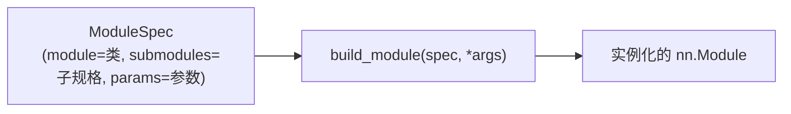
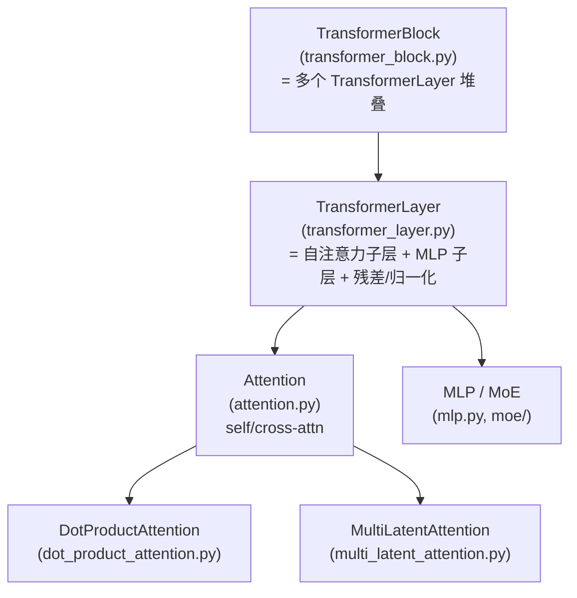
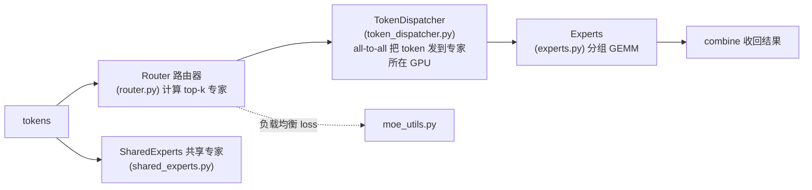
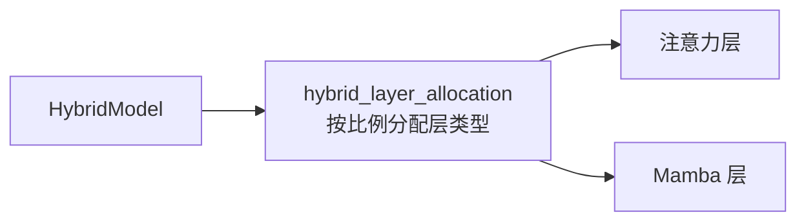
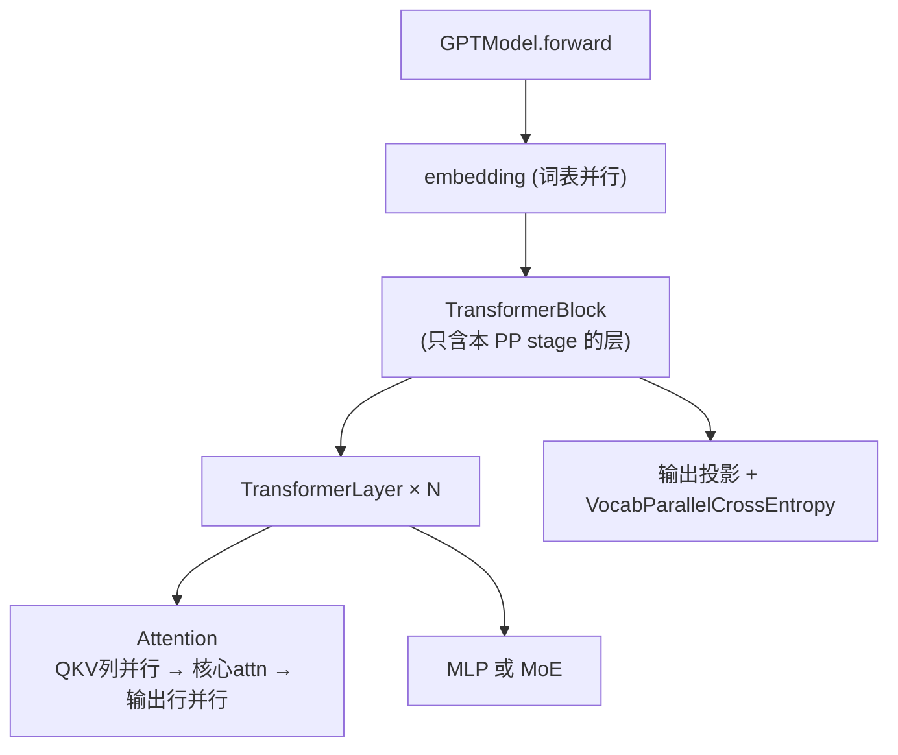

# 03 · Transformer 与模型子系统

本篇拆解 Megatron 如何用「Spec 规格 + 可组合构件」搭建各类模型：从 `TransformerConfig` 配置，到 `TransformerBlock`/`TransformerLayer` 构件，再到 GPT/Mamba/Hybrid/MoE/多模态等具体模型。

相关路径：
- `megatron/core/transformer/`（构件层 L3）
- `megatron/core/models/`（模型层 L2）

---

## 1. 核心设计：Spec 机制

Megatron 不把模型结构写死，而是用 **`ModuleSpec`（规格）** 描述「某个位置该放哪个模块、用什么参数」，再由 `build_module()` 动态实例化。这是整个模型层最重要的设计模式。

```12:13:megatron/core/transformer/spec_utils.py
@dataclass
class ModuleSpec:
```



### 带来的好处

- **可插拔后端**：同一个注意力位置，既可填本地实现，也可填 Transformer Engine 的融合实现（FP8 加速），只换 spec 不改模型代码。
- **结构变体统一**：Dense / MoE / MLA（多头潜在注意力）/ Mamba 层只是不同的 layer spec 组合。
- **配方化**：`gpt_layer_specs.py`、`mamba_layer_specs.py`、`moe_module_specs.py` 等文件就是「预制 spec 工厂」。

例如 GPT 提供 `get_gpt_layer_with_transformer_engine_spec()` 与本地版本，按是否安装 TE 选择。

---

## 2. Transformer 构件层（transformer/）

自底向上的构件层级：



### 关键文件

| 文件 | 职责 |
|------|------|
| `transformer_config.py` | `TransformerConfig`（继承 `ModelParallelConfig`），统一结构超参 |
| `transformer_block.py` | `TransformerBlock`：层堆叠 + 最终归一化，处理 PP 切层 |
| `transformer_layer.py` | `TransformerLayer`：标准「注意力 + MLP」双子层结构 |
| `attention.py` | 自/交叉注意力，QKV 投影（列并行）、输出投影（行并行） |
| `dot_product_attention.py` | 核心注意力计算（可走 flash/fused 后端） |
| `multi_latent_attention.py` | MLA（DeepSeek 系列的低秩 KV 压缩注意力） |
| `mlp.py` | 前馈网络（列并行升维 + 行并行降维） |
| `multi_token_prediction.py` | MTP 多 token 预测（DeepSeek-V3 特性） |
| `module.py` | `MegatronModule` 基类（提供 sharded_state_dict 等） |
| `cuda_graphs.py` | CUDA Graph 捕获以降低 kernel launch 开销 |
| `moe/` | 混合专家子系统（见下） |

`TransformerConfig` 是模型构建的统一配置入口：

```53:53:megatron/core/transformer/transformer_config.py
class TransformerConfig(ModelParallelConfig):
```

---

## 3. MoE 混合专家子系统（transformer/moe/）

MoE 把单个 MLP 替换为「路由器 + 多个专家」，每个 token 只激活少数专家，从而在不显著增加计算的前提下放大参数量。



| 文件 | 职责 |
|------|------|
| `router.py` | 路由：top-k 专家选择、负载均衡 |
| `token_dispatcher.py` | token 在 EP 组间的 all-to-all 分发与收回 |
| `fused_a2a.py` | 融合 all-to-all 通信优化 |
| `experts.py` | 专家网络（分组 GEMM 实现） |
| `shared_experts.py` | 共享专家（所有 token 都过） |
| `moe_utils.py` | 辅助损失、容量因子、辅助工具 |
| `token_dispatcher_inference.py` | 推理期专用 dispatcher |
| `upcycling_utils.py` | 从 dense 模型「升级」为 MoE |

EP 进程组由 `parallel_state` 提供，见 [02 并行化子系统](./02-并行化子系统.md)。

---

## 4. 模型层（models/）

各模型本质上是「一组 layer spec + 嵌入 + 输出头」的组装。

### 4.1 GPT（models/gpt/）

最核心、被复用最多的模型。`GPTModel` 继承 `LanguageModule`，依赖几乎覆盖全栈：

```9:39:megatron/core/models/gpt/gpt_model.py
from megatron.core import tensor_parallel
...
from megatron.core.models.common.embeddings.language_model_embedding import LanguageModelEmbedding
from megatron.core.models.common.embeddings.rotary_pos_embedding import (
    MultimodalRotaryEmbedding,
    RotaryEmbedding,
)
from megatron.core.models.common.language_module.language_module import LanguageModule
...
from megatron.core.transformer.transformer_block import TransformerBlock
from megatron.core.transformer.transformer_config import TransformerConfig
```

| 文件 | 职责 |
|------|------|
| `gpt_model.py` | `GPTModel`：嵌入 → TransformerBlock → 输出投影 |
| `gpt_layer_specs.py` | 预制 layer spec（TE 版 / 本地版 / MoE 版 / MLA 版） |
| `moe_module_specs.py` | MoE 层规格 |
| `fine_grained_callables.py` | 细粒度调度节点（前/后处理、层节点），支持计算-通信重叠 |
| `heterogeneous/` | 异构层（不同层不同结构） |

### 4.2 公共构件（models/common/）

被所有语言模型复用：

- `embeddings/`：`LanguageModelEmbedding`（词嵌入 + 位置嵌入）、`RotaryEmbedding`（RoPE）、`YarnRotaryEmbedding`（YaRN 长上下文扩展）、`MultimodalRotaryEmbedding`。
- `language_module/language_module.py`：`LanguageModule` 基类，提供 logits 计算、词嵌入权重共享（PP 首尾 tying）、loss 计算。
- `model_chunk_schedule_plan.py`：模型分块的调度计划（配合 VP/细粒度调度）。

### 4.3 Mamba 与 Hybrid（models/mamba、models/hybrid）

- **Mamba**：状态空间模型（SSM），用 `ssm/` 下的算子，`mamba_layer_specs.py` 定义 Mamba 层规格。
- **Hybrid**：Transformer + Mamba 混合架构（如 Falcon-H1）。`hybrid_layer_allocation.py` 决定哪些层用注意力、哪些用 Mamba；`hybrid_block.py` 组装混合块。



### 4.4 其他模型

| 目录 | 模型 |
|------|------|
| `models/T5/` | T5 编码器-解码器 |
| `models/bert/` | BERT 双向编码器 |
| `models/multimodal/` | 视觉-语言多模态（VLM） |
| `models/vision/` | 视觉骨干 |
| `models/mimo/` | 多输入多输出 |
| `models/huggingface/` | HuggingFace 模型桥接 |

---

## 5. 模型如何被「点亮」并行能力

模型代码本身**不直接写并行逻辑**，而是通过：

1. 用 `ColumnParallelLinear`/`RowParallelLinear` 替代普通 `nn.Linear`（TP 自动生效）。
2. `TransformerBlock` 按 `parallel_state` 的 PP rank 只构建本 stage 的层（PP 自动生效）。
3. 注意力内部按 CP 组通信（CP 自动生效）。
4. MoE 层通过 token dispatcher 走 EP 组（EP 自动生效）。



---

## 6. 依赖关系小结

- 模型层（L2）**组合** Transformer 构件（L3），构件层**调用** 并行原语（L4）。
- Spec 机制是解耦「结构定义」与「具体实现/后端」的关键。
- 所有模型共享 `models/common/` 的嵌入与 `LanguageModule` 基类。
- 并行能力对模型代码「透明」——靠并行版算子与 `parallel_state` 自动生效。

下一篇：[分布式训练与优化器](./04-分布式训练与优化器.md)。
