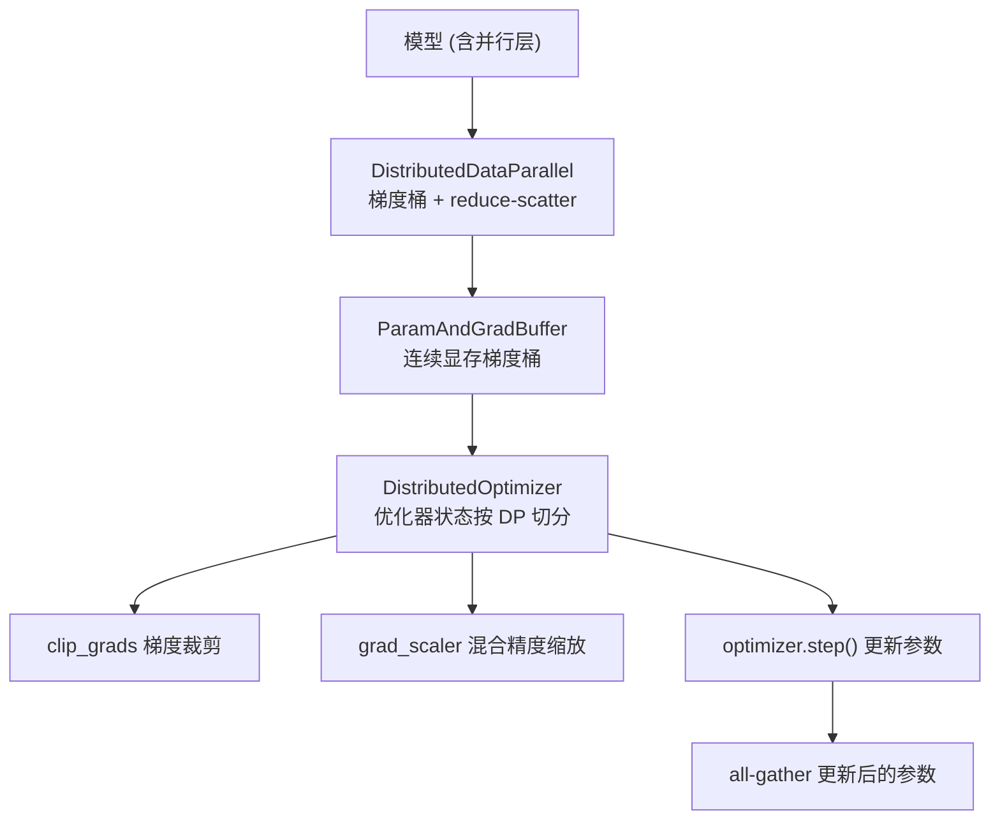
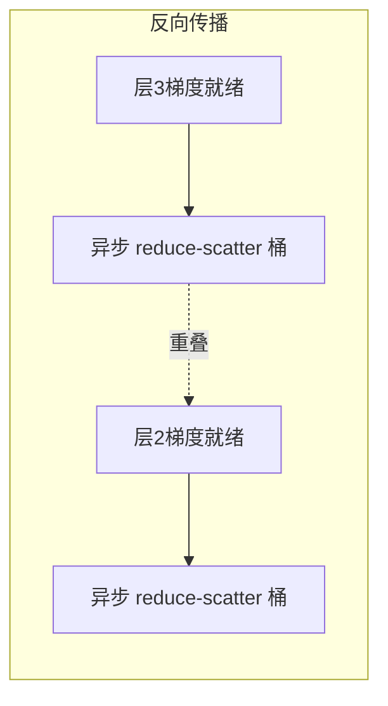
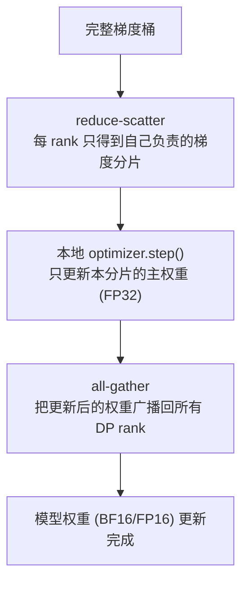
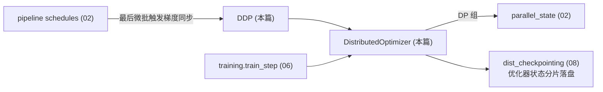

# 04 · 分布式训练与优化器

本篇拆解数据并行的两条路线（自研 DDP 与 FSDP）、梯度桶机制、分布式优化器（ZeRO 式优化器状态切分），以及梯度裁剪/缩放等数值稳定性组件。

相关路径：
- `megatron/core/distributed/`
- `megatron/core/optimizer/`

---

## 1. 总体定位

模型层算出梯度后，分布式训练层负责：**在 DP 组内同步梯度**、**切分优化器状态省显存**、**更新参数**。这是数据并行（DP）维度的落地实现，与 TP/PP 正交协作。

---

## 2. 数据并行两条路线（distributed/）

| 文件 | 职责 |
|------|------|
| `distributed_data_parallel.py` | ★ Megatron 自研 `DistributedDataParallel`（非 PyTorch 原生 DDP） |
| `distributed_data_parallel_config.py` | `DistributedDataParallelConfig`：重叠开关、桶大小、梯度精度等 |
| `param_and_grad_buffer.py` | ★ `ParamAndGradBuffer`：把参数/梯度打包进连续显存桶 |
| `data_parallel_base.py` | DP 基类 |
| `finalize_model_grads.py` | 迭代末梯度收尾：跨 PP/嵌入组的梯度处理、规约 |
| `torch_fully_sharded_data_parallel.py` | 基于 PyTorch FSDP2 的封装（FSDP 路线） |
| `reduce_scatter_with_fp32_accumulation.py` | FP32 累加的 reduce-scatter，保精度 |

### 2.1 自研 DDP + 梯度桶

为什么不用原生 DDP？因为 Megatron 需要与 TP/PP/分布式优化器深度协同、精细控制通信重叠。核心机制：

- **梯度桶（bucket）**：把众多参数的梯度拼进少数几块连续显存（`ParamAndGradBuffer`），减少 NCCL 调用次数。
- **通信-计算重叠**：反向计算某层梯度的同时，异步规约已就绪的桶（`--overlap-grad-reduce`）。
- **参数 all-gather 重叠**：与分布式优化器配合，更新后参数的 all-gather 与下一步前向重叠（`--overlap-param-gather`）。

### 2.2 FSDP 路线

`torch_fully_sharded_data_parallel.py` 提供基于 PyTorch FSDP2 的替代方案；仓库还含一个自研 Megatron-FSDP（`megatron/core/distributed/fsdp/` 子包，带独立 `pyproject.toml`）。FSDP 把参数、梯度、优化器状态三者都沿 DP 切分，适合超大模型的纯数据并行场景。`examples/megatron_fsdp/` 有用例。

> FSDP(ZeRO-3) 的原理（显存 `16P→16P/N`、通信 ≈1.5× DP、flat buffer + 预取重叠）与两套实现开关的完整讲解，见铺垫专题 [02.3.1 · FSDP](./02.3.1-FSDP.md)。

---

## 3. 优化器子系统（optimizer/）

| 文件 | 职责 |
|------|------|
| `optimizer.py` | 优化器基类与混合精度优化器封装 |
| `distrib_optimizer.py` | ★ `DistributedOptimizer`：ZeRO-1 式优化器状态切分 |
| `optimizer_config.py` | `OptimizerConfig`：lr、weight decay、精度等 |
| `clip_grads.py` | 全局梯度范数裁剪（跨所有并行组规约范数） |
| `grad_scaler.py` | 混合精度（FP16）动态损失缩放 |
| `layer_wise_optimizer.py` | 逐层优化器（与梯度桶路由配合） |
| `muon.py` / `emerging_optimizers.py` | Muon 等新兴优化器接入 |
| `qk_clip.py` | QK 裁剪（注意力稳定性） |
| `cpu_offloading/` | 优化器状态/计算卸载到 CPU |
| `optimizer_cuda_graph.py` | 优化器步骤的 CUDA Graph 加速 |

### 3.1 DistributedOptimizer（关键）

把优化器状态（如 Adam 的 m、v）沿 **DP 维度切分**，每个 DP rank 只持有 `1/DP` 的优化器状态与主权重，显著省显存（ZeRO-1 思想）。

- 主权重以 FP32 保存（数值稳定），模型计算用 BF16/FP16。
- 与梯度桶天然契合：reduce-scatter 的输出分片正好是本 rank 要更新的部分。
- 与 `--overlap-param-gather` 配合，AG 与下个前向重叠。

### 3.2 梯度收尾与裁剪

- `finalize_model_grads.py`：处理 PP 各 stage、嵌入权重共享组的梯度同步，确保 tied 权重梯度一致。
- `clip_grads.py`：先跨 TP/PP/DP 规约出全局梯度范数，再统一缩放，保证裁剪在并行下语义正确。

---

## 4. 混合精度

Megatron 支持 FP16 / BF16 / FP8 / FP4（见 `core/fp8_utils.py`、`fp4_utils.py`）：

- **FP16**：需 `grad_scaler.py` 动态损失缩放防下溢。
- **BF16**：动态范围大，通常无需损失缩放。
- **FP8**：依赖 Transformer Engine，在 GEMM 处用 FP8 加速（Hopper/Blackwell）。
- 主权重恒为 FP32（在分布式优化器内维护）。

---

## 5. 与其他子系统的协作

- PP 调度只在每个 global batch 的最后一个微批做梯度规约（其余微批关闭 grad sync）。
- 优化器状态分片直接映射到分布式检查点的分片格式（见 [08](./08-检查点与重切分.md)）。
- 训练主循环 `train_step()` 编排「前向反向 → 优化器步进 → LR 调度」。

下一篇：[数据集与分词器](./05-数据集与分词器.md)。
