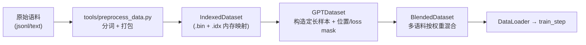
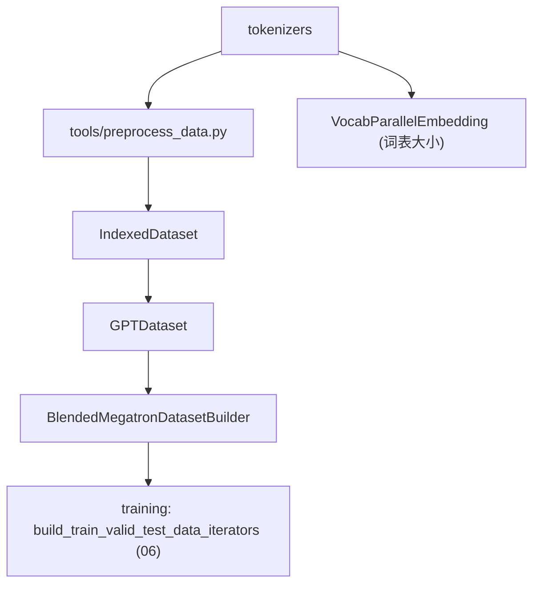

# 05 · 数据集与分词器

本篇拆解 Megatron 的数据管线：高效的二进制索引数据集格式、多语料混合、按模型类型构造样本，以及分词器体系与数据预处理工具。

相关路径：
- `megatron/core/datasets/`
- `megatron/core/tokenizers/`
- `tools/preprocess_data.py`（预处理入口）

---

## 1. 数据管线总览

大规模训练对数据吞吐极敏感，Megatron 采用「**预处理为二进制索引格式 → 内存映射零拷贝读取 → 按需混合采样**」的方案。



---

## 2. 核心文件（datasets/）

| 文件 | 职责 |
|------|------|
| `indexed_dataset.py` | ★ 底层二进制格式：`.bin`（token 数据）+ `.idx`（文档/序列偏移索引），内存映射读取 |
| `megatron_dataset.py` | `MegatronDataset` 抽象基类 |
| `gpt_dataset.py` | ★ `GPTDataset` / `MockGPTDataset` / `GPTDatasetConfig`：自回归 LM 样本 |
| `bert_dataset.py` | BERT 的 MLM/NSP 样本 |
| `t5_dataset.py` | T5 的 span corruption 样本 |
| `masked_dataset.py` | 掩码语言建模通用逻辑 |
| `multimodal_dataset.py` | 图文多模态样本 |
| `blended_dataset.py` | `BlendedDataset`：多数据集按权重混合采样 |
| `blended_megatron_dataset_builder.py` | ★ `BlendedMegatronDatasetBuilder`：统一构建入口 |
| `blended_megatron_dataset_config.py` | 混合与切分配置（train/valid/test 比例） |
| `data_schedule.py` | 数据课程/调度（如按训练进度变更采样） |
| `helpers.py` | C++/Cython 加速的索引构建辅助 |
| `indexed_dataset.py` | 索引格式核心 |
| `object_storage_utils.py` / `utils_s3.py` | 从 S3/对象存储读取 |

### 2.1 IndexedDataset：高效二进制格式

- `.bin` 存连续 token 流，`.idx` 存每个文档的起止偏移与长度。
- 通过 `np.memmap` 内存映射，多进程零拷贝共享，避免把 TB 级语料读进内存。
- 是整个数据栈的物理基石。

### 2.2 GPTDataset：样本构造

`GPTDataset` 把 token 流切成定长 `seq_length+1` 的窗口，生成：
- `tokens`（输入）与 `labels`（右移一位的目标）；
- `position_ids`、`loss_mask`、`attention_mask`。

在 `pretrain_gpt.py` 中由 `BlendedMegatronDatasetBuilder` 配合 `GPTDatasetConfig` 构建：

```28:30:pretrain_gpt.py
from megatron.core.datasets.blended_megatron_dataset_builder import BlendedMegatronDatasetBuilder
from megatron.core.datasets.gpt_dataset import GPTDataset, GPTDatasetConfig, MockGPTDataset
```

### 2.3 BlendedDataset：多语料混合

`--data-path` 可指定多个语料及权重（如 `0.7 corpusA 0.3 corpusB`），`BlendedDataset` 按权重在线采样，保证混合比例与可复现的样本顺序。`--split 949,50,1` 控制 train/valid/test 切分。

---

## 3. 训练侧数据扩展（megatron/training/datasets/）

训练层在 Core 数据集之上提供任务特化数据集：

- `fim_dataset.py`：FIM（Fill-In-the-Middle）代码补全数据。
- `sft_dataset.py`：监督微调（SFT）对话/指令数据。

`pretrain_gpt.py` 同时导入二者，按是否 SFT 选择：

```59:61:pretrain_gpt.py
from megatron.training.datasets.fim_dataset import GPTFIMDataset, GPTFIMDatasetConfig
from megatron.training.datasets.sft_dataset import SFTDataset
```

---

## 4. 分词器体系（tokenizers/）

`megatron/core/tokenizers/` 提供统一分词器抽象：

- `text/`：文本分词器（SentencePiece、tiktoken、HuggingFace、GPT2 BPE 等多后端）。
- `vision/`：视觉 tokenizer（多模态）。
- `utils/build_tokenizer.py`：统一构建入口，被入口脚本调用。

```37:37:pretrain_gpt.py
from megatron.core.tokenizers.utils.build_tokenizer import build_tokenizer
```

分词器决定词表大小（影响 `VocabParallelEmbedding` 与词表并行交叉熵的切分）。

---

## 5. 数据预处理工具（tools/）

把原始语料转成 IndexedDataset 的入口：

| 工具 | 用途 |
|------|------|
| `tools/preprocess_data.py` | 文本 → 分词 → `.bin/.idx` |
| `tools/preprocess_data_nmt.py` | 机器翻译双语预处理 |
| `tools/preprocess_mmdata.py` | 多模态数据预处理 |
| `tools/merge_datasets.py` | 合并多个预处理分片 |

典型流程：

```bash
python tools/preprocess_data.py \
  --input corpus.jsonl --output-prefix my_corpus \
  --tokenizer-type GPT2BPETokenizer --vocab-file gpt2-vocab.json \
  --merge-file gpt2-merges.txt --workers 32
# 产出 my_corpus_text_document.bin / .idx
```

---

## 6. 依赖关系小结



- 数据栈相对独立，向训练层提供 `DataLoader`/iterator。
- 分词器既被预处理工具用，也决定模型词表并行的切分。
- 内存映射 + 混合采样是支撑大规模吞吐的关键设计。

下一篇：[训练框架 Harness](./06-训练框架Harness.md)。
