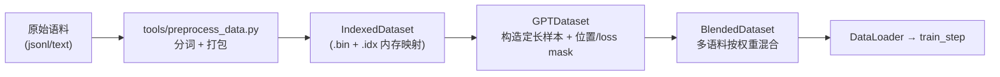
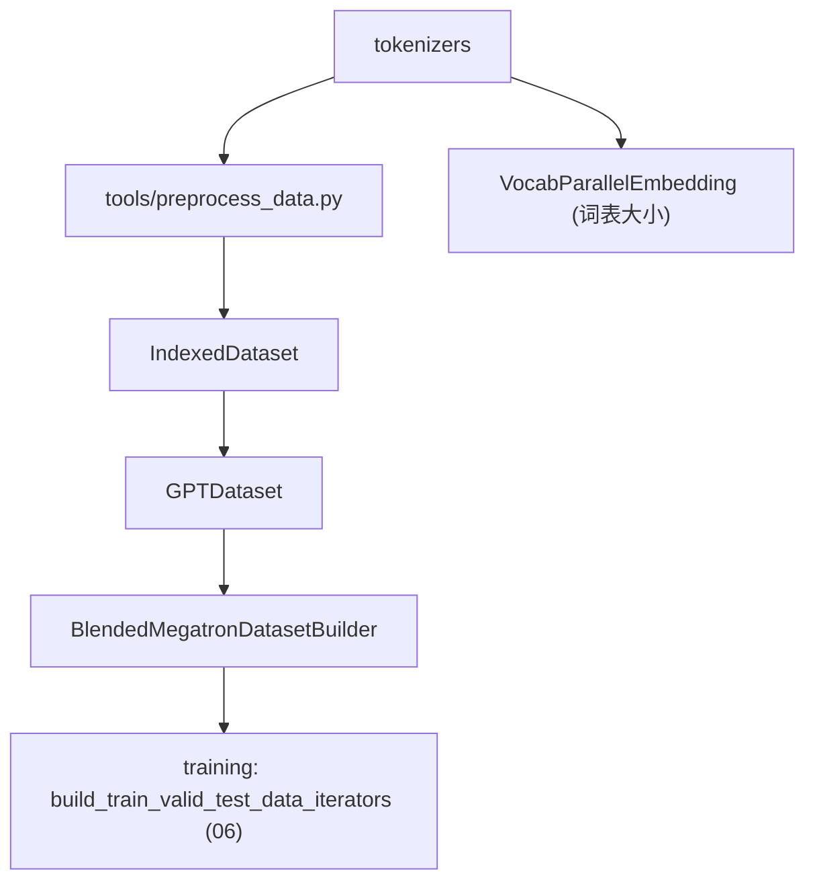

# 05 · 数据集与分词器

本篇拆解 Megatron 的数据管线：高效的二进制索引数据集格式、多语料混合、按模型类型构造样本，以及分词器体系与数据预处理工具。

相关路径：
- `megatron/core/datasets/`
- `megatron/core/tokenizers/`
- `tools/preprocess_data.py`（预处理入口）

---

## 1. 数据管线总览

大规模训练对数据吞吐极敏感，Megatron 采用「**预处理为二进制索引格式 → 内存映射零拷贝读取 → 按需混合采样**」的方案。



---

## 2. 核心文件（datasets/）

| 文件 | 职责 |
|------|------|
| `indexed_dataset.py` | ★ 底层二进制格式：`.bin`（token 数据）+ `.idx`（文档/序列偏移索引），内存映射读取 |
| `megatron_dataset.py` | `MegatronDataset` 抽象基类 |
| `gpt_dataset.py` | ★ `GPTDataset` / `MockGPTDataset` / `GPTDatasetConfig`：自回归 LM 样本 |
| `bert_dataset.py` | BERT 的 MLM/NSP 样本 |
| `t5_dataset.py` | T5 的 span corruption 样本 |
| `masked_dataset.py` | 掩码语言建模通用逻辑 |
| `multimodal_dataset.py` | 图文多模态样本 |
| `blended_dataset.py` | `BlendedDataset`：多数据集按权重混合采样 |
| `blended_megatron_dataset_builder.py` | ★ `BlendedMegatronDatasetBuilder`：统一构建入口 |
| `blended_megatron_dataset_config.py` | 混合与切分配置（train/valid/test 比例） |
| `data_schedule.py` | 数据课程/调度（如按训练进度变更采样） |
| `helpers.py` | C++/Cython 加速的索引构建辅助 |
| `indexed_dataset.py` | 索引格式核心 |
| `object_storage_utils.py` / `utils_s3.py` | 从 S3/对象存储读取 |

### 2.1 IndexedDataset：高效二进制格式

- `.bin` 存连续 token 流，`.idx` 存每个文档的起止偏移与长度。
- 通过 `np.memmap` 内存映射，多进程零拷贝共享，避免把 TB 级语料读进内存。
- 是整个数据栈的物理基石。

### 2.2 GPTDataset：样本构造

`GPTDataset` 把 token 流切成定长 `seq_length+1` 的窗口，生成：
- `tokens`（输入）与 `labels`（右移一位的目标）；
- `position_ids`、`loss_mask`、`attention_mask`。

在 `pretrain_gpt.py` 中由 `BlendedMegatronDatasetBuilder` 配合 `GPTDatasetConfig` 构建：

```28:30:pretrain_gpt.py
from megatron.core.datasets.blended_megatron_dataset_builder import BlendedMegatronDatasetBuilder
from megatron.core.datasets.gpt_dataset import GPTDataset, GPTDatasetConfig, MockGPTDataset
```

#### 2.2.1 一个样本到底长什么样（具体例子）★

先纠正一个常见误解：**一条样本不是「一篇文档」**。预处理把**所有文档首尾相接拼成一条超长 token 流**（文档之间用 `<eod>` 分隔），`GPTDataset` 再在这条流上**按固定长度 `seq_length+1` 切窗口**（`__getitem__` → `_query_document_sample_shuffle_indices`，`gpt_dataset.py:225`）。所以一条样本可能**横跨多篇文档、也可能是某篇文档的中段**，不做「一文一样本」的对齐，也基本不 padding——这是大规模训练吞吐的关键。

取到 `seq_length+1` 个 token 后（默认 `add_extra_token_to_sequence=True`），错位一格切出输入和目标（`gpt_dataset.py:242-243`）：

```
tokens = text[:-1]   # 输入
labels = text[1:]    # 目标 = 每个位置的“下一个 token”（teacher forcing）
```

**玩具例子**：设 `seq_length=8`，`<eod>` 的 id = 0。语料里两篇文档拼进了同一条流：
- 文档 A = `机器(10) 学习(11) 很(12) 有趣(13)`
- 文档 B = `深度(20) 学习(11) 改变(21) 世界(22) 从此(23)`

拼接后的流：`[10, 11, 12, 13, 0, 20, 11, 21, 22, 23, 0, …]`。`__getitem__(0)` 取前 `9` 个（`seq_length+1`）：

```
text   = [10, 11, 12, 13,  0, 20, 11, 21, 22]      # 9 个，跨过了 A/B 边界(中间那个 0=<eod>)
tokens = [10, 11, 12, 13,  0, 20, 11, 21]          # text[:-1]，长度 8
labels = [11, 12, 13,  0, 20, 11, 21, 22]          # text[1:] ，长度 8（tokens 左移一格）
```

逐位读：位置 0 输入 `机器(10)` 要预测 `学习(11)`；位置 3 输入 `有趣(13)` 要预测 `<eod>(0)`；位置 4 输入 `<eod>(0)` 要预测文档 B 的 `深度(20)`……模型永远在「用前面所有 token 预测下一个」。

`__getitem__` 最终返回一个 **dict**（`gpt_dataset.py:283`），字段、dtype、形状如下（`S=seq_length`）：

| 字段 | dtype | 形状 | 内容 |
|------|-------|------|------|
| `tokens` | long | `[S]` | 输入 token id |
| `labels` | long | `[S]` | 目标 = 下一个 token |
| `loss_mask` | float | `[S]` | 每个位置**是否计入损失**（1 计 / 0 不计） |
| `position_ids` | long | `[S]` | 位置编号 |
| `attention_mask` | bool | `[1, S, S]` | 因果掩码；`True=禁止注意`。可为 `None`（见下） |

#### 2.2.2 掩码与位置：两种模式

掩码由 `_get_ltor_masks_and_position_ids`（`gpt_dataset.py:706`）生成，行为取决于是否开启 `reset_position_ids` / `reset_attention_mask`（即「是否把同窗口内的不同文档隔离开」）。

**模式 A · 默认（不 reset，文档在窗口内自然相连）**：

```
position_ids   = [0, 1, 2, 3, 4, 5, 6, 7]          # 简单的 arange(S)
attention_mask = 下三角因果掩码 [1, 8, 8]           # 每个位置只能看它自己及左边
loss_mask      = [1, 1, 1, 1, 0, 1, 1, 1]          # eod_mask_loss=True → <eod> 那位(=位置4)置 0
```

`attention_mask` 就是标准因果矩阵（`torch.tril` 后转 bool，`True` 表示被挡住），示意（`·`=可见，`✕`=禁止）：

```
          能看的列 j →
        0  1  2  3  4  5  6  7
   0 [  ·  ✕  ✕  ✕  ✕  ✕  ✕  ✕ ]
   1 [  ·  ·  ✕  ✕  ✕  ✕  ✕  ✕ ]
行 2 [  ·  ·  ·  ✕  ✕  ✕  ✕  ✕ ]      每行 i 只能注意到 j≤i（下三角）
i  … [  … 依此类推 …            ]
   7 [  ·  ·  ·  ·  ·  ·  ·  · ]
```

> 注意默认模式下文档 B 的 token（位置 5–7）**能看到**文档 A（位置 0–3）——跨文档「泄漏」被容忍，靠海量数据摊薄影响。

**模式 B · reset（打包但文档间互相隔离，`--reset-position-ids --reset-attention-mask`）**：以 `<eod>` 为界，位置编号在每篇文档重新从 0 数，注意力也禁止跨文档：

```
position_ids   = [0, 1, 2, 3, 4, 0, 1, 2]          # 遇到位置4的<eod>后，文档B重新从0数
attention_mask = 块对角因果 [1, 8, 8]               # 位置5–7 不能再看位置0–4
```

块对角的注意力矩阵（文档 A = 位置 0–4，文档 B = 位置 5–7，各自独立的下三角）：

```
        0  1  2  3  4 │ 5  6  7
   0 [  ·  ✕  ✕  ✕  ✕ │ ✕  ✕  ✕ ]
   … [  文档A 自己的下三角  │  全 ✕     ]
   4 [  ·  ·  ·  ·  · │ ✕  ✕  ✕ ]
   ──────────────────┼─────────
   5 [  ✕  ✕  ✕  ✕  ✕ │ ·  ✕  ✕ ]   位置5–7 看不到文档A，只在文档B内部因果
   6 [  ✕  ✕  ✕  ✕  ✕ │ ·  ·  ✕ ]
   7 [  ✕  ✕  ✕  ✕  ✕ │ ·  ·  · ]
```

#### 2.2.3 几个实现细节

- **`attention_mask` 常为 `None`**：当 `create_attention_mask=False`（如用 FlashAttention/TE 后端，kernel 自己按 `position_ids` 造因果掩码），dict 里就不含 `attention_mask`，省掉 `[1,S,S]` 的显存与传输（`gpt_dataset.py:291`）。
- **padding 兜底**：末尾不足或 `idx=None`（batch 补齐用）时，`labels==pad` 的位置 `loss_mask` 置 0、`tokens/labels` 里的 pad id 改写成 0（保证 embedding 能查到），整条补齐样本 `loss_mask` 全 0（`gpt_dataset.py:271-280`）。
- **loss 只在 `loss_mask=1` 处回传**：训练时交叉熵按 `loss_mask` 加权求和，`<eod>`、padding 等位置不产生梯度。

> **其它模型的样本形状不同**（本篇后续文件）：BERT（`bert_dataset.py`）产出 MLM 的 `[MASK]` 标签 + NSP 句对；T5（`t5_dataset.py`）产出 span-corruption 的 encoder/decoder 双序列。GPT 是最简单的「定长 + 右移一格」自回归样本，这里讲透，其余按同样思路看各自 `__getitem__` 即可。

### 2.3 BlendedDataset：多语料混合

`--data-path` 可指定多个语料及权重（如 `0.7 corpusA 0.3 corpusB`），`BlendedDataset` 按权重在线采样，保证混合比例与可复现的样本顺序。`--split 949,50,1` 控制 train/valid/test 切分。

---

## 3. 训练侧数据扩展（megatron/training/datasets/）

训练层在 Core 数据集之上提供任务特化数据集：

- `fim_dataset.py`：FIM（Fill-In-the-Middle）代码补全数据。
- `sft_dataset.py`：监督微调（SFT）对话/指令数据。

`pretrain_gpt.py` 同时导入二者，按是否 SFT 选择：

```59:61:pretrain_gpt.py
from megatron.training.datasets.fim_dataset import GPTFIMDataset, GPTFIMDatasetConfig
from megatron.training.datasets.sft_dataset import SFTDataset
```

三者与预训练 GPT 样本的关系可以一句话概括：**FIM 换 token 顺序、SFT 换 loss 范围、RL（见 [09](./09-后训练与RL.md)）换目标函数**——越往后离「预测下一个词」越远。

### 3.1 FIM（Fill-In-the-Middle）：结构仍是普通 GPT 样本，只是把 token 重排

源码 `fim_dataset.py:233 _permute`。以概率 `fim_rate` 抽中一篇文档，把它的**文本**在两个随机字符位置切成 `prefix / middle / suffix`，再用 **3 个哨兵 token**（`<PRE> <SUF> <MID>`）重新拼接，布局由 `fim_spm_rate` 在两种间随机：

以原始文档 `def add(a, b):\n    return a + b`，切成 `prefix="def add(a, b):\n    return "`、`middle="a +"`、`suffix=" b"` 为例：

```
PSM 布局(fim_dataset.py:305)：<PRE> "…return " <SUF> " b" <MID> "a +"
SPM 布局(:299，论文变体2)  ：<PRE><SUF> " b" <MID> "…return " "a +"
```

**关键**：重排后这条序列就当**普通自回归 LM 样本**训练——`tokens/labels` 照样错位一格、**loss 落在每个位置（不屏蔽）**。模型学到「看到 `<PRE>前文<SUF>后文<MID>` 就补出中间」，推理做代码补全时喂 `<PRE>光标前<SUF>光标后<MID>` 即可。所以 **FIM 样本的字段和 [§2.2](#22-gptdataset样本构造) 的 GPT 样本完全一样**（tokens/labels/loss_mask/position_ids），差别只在预处理阶段重排 + 插哨兵，长度保持不变（多余截断、不足 pad，`:284-295`）。

### 3.2 SFT（监督微调）：屏蔽 prompt 的 LM 样本 + 多轮对话打包

输入是 jsonl，每行一个 `messages` 列表（可打包多段对话）：

```json
{"messages": [
  {"role": "system",    "content": "You are a helpful assistant."},
  {"role": "user",      "content": "2+3=?"},
  {"role": "assistant", "content": "5"}
]}
```

`tokenize_conversation(..., return_target=True)`（`sft_dataset.py:113`）套 chat 模板分词，得到 `tokens` 与 `targets`；**prompt 部分（system/user）的 target 被写成 `IGNORE_INDEX = -100`**，只有 assistant 回复保留真实目标。最终样本（示意）：

```
tokens :  <sys> You are helpful <user> 2+3=? <asst> 5 <eod>   ← 输入(去末位)
labels : [-100 -100 …………… -100 -100 …… -100]  5  <eod>   ← prompt 位全 -100
loss_mask: 0    0   …………………………… 0     1   1     ← 只在 assistant 回复上=1
```

`__getitem__` 返回（`sft_dataset.py:186`）在 GPT 样本基础上多出两组字段：

| 字段 | 说明 | 与预训练 GPT 的差别 |
|------|------|------|
| `tokens` / `labels` | 同 GPT，错位一格 | — |
| `loss_mask` | `labels==pad` 或 `==-100` 处置 0 | **只训 assistant 回复**（`:167-168`） |
| `position_ids` | **每段对话从 0 重数**（`:123`） | 打包用 |
| `cu_seqlens` | 累积长度 `[0, len1, len1+len2, …]` 标记对话边界 | **新增**：配合 FlashAttention 变长（varlen）**禁止跨对话注意**（代替 `attention_mask` 张量，`:172`） |
| `max_seqlen` | 各段最大长度 | 新增 |

SFT 把多段短对话**打包**进一条 `pack_length` 序列塞满算力，用 `cu_seqlens` 而非稠密 `attention_mask` 隔离。它和预训练的**唯一本质区别是 loss_mask 只覆盖 assistant 回复**。

> **Remark · 为什么 SFT 只对 assistant 回复算 loss？**
>
> 一句话：SFT 学的是**条件分布 `P(回答 | 问题)`**，不是 `P(问题)`。prompt 是**给定的输入条件**，不是要学着生成的目标。
> - **符合推理真实用法**：线上是「用户给 prompt、模型只生成 response」，模型永远不需要「生成用户的问题」；对 prompt 算 loss 等于训练一个推理时用不到的能力，白占容量。
> - **屏蔽的是 loss，不是输入**：prompt 的 token 仍在 `tokens` 里、有 `position_ids`、被 attention 看到——它作为**上下文/条件**参与预测，只是不作为**预测目标**。「看得到」≠「要学着生成」。
> - **统计效率**：监督信号全在 assistant 的示范回复里；system 提示常各条相同、user 问题高度模板化，这些**又多又易预测**的 token 若参与 loss 会主导梯度、淹没真正要学的「怎么回答」。
> - **对比预训练**：预训练无「输入/输出」之分，故所有 token 都算 loss；SFT 引入了这个不对称，只算输出侧。多轮对话里，**每个 assistant 轮次都是目标、user/system 轮次全屏蔽**。
> - **代码**：`loss_mask[labels == IGNORE_INDEX] = 0.0`（`-100` 正是 PyTorch 交叉熵 `ignore_index` 默认值，这些位置梯度为零）。
> - 边界：也有 prompt-loss-weight 之类给 prompt 小权重的做法（极低数据量下偶有帮助），但主流与 Megatron 默认都是**完全屏蔽 prompt**。

> **RL（GRPO）数据**不是静态文件，而是在线 rollout 生成、带 `advantages/old_logprobs/generation_mask` 且用策略梯度而非交叉熵——详见 [09 · 后训练与 RL §2.4](./09-后训练与RL.md)。

---

## 4. 分词器体系（tokenizers/）

`megatron/core/tokenizers/` 提供统一分词器抽象：

- `text/`：文本分词器（SentencePiece、tiktoken、HuggingFace、GPT2 BPE 等多后端）。
- `vision/`：视觉 tokenizer（多模态）。
- `utils/build_tokenizer.py`：统一构建入口，被入口脚本调用。

```37:37:pretrain_gpt.py
from megatron.core.tokenizers.utils.build_tokenizer import build_tokenizer
```

分词器决定词表大小（影响 `VocabParallelEmbedding` 与词表并行交叉熵的切分）。

---

## 5. 数据预处理工具（tools/）

把原始语料转成 IndexedDataset 的入口：

| 工具 | 用途 |
|------|------|
| `tools/preprocess_data.py` | 文本 → 分词 → `.bin/.idx` |
| `tools/preprocess_data_nmt.py` | 机器翻译双语预处理 |
| `tools/preprocess_mmdata.py` | 多模态数据预处理 |
| `tools/merge_datasets.py` | 合并多个预处理分片 |

典型流程：

```bash
python tools/preprocess_data.py \
  --input corpus.jsonl --output-prefix my_corpus \
  --tokenizer-type GPT2BPETokenizer --vocab-file gpt2-vocab.json \
  --merge-file gpt2-merges.txt --workers 32
# 产出 my_corpus_text_document.bin / .idx
```

---

## 6. 依赖关系小结



- 数据栈相对独立，向训练层提供 `DataLoader`/iterator。
- 分词器既被预处理工具用，也决定模型词表并行的切分。
- 内存映射 + 混合采样是支撑大规模吞吐的关键设计。

下一篇：[训练框架 Harness](./06-训练框架Harness.md)。
