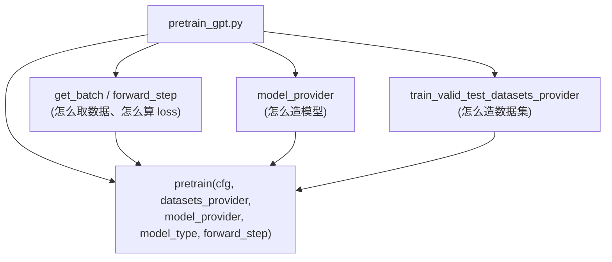
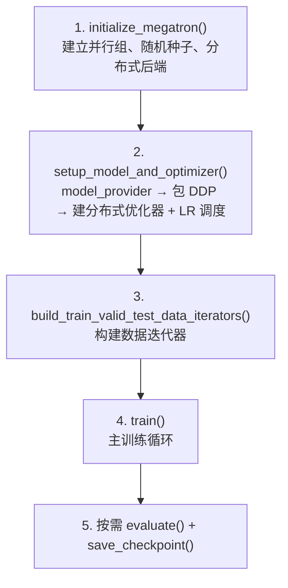
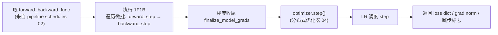
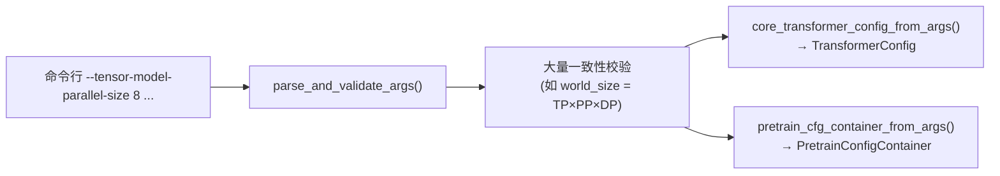
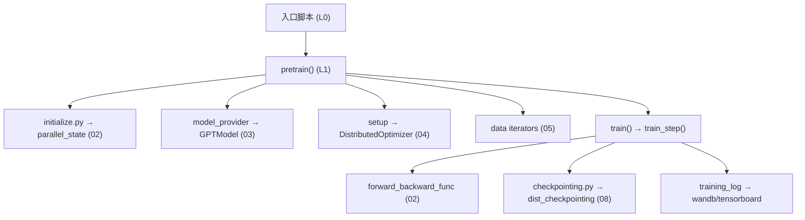

# 06 · 训练框架 Harness

本篇拆解应用层：入口脚本如何把 Core 各能力编排成一次完整训练，`megatron/training/` 的参数系统、初始化、训练主循环、检查点与日志。

相关路径：
- 根目录 `pretrain_gpt.py` / `pretrain_hybrid.py` / `pretrain_mamba.py` / `pretrain_vlm.py` / `train_rl.py`
- `gpt_builders.py` / `model_provider.py`
- `megatron/training/`

---

## 1. 入口脚本的统一范式

所有 `pretrain_*.py` 遵循同一范式：**定义三个回调，交给 `pretrain()` 编排**。



入口脚本只声明「做什么」，`pretrain()` 负责「怎么跑」（初始化、循环、检查点）。这种**回调反转**让同一套训练引擎服务于 GPT/Mamba/VLM/RL 等所有模型。

`pretrain_gpt.py` 的关键导入印证了这种分工：

```49:62:pretrain_gpt.py
from megatron.training import (
    get_args,
    get_timers,
    inprocess_restart,
    pretrain,
    print_rank_0,
    set_startup_timestamps,
)
from megatron.training.argument_utils import pretrain_cfg_container_from_args, gpt_config_from_args
from megatron.training.arguments import core_transformer_config_from_args, parse_and_validate_args
...
from model_provider import model_provider
```

`model_provider.py` 是各脚本共享的模型工厂，委托给具体 builder（`gpt_builder`/`hybrid_builder`），返回 `GPTModel` 或 `HybridModel`。

---

## 2. megatron/training/ 文件职责

| 文件 | 职责 |
|------|------|
| `training.py` | ★ 核心：`pretrain()`、`train()`、`train_step()`、`evaluate()`、模型/优化器构建 |
| `arguments.py` | ★ 命令行参数定义与校验 `parse_and_validate_args()`，`core_transformer_config_from_args()` |
| `argument_utils.py` | 参数 → 配置容器（`PretrainConfigContainer`）转换 |
| `yaml_arguments.py` | YAML 配置支持 |
| `initialize.py` | `initialize_megatron()`：分布式后端、并行组、随机种子、设备 |
| `checkpointing.py` | 检查点保存/加载（对接 Core 的 dist_checkpointing） |
| `global_vars.py` | 全局单例：args、timers、tokenizer、tensorboard/wandb writer |
| `training.py` 内 `training_log` | 指标聚合与打印 |
| `async_utils.py` | 异步检查点保存 |
| `theoretical_memory_usage.py` | 理论显存估算 |
| `inprocess_restart.py` / `ft_integration.py` | 进程内重启 / 容错（fault tolerance）集成 |
| `dist_signal_handler.py` | 分布式信号处理（优雅退出） |
| `wandb_utils.py` / `one_logger_utils.py` | 实验追踪 |
| `gpu_sniff_test.py` | GPU 健康自检 |

---

## 3. pretrain() 的编排流程

`pretrain()`（`training.py:1029`）按固定顺序串起整个训练：



源码 docstring 明确了这一顺序：

```1044:1048:megatron/training/training.py
        1) initialize Megatron.
        2) setup model, optimizer and lr schedule using the model_provider.
        3) call train_val_test_data_provider to get train/val/test datasets.
        4) train the model using the forward_step_func.
```

关键函数定位：

| 函数 | 行号 | 作用 |
|------|------|------|
| `pretrain` | 1029 | 顶层编排 |
| `get_model` | 1631 | 构建模型并按需包 DDP（`wrap_with_ddp`） |
| `setup_model_and_optimizer` | 1956 | 模型 + 优化器 + LR 调度组装 |
| `train` | 3107 | 主循环 |
| `train_step` | 2198 | 单步：前向反向 + 优化器步进 |
| `training_log` | 2408 | 日志聚合 |
| `evaluate` | 3868 | 验证 |
| `save_checkpoint_and_time` | 2822 | 检查点 |
| `build_train_valid_test_data_iterators` | 4298 | 数据迭代器 |

---

## 4. train_step：单步训练

`train_step()`（`training.py:2198`）是训练的最小执行单元：



- `forward_step_func` 是入口脚本传入的回调（`pretrain_gpt.py` 的 `forward_step`），内部调用模型并算 loss。
- 通过 `get_forward_backward_func()` 自动选择无流水线 / 1F1B / 交错 1F1B 调度。
- 与 `rerun_state_machine`（`core/rerun_state_machine.py`）配合，支持确定性重跑与数值异常检测。

---

## 5. 参数系统

`arguments.py` 用 `argparse` 定义了**数百个**命令行参数，覆盖模型结构、并行尺寸、优化器、数据、日志、检查点等。流程：



GPT-3 175B 配方展示了典型参数分组（模型/训练/并行/数据/日志）：

```55:58:examples/gpt3/train_gpt3_175b_distributed.sh
MODEL_PARALLEL_ARGS=(
	--tensor-model-parallel-size 8 
	--pipeline-model-parallel-size 16 
)
```

---

## 6. 初始化与容错

- `initialize.py` 的 `initialize_megatron()`：调用 `torch.distributed.init_process_group`，再调 `parallel_state.initialize_model_parallel()` 建并行组，设随机种子（`tensor_parallel/random.py`）。
- **容错**：`inprocess_restart.py` 支持节点故障后进程内重启（结合 `nvidia-resiliency-ext`），`ft_integration.py` 集成故障检测，避免大集群训练因单点故障从头再来。
- `dist_signal_handler.py` 处理 SIGTERM 等实现优雅 checkpoint 退出。

---

## 7. 依赖关系小结



训练 Harness 是「总指挥」：自身不实现并行/模型/优化器细节，而是按正确顺序把 Core 的各能力编排起来。

下一篇：[推理子系统](./07-推理子系统.md)。
