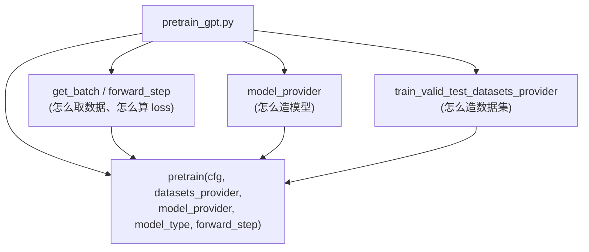
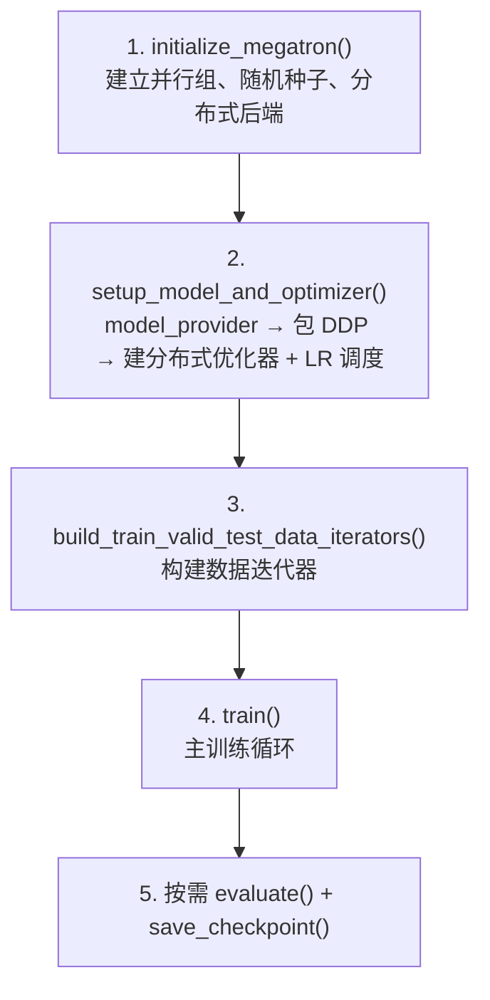
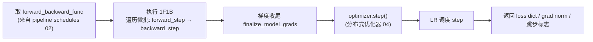
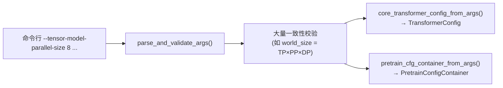
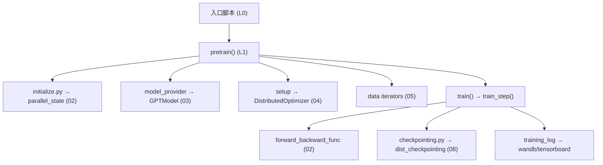

# 06 · 训练框架 Harness

本篇拆解应用层：入口脚本如何把 Core 各能力编排成一次完整训练，`megatron/training/` 的参数系统、初始化、训练主循环、检查点与日志。

相关路径：
- 根目录 `pretrain_gpt.py` / `pretrain_hybrid.py` / `pretrain_mamba.py` / `pretrain_vlm.py` / `train_rl.py`
- `gpt_builders.py` / `model_provider.py`
- `megatron/training/`

---

## 1. 入口脚本的统一范式

所有 `pretrain_*.py` 遵循同一范式：**定义三个回调，交给 `pretrain()` 编排**。



入口脚本只声明「做什么」，`pretrain()` 负责「怎么跑」（初始化、循环、检查点）。这种**回调反转**让同一套训练引擎服务于 GPT/Mamba/VLM/RL 等所有模型。

> **Remark · 这里的「回调」是什么、为什么叫「回调反转」**
>
> **回调（callback）**：你把一个函数**当参数传给别人**，别人在合适的时机「回过头来调用」它。你定义「做什么」，框架决定「何时调、怎么跑」。
>
> **三个回调**：`pretrain_gpt.py:416` 把自己定义、但**不自己调用**的函数交给 `pretrain()`：
> ```python
> pretrain(full_config,
>          train_valid_test_datasets_provider,  # 回调①：怎么造数据集
>          model_provider,                      # 回调②：怎么造模型
>          forward_step)                        # 回调③：怎么取 batch + 算 loss
> ```
> 对应 `pretrain()` 签名的 `train_valid_test_dataset_provider / model_provider / forward_step_func`（`training.py:1029`）。
>
> **控制权是反的（IoC / 好莱坞原则「Don't call us, we'll call you」）**：正常是「你调库」，这里是「库调你」。`pretrain()` 是通用引擎，掌握训练骨架（初始化→建模→建数据→主循环→检查点，见 §3），但**故意不知道**模型细节；跑到需要处才回调：该建模型 → 调 `model_provider()`（`get_model` 内）；该建数据 → 调 provider；每步该前向算 loss → 调 `forward_step_func(...)`（`training.py:2268`，在 `train_step` 里）。
>
> **为什么这么设计**：把**随模型而变**的部分（模型/数据/loss）外置成回调，把**不变**的部分（初始化/循环/检查点/容错）锁进 `pretrain()`。于是 `pretrain_gpt/mamba/vlm.py`、`train_rl.py` 各传不同回调、**复用同一个 `pretrain()`**；新增模型只写三个回调，不碰主循环。
>
> **与 [02.3 §2.5](./02.3-通信原语速查.md) 的 hook 的关系**：都是「框架回调你的函数」（控制反转），但形式不同——**回调**是把函数**当参数传进** `pretrain(...)`、在流程固定节点被调（流程编排型）；**hook** 是**注册**到某事件点、事件发生时被调（事件触发型，如反向 backward post-hook）。

`pretrain_gpt.py` 的关键导入印证了这种分工：

```49:62:pretrain_gpt.py
from megatron.training import (
    get_args,
    get_timers,
    inprocess_restart,
    pretrain,
    print_rank_0,
    set_startup_timestamps,
)
from megatron.training.argument_utils import pretrain_cfg_container_from_args, gpt_config_from_args
from megatron.training.arguments import core_transformer_config_from_args, parse_and_validate_args
...
from model_provider import model_provider
```

`model_provider.py` 是各脚本共享的模型工厂，委托给具体 builder（`gpt_builder`/`hybrid_builder`），返回 `GPTModel` 或 `HybridModel`。

---

## 2. megatron/training/ 文件职责

| 文件 | 职责 |
|------|------|
| `training.py` | ★ 核心：`pretrain()`、`train()`、`train_step()`、`evaluate()`、模型/优化器构建 |
| `arguments.py` | ★ 命令行参数定义与校验 `parse_and_validate_args()`，`core_transformer_config_from_args()` |
| `argument_utils.py` | 参数 → 配置容器（`PretrainConfigContainer`）转换 |
| `yaml_arguments.py` | YAML 配置支持 |
| `initialize.py` | `initialize_megatron()`：分布式后端、并行组、随机种子、设备 |
| `checkpointing.py` | 检查点保存/加载（对接 Core 的 dist_checkpointing） |
| `global_vars.py` | 全局单例：args、timers、tokenizer、tensorboard/wandb writer |
| `training.py` 内 `training_log` | 指标聚合与打印 |
| `async_utils.py` | 异步检查点保存 |
| `theoretical_memory_usage.py` | 理论显存估算 |
| `inprocess_restart.py` / `ft_integration.py` | 进程内重启 / 容错（fault tolerance）集成 |
| `dist_signal_handler.py` | 分布式信号处理（优雅退出） |
| `wandb_utils.py` / `one_logger_utils.py` | 实验追踪 |
| `gpu_sniff_test.py` | GPU 健康自检 |

---

## 3. pretrain() 的编排流程

`pretrain()`（`training.py:1029`）按固定顺序串起整个训练：



源码 docstring 明确了这一顺序：

```1044:1048:megatron/training/training.py
        1) initialize Megatron.
        2) setup model, optimizer and lr schedule using the model_provider.
        3) call train_val_test_data_provider to get train/val/test datasets.
        4) train the model using the forward_step_func.
```

关键函数定位：

| 函数 | 行号 | 作用 |
|------|------|------|
| `pretrain` | 1029 | 顶层编排 |
| `get_model` | 1631 | 构建模型并按需包 DDP（`wrap_with_ddp`） |
| `setup_model_and_optimizer` | 1956 | 模型 + 优化器 + LR 调度组装 |
| `train` | 3107 | 主循环 |
| `train_step` | 2198 | 单步：前向反向 + 优化器步进 |
| `training_log` | 2408 | 日志聚合 |
| `evaluate` | 3868 | 验证 |
| `save_checkpoint_and_time` | 2822 | 检查点 |
| `build_train_valid_test_data_iterators` | 4298 | 数据迭代器 |

---

## 4. train_step：单步训练

`train_step()`（`training.py:2198`）是训练的最小执行单元：



- `forward_step_func` 是入口脚本传入的回调（`pretrain_gpt.py` 的 `forward_step`），内部调用模型并算 loss。
- 通过 `get_forward_backward_func()` 自动选择无流水线 / 1F1B / 交错 1F1B 调度。
- 与 `rerun_state_machine`（`core/rerun_state_machine.py`）配合，支持确定性重跑与数值异常检测。

---

## 5. 参数系统

`arguments.py` 用 `argparse` 定义了**数百个**命令行参数，覆盖模型结构、并行尺寸、优化器、数据、日志、检查点等。流程：



GPT-3 175B 配方展示了典型参数分组（模型/训练/并行/数据/日志）：

```55:58:examples/gpt3/train_gpt3_175b_distributed.sh
MODEL_PARALLEL_ARGS=(
	--tensor-model-parallel-size 8 
	--pipeline-model-parallel-size 16 
)
```

---

## 6. 初始化与容错

- `initialize.py` 的 `initialize_megatron()`：调用 `torch.distributed.init_process_group`，再调 `parallel_state.initialize_model_parallel()` 建并行组，设随机种子（`tensor_parallel/random.py`）。
- **容错**：`inprocess_restart.py` 支持节点故障后进程内重启（结合 `nvidia-resiliency-ext`），`ft_integration.py` 集成故障检测，避免大集群训练因单点故障从头再来。
- `dist_signal_handler.py` 处理 SIGTERM 等实现优雅 checkpoint 退出。

---

## 7. 性能剖析（Profiling）：PyTorch Profiler / Nsys / 显存历史

训练主循环 `train()` 内置了三套开箱即用的性能剖析工具，都由 `--profile` 系列命令行参数驱动，代码集中在 `megatron/training/training.py` 的 `train()` 里（参数定义在 `megatron/training/config/common_config.py` 的 `ProfilingConfig`）。核心机制：**只在 `[profile_step_start, profile_step_end)` 这几个稳定迭代步上采集**（避开前几步的编译/warmup 抖动），并可只采集指定 rank，避免整集群一起 dump。

### 7.1 命令行参数一览

| 参数 | 默认 | 作用 |
|------|:--:|------|
| `--profile` | 关 | 总开关。**不加它，下面所有参数都不生效**。单独用 = Nsys 模式（配合外层 `nsys` 命令） |
| `--profile-step-start N` | 10 | 从第 N 个全局 step 开始采集 |
| `--profile-step-end N` | 12 | 到第 N 个 step 停止（采集区间 `[start, end)`，示例默认只抓 10、11 两步） |
| `--profile-ranks r1 r2 …` | 空=所有 rank | 只在这些**全局 rank** 上采集（大集群通常只留 `0`） |
| `--use-pytorch-profiler` | 关 | 用内置 **torch.profiler**（产出 Chrome trace，可在 TensorBoard/Perfetto 看）；不加则走 **Nsys** 路径 |
| `--pytorch-profiler-collect-shapes` | 关 | torch profiler 记录张量形状 |
| `--pytorch-profiler-collect-callstack` | 关 | torch profiler 记录 Python 调用栈（`with_stack`） |
| `--pytorch-profiler-collect-chakra` | 关 | 额外导出 Chakra 执行轨迹（`ExecutionTraceObserver`） |
| `--nvtx-ranges` | 关 | 插入 NVTX 标注（给 Nsys 分类用，见 `configure_nvtx_profiling`） |
| `--record-shapes` | 关 | Nsys 的 `emit_nvtx(record_shapes=…)` 记录形状 |
| `--record-memory-history` | 关 | 记录 **CUDA 显存分配历史**，末 rank dump `.pickle` |
| `--memory-snapshot-path` | `snapshot.pickle` | 显存历史快照落盘路径 |

> 参数名由 `ProfilingConfig` 的字段自动生成（下划线→短横线）；唯一特例是 `--profile`（字段 `use_nsys_profiler`，显式 `dest=profile`）。

### 7.2 三种用法

**① PyTorch Profiler（推荐，看 TensorBoard/Perfetto）**

```bash
# 训练命令里追加（需同时设置 --tensorboard-dir）
    --profile \
    --use-pytorch-profiler \
    --profile-step-start 10 \
    --profile-step-end 12 \
    --profile-ranks 0 \
    --tensorboard-dir /path/to/tb
```

- Chrome trace 落盘到 **`{tensorboard_dir}/../torch_profile/rank-<r>.json.gz`**（`trace_handler` 里 `export_chrome_trace`）。
- 内部用 `torch.profiler.schedule(wait=start-1, warmup=1, active=end-start, repeat=1)`，每步调用 `prof.step()` 推进，到 `profile_step_end` 调 `prof.stop()`。
- 加 `--pytorch-profiler-collect-chakra` 时，Chakra trace 落到 `{tensorboard_dir}/../chakra/rank-<r>.json.gz`。
- **前置条件**：必须设置 `--tensorboard-dir`（输出路径以它为基准）。

**② Nsys（系统级时间线，看 kernel/NCCL）**

不加 `--use-pytorch-profiler`，只用 `--profile`（可叠加 `--nvtx-ranges`/`--record-shapes`）。此时代码在 `profile_step_start` 调 `cudaProfilerStart()` + `emit_nvtx()`，在 `profile_step_end` 调 `cudaProfilerStop()`。需要用外层 `nsys` 命令包住训练进程，并把捕获区间对齐到 `cudaProfilerApi`：

```bash
nsys profile -s none -t nvtx,cuda \
  -o <输出文件> --force-overwrite true \
  --capture-range=cudaProfilerApi --capture-range-end=stop \
  python pretrain_gpt.py ... --profile --nvtx-ranges --profile-step-start 10 --profile-step-end 12 --profile-ranks 0
```

（该 `nsys` 示例命令即 `ProfilingConfig.use_nsys_profiler` 字段 docstring 给出的官方范例。）

**③ 显存历史（排查 OOM / 碎片）**

```bash
    --record-memory-history \
    --memory-snapshot-path /path/to/snapshot.pickle
```

在末 rank 每 `log_interval` 步 `torch.cuda.memory._snapshot()` dump 一次，用 [PyTorch 显存可视化工具](https://docs.pytorch.org/memory_viz) 打开 `.pickle` 即可看每块显存的分配调用栈——排查激活/碎片（呼应 [02.1 显存账](./02.1-显存、激活值与重计算.md)）非常有用。

### 7.3 仓库内示例

现成的 profiler 用法可直接抄：`examples/llama/train_llama3_8b_h100_fp8.sh`、`examples/megatron_fsdp/train_llama3_8b_fsdp_h100_fp8.sh`、`examples/megatron_fsdp/sbatch_mfsdp_deepseek_v3.sh`（均用 `--profile --profile-step-start/end --profile-ranks 0`）。

> 相关源码：`megatron/training/config/common_config.py`（`ProfilingConfig` 参数）、`megatron/training/training.py`（`train()` 内 torch.profiler 启停、`export_chrome_trace`、显存快照 dump）、`megatron/core/utils.py:configure_nvtx_profiling`（NVTX 开关）。

---

## 8. 依赖关系小结



训练 Harness 是「总指挥」：自身不实现并行/模型/优化器细节，而是按正确顺序把 Core 的各能力编排起来。

下一篇：[推理子系统](./07-推理子系统.md)。
