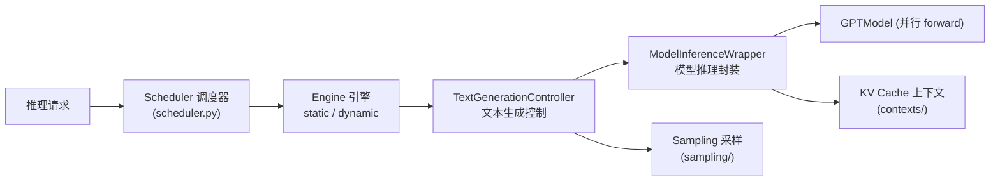
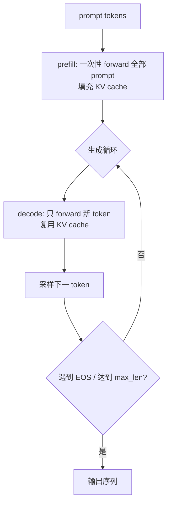
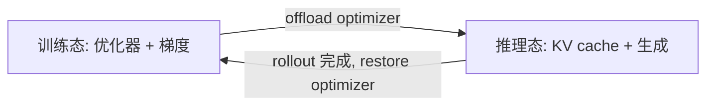
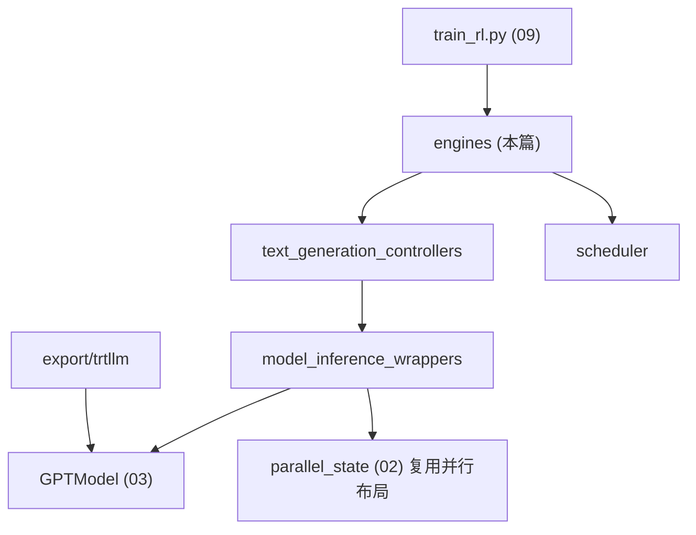

# 07 · 推理子系统

本篇拆解 Megatron Core 的推理引擎：静态/动态批处理引擎、请求调度、采样、KV 缓存上下文、文本生成服务，以及与训练共享模型权重的能力（RL 场景关键）。

相关路径：
- `megatron/core/inference/`
- `megatron/inference/`（应用层封装）
- `tools/run_text_generation_server.py` / `tools/run_dynamic_text_generation_server.py`

---

## 1. 总体定位

推理子系统让训练好的（或训练中的）Megatron 模型在保持 TP/PP/EP 并行的同时高效生成文本。它既服务于独立部署，也服务于 RL 的 rollout 采样（见 [09](./09-后训练与RL.md)）。

---

## 2. 引擎（inference/engines/）

| 文件 | 引擎类型 | 特征 |
|------|----------|------|
| `abstract_engine.py` | 抽象基类 | 定义引擎接口 |
| `static_engine.py` | 静态批 | 固定批，整批同步推进，简单 |
| `dynamic_engine.py` | ★ 动态批 | 连续批处理（continuous batching），请求动态进出，吞吐高 |
| `mcore_engine.py` | MCore 封装 | 面向 Megatron 模型的统一引擎入口 |
| `async_zmq_communicator.py` | 异步通信 | 基于 ZMQ 的异步引擎通信 |

- **静态引擎**：适合离线批量生成，逻辑简单。
- **动态引擎**：实现连续批处理，新请求可在已有请求生成中途加入，GPU 利用率更高，是服务化的核心。

---

## 3. 调度与请求（inference/）

| 文件 | 职责 |
|------|------|
| `scheduler.py` | 请求调度：决定哪些请求本步参与、何时换入换出 |
| `inference_request.py` | 请求对象（prompt、采样参数、状态） |
| `sampling_params.py` / `common_inference_params.py` | 采样与通用推理参数 |
| `inference_client.py` | 客户端封装 |
| `async_stream.py` | 流式输出 |
| `data_parallel_inference_coordinator.py` | DP 推理协调（多副本） |
| `config.py` | 推理配置 |

---

## 4. 文本生成控制与采样

- `text_generation_controllers/`：编排自回归生成循环（准备输入 → forward → 采样下一 token → 拼接 → 判停）。
- `sampling/`：贪心、top-k、top-p、温度等采样策略。
- `model_inference_wrappers/`：把训练用的 `GPTModel` 包装成推理友好的接口（处理增量解码、batch 维度）。
- `contexts/`：**KV 缓存上下文**——管理注意力 KV cache 的分配/复用，是增量解码省算力的关键（`BaseInferenceContext`）。

---

## 5. MoE 与量化推理

- `inference/moe/`：MoE 模型推理期的 token 分发优化（与训练期 dispatcher 不同，见 `transformer/moe/token_dispatcher_inference.py`）。
- `inference/quantization/`：推理量化（与 ModelOpt 后训练量化配合，见 [09](./09-后训练与RL.md)）。
- `symmetric_memory.py` / `unified_memory.py`：对称内存 / 统一内存优化，降低多卡推理通信开销。

---

## 6. 服务化与导出

| 入口 | 用途 |
|------|------|
| `tools/run_text_generation_server.py` | 启动静态文本生成 HTTP 服务 |
| `tools/run_dynamic_text_generation_server.py` | 启动动态批处理服务 |
| `tools/run_inference_performance_test.py` | 推理性能基准 |
| `megatron/core/export/trtllm/` | 导出为 TensorRT-LLM 引擎做生产部署 |
| `examples/inference/` | 推理用例与脚本 |

`run_text_generation_server.py` 的 `main(model_type="gpt")` 是服务入口。

---

## 7. 与训练共享权重（RL 关键）

推理引擎可直接复用训练中的模型实例与并行布局，无需导出/重载。RL 训练（`train_rl.py`）正是利用这点：在同一进程内**训练态↔推理态切换**，做 rollout 采样后再更新。`training.py` 中大量 `rl/inference-setup`、`rl/offload-kv-cache` 等计时器（见源码 `RL_LOGGABLE_TIMER_NAMES`）印证了这种紧耦合。

---

## 8. 依赖关系小结

推理子系统复用模型层与并行布局，向上支撑独立服务、RL rollout 与生产导出三类场景。

下一篇：[检查点与重切分](./08-检查点与重切分.md)。
