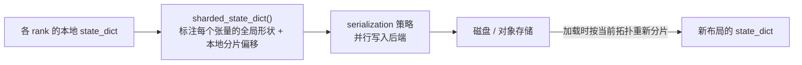
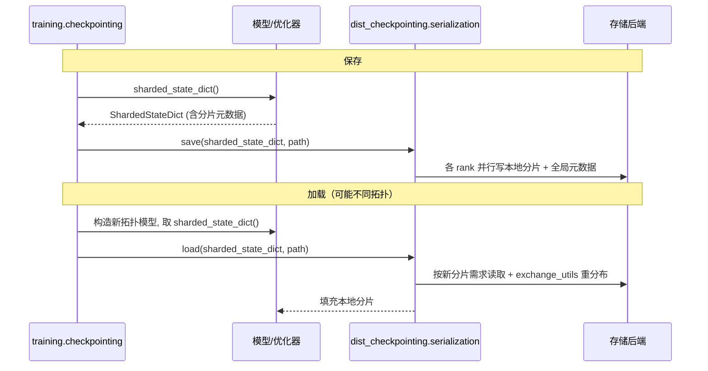
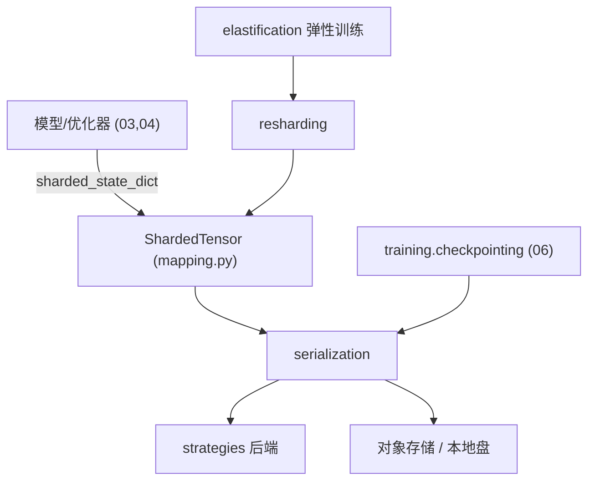

# 08 · 检查点与重切分

本篇拆解 Megatron 的分布式检查点（distributed checkpointing）：为什么需要它、ShardedTensor 抽象、序列化策略、以及在不同并行拓扑间迁移权重的 resharding。

相关路径：
- `megatron/core/dist_checkpointing/`
- `megatron/core/resharding/`
- `megatron/training/checkpointing.py`（训练侧封装）

---

## 1. 为什么需要分布式检查点

当模型被 TP×PP×DP×EP 切到成百上千 GPU 时，没有任何单卡持有完整权重。检查点必须解决：

1. **分片落盘**：每个 rank 只保存自己持有的分片，并行写入。
2. **拓扑无关**：用 N 卡（如 TP=8）训练，能用 M 卡（如 TP=4）恢复——这是大模型工程的刚需。
3. **优化器状态**：分布式优化器的切分状态也要正确保存/恢复。

Megatron 的方案：用**全局逻辑张量 + 分片描述**表示状态，落盘时与具体并行布局解耦。



---

## 2. 核心文件（dist_checkpointing/）

| 文件 | 职责 |
|------|------|
| `mapping.py` | ★ `ShardedTensor` / `ShardedStateDict`：描述全局形状与本地分片的核心数据结构 |
| `serialization.py` | ★ 保存/加载顶层 API（`save` / `load`） |
| `core.py` | 检查点核心抽象与元数据 |
| `strategies/` | 多种后端读写策略（如 PyTorch、tensorstore、zarr） |
| `optimizer.py` | 优化器状态的分片检查点 |
| `state_dict_utils.py` / `dict_utils.py` | state_dict 树形遍历与转换 |
| `tensor_aware_state_dict.py` | 张量感知的 state_dict 封装 |
| `exchange_utils.py` | 加载时分片间的数据交换（重分布） |
| `validation.py` | 检查点一致性校验 |

### ShardedTensor：核心抽象

每个被保存的张量都带上元数据：**全局形状**、**本地分片在全局中的偏移与大小**、**所属并行轴**。加载时，框架据此把磁盘上的全局张量按**当前**并行布局重新切给各 rank——这正是拓扑无关恢复的基础。

模型类通过 `sharded_state_dict()` 方法产出这种描述（`MegatronModule` 基类提供，见 `gpt_model.py` 导入的 `ShardedStateDict`）：

```11:11:megatron/core/models/gpt/gpt_model.py
from megatron.core.dist_checkpointing.mapping import ShardedStateDict
```

---

## 3. 保存/加载流程



- 训练侧 `megatron/training/checkpointing.py` 封装了「按 `--save-interval` 触发、异步写、保留最近 N 个」等策略。
- `async_utils.py` 支持异步检查点，训练几乎不被落盘 IO 阻塞。

---

## 4. 重切分 resharding/

`megatron/core/resharding/` 专门处理**在线/离线改变并行拓扑**：

- 在训练过程中动态调整并行度（如弹性训练 `megatron/elastification/`）。
- `copy_services/` 与 `nvshmem_copy_service/`：用 NVSHMEM 等高效在 GPU 间搬运分片，避免落盘往返。

应用场景：RL 训练时训练态（高 TP）与推理态（低 TP）可能用不同布局；弹性训练时节点数变化需要重分布权重。

---

## 5. 与对象存储集成

- `multi-storage-client`、`tensorstore`（见 `pyproject.toml` dev 依赖）让检查点可直写 S3/GCS 等对象存储。
- `datasets/object_storage_utils.py` 与检查点共用对象存储能力。

---

## 6. 依赖关系小结



- 检查点是连接「内存中分片状态」与「持久化存储」的桥梁。
- ShardedTensor 抽象是拓扑无关恢复与 resharding 的共同基石。
- 训练层负责策略（何时存、存几个），Core 负责机制（怎么分片读写）。

下一篇：[后训练与强化学习](./09-后训练与RL.md)。
