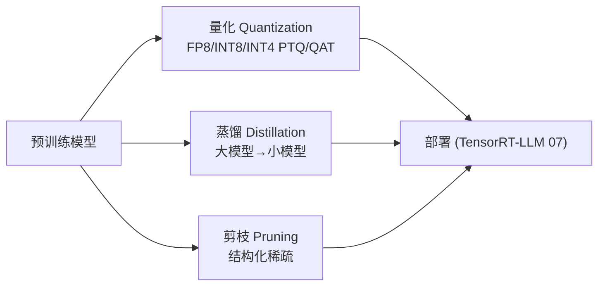
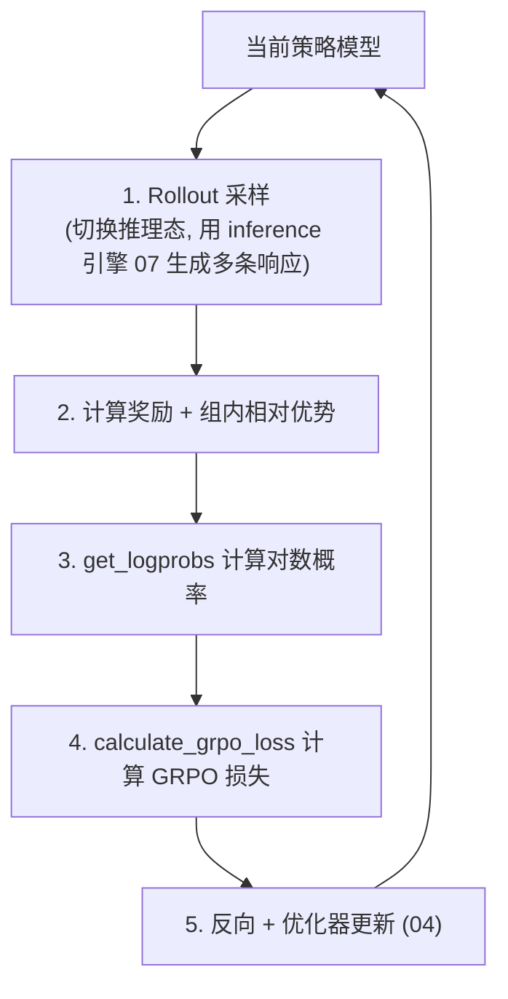
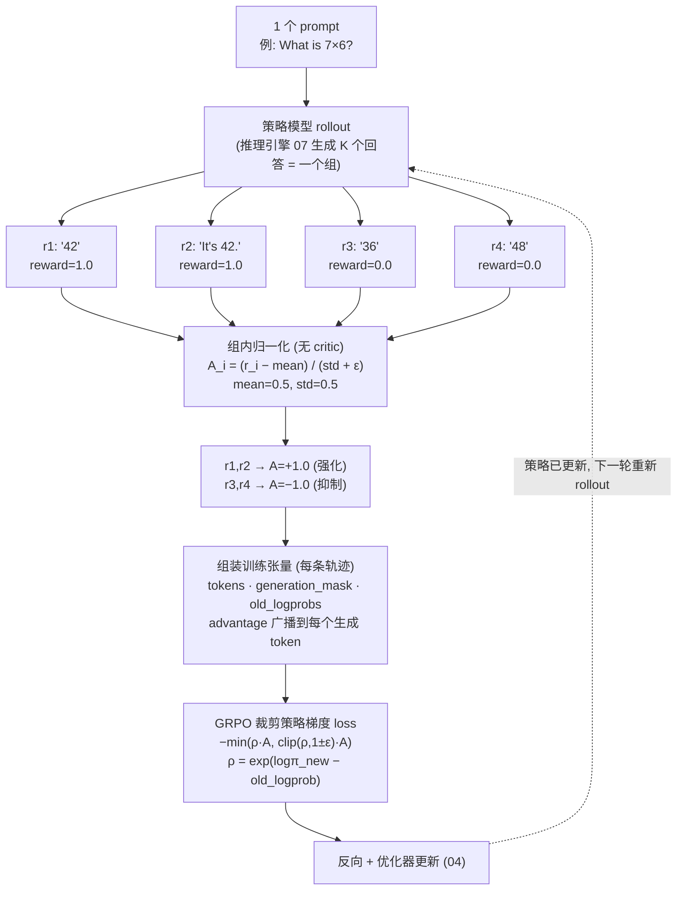
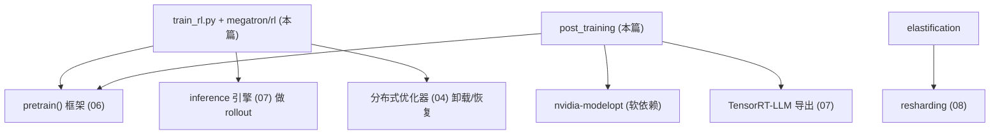

# 09 · 后训练与强化学习

本篇拆解预训练之后的两类工作流：基于 NVIDIA ModelOpt 的模型优化（量化/蒸馏/剪枝），以及强化学习（GRPO/RLHF）。它们复用前面所有子系统，是 Megatron 能力的「上层应用」。

相关路径：
- `megatron/post_training/`（应用层）、`megatron/core/post_training/`（核心侧）
- `megatron/rl/` + 根目录 `train_rl.py`
- `examples/post_training/`、`examples/rl/`

---

## 1. 后训练（Post-Training / ModelOpt）

借助 `nvidia-modelopt` 对训练好的模型做压缩与优化，便于部署。

### 文件职责

| 路径 | 职责 |
|------|------|
| `megatron/post_training/arguments.py` | `add_modelopt_args()`：注入 ModelOpt 相关 CLI 参数 |
| `megatron/post_training/model_builder.py` | `modelopt_gpt_hybrid_builder`：构建可优化的模型 |
| `megatron/post_training/loss_func.py` | 蒸馏/优化的损失函数 |
| `megatron/post_training/checkpointing.py` | ModelOpt 状态的检查点 |
| `megatron/post_training/generate.py` | 后训练模型的生成 |
| `megatron/core/post_training/modelopt/` | 核心侧 ModelOpt 集成 |

### 三类能力



入口脚本通过 try-import 可选启用（`pretrain_gpt.py` 顶部）：

```64:71:pretrain_gpt.py
try:
    from megatron.post_training.arguments import add_modelopt_args
    from megatron.post_training.loss_func import loss_func as loss_func_modelopt

    has_nvidia_modelopt = True
except ImportError:
    has_nvidia_modelopt = False
```

这种「软依赖」模式贯穿全仓：高级特性缺失不影响核心训练。

---

## 2. 强化学习（megatron/rl/ + train_rl.py）

实现 RLHF 类训练，当前以 **GRPO**（Group Relative Policy Optimization）为代表。RL 的独特之处：**在一个训练步内要先做大量推理 rollout，再用 rollout 数据更新策略**，因此深度耦合训练与推理两套子系统。

### 文件职责

| 路径 | 职责 |
|------|------|
| `train_rl.py` | RL 训练入口（沿用 `pretrain()` 框架，定制 forward/loss） |
| `megatron/rl/rl_utils.py` | ★ `calculate_grpo_loss`、`get_logprobs`、运行时状态、数据加载 |
| `megatron/rl/sequence_packing_utils.py` | 序列打包（变长 rollout 高效批处理） |
| `megatron/rl/parallel_utils.py` | RL 下的并行协调 |
| `megatron/rl/logging.py` | RL 指标日志 |

`train_rl.py` 的导入揭示了它如何把 RL 逻辑接到通用训练框架上：

```18:28:train_rl.py
from megatron.rl.rl_utils import (
    calculate_grpo_loss,
    get_logprobs,
    get_rl_runtime_state,
    load_packed_data_by_index,
)
from megatron.training import get_args, get_timers, pretrain, print_rank_0
...
from model_provider import model_provider
```

### RL 训练循环（GRPO）



### 训练态↔推理态切换的开销管理

`megatron/training/training.py` 定义了一组 RL 专用计时器，反映这种切换的工程复杂度：

```82:99:megatron/training/training.py
RL_LOGGABLE_TIMER_NAMES = [
    # Top-level RL phases
    'rl/rollout-collection',
    'rl/prepare-data-for-update',
    # Rollout collection breakdown
    'rl/inference-setup',
    'rl/collect-rollouts',
    'rl/sync-rollouts',
    'rl/suspend-engine',
    # Optimizer offload/restore
    'rl/offload-optimizer-before-inference',
    'rl/restore-optimizer-after-inference',
    'rl/offload-kv-cache-after-inference',
    'rl/restore-kv-cache-before-inference',
```

要点：rollout 阶段把**优化器状态卸载**腾出显存给 KV cache，更新阶段再恢复。这正是推理（07）、分布式优化器（04）、检查点/重切分（08）协同的典型场景。

### 2.4 RL 训练数据长什么样（GRPO）★

和预训练/SFT 的静态样本不同，**RL 数据是在线 rollout 生成的**，且携带监督学习里没有的字段（reward / advantage / logprobs），loss 也不是交叉熵。源码：`megatron/rl/agent/api.py`（数据类）、`megatron/rl/rl_utils.py`（advantage 与训练张量）。



> 读图要点：**同组 K 个回答共享一个 prompt**，reward 只做**组内**相对比较（好于均值→正 advantage、差于均值→负）；loss 只落在 `generation_mask=1` 的**生成 token** 上；`old_logprob` 是采样时刻存下的旧策略概率，用于算重要性比 ρ。下面按①②③④拆解每一步。

**① 采样一组 rollout**（`GroupedRolloutRequest`：`num_groups × rollouts_per_group`）——对**同一个 prompt** 生成 K 个回答（一个「组」），每个是一条 `TokenRollout`（`api.py:60`）：

```python
TokenRollout(
    trajectory      = [prompt_ids + response_ids],   # 完整 token 序列
    reward          = 1.0,                            # 打分(验证器/奖励模型给)
    generation_mask = [F,F,…,F, T,T,…,T],            # 哪些是"生成的"(只这些算 loss)
    logprobs        = [ …, lp, lp, … ],              # 生成时旧策略的 per-token log 概率
)
```

**② 算 GRPO advantage**（`rl_utils.py:824 calculate_grpo_advantages`）——**组内归一化，没有 critic 网络**（这正是 GRPO 区别于 PPO 的关键：用「同组其它回答的平均分」当基线，省掉价值网络）：

$$A_i = \frac{r_i - \operatorname{mean}(r_{\text{group}})}{\operatorname{std}(r_{\text{group}}) + \epsilon}$$

**具体例子**。Prompt：`What is 7 × 6? Answer with a number.`，一组 4 个回答：

| rollout | 回答 | reward | advantage `(r−0.5)/0.5` |
|---|---|:--:|:--:|
| r1 | `42` | 1.0 | **+1.0** |
| r2 | `It's 42.` | 1.0 | **+1.0** |
| r3 | `36` | 0.0 | **−1.0** |
| r4 | `48` | 0.0 | **−1.0** |

（组均值 0.5、标准差 0.5）→ 对的回答拿正 advantage（**强化**），错的拿负（**抑制**）。

**③ 组装训练张量**（`rl_utils.py:1462-1499`，advantage 广播到该轨迹每个生成 token）：

```
r1 样本:
 tokens         : What is 7×6? Answer with a number.  4  2  <eod>
 generation_mask:  0   0  0    0    0    0    0    0   1  1   1     ← prompt=0, 生成=1
 loss_mask      :  0   0  ……………………… 0              1  1   1     ← =generation_mask(:1499)
 advantages     :  -   -  ……………………… -             +1 +1  +1     ← 整条轨迹同一个 A_i
 old_logprobs   :  -   -  ……………………… -             lp lp  lp     ← 生成时的旧 log 概率
```

**④ loss 不是交叉熵，而是 GRPO/PPO 裁剪策略梯度目标**（`calculate_grpo_loss`，`rl_utils.py:1859` 附近）：

$$L = -\min\big(\rho_t A_i,\ \operatorname{clip}(\rho_t, 1{-}\epsilon, 1{+}\epsilon)\,A_i\big),\qquad \rho_t = e^{\log\pi_{\text{new}}(t) - \text{old\_logprob}(t)}$$

即用**新旧策略的概率比 ρ** 乘 **advantage**，推高好回答里 token 的概率、压低差回答的。`old_logprobs` 就是采样时为算这个比值而存下来的（也是训练态↔推理态切换、§2.3 那些计时器存在的原因）。

**另一种 RL 数据 · 偏好对**（`ContrastiveRollout`，`api.py:97`）：`chosen_trajectory` vs `rejected_trajectory`——同一 prompt 的「更好/更差」两条回答，用于 DPO 类偏好优化，样本是**一对轨迹**而非带标量奖励的单条。

> 与 [05 · 数据集与分词器](./05-数据集与分词器.md) 对照：**FIM 换 token 顺序、SFT 换 loss 范围、RL 换目标函数**。前两者仍是交叉熵下的自回归样本，RL 则彻底换成「reward → advantage → 策略梯度」，数据也从静态文件变为在线 rollout。

---

## 3. 弹性训练（megatron/elastification/）

支持训练过程中节点数量变化（扩容/缩容），依赖 resharding（08）在线重分布权重，与容错（`inprocess_restart`）配合提升大集群训练的鲁棒性。

---

## 4. 依赖关系小结



后训练与 RL 是「集大成者」：它们不新增底层机制，而是把模型、并行、优化器、推理、检查点编排成更复杂的工作流。

下一篇：[工具、示例与测试 CI](./10-工具示例与测试CI.md)。
