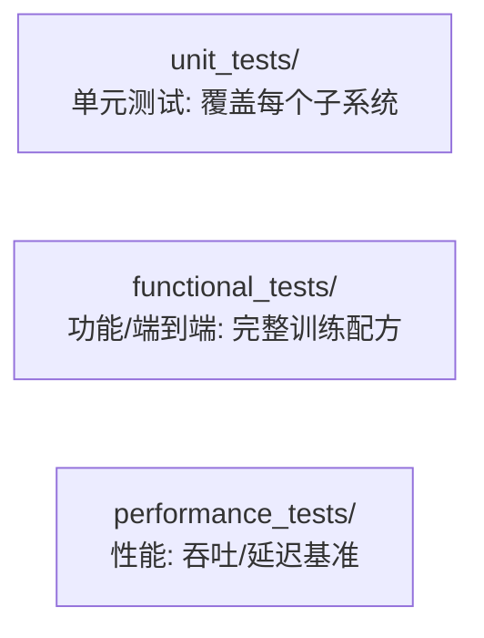
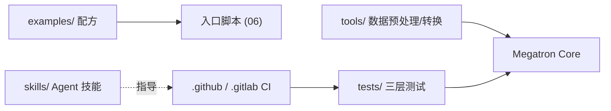

# 10 · 工具、示例与测试 CI

本篇覆盖支撑性的「外围」子系统：实用工具（tools/）、开箱即用配方（examples/）、测试体系（tests/）与持续集成（.github/、.gitlab/），以及仓库内嵌的 Agent skills。

---

## 1. 工具 tools/

围绕训练/推理生命周期的实用脚本。

| 工具 | 用途 |
|------|------|
| `preprocess_data.py` | 原始语料 → IndexedDataset（见 [05](./05-数据集与分词器.md)） |
| `preprocess_data_nmt.py` / `preprocess_mmdata.py` | 翻译 / 多模态预处理 |
| `merge_datasets.py` | 合并预处理分片 |
| `checkpoint/convert.py` | 检查点格式转换（统一入口） |
| `checkpoint/hybrid_conversion.py` / `gpt_hybrid_conversion.py` | GPT↔Hybrid 转换 |
| `checkpoint/remap_gpt_dsa_to_mamba.py` | GPT→Mamba 权重重映射 |
| `run_text_generation_server.py` | 文本生成服务（见 [07](./07-推理子系统.md)） |
| `run_dynamic_text_generation_server.py` | 动态批处理服务 |
| `run_inference_performance_test.py` | 推理性能测试 |
| `report_theoretical_memory.py` | 理论显存估算 |
| `linter.py` / `check_copyright.py` / `copyright.sh` | 代码规范 |
| `bert_embedding/` | BERT 嵌入提取 |
| `common_pile_dataset/` | Common Pile 数据集准备 |

> `checkpoint/` 子目录是连接 Megatron 与外部生态（HF 等）的桥梁；更完整的双向转换推荐用 **Megatron Bridge**。

---

## 2. 示例 examples/

每个子目录是一类模型/场景的开箱即用配方（脚本 + 配置）。

| 目录 | 内容 |
|------|------|
| `gpt3/` | GPT-3 各规模训练（`train_gpt3_175b_distributed.sh` 是经典模板） |
| `llama/` / `mixtral/` / `gptoss/` | 开源权重模型族 |
| `mamba/` | Mamba/SSM |
| `multimodal/` / `mimo/` | 多模态、多输入多输出 |
| `t5/` / `bert/` | 编码器-解码器、双向编码器 |
| `inference/` | 推理与服务 |
| `rl/` | 强化学习（见 [09](./09-后训练与RL.md)） |
| `post_training/` | 量化/蒸馏/剪枝 |
| `export/` | TensorRT-LLM 导出 |
| `megatron_fsdp/` | FSDP 用法 |
| `academic_paper_scripts/` | 论文复现脚本 |
| `run_simple_mcore_train_loop.py` | ★ 最小 Core-only 训练循环，理解 API 的最佳起点 |

`run_simple_mcore_train_loop.py` 直接使用 `megatron.core` 而不经过完整 `training` 框架，是学习 Core API 的最佳切入点。

---

## 3. 测试体系 tests/

测试是仓库最大子树（约 40MB），分三类：



### 单元测试覆盖（tests/unit_tests/ 子目录）

与 Core 子系统一一对应，体现模块化设计：

```
data/ dist_checkpointing/ distributed/ export/ extension/ fusions/
inference/ models/ optimizer/ pipeline_parallel/ post_training/
resharding/ rl/ ssm/ tensor_parallel/ tokenizers/ training/
transformer/ utils/ a2a_overlap/ elastification/
```

### 测试基础设施（tests/test_utils/）

- `python_scripts/`：CI 编排脚本（下载金标准值、触发 JET workload、资源等待、覆盖率收集等）。
- `recipes/`：功能测试配方定义。
- **golden values**：功能测试用「金标准数值」回归比对，确保改动不破坏数值正确性（`download_golden_values.py`、`skills/update-golden-values`）。

---

## 4. 持续集成 CI

仓库同时使用 **GitHub Actions**（`.github/workflows/`）与 **GitLab CI**（`.gitlab/`）：

| 工作流（节选） | 作用 |
|----------------|------|
| `cicd-main.yml` | 主 CI 流水线 |
| `_build_test_publish_wheel.yml` | 构建/测试/发布 PyPI wheel |
| `_update_dependencies.yml` | 依赖更新 |
| `claude_review.yml` / `claude-complexity-label.yml` | AI 辅助代码评审/打标 |
| `cherry-pick-release-commit.yml` | 发布分支 cherry-pick |
| `auto-assign-milestone.yml` / `auto-swap-labels.yml` | issue/PR 自动化 |
| `close-inactive-issue-pr.yml` | 清理不活跃 issue/PR |

`.gitlab/stages/` 与 `.gitlab/scripts/` 承载在 NVIDIA 内部 GPU 集群上跑的功能/性能测试（需真实 GPU，GitHub 侧多为轻量检查）。

---

## 5. 内嵌 Agent Skills（skills/、.claude/、.agents/）

仓库内置了一批面向 AI 开发助手的「技能」，描述如何在此仓库执行常见运维任务：

```
skills/
├── mcore-testing/            # 如何跑测试
├── mcore-cicd/               # CI/CD 操作
├── mcore-linting-and-formatting/
├── mcore-run-on-slurm/       # 在 Slurm 上启动训练
├── mcore-split-pr/           # 拆分 PR
├── update-golden-values/     # 更新金标准值
├── respond-to-issue/         # 响应 issue
└── ...
```

这反映出项目的工程成熟度：连贡献流程与运维都做了「可自动化」的固化。

---

## 6. 依赖关系小结

这些外围子系统不在运行时主链路上，而是**支撑开发-训练-部署生命周期**：



下一篇（收官）：[整体逻辑综述](./11-整体逻辑综述.md)。
