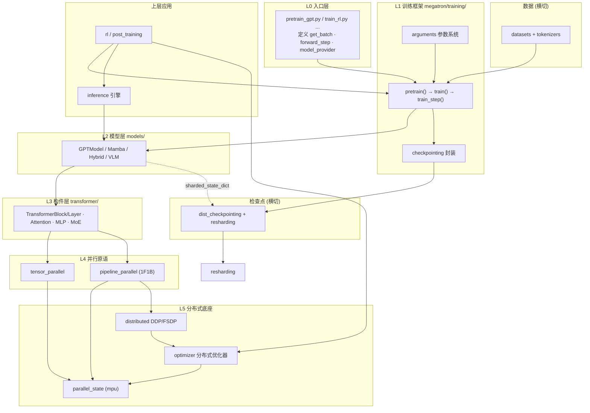

# 11 · 整体逻辑综述

本篇是收官：把前十篇拆开的子系统重新「焊接」成一个整体，给出端到端执行链路、跨子系统协作矩阵、设计哲学总结，以及给不同读者的上手路线。

---

## 1. 一张图看懂整个代码仓



---

## 2. 端到端执行链路（GPT 预训练全流程）

把六层串成一次真实运行：

```mermaid
sequenceDiagram
    autonumber
    participant CLI as torchrun + args
    participant E as pretrain_gpt.py
    participant TR as training.pretrain/train
    participant MPU as parallel_state
    participant DL as DataLoader
    participant SCH as forward_backward_func
    participant M as GPTModel
    participant DDP as DDP+梯度桶
    participant OPT as DistributedOptimizer
    participant CK as dist_checkpointing

    CLI->>E: 启动, 解析数百个参数
    E->>TR: pretrain(cfg, datasets_provider, model_provider, forward_step)
    TR->>MPU: initialize_megatron 建 TP/PP/DP/CP/EP 进程组
    TR->>M: setup_model_and_optimizer 构模型(只建本PP stage的层)
    TR->>DDP: 包 DDP, 分配连续梯度桶
    TR->>OPT: 建分布式优化器(优化器状态按DP切分)
    TR->>DL: 构建数据迭代器(IndexedDataset→Blended)
    loop 每次迭代 train_step
        TR->>SCH: 选择 1F1B / 交错调度
        loop 遍历微批
            SCH->>DL: get_batch 取一个微批
            SCH->>M: forward_step → loss (TP/CP/EP 在层内透明生效)
            M->>DDP: backward 累积梯度到桶(末微批触发reduce-scatter)
        end
        SCH->>DDP: finalize_model_grads 跨PP/嵌入组收尾
        TR->>OPT: 梯度裁剪 → step → all-gather 更新后参数
        TR->>TR: LR 调度 + training_log(wandb/tensorboard)
        TR->>CK: 按 save-interval 异步保存分片检查点
    end
```

**核心闭环**：取数据 → 多微批前向（并行透明）→ 反向累积梯度 → 末微批规约 → 优化器分片更新 → 参数 all-gather → 记录/存档。

---

## 3. 跨子系统协作矩阵

哪些子系统在何处「握手」：

| 协作点 | 参与子系统 | 协作内容 |
|--------|-----------|----------|
| 并行组初始化 | training(06) ↔ parallel_state(02) | `initialize_megatron` 建立全部进程组 |
| 模型并行化 | models(03) ↔ tensor/pipeline_parallel(02) | 并行版算子 + PP 切层使并行对模型透明 |
| 流水线 vs 梯度同步 | pipeline_parallel(02) ↔ DDP(04) | 仅末微批开启 grad sync，其余关闭 |
| 优化器状态切分 | optimizer(04) ↔ parallel_state(02) | 沿 DP 维切分，reduce-scatter/all-gather |
| 检查点分片 | models(03) ↔ dist_checkpointing(08) | `sharded_state_dict()` 产出分片元数据 |
| 拓扑迁移 | dist_checkpointing(08) ↔ resharding(08) | 不同并行布局间恢复/重分布 |
| RL 态切换 | rl(09) ↔ inference(07) ↔ optimizer(04) | rollout 时卸载优化器、装载 KV cache |
| 词表切分 | tokenizers(05) ↔ tensor_parallel(02) | 词表大小决定 VocabParallel 切分 |
| 配置贯穿 | 全栈 | `ModelParallelConfig → TransformerConfig` |

---

## 4. 设计哲学总结

通读全仓后可提炼出几条贯穿始终的设计原则：

1. **严格分层、单向依赖**：入口 → 训练 → 模型 → 构件 → 并行原语 → 分布式底座。下层从不反向依赖上层，Core 不感知训练脚本。

2. **并行对模型透明**：模型代码几乎不写并行逻辑；靠并行版算子（Column/RowParallelLinear）+ `parallel_state` 全局状态 + PP 切层，让 TP/PP/CP/EP「自动生效」。

3. **配置驱动 + Spec 可插拔**：`TransformerConfig` 统一超参，`ModuleSpec`/`build_module` 解耦「结构定义」与「具体后端」（本地 vs Transformer Engine FP8）。

4. **回调反转的训练引擎**：`pretrain()` 固化「怎么跑」，入口脚本只提供「做什么」（forward/model/dataset 三回调），一套引擎服务所有模型与 RL。

5. **拓扑无关的状态持久化**：ShardedTensor 抽象让检查点与并行布局解耦，支撑 N→M 卡恢复、resharding、弹性训练。

6. **软依赖与可选特性**：ModelOpt、flashinfer、Transformer Engine 等以 try-import 方式可选启用，缺失不影响核心训练。

7. **显存即一切**：梯度桶、分布式优化器（ZeRO-1）、activation 卸载、CPU offload、混合精度、CUDA Graph——大量工程都围绕「在固定显存下塞进更大模型」。

8. **工程成熟度**：三层测试 + 金标准回归 + 双 CI（GitHub/GitLab）+ 内嵌 Agent skills，体现产线级质量要求。

---

## 5. 数据/控制流分层回顾

| 层 | 关注「数据流」 | 关注「控制流」 |
|----|---------------|---------------|
| L0 入口 | 定义样本格式 | 声明回调 |
| L1 训练 | DataLoader → 微批 | 迭代循环、检查点节奏 |
| L2 模型 | tokens → logits | forward 组装 |
| L3 构件 | hidden states | 注意力/MLP/MoE 计算 |
| L4 并行原语 | 分片张量 + 集合通信 | 1F1B 微批调度 |
| L5 底座 | 梯度桶、优化器状态 | 进程组、梯度同步时机 |

---

## 6. 给不同读者的上手路线

| 你是谁 | 建议路线 |
|--------|----------|
| 想快速训一个模型 | `examples/` 选配方 → `tools/preprocess_data.py` → `torchrun pretrain_gpt.py` → 读 [06](./06-训练框架Harness.md) |
| 想学 Core API | `examples/run_simple_mcore_train_loop.py` → [03](./03-Transformer与模型子系统.md) → [02](./02-并行化子系统.md) |
| 想理解并行/性能 | [02](./02-并行化子系统.md) + [04](./04-分布式训练与优化器.md)，重点 `schedules.py`、`distrib_optimizer.py` |
| 想做 MoE/长上下文/混合架构 | [03](./03-Transformer与模型子系统.md) 的 MoE/Mamba 段 + 对应 `examples/` |
| 想做 RLHF | [09](./09-后训练与RL.md) + [07](./07-推理子系统.md)，读 `train_rl.py`、`rl_utils.py` |
| 想做部署/量化 | [07](./07-推理子系统.md) + [09](./09-后训练与RL.md) 的 ModelOpt 段，`export/trtllm` |
| 想对接 HuggingFace 权重 | 用 **Megatron Bridge**，辅以 `tools/checkpoint/` |

---

## 7. 一句话收尾

> Megatron-LM = 一个**严格分层、配置驱动、并行透明**的大模型训练栈：底层用五维并行 + 分布式优化器 + 分片检查点把模型铺到上千 GPU；中层用 Spec 机制把 Transformer/Mamba/MoE/多模态统一为可组合构件；上层用「回调反转」的 `pretrain()` 引擎统一驱动预训练、SFT、RL 与后训练全流程。

—— 全文完。返回 [文档索引](./README.md)。
