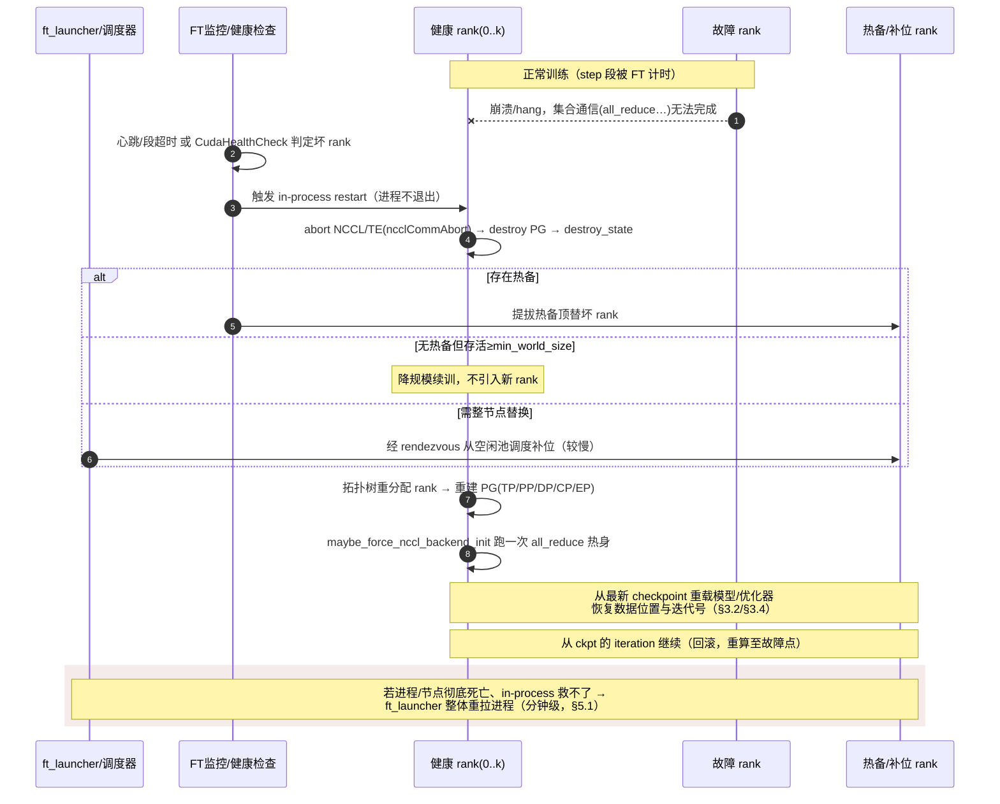
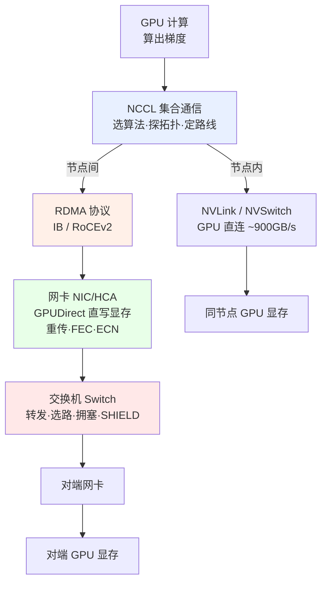

<!--
name: 高可用与容错
creator: Li Cheng
created: 2026-07-17
modified: 2026-07-20
-->

# 高可用与容错（源码锚定：Megatron + NVRx）

> 本篇解析 Megatron-LM 面向大规模训练的**高可用（HA）/ 容错（Fault Tolerance）**机制。
> 组织方式：**两大核心维度（训练资源、通信网络）+ 两个正交维度（状态持久化、计算正确性）+ 一个上层维度（调度弹性）+ 两类横切支撑（检测归因、故障演练）**。
> 分析对象：`megatron/training/ft_integration.py`、`inprocess_restart.py`、`config/resilience_config.py`、`megatron/core/rerun_state_machine.py`、`megatron/core/utils.py`(StragglerDetector)、`megatron/core/fault_injector.py`、`megatron/core/dist_checkpointing/serialization.py`、`megatron/training/gpu_sniff_test.py`，以及在 `training.py` 中的接入点。
> 前置阅读：[06 训练框架 Harness](../06-训练框架Harness.md)、[08 检查点与重切分](../08-检查点与重切分.md)。
> 本篇定位：本文档集《训练可靠性工程》中**源码锚定的高可用与容错**一支；概念总览见 [01 总览与 Goodput 目标](./01-可靠性工程总览与Goodput目标.md)，超出框架的工程考量（容灾/可观测性/电热/SRE）见 [03 超出框架的工程考量](./03-超出框架的工程考量.md)。

---

## 0. 全景：训练高可用的维度地图

Megatron 本身**不造轮子**，其 HA 能力几乎全部构建在 NVIDIA 官方库 **`nvidia-resiliency-ext`（NVRx）** 之上，Megatron 只负责在训练主循环里"打点"接入。

很多人只把"资源"和"网络"当作高可用的全部——它们确实是两大核心，但那是**按"哪个硬件坏了"**来分的。真实的大规模训练里还有几类故障**不是"某个硬件坏了"**：状态可能丢失/损坏、硬件"在线但算错"、慢节点拖垮全局。它们是与资源/网络**正交**的维度。完整地图如下：

| 维度 | 故障形态 | 一句话定位 | 关键实现 | 本篇章节 |
|------|---------|-----------|---------|---------|
| **① 训练资源 HA**（核心） | GPU/节点 crash、hang | 掉卡 → 热备重组、原地续训 | `inprocess_restart`、弹性 world size、straggler | 第一部分 |
| **② 通信网络 HA**（核心） | 链路断、NCCL hang、拥塞 | 检测→重建；底层 fabric µs 级自愈 | FT 超时 + 四层网络栈 | 第二部分 |
| **③ 状态/持久化 HA**（正交） | ckpt 丢失/**静默损坏**、数据位置错乱 | 恢复的**前提**：状态要持久+正确+可快加载 | 本地副本 ckpt、`verify_integrity`、数据迭代器状态 | 第三部分 |
| **④ 计算正确性 HA**（正交） | 硬件在线但**算错**(NaN/spiky/SDC) | "灰故障"：结果错却不报错 | `RerunStateMachine` | 第四部分 |
| **⑤ 调度层弹性**（上层） | 作业级：进程/节点整体不可用 | 自动重拉、弹性规模、热备池 | `ft_launcher`、`RetryController` | 第五部分 |
| **横切 A：检测与归因** | ——（恢复的神经系统） | 检测不到就恢复不了 | 心跳/健康检查/段超时/sniff test/RAS | 横切支撑 A |
| **横切 B：故障演练** | ——（验证恢复路径） | 主动注入，确保真能救回来 | `fault_injector`、`FT_SIM_FAULT_DESC` | 横切支撑 B |

**三条恢复路径（由轻到重，代价递增）**：

```
瞬时链路故障  → ③fabric SHIELD 就地自愈（µs 级，见第二部分）
GPU/节点掉线  → ①进程内重组，进程不退出（秒级，见第一部分 1.1）
              → ③本地/副本 ckpt 续训（秒~分钟，见第三部分）
              → 远端全局 ckpt 续训 / ⑤ft_launcher 整体重拉（分钟级，见第五部分）
计算结果异常  → ④重算校验归因，continue / 存档退出 / 换卡重启（见第四部分）
```

> 全部能力**可选、默认关闭**，需以 `ft_launcher` 启动并安装 `nvidia-resiliency-ext` 才完整生效。配置集中在 `config/resilience_config.py`：`RerunStateMachineConfig`、`StragglerDetectionConfig`、`FaultInjectorConfig`。

---

<a id="nvrx-boundary"></a>

## 0.1 NVRx 是什么 · 与 Megatron 的分工边界

**NVRx = NVIDIA Resiliency Extension**（PyPI / GitHub 包名 `nvidia-resiliency-ext`），是 NVIDIA 官方开源的一套**大规模训练容错与弹性基础设施库**。本篇后文出现的 `ft_launcher`、`RankMonitorClient`、`inprocess.Wrapper`、`LocalCheckpointManager`、section-based timeout 等名字**全部来自 NVRx**——真正的容错机制在 NVRx 里，Megatron 只在训练主循环的几个关键点把它们"接线"进来。

### 它解决什么问题

万卡级训练里，单卡 MTBF 再高，聚合到数千上万张卡后**故障是常态而非例外**：几十分钟就可能掉一次卡、hang 一次网络，或出现一次静默数据损坏（SDC）。传统做法"进程崩 → 整个 job 挂 → 调度器重拉 → 从 checkpoint 恢复"一次动辄十几到几十分钟。NVRx 的目标是把**故障检测 + 恢复的粒度和时延大幅压低**（秒级原地重组，而非分钟级整体重拉）。

### 四大能力（对应 Megatron 的接入点）

| NVRx 模块 | 作用 | Megatron 里的对应 | 本篇章节 |
|-----------|------|-------------------|---------|
| **Fault Tolerance**（`ft_launcher` + `RankMonitorClient`） | 分段（setup/step/checkpointing）心跳超时监控，自适应学习每段耗时基线，超时即判故障；`ft_launcher` 替代 `torchrun` 做弹性 rendezvous（`--nnodes=MIN:MAX`） | `megatron/training/ft_integration.py` | 横切 A、第五部分 |
| **In-Process Restart**（`inprocess.Wrapper`） | **进程不退出**，同进程内 abort NCCL/TE、销毁 PG、重建拓扑、重新调用训练函数——恢复时延从"分钟级重拉"降到"秒级"，并自动排除坏 rank、提拔热备 | `megatron/training/inprocess_restart.py` | 第一部分 1.1 |
| **Local / Replica Checkpointing**（`LocalCheckpointManager`） | 本地盘 + 跨 rank 副本（`CliqueReplicationStrategy`）存 checkpoint，避免每次都读远端存储；SHA-256 完整性校验 | `checkpointing.local`，Megatron 侧 `--replication*` / `--verify-integrity` | 第三部分 |
| **Straggler / Health Detection** | 慢节点检测、CUDA 健康检查（`CudaHealthCheck`），发现"没崩但变慢/变错"的灰色故障 | `StragglerDetector`、`gpu_sniff_test` | 第一部分 1.3、横切 A |

### 分工边界一句话

> **Megatron 负责"接线"，NVRx 负责"造机制"。** Megatron 不自己实现容错逻辑，只在训练主循环的 setup / step / checkpoint / shutdown 等打点处调用 NVRx 的 hook（见附录一「主循环接入点表」）。因此本篇每个实现小节的"使用什么方法解决"里，具体机制几乎都落在 NVRx，Megatron 侧代码更多是**参数透传、状态回填、与主循环的协作**。

```
┌─────────────────────── Megatron-LM（接线层）────────────────────────┐
│  training.py 主循环打点  ·  ft_integration.py  ·  inprocess_restart.py │
│  arguments.py 参数透传   ·  config/resilience_config.py 配置           │
└───────────────────────────────┬─────────────────────────────────────┘
                                 │ 调用 hook / 传参
┌───────────────────────────────▼─────────────────────────────────────┐
│              nvidia-resiliency-ext（NVRx，造机制层）                  │
│  ft_launcher · RankMonitorClient · inprocess.Wrapper                  │
│  LocalCheckpointManager · CliqueReplicationStrategy · CudaHealthCheck │
└──────────────────────────────────────────────────────────────────────┘
```

---

# 第一部分 · 训练资源高可用

> 对象：算力（GPU / 节点）本身发生 crash 或 hang。目标：坏掉少数资源时，不整体重拉，尽量原地续训。

## 1.1 进程内重启 In-process Restart（核心）

**源码**：`megatron/training/inprocess_restart.py`

### 问题是什么

传统恢复是"进程崩溃 → 调度器整体重拉作业 → 重新初始化 CUDA/NCCL → 从检查点续训"，一次动辄数分钟到十几分钟，且要占满原有资源。当只是**一张卡/一个节点**出问题时，把几千个健康进程全杀掉重来代价极高。需要一种**不销毁进程、原地重组通信域**的恢复方式，并能用**热备 rank**顶替坏掉的 rank。

### 使用什么方法解决

用 NVRx 的 `inprocess.Wrapper` 把训练入口函数包一层。故障发生时：**abort 当前分布式后端（NCCL/TransformerEngine）→ 健康检查 → 用拓扑树重新分配 rank → 重建 process group → 从上次内存/检查点状态继续**，全程进程不退出。配合预留的备份 rank（RESERVE），可在活跃规模不低于阈值时持续训练。

### 具体是如何实现的

`inprocess_restart(train, args)`（`inprocess_restart.py:32`）构造并返回被包裹的 `train`：

1. **拓扑树 + 备份 rank**（`layers`，`:50`）：`rank_assignment.Layer` 分层——第一层全体 rank（`min_ranks=max_ranks=--inprocess-active-world-size`，`flag=RESERVE`）；`--inprocess-granularity=node` 时追加按 `socket.gethostname()` 分组、以 `device_count` 为粒度的第二层。`RESERVE` 使超出活跃规模的 rank 作为热备。
2. **重试控制**（`initialize`，`:80`）：`RetryController(min_world_size=args.inprocess_active_world_size)`——只要存活规模 ≥ 活跃世界大小就允许重组重试（弹性 world size，详见 1.2）。
3. **abort 链**（`abort`，`:94`）：依次 `AbortTransformerEngine()`、`AbortTorchDistributed()`（即底层 `ncclCommAbort`，销毁 NCCL 通信组）、`AbortCheckpoint`（`reset_persistent_async_worker` 复位异步存档 worker，避免半写状态），最后切到 `NestedRestarterHandlingStarting()`。
4. **健康检查与心跳**（`Wrapper` 参数，`:103`）：`health_check=CudaHealthCheck(timeout=10s)`；`heartbeat_interval/timeout`、`soft_timeout/hard_timeout`、`monitor_thread_interval/monitor_process_interval`、`barrier_timeout`、`completion_timeout`、`termination_grace_time` 全部由 `--inprocess-*` 参数控制（`arguments.py:2212-2254`）。Wrapper 用独立 `TCPStore`（端口 `MASTER_PORT+2`）做重启协调。
5. **强制初始化 NCCL**（`maybe_force_nccl_backend_init` `:153`）：abort 走 `destroy_process_group`，若 NCCL 后端在建子组前没完全初始化会残留 kernel；这里主动跑一次 `all_reduce` 强制初始化。
6. **主循环协作**（`training.py:1040/1088`）：`train()` 接收 `inprocess_call_wrapper`，从 `.iteration` 取回重启后的迭代号。

### 恢复生命周期（原理，含常见误解澄清）

一次资源故障的完整恢复时序：

```
① 故障发生    某 rank crash/hang → 健康 rank 在下一个集合通信上 hang 或报错
② 检测        FT 心跳/段超时（横切 A）或 CudaHealthCheck 判定坏 rank
③ abort       所有 rank 强制中止在途 NCCL/TE 集合通信（不是优雅暂停，是打断死锁）
④ 重分配      拓扑树排除坏 rank → 提拔热备 / 降规模 / 调度补位（三选一，见 5.3）
⑤ 同进程重跑  同一活进程内：销毁全局态 → 重建 PG+模型+优化器 → 从最新 ckpt 重载 → 恢复数据位置/迭代号
⑥ 继续        从 ckpt 对应的 iteration 往后训练
```

时序图（in-process 快路径；救不了则退化为底部的整体重拉）：



**三个必须澄清的常见误解**：

1. **"重启整个训练进程"——不准确**。in-process 重启**进程始终存活**，重跑的是训练**函数**（`pretrain`），跳过了杀进程 + 重拉 + CUDA/NCCL 冷启动。"杀掉重拉"其实是**更重的 `ft_launcher` 整体重拉路径**（§5.1），in-process 正是为省掉这段而生。
2. **不是"只救那张坏卡"，而是全局协调重启**。abort 后**所有** rank 一起销毁状态、重建、重载——恢复是集体动作，因此热备 rank 无需预热模型状态（见 5.3）。
3. **"走到最新 checkpoint"是回滚，不是前进**。恢复点 = **上一个 checkpoint**，故障时刻与该 ckpt 之间的所有迭代**丢失并重算**。所以 ckpt 频率（及 §3.5 异步档缩短脆弱窗口）直接决定单次故障浪费多少算力。数据 batch 位置由 §3.4 的迭代器状态精确续接，保证不重复不跳过。

## 1.2 弹性 world size 与热备 rank

### 问题是什么

节点掉线后，若强制要求"必须凑满原始 world size 才能继续"，就退化成了整体重拉。理想情况是：**掉几个 rank，用备份补上；备份不够时，允许以更小规模继续**。

### 使用什么方法解决 / 如何实现

- **热备（RESERVE）**：1.1 中 `Layer(flag=RESERVE)` 预留的 rank 在有 rank 掉线时顶替。
- **弹性下界**：`RetryController(min_world_size=--inprocess-active-world-size)`——存活规模 ≥ 该下界即重组继续，无需回到初始规模。`--inprocess-active-world-size` 即"活跃世界大小"，决定了能容忍多少 rank 同时失效。
- **迭代号续接**：重启后从 `inprocess_call_wrapper.iteration` 恢复，配合第三部分的 ckpt 保证不丢进度。

> 注：Megatron 另有 `megatron/elastification/`（Flextron）子系统，主要面向**弹性模型结构**（一网多档的宽度/深度自适应），与本节的"弹性资源规模"不是一回事，不在本篇 HA 范畴。

## 1.3 灰度故障：慢节点检测 StragglerDetector

**源码**：`megatron/core/utils.py:1305`、接入 `training.py:3315/2935`、配置 `resilience_config.py:StragglerDetectionConfig`

### 问题是什么

同步训练的木桶效应：一张**变慢但没坏**的 GPU（散热降频、ECC 修复、邻居争抢）会拖慢每一步的全局 barrier，且不触发任何"故障"。这类 straggler 隐蔽而昂贵——它是"资源在线但性能退化"的灰度故障，需量化定位到具体 rank。

### 使用什么方法解决

内置单例 `StragglerDetector`，用 **CUDA event** 计时关键算子（GEMM）与数据加载（get_batch），估算每 rank 有效算力（TFLOPs），周期性 all-gather 后报告吞吐最高/最低的若干 rank。支持运行时经端口开关，避免长期开销。

### 具体是如何实现的

1. **单例**（`utils.py:1348`）：`training.py:281` 建 `stimer = StragglerDetector()`，默认 `_off=True`。
2. **初始化**（`training.py:3315`）：`--log-straggler` 时用 world/rank、`--straggler-minmax-count`、`--straggler-ctrlr-port` 配置；`--disable-straggler-on-startup` 控制启动是否先关。
3. **计时**：`start`/`stop`（可作 context manager）围住目标算子，用 CUDA event 队列记录 GEMM/data 起止；`amp` 为 TFLOPs 放大因子（默认 3.0）。
4. **报告**（`training.py:2935`）：每 `--log-interval` 且 `--log-straggler` 输出 min/max 吞吐 rank。详见 `megatron/core/README_STRAGGLER.md`。

配置字段：`log_straggler` / `straggler_ctrlr_port`(默认 65535) / `straggler_minmax_count`(默认 1) / `disable_straggler_on_startup`。

---

# 第二部分 · 通信网络高可用

> 对象：网络（链路 / 网卡 / 交换机）。GPU 通信栈从上到下四层，Megatron/NVRx 只是最上层，真正的"链路级自愈"发生在最底下的网卡与交换机 fabric 层。本部分把 Megatron 之下的整条栈补全，避免"以为 NCCL 会自愈链路"的误解。

## 2.0 〔入门铺垫〕通信协议 · 网卡 · 交换机：它们如何统一协调地工作

> 本节面向对网络不熟的读者，用类比 + 具体例子讲清"协议 / 网卡 / 交换机"三者分别是什么、如何拼成一条端到端的路、又如何"没有总指挥却协调一致"。看完再读 2.1 的四层高可用栈会顺很多。

### 为什么训练需要"网络"？

一个大模型（比如几百亿参数）**一张 GPU 装不下**，要切成很多块，分给成百上千张 GPU 一起算（这就是前面 [02 并行化子系统](../02-并行化子系统.md) 讲的 TP/PP/DP/CP/EP）。但"分工"就必然要"汇总"：

> 每训练一步，每张卡都算出一份**梯度**，最后必须把所有卡的梯度**加起来求平均**，再一起更新模型——这一步叫 **All-Reduce**。几千张卡、每步要搬运几百 GB 数据、每秒要做很多步。

所以训练集群的网络不是"能连上就行"，而是要**极快、极稳、极可靠**。协议、网卡、交换机就是为这件事服务的三个角色。

### 三个角色分别是什么（先各自讲清）

**① 网卡（NIC / HCA）——每台服务器的"收发口"**

- 是一块插在服务器上的硬件卡（训练卡常见是 **400Gb/s** 甚至 **800Gb/s** 的 InfiniBand HCA 或 RoCE 网卡），负责把数据**搬上网线、从网线收回来**。
- 训练网卡有个关键本领 **GPUDirect RDMA**：能**绕过 CPU 和操作系统，直接读写 GPU 显存**。
  - 打个比方：普通网络像"你要寄东西，得先自己把货从仓库（GPU 显存）搬到楼下驿站（CPU 内存），驿站再寄出去"；GPUDirect 则是"快递员直接开车到仓库门口装货"，省掉中间一次搬运，快得多。
- 网卡还负责**这一根线上的可靠性**：数据有个别比特出错，它用 FEC（前向纠错）就地补回来；小抖动丢包，它按协议重发。

**② 交换机（Switch）——机房里的"分拣中转中心"**

- 服务器不是两两拉一根线（几千台那样要拉天文数字根线），而是都接到**交换机**上，由交换机看"目的地址"决定把数据转发到哪个口。
- 类比快递的**分拣中心**：所有包裹先到分拣中心，中心看地址决定发往哪条线路。
- 大集群用**多层交换机**堆成"胖树（Fat-Tree / Leaf-Spine）"：机架内一层（Leaf/叶），机架之间再上一层（Spine/骨干）。这样任意两张卡之间都有**多条等价路径**——某条堵了或断了，可以换一条走（这正是 2.4 SHIELD/自适应路由 的物理基础）。

**③ 通信协议（RDMA / RoCE / InfiniBand）——大家共同遵守的"规矩"**

- 协议**不是一个盒子**，而是网卡和交换机都必须遵守的一套**共同语言 + 规则**，规定了：
  - **地址怎么写**（每张卡/每个通信端点有唯一标识，类似快递的收件地址）；
  - **丢了怎么办**（重传规则）；
  - **堵了怎么办**（拥塞控制：发现快堵车了就让发送方慢一点，避免雪崩）。
- 训练集群主流两套：
  - **InfiniBand（IB）**：为高性能计算专门设计，天生低延迟、无损，自带一套强大的流控；
  - **RoCE（RDMA over Converged Ethernet）**：在普通以太网上跑 RDMA，靠 PFC + ECN 这类机制做到"准无损"。
- 关键点：**"协议是共同语言"正是三者能协调的根本**——下面会展开。

### 一句话对应表

| 角色 | 是什么 | 快递类比 | 负责的核心事 |
|------|--------|----------|-------------|
| **通信协议**（RDMA/IB/RoCE） | 一套规则/语言 | 面单格式 + 签收/重寄规则 | 地址、重传、拥塞控制 |
| **网卡 NIC/HCA** | 服务器上的硬件卡 | 楼下收发驿站 | 上/下网线、直写显存(GPUDirect)、单链路纠错重传 |
| **交换机 Switch** | 机房里的转发设备 | 分拣中转中心 | 看地址转发、选路、拥塞调度、坏链路绕行 |

### 它们如何拼成一条路：分层图

```
┌──────────────────────────────────────────────────────────────────────┐
│  应用层      GPU 算出梯度,需要跨卡求和 (All-Reduce)                    │
├──────────────────────────────────────────────────────────────────────┤
│  集合通信    NCCL: 选算法(Ring/Tree)、探测拓扑、决定                    │
│  (软件)      "节点内走 NVLink,节点间走 RDMA"、分几步、每步发多少        │
├──────────────────────────────────────────────────────────────────────┤
│  传输协议    ┌─ 节点内: NVLink / NVSwitch (GPU↔GPU 直连,不经网卡)      │
│  (共同语言)  └─ 节点间: RDMA ─┬─ InfiniBand                            │
│              地址/重传/拥塞    └─ RoCEv2 (RDMA over Ethernet)          │
├──────────────────────────────────────────────────────────────────────┤
│  网卡 NIC    硬件执行协议: GPUDirect 直写远端显存、绕过 CPU;            │
│  /HCA        分包、重传、FEC 纠错、给拥塞打标记(ECN)                    │
├──────────────────────────────────────────────────────────────────────┤
│  交换机      按协议转发: 看目的地址选端口; 自适应路由绕开热点;          │
│  Switch      拥塞控制; 链路坏时 SHIELD µs 级重路由                     │
├──────────────────────────────────────────────────────────────────────┤
│  物理层      光模块 + 光纤/铜缆 (Leaf-Spine 胖树拓扑)                  │
└──────────────────────────────────────────────────────────────────────┘
        节点内 = Scale-Up (NVLink域)   节点间 = Scale-Out (RDMA网络)
```

用 Mermaid 再看一遍层与层的调用关系（GitHub 可渲染）：



### 最容易混的点：一个集群其实是"两张网叠在一起"

初学者常以为"所有 GPU 都通过交换机通信"，其实分**两个域**，NCCL 会自动挑：

```
        ┌─────────── 节点 A (1 台服务器, 8×GPU) ──────────┐   ┌──── 节点 B ────┐
        │  GPU0 ─┐                                        │   │                │
        │  GPU1 ─┤                                        │   │  GPU0 … GPU7   │
        │  …     ├─ NVSwitch (节点内全互连, 极快)         │   │   │(NVSwitch)  │
        │  GPU7 ─┘             │                          │   │ ┌─┴──┐         │
        │                  ┌───┴───┐                      │   │ │NIC │         │
        │                  │ NIC×N │◄── GPUDirect RDMA    │   │ └─┬──┘         │
        └──────────────────┴───┬───┴──────────────────────┘   └───┼────────────┘
                               │                                  │
                          ┌────▼──────────────────────────────────▼────┐
                          │        Leaf 交换机 (机架内汇聚)             │
                          └────┬──────────────────────────────────┬────┘
                               │                                  │
                          ┌────▼──────────────────────────────────▼────┐
                          │        Spine 交换机 (跨机架骨干)            │
                          └─────────────────────────────────────────────┘
```

- **节点内（Scale-Up）**：同一台服务器里的 8 张 GPU，走 **NVLink/NVSwitch** 直连，带宽极高（~900GB/s），**根本不经过网卡和交换机**。
- **节点间（Scale-Out）**：跨服务器才必须走 **网卡 → 交换机 → 网卡**，协议是 RDMA。
- NCCL 探测到这个拓扑后，会**尽量让通信留在节点内走 NVLink，只有跨节点才下到网卡**——因为节点内快一个数量级。

### 把一次 All-Reduce 完整走一遍（三者如何协作）

假设 2 台服务器共 16 张卡，要把 16 份梯度加起来：

```
① GPU 算完梯度,数据躺在 GPU 显存里
        │
② NCCL 决策路线: "先在每台机内 8 卡用 NVLink 做 Ring-ReduceScatter,
   再跨 2 台机用 RDMA 做 All-Gather" —— 决定谁跟谁通、分几步
        │
③ 跨节点那步: NCCL 告诉网卡 "把这块显存数据写到对面那张 GPU 的显存"
   (把指令 post 到网卡的 verbs 队列)
        │
④ 网卡: GPUDirect 直接从本地 GPU 显存读数据,按 RDMA 协议封包
   (包上写好对端地址),绕过 CPU,发上光纤
        │
⑤ 数据进 Leaf 交换机 → 看地址转发 → (若跨机架)上 Spine → 下到对端 Leaf
   途中若某条线拥堵: 用 ECN 打标记通知发送方减速;
   若某条线坏了: 自适应路由/SHIELD 自动换一条等价路径 (µs 级)
        │
⑥ 对端网卡收包,按 RDMA 协议校验;个别丢包就重传;
   然后 GPUDirect 直接写进对端 GPU 显存
        │
⑦ 对端 GPU 拿到数据,继续下一步 —— 全程 CPU 几乎不参与
```

### "没有总指挥却协调一致"的本质

很多人会问：谁在统一指挥这一切？答案是**没有中央老板**，协调靠三件事：

1. **NCCL 在软件层做全局路线规划**——它先探测整个集群的拓扑（谁和谁是 NVLink、谁和谁隔着几层交换机），据此规划"谁走哪条路、分几步"。这是唯一有"全局视野"的角色，但它只规划、不亲自搬数据。
2. **协议是网卡和交换机共守的契约**——地址格式、重传规则、拥塞信号（ECN）大家都认。就像全国快递都用同一套面单格式和签收规则，不同网点不用互相打电话也能接力。
3. **每一跳本地自治**——每台交换机各自按协议转发和防拥塞，每张网卡各自负责自己这段的重传纠错。谁也不等一个中心批准，靠"都遵守同一协议"保证接力拼起来端到端可靠。

> 一句话：**NCCL 出图纸（全局路线），协议定规矩（共同语言），网卡和交换机各干各的（本地自治）——三者叠加就得到一张既快又稳的网。**

### 这一节和"高可用"的关系（承上启下）

理解了三者怎么正常协作，就能看懂**故障时各层各修各的**（正是下面 2.1–2.5 的主题）：

- 某条线上**个别比特错/瞬时抖动** → **网卡**用 FEC/重传就地补（纳秒~微秒，见 2.3）；
- 某条**链路整个坏了** → **交换机** SHIELD/自适应路由换一条等价路径（~1µs，见 2.4）；
- **一张 GPU 或整台服务器挂了** → 这不是网络能修的，交换机绕不出一张死卡，只能**向上抛错** → NCCL `abort` → NVRx/Megatron 重组续训（秒~分钟，见 2.2、2.5 及第一部分 1.1）。

**层级越低，自愈越快、越透明；越往上，代价越大但能处理越严重的故障。** 带着这个"分层自愈"的直觉往下看四层栈。

## 2.1 四层网络高可用栈总览

```
应用/框架层   Megatron + NVRx        ← 超时检测 → abort → 重组续训（秒~分钟级）
──────────────────────────────────────────────────────────────
① NCCL 层     集合通信库             ← 不自愈链路，只提供 abort/shrink/revoke 恢复原语
② 网卡/传输层  ConnectX / IB verbs / RoCE ← 链路级重传、FEC、多口；断链上抛 QP error
③ Fabric 层   Quantum 交换机 + 子网管理器(SM) ← 真正的链路自愈：SHIELD ~1µs 重路由 + 自适应路由
```

| 层 | 有无链路级高可用 | 形态 | 恢复时延量级 |
|----|-----------------|------|-------------|
| 应用/框架（Megatron+NVRx） | ⚠️ 检测+重组 | 超时判定→`ncclCommAbort`→重建通信域→从 ckpt/内存续训 | 秒 ~ 分钟 |
| ① NCCL | ❌ 不自愈 | 只给恢复**原语**（abort / shrink / revoke），healing 靠上层驱动 | —（fail-fast） |
| ② 网卡/传输 | ⚠️ 部分 | 链路级重传、FEC、多端口；彻底断链上抛为 QP completion error | 纳秒~微秒（纠错） |
| ③ 交换机/fabric | ✅ 有 | SHIELD（FLFR/FLFN）自动改路 + 自适应路由 + 冗余 SM | **~1 微秒** |

**一句话**：瞬时链路故障由 ③fabric 就地自愈（µs 级）；③扛不住的（节点/GPU 掉、QP 永久错）才逐层上抛，由 ①NCCL `abort`、再由上层 NVRx/Megatron 重组续训（秒~分钟级）。

## 2.2 ① NCCL 层：fail-fast + 恢复原语，不自愈链路

NCCL **不会**在链路中途挂掉时透明绕路重传，它的定位是**暴露错误 + 提供干净拆除与重建工具**：

- **非阻塞通信 + 异步错误查询**：communicator 必须设为 nonblocking，否则链路出错时线程会永久卡在 NCCL 调用里（正是横切 A 的 FT `step` 段超时要兜底的场景）。网络错误经 `ncclCommGetAsyncError` **异步上报**——出错的集合操作不推进也永不完成，必须 abort。
- **`ncclCommAbort`**：查到 fatal 错误后立即终止 communicator、取消在途操作、释放资源，再重建。这正是 1.1 `AbortTorchDistributed()` 所做的事。注意：一个 rank 失败时，**其余所有 rank 都要各自调用 abort**，否则集体死等。
- **2025 年新增原语**（把"整体重建"优化为"局部收缩"）：
  - **`ncclCommShrink`**（NCCL **2.27**）：配 `NCCL_SHRINK_ABORT` 传入要剔除的坏 rank，直接生成去掉坏 rank 的新 communicator，**无需 `ncclGetUniqueId`/`ncclCommInit` 全量重建**。
  - **`ncclCommRevoke`**（Q4 2025 roadmap）：更快地安全"吊销"communicator；roadmap 还含 **Grow API**（动态加设备）与 JSON 化 **RAS** 诊断输出。
- **传输侧冗余（并发/建连鲁棒性，非运行时 failover）**：每对 rank 双向各一条 RC QP；每远端 GPU/每 NIC 默认 2 条逻辑 channel；建连阶段对 socket/IB QP 连接失败有重试。

## 2.3 ② 网卡/传输层：保证单条链路可靠传输

- **链路级重传** 与 **FEC（前向纠错）**：误码/瞬时抖动在物理/链路层就地纠正，不上抛软件。
- **多端口网卡/多 rail**：配合 GPUDirect RDMA 直连 GPU 显存。
- 链路彻底断时以 **QP completion error**（如 `NET/IB: Got completion from peer with error 5...`）上抛给 ①NCCL。

## 2.4 ③ Fabric/交换机层：真正的链路级自愈

- **SHIELD（Self-Healing Interconnect，即 Fast Link Fault Recovery / FLFR）**：交换机发现出端口不在 Armed/Active 态时**自动改选备用输出口**，**无需 SM 介入**；本地无备用路时用 **FLFN** 带内通知邻居改路（典型如 Fat-Tree 下游无备份路）。重路由**约 1 微秒**级，官方称比软件方案快 **约 5000 倍**。要求 Switch-IB2+/ConnectX-5+，MLNX OFED 4.7+/UFM 6.3+。
- **自适应路由（AR）**：按端口实时负载选路，绕开拥塞/不健康链路；HDR100 实测约 **+28%**。配 **ARN** 拥塞通告，由 UFM 的 Adaptive Routing Manager 与 SHIELD 一并管理。
- **冗余子网管理器（SM）**：主备部署，避免 fabric 控制面单点。
- **RoCE/以太网等价物**：ECMP/LAG 多路径、PFC 无损、Spectrum-X 自适应路由与拥塞控制。

> **现实 caveat**（大规模 ML 集群复盘，arXiv 2410.21680）：SHIELD 判定"链路 down"的阈值可能**过于保守**，导致协议层反复重传与带宽退化——某集群 bring-up 阶段曾观测到 **50–75% 带宽损失**。fabric 自愈**不是银弹**，仍需监控 + AR 兜底。

## 2.5 Megatron 在这条栈里的位置

| 维度 | Megatron 是否覆盖 | 说明 |
|------|------------------|------|
| 通信**卡死检测** | ✅ | 横切 A 的 FT `step` 段超时 + 1.1 心跳/barrier 超时发现 NCCL/网络 hang |
| 通信组**重建** | ✅ | 1.1 abort（`AbortTorchDistributed`=`ncclCommAbort`）→ `destroy_process_group` → 重组 → 重建 |
| 链路级**自愈/重路由** | ❌（交给底层） | 属 ③fabric（SHIELD/AR）与 ②网卡（重传/FEC）职责，Megatron 不介入 |
| `ncclCommShrink/Revoke` 局部恢复 | 间接 | 由 NVRx/PyTorch 后端调用，Megatron 经 `--inprocess-restart` 间接受益 |

**结论**：Megatron 对网络故障是"**超时检测 + 通信组重建**"，**不做链路无缝切换**；链路级高可用在底层——②网卡的重传/FEC/多口 与 ③交换机 fabric 的 SHIELD/AR/冗余 SM。

## 2.6 参考资料

- [Building Scalable and Fault-Tolerant NCCL Applications — NVIDIA (2025)](https://developer.nvidia.com/blog/building-scalable-and-fault-tolerant-nccl-applications/)
- [NCCL User Guide: Creating a Communicator（nonblocking / abort / async error）](https://docs.nvidia.com/deeplearning/nccl/user-guide/docs/usage/communicators.html)
- [NCCL Roadmap Q4 2025（ncclCommRevoke / Grow API / RAS）](https://github.com/NVIDIA/nccl/issues/1896)
- [NCCL Networking Troubleshooting（IB/RoCE 诊断）](https://docs.nvidia.com/deeplearning/nccl/user-guide/docs/troubleshooting/networking_troubleshooting.html)
- [Mellanox SHIELD 白皮书](https://network.nvidia.com/pdf/whitepapers/WP_Mellanox_SHIELD.pdf)
- [How To Configure Adaptive Routing and Self-Healing Networking — NVIDIA](https://enterprise-support.nvidia.com/s/article/How-To-Configure-Adaptive-Routing-and-Self-Healing-Networking-New)
- [InfiniBand Adaptive Routing Technology 白皮书](https://www.amax.com/content/files/2023/12/NVIDIA_InfiniBand_Adaptive_Routing_Technology_Insights_Whitepaper.pdf)
- [Revisiting Reliability in Large-Scale ML Research Clusters（arXiv 2410.21680）](https://arxiv.org/pdf/2410.21680)

---

# 第三部分 · 状态与持久化高可用

> 对象：训练的**可恢复状态**本身（模型/优化器权重、迭代号、数据读取位置）。这是与资源/网络正交的维度——即便进程能秒级重组、链路能自愈，**若状态本身丢了、坏了、或加载太慢，恢复照样白搭**。

## 3.1 为什么状态是"恢复的前提"

三种独立的状态失效模式，分别对应三个手段：

| 失效模式 | 后果 | 对应手段 |
|---------|------|---------|
| ckpt **单点丢失**（存档那台机器正好挂了） | 回退到很旧的远端 ckpt，丢大量进度 | 3.2 副本 |
| ckpt **静默损坏**（存储悄悄写坏了字节） | 续训加载到"垃圾"，训练发散且难归因 | 3.3 完整性校验 |
| **数据位置错乱**（重启后重复/跳过样本） | 数据分布被破坏，影响收敛与可复现 | 3.4 数据可恢复 |
| **脆弱窗口过长**（存档太慢/太稀） | 一次故障丢掉两次存档间的所有计算 | 3.5 异步档 |

## 3.2 本地 + 副本检查点

**源码**：`training.py:1196-1227`、配置 `config/training_config.py:585-594`

### 问题是什么

每次都从远端共享存储拉 TB 级 ckpt，恢复慢且给存储带来风暴式读压力；而"只存本地盘"又有单点问题——**存 ckpt 的机器正好是挂掉那台，本地副本也没了**。

### 使用什么方法解决

两个正交手段：**本地非持久检查点**（`--non-persistent-ckpt-type=local`，写本地盘、优先本地恢复，避开远端）+ **跨节点副本**（`--replication`，把每个 rank 的本地 ckpt 复制到相隔 `J` 个 rank 的另外 `replication_factor` 台机器，形成"团(clique)"式冗余）。二者依赖 NVRx 的 `checkpointing.local`。

### 具体是如何实现的

1. **构造 `LocalCheckpointManager`**（`training.py:1196`）：`non_persistent_ckpt_type == 'local'` 时从 `nvidia_resiliency_ext.checkpointing.local` 导入 manager 与 `CliqueReplicationStrategy`（缺库直接报错）。
2. **副本策略**（`training.py:1214`）：`replication` 为真时用 `CliqueReplicationStrategy.from_replication_params(replication_jump, replication_factor)`，否则 `repl_strategy=None`；manager 放进 `checkpointing_context` 传入 `setup_model_and_optimizer`。
3. **参数语义**（`training_config.py:588`）：`replication_jump=J` 指定副本落在 `n±J, n±2J…` 的 rank；`replication_factor` 副本份数（默认 2）。校验见 `arguments.py:1688-1695`。

## 3.3 检查点完整性校验 verify_integrity

**源码**：`megatron/core/dist_checkpointing/serialization.py:107/417`

### 问题是什么

存储/传输可能**静默地把 ckpt 文件写坏**（比特翻转、截断、半写）。若无校验，续训会加载损坏权重，表现为莫名发散，且极难定位到"是 ckpt 坏了"。

### 使用什么方法解决

对每个 ckpt 文件计算 **SHA-256 哈希**并写入 manifest；加载时逐一重算比对，不匹配即报错，把"坏档"挡在加载前。

### 具体是如何实现的

- **保存**（`serialization.py:417`）：`save(..., verify_integrity=True)` 时，在 async/sync 两条路径都追加 `integrity_finalize_fn` —— rank0 调 `save_integrity_manifest(checkpoint_dir)` 写哈希清单（异步档作为 `async_request.finalize_fns` 收尾执行）。
- **加载**（`serialization.py:107`）：`load(..., verify_integrity=True)` 时调 `verify_integrity_manifest(checkpoint_dir)` 重算并比对全部文件哈希。
- **开关**：配置 `CheckpointConfig.verify_integrity`（`training_config.py:596`，默认 `False`）。

## 3.4 数据管线可恢复

**源码**：`megatron/core/rerun_state_machine.py:824/933`

### 问题是什么

重启后若数据迭代器从头开始或位置错乱，会**重复或跳过样本**，破坏数据分布与可复现性——这是一种隐蔽的"状态丢失"。

### 使用什么方法解决 / 如何实现

把**数据迭代器状态随 ckpt 分片保存**，恢复时精确续接读取位置：

- `RerunStateMachine.state_dict()`（`:824`）把各数据迭代器的 `data_iterator_checkpoints` 写入分片状态字典；`load_state_dict()`（`:889/933`）恢复。
- 进入迭代时（`should_run_forward_backward` `:304`）用 `d.load_state_dict(self.data_iterator_checkpoints[i])` 恢复位置，`RerunDataIterator`（`:1110`）支持 `save_state/rewind/advance` 回放同一批 microbatch。
- 这套机制同时服务于第四部分的重算校验（rewind 同批数据重算）。

## 3.5 异步检查点与脆弱窗口

### 问题是什么

存档期间若同步阻塞训练，为降开销就会拉长存档间隔，而**两次存档之间的所有计算在故障时全部丢失**（脆弱窗口）。

### 使用什么方法解决 / 如何实现

**异步检查点**把落盘与训练重叠，从而支持更高频存档、缩短脆弱窗口：

- 配置 `async_save`（`training_config.py:496`）+ `async_strategy`（`nvrx`/`mcore`）+ `use_persistent_ckpt_worker`（常驻 worker 线程/进程）。`--async-save` 要求 `--use-persistent-ckpt-worker`（`arguments.py:1615`）。
- NVRx 异步档能力探测见 `dist_checkpointing/strategies/nvrx.py`（`has_nvrx_async_support()`，`NVRX_MIN_VERSION=0.6.0`）。
- 与横切 A 的 FT `checkpointing` 段配合：异步收尾 `on_checkpointing_end(is_async_finalization=True)` 不计入检查点计数，避免污染超时统计。

---

# 第四部分 · 计算正确性高可用（SDC）

> 对象：**计算结果本身**。卡没坏、网没断，但硬件**静默算错**了——NaN、spiky loss、或静默数据损坏（SDC，偶发比特翻转致结果错误却无报错）。这是与资源/网络正交的"灰故障"，两大核心都盖不住。

**源码**：`megatron/core/rerun_state_machine.py`、配置 `resilience_config.py:RerunStateMachineConfig`

### 问题是什么

有些错误不是"崩溃"而是"算错"。尤其 SDC 在万卡规模下并不罕见（个别坏 GPU 持续产出错误结果）。需要判定一个可疑结果到底是"非确定性抖动 / 本卡瞬时故障 / 本卡永久故障"，并据此决定重试还是换卡。

### 使用什么方法解决

`RerunStateMachine` 单例对可疑结果**重算并比对**归因：同卡重算结果不同 → 不可复现（本卡瞬时问题）；换卡重算——结果不同 → 原卡有误（疑似 SDC/永久故障），结果相同 → "预期结果"（数值本就这么大，非硬件问题）。三种模式：`disabled` / `validate_results`（默认）/ `report_stats`（只统计非确定性）。

### 具体是如何实现的

1. **训练步包裹**（`training.py:2165/2218`）：`while rerun_state_machine.should_run_forward_backward(data_iterator): ...`，由状态机决定是否重跑。
2. **状态机**（`should_run_forward_backward` `:271`）：`NOT_RUNNING_YET → INITIAL_RUN → RERUNNING_IN_PLACE`（同卡原地重算）`→ WILL_RERUN_FROM_CHECKPOINT → RERUNNING_FROM_CHECKPOINT`。重跑靠 `RerunDataIterator` 的 `save_state/rewind` 回放同批 microbatch（见 3.4）。
3. **结果校验**（`validate_result` `:463`）：传入 `result`、`rejection_func`（如 `torch.isnan`）、`message`、`tolerance`、`fatal`。`disabled` 下仍对 NaN/Inf 抛 `RuntimeError`（向后兼容）。`check_for_nan_in_loss`（默认开）/`check_for_spiky_loss`（默认关）。
4. **检查点并退出**（`should_checkpoint_and_exit` `:399`）：归因完成后返回 (是否存档, 是否退出, 退出码)，`training.py:2311` 据此决策。
5. **跨重启一致**（`training.py:3246`）：从 ckpt 恢复后校正 `current_iteration`。
6. **错误注入器**（`RerunErrorInjector` `:1264`）：按 `error_injection_rate`/`error_injection_type`（`correct_result`/`transient_error`/`persistent_error`）注入假结果验证机制本身。

---

# 第五部分 · 调度层弹性（Megatron 之上）

> 对象：作业级——进程/节点整体不可用，需要"重拉"或"弹性伸缩"。这一层**大部分在 Megatron 代码之外**（由 `ft_launcher` / 集群调度器承担），但与 Megatron 强耦合，故单列。

## 5.1 两种恢复模式：进程内重启 vs 整体重拉

Megatron + NVRx 提供**两条并存**的作业级恢复路径，代价不同：

| 模式 | 触发 | 是否杀进程 | 代价 | 开关 |
|------|------|-----------|------|------|
| **进程内重启** | FT 心跳/超时判定故障 | 否，原地重组（第一部分 1.1） | 秒级 | `--inprocess-restart` |
| **ft_launcher 重拉** | 进程/节点彻底死亡 | 是，rendezvous 重新拉起进程 | 分钟级 | `ft_launcher` 启动 |

轻故障走进程内重启；重到进程都没了，才由 `ft_launcher` 基于 rendezvous 重拉，再从第三部分的 ckpt 续训。

> **落到分层图上看**：这两种模式对应的机制（`inprocess.Wrapper` 与 `ft_launcher`）都在 §0.1 分层图的**下层（NVRx 造机制层）**，Megatron 侧只是通过 `--inprocess-restart` 开关与 `ft_launcher` 启动方式做**上层接线**——同一张 [§0.1 分工边界分层图](#nvrx-boundary) 里，进程内重启走 `inprocess_restart.py` 这条线，整体重拉走 `ft_integration.py` + `ft_launcher` 那条线。两条恢复路径的"快/重"差异，本质就是它们在 NVRx 里各自触发的机制重量不同。

## 5.2 ft_launcher 与 rendezvous

**源码线索**：`ft_integration.py:9/25-33`

### 问题是什么

普通 `torchrun` 无法感知 FT 的故障判定，也不做 FT 超时管理。需要一个**替代启动器**，既承载 rendezvous（成员发现/重组），又下发 FT 超时参数、在进程死亡时重拉。

### 使用什么方法解决 / 如何实现

必须用 NVRx 的 **`ft_launcher`**（替代 `torchrun`）启动，通过启动参数下发 rendezvous 与 FT 超时：

```
ft_launcher --rdzv_backend=c10d --rdzv_endpoint=${MASTER_ADDR}:${MASTER_PORT} \
    --nnodes=${NUM_NODES} --nproc-per-node=${NUM_GPUS_PER_NODE} \
    --ft-param-rank_section_timeouts=setup:600,step:180,checkpointing:420 \
    --ft-param-rank_out_of_section_timeout=300 \
    train_script_with_ft.py
```

`--rdzv_*` 定义成员集结点；`--ft-param-*` 下发的分段超时由横切 A 的 `RankMonitorClient` 消费。进程死亡时 launcher 依据 rendezvous 重新拉起。

## 5.3 备份来源：进程内热备 vs 调度补位

节点/rank 失效后，"从哪拿一个健康 rank 顶上"有两条路径，本质是一组**"空闲 GPU 成本 ↔ 恢复延迟"**的权衡。

### 关键前提：默认零热备

`--inprocess-active-world-size` 的默认值 = `WORLD_SIZE`（`arguments.py:2249-2253`），即**默认所有 rank 都在训练、不留任何热备**。只有显式把它设小于 `WORLD_SIZE`，差额部分才作为 **warm reserve**。所以"囤大量备份拉低利用率"不是默认行为，而是一个可选旋钮。

### 两条路径对比

| | **A. 进程内热备（warm reserve）** | **B. 调度补位（elastic / cold spare）** |
|---|---|---|
| 备份来源 | 本作业预留、常驻的 rank | 集群共享空闲池，故障后经 rendezvous 补入 |
| 正常运行时 GPU 占用 | ❌ 备份 rank 空转占卡 | ✅ 本作业不占额外卡 |
| 恢复延迟 | 秒级（进程/CUDA/NCCL 已 warm，只需重建+reload） | 数十秒~分钟（拉进程、初始化 CUDA/NCCL、reload） |
| 依赖 | 无（备份已在手） | **依赖调度器此刻有空闲节点**；集群满则要排队等 |
| 触发方式 | `--inprocess-active-world-size < WORLD_SIZE` | `ft_launcher --nnodes=MIN:MAX` 弹性区间 |

### warm reserve 究竟"warm"在哪

热备 rank 的准备是**进程级**、不是**模型状态级**的——它**不预建模型、不预载 ckpt**，只需作为初始 allocation 的一部分被拉起、进程活着、坐在 `inprocess.Wrapper` 控制循环里。原因见 1.1：in-process 重启是**全局协调重启**，`destroy_state`（`inprocess_restart.py:70`）会销毁全局状态，`pretrain` 整体重跑，所有参与 rank（含被提拔的热备）一起重建模型 + 从 ckpt 重载。因此热备的价值只是**省掉冷启动延迟**（调度拉进程 + import + CUDA context），代价是**占着一张 GPU 空转**——成本在 GPU 占用，不在 compute。

### 三种恢复出路（"顶上"不止一种）

failover 时拓扑树（`rank_assignment.Tree`）有三种落点，未必都是"新 rank 加入"：

1. **提拔热备**：用 A 路径预留的 reserve rank 顶替（存在热备时）。
2. **降规模续训**：无热备时，只要存活 ≥ `min_world_size`，直接以更小 world size 重导并行布局继续（`RetryController`，§1.2）——**不引入任何新 rank**。
3. **调度补位**：B 路径，`ft_launcher` 从共享空闲池经 rendezvous 补入新节点，下次集结扩回原规模（NCCL Grow API / 重新 rendezvous）。

### 实践取法：按经济性混合

- **单卡/rank 级抖动** → 通常零热备（`active = WORLD_SIZE`），靠"降规模续训"扛过去，几乎不牺牲利用率。
- **节点级故障** → 不在单作业里囤热备，而用**集群级共享空闲池 + 弹性 rendezvous**；空闲成本被整个 fleet 的所有作业**摊薄**，而非记在单个作业头上——这才是解决"利用率被拉低"的标准做法。
- **只有 MTBF 很低且停机极贵时**（超大规模、临近 deadline）才值得留**少量**（1~2 个、非"大量"）进程内热备换秒级恢复，覆盖一个 ckpt 间隔内的预期并发失效即可。
- **让补位 rank reload 快**：让它从 §3.2 的**本地副本 ckpt**（replication）而非远端全局 ckpt 加载，把 cold-replace 的恢复时间压到可接受范围。

> 一句话：**热备之所以快，恰恰是用"占着 GPU"换掉了冷启动延迟**；想要"轻量 + 故障后补位"就走弹性 rendezvous，代价是恢复慢一截且依赖调度器有空闲节点。二者是同一枚硬币的两面，按 MTBF 与空闲卡机会成本来选。

---

# 横切支撑 A · 检测与故障归因

> "检测不到就恢复不了。" 本节汇总①~⑤共用的检测神经系统。

## A.1 FT 分段心跳/超时监控

**源码**：`megatron/training/ft_integration.py`

### 问题是什么

最常见的故障是某 rank **卡死或静默退出**——进程还"活着"但不推进，或 NCCL 一方永久等待。普通 `torchrun` 无法区分"很慢"和"已死"，要等 NCCL 默认超时（半小时级）才报错。需要**快速判定"这个 rank 出问题了"**的看门狗。

### 使用什么方法解决

NVRx 的 **section-based（分段）超时监控**：把一次迭代拆成语义段，每段单独设超时；某 rank 在某段停留超阈值即判定故障，由 `ft_launcher` 触发处理。段：`setup`（初始化，含加载持久 ckpt）/ `step`（单步，最敏感）/ `checkpointing`（存档）/ 段外区域（warmup 等）。

### 具体是如何实现的

1. **初始化**（`setup()` `:76`）：`--enable-ft-package` 开启后创建 `RankMonitorClient` 全局单例；状态文件 `${save}/ft_state.json`；`init_workload_monitoring(num_warmup_iters=...)` 后立即 `start_section("setup")`。
2. **主循环打点**（FT 未初始化时全部 no-op）：
   - `on_training_step_start/end()`（`training.py:3564/3577`）：首次先 `end_section("setup")`；跳过 `--ft-num-warmup-iters`（默认 5）个 warmup 后，才用 `start/end_section("step")` 包裹每步（warmup 偏慢，会污染 step 短超时）。
   - `on_eval_step_start/end()`（`training.py:3942/3954`）：评估步同归 `step`。
   - `on_checkpointing_start/end()`（`training.py:3457/3832`）：包裹存档；`is_async_finalization=True` 不计检查点数。
3. **自适应超时**（`--calc-ft-timeouts`，`_maybe_update_timeouts()` `:244`）：每存一次 ckpt 及退出前，据实测区间用 `calculate_and_set_section_timeouts()` 更新阈值，rank0 写回 `ft_state.json`，下次启动读回。更新前置条件：`setup` 需已加载**持久** ckpt；`step` 需累计 ≥16 iter；异步档时不更新 `checkpointing` 段。
4. **优雅关闭**（`shutdown()` `:207`，`training.py:3859`）。

## A.2 CUDA 健康检查

进程内重启 Wrapper 内置 `health_check=CudaHealthCheck(timeout=10s)`（`inprocess_restart.py:112`），重组前确认各 rank 的 CUDA 上下文健康，剔除坏卡。

## A.3 GPU 性能预检 sniff test

**源码**：`megatron/training/gpu_sniff_test.py`

一个**同时覆盖资源与网络**的检测工具：跑 5 个微基准并跨 rank 采集，**任一 rank 偏离均值 >1 个标准差即标记为 outlier**：

1. GEMM（TFLOP/s/GPU，测算力）；2. All-reduce（全局 PG 总线带宽）；3. Reduce-scatter（TP PG）；4. All-to-all（EP PG）；5. Send/recv（DP PG 内成对）。

两种用法：训练内周期触发（`--gpu-sniff-test-interval`）或独立运行（`torchrun ... megatron/training/gpu_sniff_test.py`）。用于**开训前/训练中揪出慢卡与慢链路**，是资源(1.3)与网络(第二部分)故障的早期探针。

## A.4 RAS 与 straggler 报告

- **NCCL RAS**：NCCL 内建的可靠性/可用性/可服务性诊断，Q4 2025 起支持 JSON 输出便于机器采集（见 2.2）。
- **straggler 报告**：见 1.3，量化定位慢 rank。

---

# 横切支撑 B · 故障演练（Fault Injection）

> 上述①~⑤的恢复路径平时不触发，无法确认"真出故障时能不能救回来"。需主动制造故障做演练与 CI 回归。

**源码**：`megatron/core/fault_injector.py`、`ft_integration.maybe_setup_simulated_fault()`

### 使用什么方法解决 / 如何实现

两套注入器：

- **进程级模拟故障**（`ft_integration.py:300`）：读环境变量 `FT_SIM_FAULT_DESC="rank_hung|rank_killed;rank_to_fail;base_delay"`，广播选定失败 rank，后台线程延时后对本进程发 `SIGSTOP`（模拟 hang）或 `SIGKILL`（模拟 crash）。验证 A.1 检测 + 1.1 进程内重启。
- **NVRx 故障注入框架**（`fault_injector.py`）：`FaultInjectorConfig` 支持按 rank 列表/随机数、故障类型（`hang,crash`）、概率、MTTI（平均注入间隔）、延时、seed 精细控制；底层依赖 `nvidia_resiliency_ext.shared_utils.inject_fault`。`get_fault_ranks(config)`（`:113`）从显式列表或随机采样定 rank，全 rank 一致靠 RNG seed 同步。单测 `tests/unit_tests/test_fault_injector.py`。

---

# 附录一 · 能力接入训练主循环的位置

| 时机 | 调用 | 位置 | 所属维度 |
|------|------|------|---------|
| 入口包裹 | `maybe_wrap_for_inprocess_restart(pretrain)` | `inprocess_restart.py:131` | ①/⑤ |
| FT 初始化 | `ft_integration.setup()` | `training.py:1096` | 横切 A |
| 强制 NCCL 初始化 | `maybe_force_nccl_backend_init()` | initialize 阶段 | ②/① |
| 本地/副本 ckpt 管理器 | `LocalCheckpointManager(...)` | `training.py:1196` | ③ |
| straggler 初始化 | `StragglerDetector.configure(...)` | `training.py:3315` | ①/横切 A |
| 每步开始/结束 | `on_training_step_start/end()` | `training.py:3564/3577` | 横切 A |
| fwd-bwd 重算循环 | `should_run_forward_backward()` | `training.py:2165/2218` | ④ |
| 存档前后 | `on_checkpointing_start/end()` | `training.py:3457/3832` | ③/横切 A |
| straggler 报告 | `--log-straggler` 分支 | `training.py:2935` | ①/横切 A |
| 退出 | `ft_integration.shutdown()` | `training.py:3859` | 横切 A |

---

# 附录二 · 参数速查

**① 资源（进程内重启）**（`arguments.py:2212-2254`）：`--inprocess-restart`、`--inprocess-active-world-size`、`--inprocess-granularity`(node/rank)、`--inprocess-max-iterations`、`--inprocess-heartbeat-interval/-timeout`、`--inprocess-soft-timeout/-hard-timeout`、`--inprocess-barrier-timeout`、`--inprocess-completion-timeout`、`--inprocess-monitor-thread-interval/-process-interval`、`--inprocess-progress-watchdog-interval`、`--inprocess-last-call-wait`、`--inprocess-termination-grace-time`、`--inprocess-empty-cuda-cache`。

**① 资源（慢节点）**：`--log-straggler`、`--straggler-ctrlr-port`(默认 65535)、`--straggler-minmax-count`(默认 1)、`--disable-straggler-on-startup`。

**③ 状态**：`--non-persistent-ckpt-type=local`、`--non-persistent-local-ckpt-dir`、`--replication`、`--replication-jump`(J)、`--replication-factor`(默认 2)、`verify_integrity`(默认 False)、`--async-save` + `--use-persistent-ckpt-worker` + `async_strategy`(nvrx/mcore)。

**④ 正确性**：`RerunStateMachineConfig`（`rerun_mode`、`check_for_nan_in_loss`、`check_for_spiky_loss`、`error_injection_rate/type`）。

**⑤ 调度**：`ft_launcher --rdzv_* --nnodes=MIN:MAX --nproc-per-node --ft-param-*`。

**横切 A 检测**：`--enable-ft-package`、`--calc-ft-timeouts`、`--ft-num-warmup-iters`(默认 5)、`--gpu-sniff-test-interval`。

**横切 B 演练**：`FaultInjectorConfig`（`fault_injector_ranks/num_ranks/fault_types/...`）；环境变量 `FT_SIM_FAULT_DESC`。

---

# 小结

- Megatron 的训练高可用 = **NVRx（检测/重启/本地副本 ckpt）+ 内置（straggler/rerun 校验/sniff test）** 的组合，主循环打点接入，**可选、默认关闭**。
- **两大核心**（资源、网络）按"哪个硬件坏了"分；此外还有三个不可忽视的维度：**③状态**（恢复的前提：持久+正确+可快加载）、**④计算正确性**（在线但算错的灰故障）、**⑤调度弹性**（作业级重拉/伸缩）。
- **检测是一切恢复的前提**（横切 A），**演练是恢复可信的保证**（横切 B）。
- 恢复路径由轻到重：**fabric 自愈(µs) → 进程内重组(秒) → 本地/副本 ckpt(秒~分) → 远端 ckpt / 整体重拉(分)**。
- 通信网络侧 Megatron 只做"**超时检测 + 通信组重建**"，链路级自愈在底层网卡/交换机 fabric。
